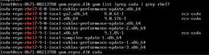
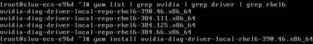
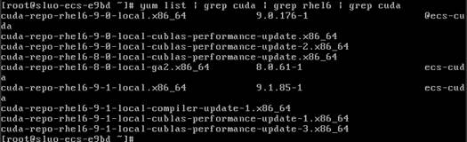
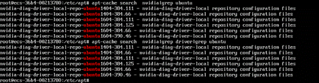
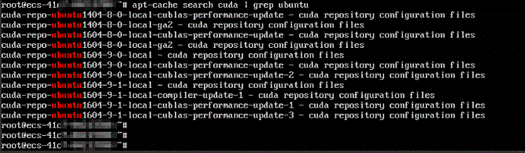
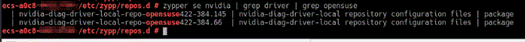
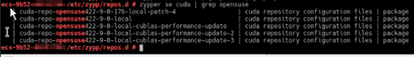

# \(推荐使用\)安装NVIDIA GPU驱动和CUDA工具包<a name="ZH-CN_TOPIC_0142409507"></a>

## 操作场景<a name="section590445319591"></a>

使用P1型、P2v型、Pi1型弹性云服务器时，需确保云服务器已安装GPU驱动和CUDA工具包，否则无法实现计算加速功能。

-   已创建弹性云服务器。
-   使用公共镜像创建的云服务器，默认已安装GPU驱动和CUDA工具包。
-   使用私有镜像创建云服务器，需检查是否已安装GPU驱动和CUDA工具包，详细操作请参考[检查是否已安装GPU驱动和CUDA工具包](#section11444117152017)。

    如果使用的镜像中没有安装GPU驱动和CUDA工具包，您可以在云服务器创建成功后，手动安装所需的驱动和工具包。具体操作请参见[安装指引](#section541712554262)。


本节内容主要解决如下问题：

-   检查GPU驱动和CUDA工具包是否安装成功？
-   云服务器是否已安装GPU驱动和CUDA工具包？
-   如何手动安装所需的GPU驱动和CUDA工具包？

## 安装须知<a name="section75624461422"></a>

-   本节内容仅适用于P1型、P2v型、Pi1型弹性云服务器。

## 安装指引<a name="section541712554262"></a>

1.  检查弹性云服务器是否已安装GPU驱动和CUDA工具包。具体操作请参见[检查是否已安装GPU驱动和CUDA工具包](#section11444117152017)。
    -   是，结束。
    -   否，执行[2](#li141551627172714)。

2.  <a name="li141551627172714"></a>安装GPU驱动和CUDA工具包。

    不同操作系统的弹性云服务器，安装方法不同，如[表1](#table1768161542918)所示。

    **表 1**  GPU驱动和CUDA工具包安装指导

    <a name="table1768161542918"></a>
    <table><thead align="left"><tr id="row46911592911"><th class="cellrowborder" valign="top" width="39.160000000000004%" id="mcps1.2.3.1.1"><p id="p1369131582913"><a name="p1369131582913"></a><a name="p1369131582913"></a>操作系统</p>
    </th>
    <th class="cellrowborder" valign="top" width="60.84%" id="mcps1.2.3.1.2"><p id="p96921592910"><a name="p96921592910"></a><a name="p96921592910"></a>安装指导</p>
    </th>
    </tr>
    </thead>
    <tbody><tr id="row06971516298"><td class="cellrowborder" valign="top" width="39.160000000000004%" headers="mcps1.2.3.1.1 "><p id="p26951542917"><a name="p26951542917"></a><a name="p26951542917"></a>Windows</p>
    </td>
    <td class="cellrowborder" valign="top" width="60.84%" headers="mcps1.2.3.1.2 "><p id="p06920152292"><a name="p06920152292"></a><a name="p06920152292"></a>请参见<a href="#section1162617395371">安装GPU驱动和CUDA工具包（Windows）</a></p>
    </td>
    </tr>
    <tr id="row17691615182919"><td class="cellrowborder" valign="top" width="39.160000000000004%" headers="mcps1.2.3.1.1 "><a name="ul18317182524012"></a><a name="ul18317182524012"></a><ul id="ul18317182524012"><li>CentOS 7.x</li><li>Red Hat Enterprise Linux 7.x</li><li>EulerOS 2.x</li></ul>
    </td>
    <td class="cellrowborder" valign="top" width="60.84%" headers="mcps1.2.3.1.2 "><p id="p8691415112917"><a name="p8691415112917"></a><a name="p8691415112917"></a>请参见<a href="#section15267203920518">安装GPU驱动和CUDA工具包（CentOS 7.x &amp;RHEL 7.x &amp;EulerOS 2.x）</a></p>
    </td>
    </tr>
    <tr id="row969415132918"><td class="cellrowborder" valign="top" width="39.160000000000004%" headers="mcps1.2.3.1.1 "><a name="ul912415132405"></a><a name="ul912415132405"></a><ul id="ul912415132405"><li>CentOS 6.x</li><li>Red Hat Enterprise Linux 6.x</li></ul>
    </td>
    <td class="cellrowborder" valign="top" width="60.84%" headers="mcps1.2.3.1.2 "><p id="p186921515291"><a name="p186921515291"></a><a name="p186921515291"></a>请参见<a href="#section1889382433818">安装GPU驱动和CUDA工具包（CentOS 6.x &amp;RHEL 6.x）</a></p>
    </td>
    </tr>
    <tr id="row12157144318406"><td class="cellrowborder" valign="top" width="39.160000000000004%" headers="mcps1.2.3.1.1 "><p id="p01571443154012"><a name="p01571443154012"></a><a name="p01571443154012"></a>OpenSUSE 42.x</p>
    </td>
    <td class="cellrowborder" valign="top" width="60.84%" headers="mcps1.2.3.1.2 "><p id="p1215713430403"><a name="p1215713430403"></a><a name="p1215713430403"></a>请参见<a href="#section45302579422">安装GPU驱动和CUDA工具包（OpenSUSE 42.x）</a></p>
    </td>
    </tr>
    </tbody>
    </table>


## 检查是否已安装GPU驱动和CUDA工具包<a name="section11444117152017"></a>

对于已创建弹性云服务器，您可以通过如下操作检查云服务器是否已安装GPU驱动和CUDA工具包。如果创建云服务器时已勾选“自动安装GPU驱动”，您也可以通过如下操作检查所需的GPU驱动、CUDA工具包是否安装成功。

-   Windows弹性云服务器

    查看C:\\nvidia\_install\_log.txt，如果安装失败，请根据日志文件中指定的driver和cuda进行手动安装。

-   Linux弹性云服务器

    查看/var/log/nvidia\_install\_log.txt，如果安装失败，请根据日志文件中指定的driver和cuda进行手动安装。


## 安装GPU驱动和CUDA工具包（Windows）<a name="section1162617395371"></a>

1.  从内源下载Windows弹性云服务器所需的GPU驱动和CUDA工具包。

    下载地址：[http://mirrors.myhuaweicloud.com/ecs/windows/exe/](http://mirrors.myhuaweicloud.com/ecs/windows/exe/)

    > **说明：**   
    >请在弹性云服务器中访问此地址。  

    打开该地址后，能够看到“win2008r2“、“win2012r2“、“win2016“三个版本的文件夹，每个文件夹下包括了“cuda“和“driver“两个文件夹，这两个文件夹中的文件即为不同版本的cuda和driver安装包。

    请根据您的弹性云服务器操作系统版本，打开对应的文件夹，并根据实际需要获取对应版本的cuda和driver安装包。

    示例：

    假设您的弹性云服务器操作系统为Windows 2016，则GPU驱动和CUDA工具包的获取方式为：

    1.  打开链接[http://mirrors.myhuaweicloud.com/ecs/windows/exe/](http://mirrors.myhuaweicloud.com/ecs/windows/exe/)。

        > **说明：**   
        >请在弹性云服务器中访问此地址。  

        可以看到三个文件夹：win2008r2、“win2012r2“和“win2016“

    2.  打开文件夹“win2016“。

        可以看到两个文件夹：“cuda“和“driver“

    3.  根据实际需要，选择所需版本的cuda和driver，例如：

        cuda：cuda\_9.0.176\_windows.exe

        driver：385.08-tesla-desktop-winserver-international.exe

2.  安装GPU驱动和CUDA工具包。

    双击.exe文件，并根据提示进行安装。


## 安装GPU驱动和CUDA工具包（CentOS 7.x &RHEL 7.x &EulerOS 2.x）<a name="section15267203920518"></a>

该操作指导适用于如下操作系统的弹性云服务器：

-   CentOS 7.x系列
-   Red Hat Enterprise Linux 7.x系列
-   EulerOS 2.x系列

对于Linux弹性云服务器，建议采用Repo进行安装。

1.  CentOS 7.x &RHEL 7.x &EulerOS 2.x CUDA repo配置
    1.  （可选）如果是CentOS 7.x、EulerOS 2.x系统的弹性云服务器，需执行以下命令，清理当前系统的repo文件。

        **mv /etc/yum.repos.d/\* /tmp/**

    2.  执行以下命令，新建nvidia-centos7.repo文件。

        **vi /etc/yum.repos.d/nvidia-centos7.repo**

    3.  在新建文件nvidia-centos7.repo中添加如下内容：

        ```
        [ecs-cuda] 
        name=ecs-cuda-$basearch
        baseurl=http://mirrors.myhuaweicloud.com/ecs/linux/rpm/cuda/7/$basearch 
        enabled=1
        gpgcheck=0
        [ecs-driver]
        name=ecs-driver-$basearch
        baseurl=http://mirrors.myhuaweicloud.com/ecs/linux/rpm/driver/7/$basearch
        enabled=1
        gpgcheck=0
        [ecs-package] 
        name=ecs-package-$basearch
        baseurl=http://mirrors.myhuaweicloud.com/ecs/linux/rpm/package/7/$basearch
        enabled=1
        gpgcheck=0
        ```

    4.  执行以下命令，安装对应版本的repo文件。

        **yum install http://mirrors.myhuaweicloud.com/epel/epel-release-latest-7.noarch.rpm -y**

    5.  执行以下命令，清理无用的repo文件。

        **rm -rf epel-testing.repo**

    6.  执行以下命令，更新epel-7版本的repo文件。

        **curl -o /etc/yum.repos.d/epel.repo http://mirrors.myhuaweicloud.com/repo/epel-7.repo**

    7.  执行如下命令，更新CentOS系统repo文件。
        -   如果是CentOS 7系统软件仓库

            **curl -o /etc/yum.repos.d/CentOS-Base.repo http://mirrors.myhuaweicloud.com/repo/CentOS-Base-7.repo**

        -   如果是EulerOS系统软件仓库

            **curl -o /etc/yum.repos.d/EulerOS-Base.repo http://mirrors.myhuaweicloud.com/repo/euler/EulerOS\_2\_2\_base.repo**

            **curl -o /etc/yum.repos.d/EulerOS-Base.repo http://mirrors.myhuaweicloud.com/repo/euler/EulerOS\_2\_3\_base.repo**

        -   Red Hat Enterprise Linux已经有系统RHUI软件仓库了。

2.  CentOS 7.x &RHEL 7.x &EulerOS 2.x CUDA安装
    1.  执行如下命令，安装与内核版本匹配的kernel-devel。

        **yum install -y kernel-devel-\`uname -r\`**

    2.  （可选）如果是CentOS系统的弹性云服务器，需执行如下命令安装dkms。

        **yum install -y dkms**

    3.  <a name="li17778655161520"></a>执行如下命令，查询driver版本。

        **yum list | grep nvidia | grep driver | grep rhel7**

    4.  执行如下命令，安装[2.c](#li17778655161520)中查询的driver版本repo文件。

        **yum install -y nvidia-diag-driver-local-repo-rhel7-\*.x86\_64**

    5.  执行如下命令，安装driver。

        **yum install -y cuda-drivers**

    6.  <a name="li1177855516158"></a>执行如下命令，查询cuda版本。

        **yum list | grep cuda | grep rhel7**

        **图 1**  查询cuda版本<a name="fig32467569317"></a>  
        

    7.  安装对应版本的cuda。

        **yum install -y cuda-repo-rhel\***

        \*表示查询到[2.f](#li1177855516158)的cuda版本号，同一个版本有几个文件，就安装几个文件。

    8.  执行如下命令，安装cuda。

        **yum install -y cuda**

    9.  执行如下命令，重启弹性云服务器。

        **reboot**


## 安装GPU驱动和CUDA工具包（CentOS 6.x &RHEL 6.x）<a name="section1889382433818"></a>

该操作指导适用于如下操作系统的弹性云服务器：

-   CentOS 6.x系列
-   Red Hat Enterprise Linux 6.x系列

对于Linux弹性云服务器，建议采用Repo进行安装。

1.  CentOS 6.x &RHEL 6.x CUDA repo配置
    1.  （可选）如果是CentOS 6.x系统的弹性云服务器，需执行以下命令，清理当前系统的repo文件。

        **mv /etc/yum.repos.d/\* /tmp/**

    2.  执行如下命令，新建nvidia-centos6.repo文件。

        **vi /etc/yum.repos.d/nvidia-centos6.repo**

    3.  在新建文件nvidia-centos6.repo中添加如下内容：

        ```
        [ecs-cuda]
        name=ecs-cuda-$basearch
        baseurl=http://mirrors.myhuaweicloud.com/ecs/linux/rpm/cuda/6/$basearch
        enabled=1
        gpgcheck=0
        [ecs-driver] 
        name=ecs-driver-$basearch
        baseurl=http://mirrors.myhuaweicloud.com/ecs/linux/rpm/driver/6/$basearch
        enabled=1
        gpgcheck=0
        [ecs-package]
        name=ecs-package-$basearch
        baseurl=http://mirrors.myhuaweicloud.com/ecs/linux/rpm/package/6/$basearch
        enabled=1
        gpgcheck=0
        ```

    4.  执行如下命令，安装对应版本的repo文件。

        **yum install http://mirrors.myhuaweicloud.com/epel/epel-release-latest-6.noarch.rpm -y**

    5.  执行如下命令，清理无用的repo文件。

        **rm -rf epel-testing.repo**

    6.  执行如下命令，更新epel-6版本的repo文件。

        **curl -o /etc/yum.repos.d/epel.repo http://mirrors.myhuaweicloud.com/repo/epel-6.repo**

    7.  执行如下命令，更新CentOS系统repo文件。
        -   如果是CentOS 6系统软件仓库

            **curl -o /etc/yum.repos.d/CentOS-Base.repo http://mirrors.myhuaweicloud.com/repo/CentOS-Base-6.repo**

        -   Red Hat Enterprise Linux已经有系统RHUI软件仓库了。

2.  CentOS 6.x &RHEL 6.x CUDA安装
    1.  执行如下命令，安装与内核版本匹配的kernel-devel。

        **yum install -y kernel-devel-\`uname -r\`**

    2.  执行如下命令，查询driver版本。

        **yum list | grep nvidia | grep driver | grep rhel6**

    3.  <a name="li17490458193711"></a>执行如下命令，查询driver版本对应的repo文件版本。

        **图 2**  查询repo文件版本<a name="fig157259105418"></a>  
        

    4.  执行如下命令，安装所需的driver repo版本。

        **yum install nvidia-diag-driver-local-repo-rhel6-\*.x86\_64**

        \*表示[2.c](#li17490458193711)中查询到的driver repo版本。

    5.  执行如下命令，安装driver。

        **yum install -y cuda-drivers**

    6.  <a name="li9490155863716"></a>执行如下命令，查询cuda版本。

        **yum list | grep cuda | grep rhel6**

        **图 3**  查询cuda的版本<a name="fig144915231648"></a>  
        

    7.  安装对应版本的cuda。

        **yum install cuda-repo-rhel\***

        \*表示[2.f](#li9490155863716)查询到的cuda版本号，同一个版本有几个文件，就安装几个文件。

    8.  执行如下命令，安装cuda。

        **yum install -y cuda**

    9.  执行如下命令，重启弹性云服务器。

        **reboot**


## 安装GPU驱动和CUDA工具包（Ubuntu 14.04 &Ubuntu 16.04）<a name="section1374313374118"></a>

该操作指导适用于如下操作系统的弹性云服务器：

-   Ubuntu 14.04
-   Ubuntu 16.04

对于Linux弹性云服务器，建议采用Repo进行安装。

1.  Ubuntu 14.04 &Ubuntu 16.04 repo配置
    -   对于Ubuntu 14.04系统的弹性云服务器，执行以下命令进行repo配置。

        ```
        cp -fp /etc/apt/sources.list /etc/apt/sources.list.back 
        cat > /etc/apt/sources.list <<EOF 
        deb http://mirrors.myhuaweicloud.com/ubuntu/ trusty main restricted universe multiverse 
        deb http://mirrors.myhuaweicloud.com/ubuntu/ trusty-security main restricted universe multiverse 
        deb http://mirrors.myhuaweicloud.com/ubuntu/ trusty-updates main restricted universe multiverse 
        deb http://mirrors.myhuaweicloud.com/ubuntu/ trusty-proposed main restricted universe multiverse 
        deb http://mirrors.myhuaweicloud.com/ubuntu/ trusty-backports main restricted universe multiverse 
        deb-src http://mirrors.myhuaweicloud.com/ubuntu/ trusty main restricted universe multiverse 
        deb-src http://mirrors.myhuaweicloud.com/ubuntu/ trusty-security main restricted universe multiverse 
        deb-src http://mirrors.myhuaweicloud.com/ubuntu/ trusty-updates main restricted universe multiverse 
        deb-src http://mirrors.myhuaweicloud.com/ubuntu/ trusty-proposed main restricted universe multiverse 
        deb-src http://mirrors.myhuaweicloud.com/ubuntu/ trusty-backports main restricted universe multiverse 
        deb http://mirrors.myhuaweicloud.com/ecs/linux/apt ecs cuda 
        deb http://mirrors.myhuaweicloud.com/ecs/linux/apt ecs driver 
        EOF 
        apt-get update --fix-missing
        wget -O - http://mirrors.myhuaweicloud.com/ecs/linux/apt/huaweicloud.ubuntu.gpg.key | apt-key add - 
        apt update
        ```

    -   对于Ubuntu 16.04系统的弹性云服务器，执行以下命令进行repo配置。

        ```
        cp -fp /etc/apt/sources.list /etc/apt/sources.list.back 
        cat > /etc/apt/sources.list <<EOF 
        deb http://mirrors.myhuaweicloud.com/ubuntu/ xenial main restricted universe multiverse 
        deb http://mirrors.myhuaweicloud.com/ubuntu/ xenial-security main restricted universe multiverse 
        deb http://mirrors.myhuaweicloud.com/ubuntu/ xenial-updates main restricted universe multiverse 
        deb http://mirrors.myhuaweicloud.com/ubuntu/ xenial-proposed main restricted universe multiverse 
        deb http://mirrors.myhuaweicloud.com/ubuntu/ xenial-backports main restricted universe multiverse 
        deb-src http://mirrors.myhuaweicloud.com/ubuntu/ xenial main restricted universe multiverse 
        deb-src http://mirrors.myhuaweicloud.com/ubuntu/ xenial-security main restricted universe multiverse 
        deb-src http://mirrors.myhuaweicloud.com/ubuntu/ xenial-updates main restricted universe multiverse 
        deb-src http://mirrors.myhuaweicloud.com/ubuntu/ xenial-proposed main restricted universe multiverse 
        deb-src http://mirrors.myhuaweicloud.com/ubuntu/ xenial-backports main restricted universe multiverse 
        deb http://mirrors.myhuaweicloud.com/ecs/linux/apt ecs cuda 
        deb http://mirrors.myhuaweicloud.com/ecs/linux/apt ecs driver 
        EOF 
        apt-get update --fix-missing 
        wget -O - 
        http://mirrors.myhuaweicloud.com/ecs/linux/apt/huaweicloud.ubuntu.gpg.key | 
        apt-key add - 
        apt update
        ```

2.  Ubuntu 14.04 &Ubuntu 16.04 CUDA安装
    1.  执行如下命令，安装与内核版本匹配的kernel-devel。

        **apt-get install -y --allow-unauthenticated linux-headers-\`uname -r\`**

    2.  <a name="li949743665815"></a>执行如下命令，安装查询driver版本。

        **apt-cache search nvidia | grep driver | grep ubuntu**

        **图 4**  查询驱动版本<a name="fig9103184512414"></a>  
        

    3.  执行如下命令，安装需求版本的driver repo文件。

        **apt-get install -y nvidia-diag-driver-local-repo-ubuntu\***

        \*表示[2.b](#li949743665815)查询到的driver版本号，只能安装一个指定的版本。

    4.  执行如下命令，安装driver。

        **apt-get update && apt-get install -y --allow-unauthenticated cuda-drivers**

    5.  执行如下命令，查询cuda版本。

        **apt-cache search cuda | grep ubuntu**

        **图 5**  cuda版本查询<a name="fig17462205411417"></a>  
        

    6.  执行如下命令，安装需求版本的cuda repo文件。

        **apt-get install -y cuda-repo-ubuntu\***

        \*表示[2.g](#li16497236125810)查询到的driver版本号，同一个版本有几个文件，就安装几个文件。

    7.  <a name="li16497236125810"></a>执行如下命令，安装cuda。

        **pt-get update && apt-get install -y --allow-unauthenticated cuda**


## 安装GPU驱动和CUDA工具包（OpenSUSE 42.x）<a name="section45302579422"></a>

该操作指导适用于如下操作系统的弹性云服务器：

-   OpenSUSE 42.x系列

1.  执行以下命令，配置opensuse\_source4202系统软件仓库。

    ```
    mv /etc/zypp/repos.d/* /tmp/ 
    sudo zypper ar -fcg 
    http://mirrors.myhuaweicloud.com/opensuse/distribution/leap/42.2/repo/oss 
    HWCloud:42.2:OSS 
    sudo zypper ar -fcg 
    http://mirrors.myhuaweicloud.com/opensuse/distribution/leap/42.2/repo/non-oss 
    HWCloud:42.3:NON-OSS 
    sudo zypper ar -fcg 
    http://mirrors.myhuaweicloud.com/opensuse/update/leap/42.2/oss 
    HWCloud:42.2:UPDATE-OSS 
    sudo zypper ar -fcg 
    http://mirrors.myhuaweicloud.com/opensuse/update/leap/42.2/non-oss 
    HWCloud:42.2:UPDATE-NON-OSS
    ```

2.  执行以下命令，配置CUDA repo。
    1.  执行如下命令，新建HWnvidia-cudo.repo文件。

        **vi /etc/zypp/repos.d/HWnvidia-cudo.repo**

    2.  在新建文件HWnvidia-cudo.repo中添加如下内容：

        ```
        [HWnvidia-cuda] 
        enabled=1 
        autorefresh=1 
        baseurl=http://mirrors.myhuaweicloud.com/ecs/linux/zypper/opensuse422/cuda 
        type=rpm-md 
        gpgcheck=0
        ```

    3.  执行如下命令，新建HWnvidia-driver.repo文件。
    4.  在新建文件HWnvidia-driver.repo中添加如下内容：

        ```
        [HWnvidia-driver] 
        enabled=1 
        autorefresh=1 
        baseurl=http://mirrors.myhuaweicloud.com/ecs/linux/zypper/opensuse422/driver 
        type=rpm-md 
        gpgcheck=0
        ```

3.  执行以下命令，安装CUDA。
    1.  执行如下命令，安装kernel-devel。

        **zypper install -y kernel-default-devel=\`uname -r|awk -F'-' '\{print $1"-"$2\}'\`**

    2.  执行如下命令，查询driver版本。

        **zypper se nvidia | grep driver | grep opensuse**

        **图 6**  查询driver版本<a name="fig754531415510"></a>  
        

    3.  执行如下命令，安装需求版本driver repo。

        **zypper install -y nvidia-diag-driver-local-repo-opensuse422-\***

    4.  执行如下命令，安装driver。

        **zypper --gpg-auto-import-keys refresh && zypper install -y cuda-drivers**

    5.  执行如下命令，查询cuda版本。

        **zypper se cuda | grep opensuse**

        **图 7**  cuda版本的查询<a name="fig562652218515"></a>  
        

    6.  执行如下命令，安装需求版本cuda repo。

        **zypper --no-gpg-checks install -y cuda-repo-opensuse\***

        \*表示查询到的cuda版本号。

    7.  执行如下命令，安装cuda。

        **zypper --gpg-auto-import-keys refresh && zypper install -y cuda**


