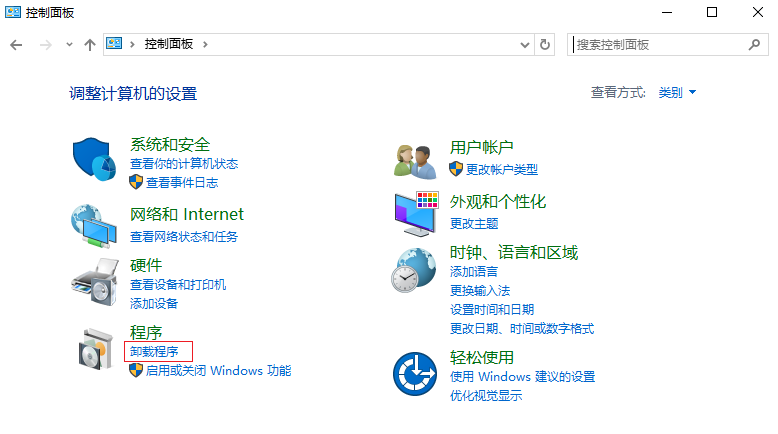
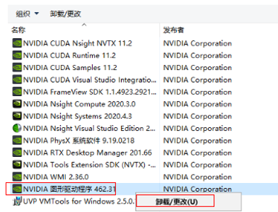
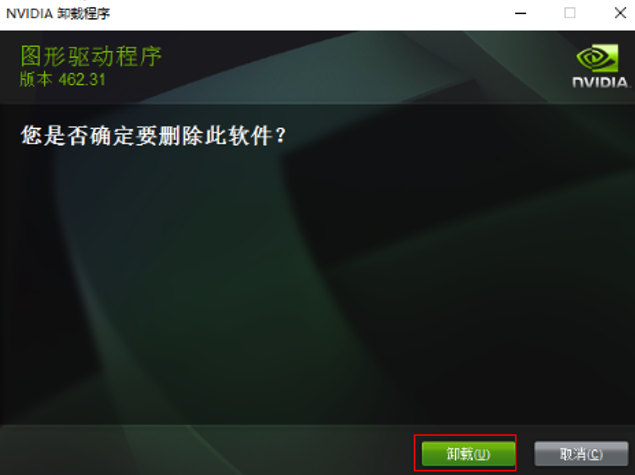
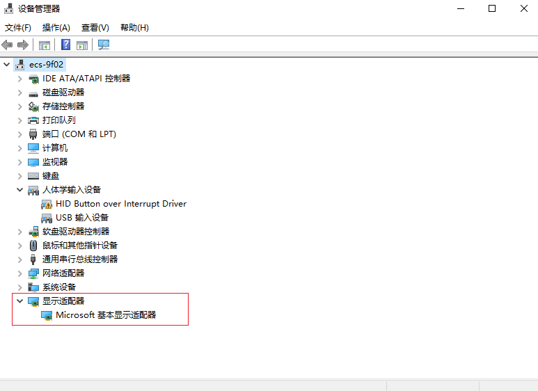
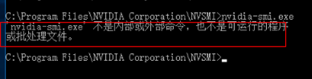
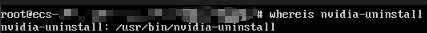
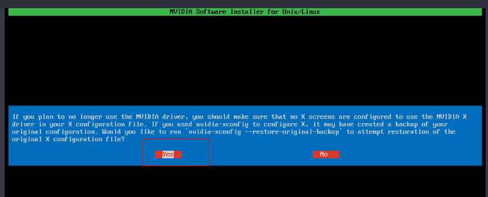
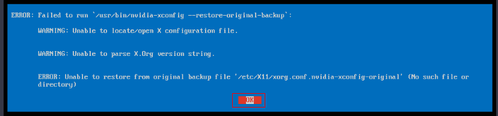
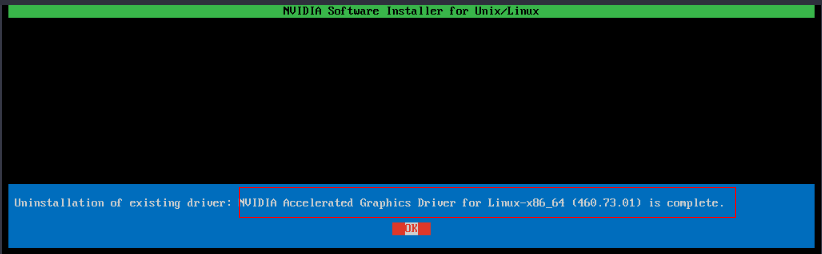
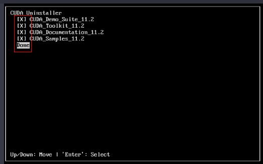

# GPU加速型实例卸载GPU驱动

## 操作场景

当GPU加速型云服务器需手动卸载GPU驱动时，可参考本文档进行操作。

GPU驱动卸载命令与GPU驱动的安装方式和操作系统类型相关，例如：

-   [Windows操作系统卸载驱动](#section631612552249)
-   [Linux操作系统卸载驱动](#section3864455115811)

## Windows操作系统卸载驱动

以Windows Server 2016 数据中心版 64位操作系统为例，介绍GPU加速型云服务器卸载NVIDIA驱动（驱动版本462.31）的操作步骤。

1.  登录弹性云服务器。
2.  单击“开始”，打开“控制面板”。
3.  在控制面板中，单击“卸载程序”。

    **图 1**  单击卸载程序  
    

4.  右键单击要卸载的NVIDIA驱动，单击“卸载/更改”。

    **图 2**  卸载驱动  
    

5.  在弹出的“NVIDIA 卸载程序”界面，单击“卸载”。

    **图 3**  NVDIA卸载程序  
    

6.  卸载完成后，单击“稍后启动”。
7.  检查驱动是否卸载成功。

    1.  在控制面板，单击“设备管理器”。

        如果“显示适配器”中没有NVIDIA显卡，表明驱动卸载成功。

        **图 4**  查看显示适配器  
        

    2.  打开云服务器cmd窗口，执行以下命令：

        **cd C:\\Program Files\\NVIDIA Corporation\\NVSMI**

        **nvidia-smi.exe**

        **图 5**  命令执行结果  
        

        如果回显信息为该文件不存在，则说明驱动卸载成功。

    确认NVDIA驱动卸载完成后，可以先不重启云服务器，直接安装新的NVIDIA驱动。

## Linux操作系统卸载驱动

对于使用run安装包安装的NVIDIA Tesla驱动，建议您按照以下步骤卸载NVIDIA Tesla驱动。

> **说明：** 
>如果您使用run安装包安装NVIDIA Grid驱动，则卸载NVIDIA驱动即可，只需执行下面的[步骤1](#li2250553204915)。

以Ubuntu20.04 server 64bit为例，介绍Tesla 460.73.01、CUDA 11.2卸载的操作步骤。

1.  卸载NVIDIA驱动。
    1.  执行以下命令，查询“nvidia-uninstall”所在路径。

        **whereis nvidia-uninstall**

        “nvidia-uninstall”一般在“/usr/bin/”目录下。

        **图 6**  查询卸载路径  
        

    2.  执行以下命令，基于查询的“nvidia-uninstall”路径，卸载驱动。

        **/usr/bin/nvidia-uninstall**

    3.  选择”Yes”，单击回车键。

        **图 7**  卸载驱动选择界面  
        

    4.  选择”OK”，单击回车键。

        **图 8**  卸载过程选择界面  
        

    5.  驱动卸载成功，单击回车键。

        **图 9**  卸载成功界面  
        

2.  卸载CUDA库和cuDNN库

    当需要升级CUDA驱动版本时，需要卸载对应的CUDA库后，再安装对应的CUDA版本。

    1.  执行以下命令，卸载CUDA库。

        **/usr/local/cuda/bin/cuda-uninstaller**

        “cuda-uninstaller”一般在“/usr/local/cuda/bin”目录下。

        > **说明：** 
        >不同CUDA版本的卸载命令可能存在差异，如果未找到“cuda-uninstaller”文件，可在“/usr/local/cuda/bin/”目录下查看是否存在“uninstall\_cuda”开头的文件。
        >如果有，则将命令中的“cuda-uninstaller”替换为“uninstall\_cuda”开头的文件名。

    2.  在卸载界面，勾选全部选项后，移动光标至“Done”，单击回车键。

        **图 10**  卸载CUDA驱动  
        

        CUDA库卸载成功，会返回”Successfully uninstalled”。

    1.  移除CUDA库和cuDNN库：

        **rm –rf /usr/local/cuda-11.2**

