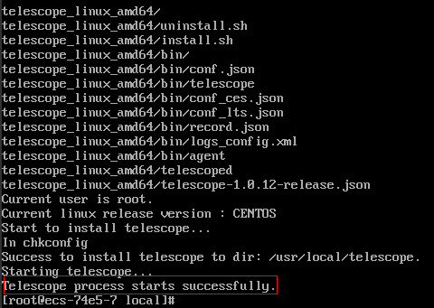
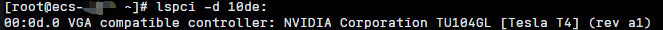

# GPU加速型实例安装GPU监控插件（Linux）<a name="ecs_03_2004"></a>

## 操作场景<a name="section635401111496"></a>

通过在GPU加速型Linux实例上安装GPU监控插件，可以为用户提供系统级、主动式、细颗粒度的GPU监控，包含GPU指标收集和GPU系统事件上报。GPU监控指标，请参见[操作系统监控指标：GPU](弹性云服务器支持的操作系统监控指标（安装Agent）.md#section282013415343)。

GPU监控插件有新、旧两个版本，如[表1](#table131981746182911)所示。

**表 1**  新旧GPU监控插件的区别

<a name="table131981746182911"></a>
<table><thead align="left"><tr id="row11199846192919"><th class="cellrowborder" valign="top" width="18.111811181118114%" id="mcps1.2.4.1.1"><p id="p19199046172913"><a name="p19199046172913"></a><a name="p19199046172913"></a>类型</p>
</th>
<th class="cellrowborder" valign="top" width="36.5036503650365%" id="mcps1.2.4.1.2"><p id="p5199946152914"><a name="p5199946152914"></a><a name="p5199946152914"></a>旧版本</p>
</th>
<th class="cellrowborder" valign="top" width="45.38453845384538%" id="mcps1.2.4.1.3"><p id="p6199154619297"><a name="p6199154619297"></a><a name="p6199154619297"></a>新版本</p>
</th>
</tr>
</thead>
<tbody><tr id="row219913464296"><td class="cellrowborder" valign="top" width="18.111811181118114%" headers="mcps1.2.4.1.1 "><p id="p5199046142911"><a name="p5199046142911"></a><a name="p5199046142911"></a>集成方式</p>
</td>
<td class="cellrowborder" valign="top" width="36.5036503650365%" headers="mcps1.2.4.1.2 "><p id="p1419919464295"><a name="p1419919464295"></a><a name="p1419919464295"></a>GPU监控插件未集成至CES监控Agent。</p>
</td>
<td class="cellrowborder" valign="top" width="45.38453845384538%" headers="mcps1.2.4.1.3 "><p id="p3199174632919"><a name="p3199174632919"></a><a name="p3199174632919"></a>GPU监控插件已集成至CES监控Agent。</p>
</td>
</tr>
<tr id="row147681930103410"><td class="cellrowborder" valign="top" width="18.111811181118114%" headers="mcps1.2.4.1.1 "><p id="p1376823015341"><a name="p1376823015341"></a><a name="p1376823015341"></a>安装方式</p>
</td>
<td class="cellrowborder" valign="top" width="36.5036503650365%" headers="mcps1.2.4.1.2 "><p id="p13163543709"><a name="p13163543709"></a><a name="p13163543709"></a>需要分别安装CES监控Agent和GPU监控插件。</p>
<a name="ol18458194953415"></a><a name="ol18458194953415"></a><ol id="ol18458194953415"><li>安装旧版本CES监控Agent。</li><li>安装GPU监控插件，详细内容，请参见<a href="https://support.huaweicloud.com/usermanual-ces/ces_01_0114.html" target="_blank" rel="noopener noreferrer">GPU监控插件安装和告警配置（Linux）</a>。</li></ol>
</td>
<td class="cellrowborder" valign="top" width="45.38453845384538%" headers="mcps1.2.4.1.3 "><p id="p207691230173411"><a name="p207691230173411"></a><a name="p207691230173411"></a>安装新版本CES监控Agent，即可完成GPU监控插件的安装。</p>
</td>
</tr>
</tbody>
</table>

> **说明：** 
>相比旧版，新版GPU监控插件上报的GPU监控指标和系统事件类型更丰富。新增GPU使用率、显存使用率等指标和GPU温度过高、infoROM告警、XID事件等系统事件。

本章节介绍如何通过CES监控Agent安装脚本为GPU加速型实例安装新版GPU监控插件：

-   [操作步骤（单台ECS安装）](#section7969360222918)
-   [操作步骤（多台ECS批量安装）](#section2088922713179)

## 约束与限制<a name="section120015418234"></a>

-   仅支持Linux操作系统，且仅部分Linux公共镜像版本支持GPU监控。

    **表 2**  支持安装GPU监控插件的Linux版本

    <a name="table1662740114719"></a>
    <table><thead align="left"><tr id="row062860204715"><th class="cellrowborder" valign="top" width="50%" id="mcps1.2.3.1.1"><p id="p1628130114716"><a name="p1628130114716"></a><a name="p1628130114716"></a>类型</p>
    </th>
    <th class="cellrowborder" valign="top" width="50%" id="mcps1.2.3.1.2"><p id="p206288074714"><a name="p206288074714"></a><a name="p206288074714"></a>版本</p>
    </th>
    </tr>
    </thead>
    <tbody><tr id="row26281103475"><td class="cellrowborder" valign="top" width="50%" headers="mcps1.2.3.1.1 "><p id="p20628705473"><a name="p20628705473"></a><a name="p20628705473"></a>CentOS（64bit）</p>
    </td>
    <td class="cellrowborder" valign="top" width="50%" headers="mcps1.2.3.1.2 "><p id="p1962810024717"><a name="p1962810024717"></a><a name="p1962810024717"></a>7.6、7.9、8.2</p>
    </td>
    </tr>
    <tr id="row06282018471"><td class="cellrowborder" valign="top" width="50%" headers="mcps1.2.3.1.1 "><p id="p17628160104713"><a name="p17628160104713"></a><a name="p17628160104713"></a>Ubuntu（64bit）</p>
    </td>
    <td class="cellrowborder" valign="top" width="50%" headers="mcps1.2.3.1.2 "><p id="p1628200174711"><a name="p1628200174711"></a><a name="p1628200174711"></a>16.04、18.04、20.04</p>
    </td>
    </tr>
    </tbody>
    </table>

-   支持的规格：G6v、G6、P2s、P2v、P2vs、G5、Pi2、Pi1、P1。
-   暂不支持CCE纳管后的GPU加速型实例。

## 前提条件<a name="section187322119597"></a>

-   已安装GPU驱动，未安装GPU驱动的云服务器不支持采集GPU指标数据及上报事件。

    如果您的弹性云服务器未安装GPU驱动，可参见[（推荐）GPU加速型实例自动安装GPU驱动（Linux）](（推荐）GPU加速型实例自动安装GPU驱动（Linux）.md)。

    > **说明：** 
    >-   安装GPU驱动需使用默认路径。
    >    GPU驱动安装完后，需重启GPU加速型实例，否则可能导致采集GPU指标及上报GPU事件失败。
    >-   GPU驱动正常安装后，最多10分钟将在控制台看到采集到的GPU指标数据。

-   已安装lspci工具，未安装lspci工具的云服务器不支持采集GPU指标数据及上报事件。

    安装lspci工具的方法，请参见[（可选）安装lspci工具](#section167521265813)。

-   确保云服务器的安装目录都有读写权限，并且安装成功后的Telescope进程不会被其他软件关闭。

## 操作步骤（单台ECS安装）<a name="section7969360222918"></a>

本操作以Ubuntu 18.04 64bit操作系统、Pi2规格的GPU加速型实例为例，介绍单台ECS安装新版GPU监控插件的操作指导。

1.  使用root用户，[远程登录](Linux弹性云服务器登录方式概述.md)弹性云服务器。
2.  执行以下命令，为单台ECS安装新版GPU监控插件。

    以“华北-北京四”为例，其余区域的安装脚本，请参见[获取安装脚本](#section13111946101)。

    **cd /usr/local && curl -k -O https://uniagent-_cn-north-4_.obs._cn-north-4_.myhuaweicloud.com/package/agent\_install.sh  && bash agent\_install.sh -r  _cn-north-4_  -u  _0.1.3_  -t  _2.4.5.1_  -d agent.ces.myhuaweicloud.com**

    其中，“cn-north-4”表示区域ID，“0.1.3”是uniagent版本号，“2.4.5.1”是telescope版本号。

    当显示如下内容，表示GPU监控插件安装成功。

    **图 1**  GPU监控插件安装成功<a name="fig18401102019321"></a>  
    


## 操作步骤（多台ECS批量安装）<a name="section2088922713179"></a>

本操作以Ubuntu 18.04 64bit操作系统、Pi2规格的GPU加速型实例为例，介绍多台ECS批量安装新版GPU监控插件的操作指导。

> **须知：** 
>批量安装的多台ECS需要归属于同一个VPC。

1.  使用root用户，[远程登录](Linux弹性云服务器登录方式概述.md)其中一台弹性云服务器。
2.  执行以下命令，为这一台ECS安装新版GPU监控插件。

    以“华北-北京四”为例，其余区域的安装脚本，请参见[获取安装脚本](GPU加速型实例安装GPU监控插件（Linux）.md#section13111946101)。

    **cd /usr/local && curl -k -O https://uniagent-_cn-north-4_.obs._cn-north-4_.myhuaweicloud.com/package/agent\_install.sh  && bash agent\_install.sh -r  _cn-north-4_  -u  _0.1.3_  -t  _2.4.5.1_  -d agent.ces.myhuaweicloud.com**

    其中，“cn-north-4”表示区域ID，“0.1.3”是uniagent版本号，“2.4.5.1”是telescope版本号。

    当新版GPU监控插件安装成功，且数据采集正常时，可以将此ECS作为跳板机，通过批量安装脚本依次为其他ECS批量安装新版GPU监控插件。

3.  收集需要批量安装新版GPU监控插件的所有ECS的IP地址和root用户密码，以iplist.txt格式整理，并上传到ECS跳板机的/usr/local目录下。

    iplist.txt格式为“IP地址,root用户密码”，每个记录一行。

    示例如下所示（示例中abcd为root用户密码，请按实际值填写）：

    ```
    192.168.1.1,abcd
    192.168.1.2,abcd
    ```

4.  执行以下命令，为多台ECS批量安装新版GPU监控插件。

    以“华北-北京四”为例，其余区域的批量安装脚本，请参见[获取安装脚本](#section13111946101)。

    **cd /usr/local && curl -k -O  https://uniagent-_cn-north-4_.obs._cn-north-4_.myhuaweicloud.com/package/batch\_agent\_install.sh && bash batch\_agent\_install.sh -r  _cn-north-4_  -u  _0.1.3_  -t  _2.4.5.1_  -d agent.ces.myhuaweicloud.com**

    其中，cn-north-4是RegoinID，0.1.3是uniagent版本号，2.4.5.1是telescope版本号。

    当显示如下内容，表示GPU监控插件安装成功。

    **图 2**  GPU监控插件安装成功<a name="ecs_03_2004_fig18401102019321"></a>  
    


## 获取安装脚本<a name="section13111946101"></a>

您可以通过执行以下命令，获取新版CES监控Agent的安装脚本。

**表 3**  安装脚本的支持区域及获取方式

<a name="table1893715396410"></a>
<table><thead align="left"><tr id="row9938153912416"><th class="cellrowborder" valign="top" width="14.69%" id="mcps1.2.3.1.1"><p id="p14938183913411"><a name="p14938183913411"></a><a name="p14938183913411"></a>区域</p>
</th>
<th class="cellrowborder" valign="top" width="85.31%" id="mcps1.2.3.1.2"><p id="p493853918418"><a name="p493853918418"></a><a name="p493853918418"></a>安装脚本</p>
</th>
</tr>
</thead>
<tbody><tr id="row16971157145"><td class="cellrowborder" valign="top" width="14.69%" headers="mcps1.2.3.1.1 "><p id="p99711574419"><a name="p99711574419"></a><a name="p99711574419"></a>华北-北京一</p>
</td>
<td class="cellrowborder" valign="top" width="85.31%" headers="mcps1.2.3.1.2 "><p id="p229311015219"><a name="p229311015219"></a><a name="p229311015219"></a>单台ECS安装：</p>
<pre class="screen" id="screen749117221083"><a name="screen749117221083"></a><a name="screen749117221083"></a>cd /usr/local &amp;&amp; curl -k -O https://uniagent-cn-north-1.obs.cn-north-1.myhuaweicloud.com/package/agent_install.sh &amp;&amp; bash agent_install.sh -r cn-north-1 -u 0.1.5 -t 2.4.8 -d agent.ces.myhuaweicloud.com</pre>
<p id="p129317101528"><a name="p129317101528"></a><a name="p129317101528"></a>多台ECS批量安装：</p>
<pre class="screen" id="screen8570142819818"><a name="screen8570142819818"></a><a name="screen8570142819818"></a>cd /usr/local &amp;&amp; curl -k -O  https://uniagent-cn-north-1.obs.cn-north-1.myhuaweicloud.com/package/batch_agent_install.sh &amp;&amp; bash batch_agent_install.sh -r cn-north-1 -u 0.1.5 -t 2.4.8 -d agent.ces.myhuaweicloud.com</pre>
</td>
</tr>
<tr id="row16971205717412"><td class="cellrowborder" valign="top" width="14.69%" headers="mcps1.2.3.1.1 "><p id="p5971557948"><a name="p5971557948"></a><a name="p5971557948"></a>华北-北京四</p>
</td>
<td class="cellrowborder" valign="top" width="85.31%" headers="mcps1.2.3.1.2 "><p id="p132936102024"><a name="p132936102024"></a><a name="p132936102024"></a>单台ECS安装：</p>
<pre class="screen" id="screen6873510815"><a name="screen6873510815"></a><a name="screen6873510815"></a>cd /usr/local &amp;&amp; curl -k -O https://uniagent-cn-north-4.obs.cn-north-4.myhuaweicloud.com/package/agent_install.sh &amp;&amp; bash agent_install.sh -r cn-north-4 -u 0.1.5 -t 2.4.8 -d agent.ces.myhuaweicloud.com</pre>
<p id="p1029315101729"><a name="p1029315101729"></a><a name="p1029315101729"></a>多台ECS批量安装：</p>
<pre class="screen" id="screen1719014411987"><a name="screen1719014411987"></a><a name="screen1719014411987"></a>cd /usr/local &amp;&amp; curl -k -O  https://uniagent-cn-north-4.obs.cn-north-4.myhuaweicloud.com/package/batch_agent_install.sh &amp;&amp; bash batch_agent_install.sh -r cn-north-4 -u 0.1.5 -t 2.4.8 -d agent.ces.myhuaweicloud.com</pre>
</td>
</tr>
<tr id="row1997117571414"><td class="cellrowborder" valign="top" width="14.69%" headers="mcps1.2.3.1.1 "><p id="p2097119579419"><a name="p2097119579419"></a><a name="p2097119579419"></a>华北-乌兰察布一</p>
</td>
<td class="cellrowborder" valign="top" width="85.31%" headers="mcps1.2.3.1.2 "><p id="p52937101229"><a name="p52937101229"></a><a name="p52937101229"></a>单台ECS安装：</p>
<pre class="screen" id="screen169002046487"><a name="screen169002046487"></a><a name="screen169002046487"></a>cd /usr/local &amp;&amp; curl -k -O https://uniagent-cn-north-9.obs.cn-north-9.myhuaweicloud.com/package/agent_install.sh &amp;&amp; bash agent_install.sh -r cn-north-9 -u 0.1.5 -t 2.4.8 -d agent.ces.myhuaweicloud.com</pre>
<p id="p4293101016210"><a name="p4293101016210"></a><a name="p4293101016210"></a>多台ECS批量安装：</p>
<pre class="screen" id="screen78774531582"><a name="screen78774531582"></a><a name="screen78774531582"></a>cd /usr/local &amp;&amp; curl -k -O  https://uniagent-cn-north-9.obs.cn-north-9.myhuaweicloud.com/package/batch_agent_install.sh &amp;&amp; bash batch_agent_install.sh -r cn-north-9 -u 0.1.5 -t 2.4.8 -d agent.ces.myhuaweicloud.com</pre>
</td>
</tr>
<tr id="row11971125715416"><td class="cellrowborder" valign="top" width="14.69%" headers="mcps1.2.3.1.1 "><p id="p997214579415"><a name="p997214579415"></a><a name="p997214579415"></a>华南-广州</p>
</td>
<td class="cellrowborder" valign="top" width="85.31%" headers="mcps1.2.3.1.2 "><p id="p1529471010213"><a name="p1529471010213"></a><a name="p1529471010213"></a>单台ECS安装：</p>
<pre class="screen" id="screen181249111919"><a name="screen181249111919"></a><a name="screen181249111919"></a>cd /usr/local &amp;&amp; curl -k -O https://uniagent-cn-south-1.obs.cn-south-1.myhuaweicloud.com/package/agent_install.sh &amp;&amp; bash agent_install.sh -r cn-south-1 -u 0.1.5 -t 2.4.8 -d agent.ces.myhuaweicloud.com</pre>
<p id="p229418103211"><a name="p229418103211"></a><a name="p229418103211"></a>多台ECS批量安装：</p>
<pre class="screen" id="screen33725111916"><a name="screen33725111916"></a><a name="screen33725111916"></a>cd /usr/local &amp;&amp; curl -k -O  https://uniagent-cn-south-1.obs.cn-south-1.myhuaweicloud.com/package/batch_agent_install.sh &amp;&amp; bash batch_agent_install.sh -r cn-south-1 -u 0.1.5 -t 2.4.8 -d agent.ces.myhuaweicloud.com</pre>
</td>
</tr>
<tr id="row20972195710410"><td class="cellrowborder" valign="top" width="14.69%" headers="mcps1.2.3.1.1 "><p id="p109727575412"><a name="p109727575412"></a><a name="p109727575412"></a>华东-上海一</p>
</td>
<td class="cellrowborder" valign="top" width="85.31%" headers="mcps1.2.3.1.2 "><p id="p122941210123"><a name="p122941210123"></a><a name="p122941210123"></a>单台ECS安装：</p>
<pre class="screen" id="screen1945217191920"><a name="screen1945217191920"></a><a name="screen1945217191920"></a>cd /usr/local &amp;&amp; curl -k -O https://uniagent-cn-east-3.obs.cn-east-3.myhuaweicloud.com/package/agent_install.sh &amp;&amp; bash agent_install.sh -r cn-east-3 -u 0.1.5 -t 2.4.8 -d agent.ces.myhuaweicloud.com</pre>
<p id="p6294151016217"><a name="p6294151016217"></a><a name="p6294151016217"></a>多台ECS批量安装：</p>
<pre class="screen" id="screen121131426193"><a name="screen121131426193"></a><a name="screen121131426193"></a>cd /usr/local &amp;&amp; curl -k -O  https://uniagent-cn-east-3.obs.cn-east-3.myhuaweicloud.com/package/batch_agent_install.sh &amp;&amp; bash batch_agent_install.sh -r cn-east-3 -u 0.1.5 -t 2.4.8 -d agent.ces.myhuaweicloud.com</pre>
</td>
</tr>
<tr id="row39723571346"><td class="cellrowborder" valign="top" width="14.69%" headers="mcps1.2.3.1.1 "><p id="p697217571414"><a name="p697217571414"></a><a name="p697217571414"></a>华东-上海二</p>
</td>
<td class="cellrowborder" valign="top" width="85.31%" headers="mcps1.2.3.1.2 "><p id="p929420101922"><a name="p929420101922"></a><a name="p929420101922"></a>单台ECS安装：</p>
<pre class="screen" id="screen173906331298"><a name="screen173906331298"></a><a name="screen173906331298"></a>cd /usr/local &amp;&amp; curl -k -O https://uniagent-cn-east-2.obs.cn-east-2.myhuaweicloud.com/package/agent_install.sh &amp;&amp; bash agent_install.sh -r cn-east-2 -u 0.1.5 -t 2.4.8 -d agent.ces.myhuaweicloud.com</pre>
<p id="p629410101522"><a name="p629410101522"></a><a name="p629410101522"></a>多台ECS批量安装：</p>
<pre class="screen" id="screen99404393914"><a name="screen99404393914"></a><a name="screen99404393914"></a>cd /usr/local &amp;&amp; curl -k -O  https://uniagent-cn-east-2.obs.cn-east-2.myhuaweicloud.com/package/batch_agent_install.sh &amp;&amp; bash batch_agent_install.sh -r cn-east-2 -u 0.1.5 -t 2.4.8 -d agent.ces.myhuaweicloud.com</pre>
</td>
</tr>
<tr id="row13467953240"><td class="cellrowborder" valign="top" width="14.69%" headers="mcps1.2.3.1.1 "><p id="p1346913531241"><a name="p1346913531241"></a><a name="p1346913531241"></a>西南-贵阳一</p>
</td>
<td class="cellrowborder" valign="top" width="85.31%" headers="mcps1.2.3.1.2 "><p id="p2294131010211"><a name="p2294131010211"></a><a name="p2294131010211"></a>单台ECS安装：</p>
<pre class="screen" id="screen2724114513918"><a name="screen2724114513918"></a><a name="screen2724114513918"></a>cd /usr/local &amp;&amp; curl -k -O https://uniagent-cn-southwest-2.obs.cn-southwest-2.myhuaweicloud.com/package/agent_install.sh &amp;&amp; bash agent_install.sh -r cn-southwest-2 -u 0.1.5 -t 2.4.8 -d agent.ces.myhuaweicloud.com</pre>
<p id="p16294191015212"><a name="p16294191015212"></a><a name="p16294191015212"></a>多台ECS批量安装：</p>
<pre class="screen" id="screen165888511797"><a name="screen165888511797"></a><a name="screen165888511797"></a>cd /usr/local &amp;&amp; curl -k -O  https://uniagent-cn-southwest-2.obs.cn-southwest-2.myhuaweicloud.com/package/batch_agent_install.sh &amp;&amp; bash batch_agent_install.sh -r cn-southwest-2 -u 0.1.5 -t 2.4.8 -d agent.ces.myhuaweicloud.com</pre>
</td>
</tr>
<tr id="row24691353540"><td class="cellrowborder" valign="top" width="14.69%" headers="mcps1.2.3.1.1 "><p id="p104691531342"><a name="p104691531342"></a><a name="p104691531342"></a>中国-香港</p>
</td>
<td class="cellrowborder" valign="top" width="85.31%" headers="mcps1.2.3.1.2 "><p id="p142957107216"><a name="p142957107216"></a><a name="p142957107216"></a>单台ECS安装：</p>
<pre class="screen" id="screen069210572910"><a name="screen069210572910"></a><a name="screen069210572910"></a>cd /usr/local &amp;&amp; curl -k -O https://uniagent-ap-southeast-1.obs.ap-southeast-1.myhuaweicloud.com/package/agent_install.sh &amp;&amp; bash agent_install.sh -r ap-southeast-1 -u 0.1.5 -t 2.4.8 -d agent.ces.myhuaweicloud.com</pre>
<p id="p42951910925"><a name="p42951910925"></a><a name="p42951910925"></a>多台ECS批量安装：</p>
<pre class="screen" id="screen428623131018"><a name="screen428623131018"></a><a name="screen428623131018"></a>cd /usr/local &amp;&amp; curl -k -O  https://uniagent-ap-southeast-1.obs.ap-southeast-1.myhuaweicloud.com/package/batch_agent_install.sh &amp;&amp; bash batch_agent_install.sh -r ap-southeast-1 -u 0.1.5 -t 2.4.8 -d agent.ces.myhuaweicloud.com</pre>
</td>
</tr>
<tr id="row14469145316418"><td class="cellrowborder" valign="top" width="14.69%" headers="mcps1.2.3.1.1 "><p id="p846914531444"><a name="p846914531444"></a><a name="p846914531444"></a>亚太-曼谷</p>
</td>
<td class="cellrowborder" valign="top" width="85.31%" headers="mcps1.2.3.1.2 "><p id="p1829520103212"><a name="p1829520103212"></a><a name="p1829520103212"></a>单台ECS安装：</p>
<pre class="screen" id="screen1557139111017"><a name="screen1557139111017"></a><a name="screen1557139111017"></a>cd /usr/local &amp;&amp; curl -k -O https://uniagent-ap-southeast-2.obs.ap-southeast-2.myhuaweicloud.com/package/agent_install.sh &amp;&amp; bash agent_install.sh -r ap-southeast-2 -u 0.1.5 -t 2.4.8 -d agent.ces.myhuaweicloud.com</pre>
<p id="p829513101521"><a name="p829513101521"></a><a name="p829513101521"></a>多台ECS批量安装：</p>
<pre class="screen" id="screen32541915191019"><a name="screen32541915191019"></a><a name="screen32541915191019"></a>cd /usr/local &amp;&amp; curl -k -O  https://uniagent-ap-southeast-2.obs.ap-southeast-2.myhuaweicloud.com/package/batch_agent_install.sh &amp;&amp; bash batch_agent_install.sh -r ap-southeast-2 -u 0.1.5 -t 2.4.8 -d agent.ces.myhuaweicloud.com</pre>
</td>
</tr>
<tr id="row1293817393417"><td class="cellrowborder" valign="top" width="14.69%" headers="mcps1.2.3.1.1 "><p id="p1593810390413"><a name="p1593810390413"></a><a name="p1593810390413"></a>亚太-新加坡</p>
</td>
<td class="cellrowborder" valign="top" width="85.31%" headers="mcps1.2.3.1.2 "><p id="p1329581019214"><a name="p1329581019214"></a><a name="p1329581019214"></a>单台ECS安装：</p>
<pre class="screen" id="screen1085122115107"><a name="screen1085122115107"></a><a name="screen1085122115107"></a>cd /usr/local &amp;&amp; curl -k -O https://uniagent-ap-southeast-3.obs.ap-southeast-3.myhuaweicloud.com/package/agent_install.sh &amp;&amp; bash agent_install.sh -r ap-southeast-3 -u 0.1.5 -t 2.4.8 -d agent.ces.myhuaweicloud.com</pre>
<p id="p162952010624"><a name="p162952010624"></a><a name="p162952010624"></a>多台ECS批量安装：</p>
<pre class="screen" id="screen10524339171012"><a name="screen10524339171012"></a><a name="screen10524339171012"></a>cd /usr/local &amp;&amp; curl -k -O  https://uniagent-ap-southeast-3.obs.ap-southeast-3.myhuaweicloud.com/package/batch_agent_install.sh &amp;&amp; bash batch_agent_install.sh -r ap-southeast-3 -u 0.1.5 -t 2.4.8 -d agent.ces.myhuaweicloud.com</pre>
</td>
</tr>
<tr id="row169391539943"><td class="cellrowborder" valign="top" width="14.69%" headers="mcps1.2.3.1.1 "><p id="p159399394414"><a name="p159399394414"></a><a name="p159399394414"></a>非洲-约翰内斯堡</p>
</td>
<td class="cellrowborder" valign="top" width="85.31%" headers="mcps1.2.3.1.2 "><p id="p112951410027"><a name="p112951410027"></a><a name="p112951410027"></a>单台ECS安装：</p>
<pre class="screen" id="screen1033118453105"><a name="screen1033118453105"></a><a name="screen1033118453105"></a>cd /usr/local &amp;&amp; curl -k -O https://uniagent-af-south-1.obs.af-south-1.myhuaweicloud.com/package/agent_install.sh &amp;&amp; bash agent_install.sh -r af-south-1 -u 0.1.5 -t 2.4.8 -d agent.ces.myhuaweicloud.com</pre>
<p id="p2295310827"><a name="p2295310827"></a><a name="p2295310827"></a>多台ECS批量安装：</p>
<pre class="screen" id="screen3106135171012"><a name="screen3106135171012"></a><a name="screen3106135171012"></a>cd /usr/local &amp;&amp; curl -k -O  https://uniagent-af-south-1.obs.af-south-1.myhuaweicloud.com/package/batch_agent_install.sh &amp;&amp; bash batch_agent_install.sh -r af-south-1 -u 0.1.3 -t 2.4.8 -d agent.ces.myhuaweicloud.com</pre>
</td>
</tr>
</tbody>
</table>

## （可选）安装lspci工具<a name="section167521265813"></a>

1.  登录弹性云服务器。
2.  更新镜像源，获取安装依赖。

    **wget http://mirrors.myhuaweicloud.com/repo/mirrors\_source.sh && bash mirrors\_source.sh**

    更多内容，请参见[如何使用自动化工具配置华为云镜像源\(x86\_64和ARM\)？](https://support.huaweicloud.com/ecs_faq/zh-cn_topic_0118948562.html)

3.  执行以下命令，安装lspci工具。
    -   CentOS系统：

        **yum install pciutils**

    -   Ubuntu系统：

        **apt install pciutils**

4.  执行以下命令，查看安装结果。

    **lspci -d 10de:**

    **图 3**  安装结果<a name="fig08271259185010"></a>  
    


