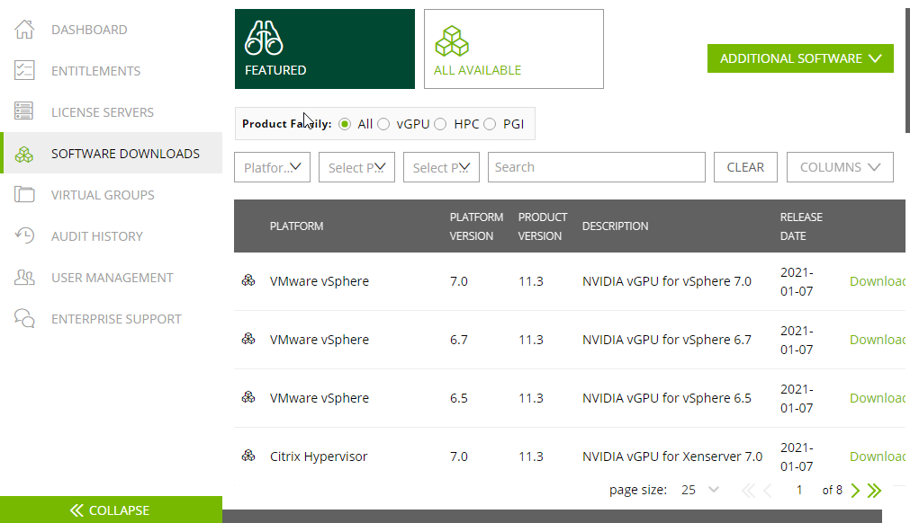
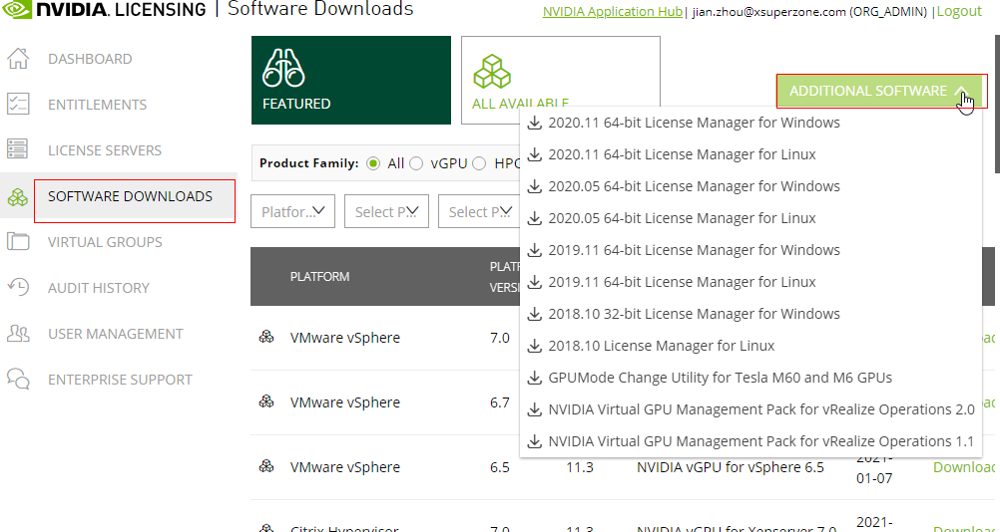
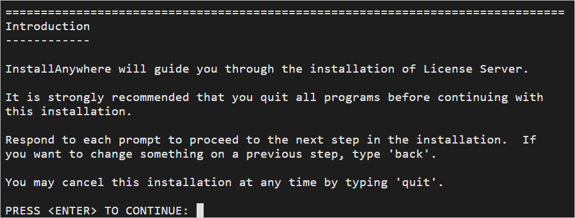
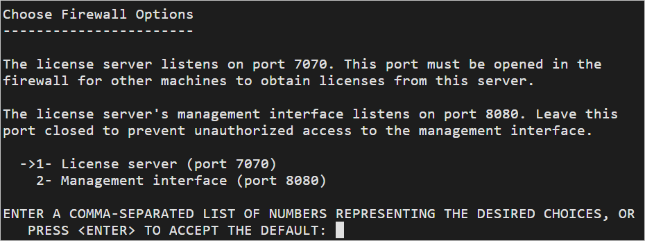
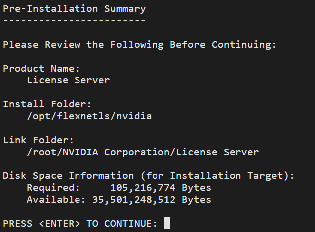
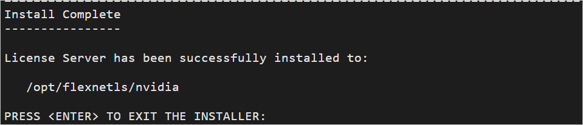
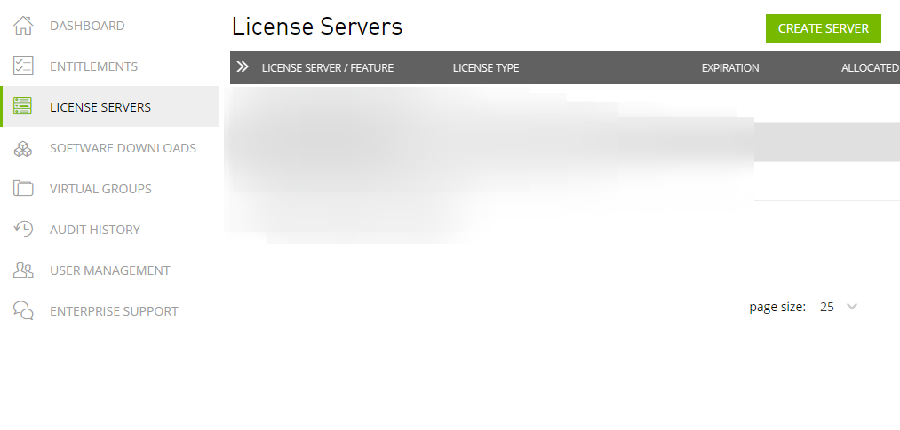
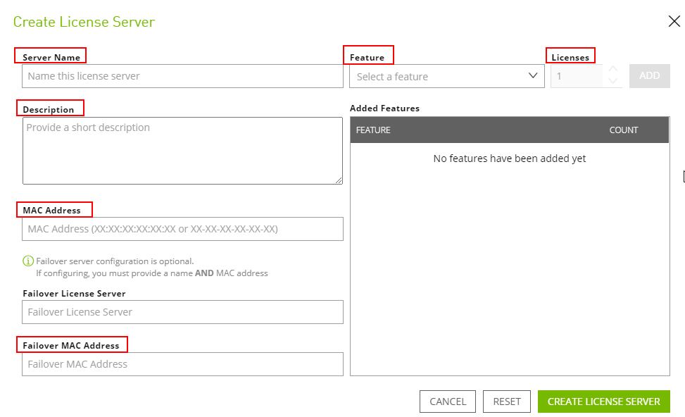
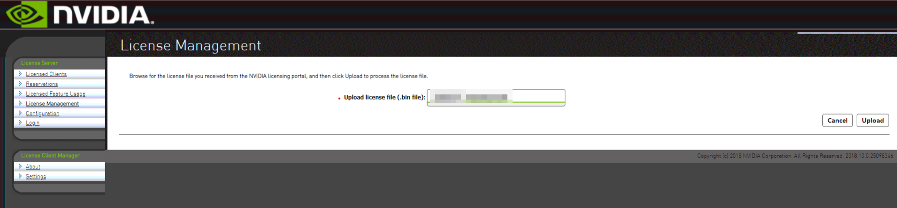

# GPU加速型实例安装GRID驱动

## 操作场景

GPU加速型实例如需使用OpenGL/DirectX/Vulkan等图形加速能力则需要安装GRID驱动并自行购买和配置使用GRID License。此外，GRID驱动配合vDWS类型License，也支持CUDA，用来满足既需要计算加速也需要图形加速的场景。

-   使用公共镜像创建的图形加速型（G系列）实例默认已安装特定版本的GRID驱动，但GRID License需自行购买和配置使用。
-   使用私有镜像创建的GPU加速型实例，则需要安装GRID驱动并自行购买和配置使用GRID License。

> **说明：** 
>如果通过私有镜像创建的GPU实例使用虚拟化类型的GPU显卡（如G6v），请确保下载和安装与公共镜像创建云服务器时相同的GRID驱动版本，以确保驱动与主机配套，云服务器可正常运行。
>GRID驱动版本，请参见[表1](#table188851534175019)。

本节操作介绍如何安装GRID驱动，购买或者申请GRID License，以及如何配置License服务器。

安装GRID驱动操作步骤：

1.  [购买GRID License](#section1130184214229)
2.  [下载GRID驱动及License软件包](#section91244318407)
3.  [部署和配置License Server](#section19229135113439)
4.  [安装GRID驱动并配置License](#section17545653184812)

> **说明：** 
>-   NVIDIA支持用户申请90天试用版License。
>-   不同规格的GPU实例介绍和应用场景请参见[GPU加速型](https://support.huaweicloud.com/productdesc-ecs/ecs_01_0045.html)。

## 购买GRID License

-   购买License

    如果需要正式版本License，请联系NVIDIA或者所在国家/地区的NVIDIA代理商。

-   申请试用版License。

    打开[NVIDIA官方网站](https://www.nvidia.com/object/nvidia-enterprise-account.html)，填写相关信息。

    注册账号和申请试用版License的注意事项请参见[NVIDIA官方帮助页](https://nvid.nvidia.com/NvidiaUtilities/#/needHelp)。

    > **说明：** 
    >试用版License的使用方法和正式版本的License一致，可以保留试用版账号激活正式版本的License，无需重新注册。试用版License有限期限为90天，账号过期将无法使用，请尽快购买正式版本。

    **图 1**  申请试用版License  
    

## 下载GRID驱动及License软件包

1.  请根据[表1](#table188851534175019)对应操作系统下载驱动安装包。

    了解更多GRID驱动信息请参考[NVIDIA vGPU驱动](https://docs.nvidia.com/grid/index.html)。

    > **说明：** 
    >GPU直通型实例：根据需求选择GRID驱动版本。
    >GPU虚拟化型实例：请严格按照下表选择合适的驱动版本下载使用。

    **表 1**  GPU实例类型支持的GRID驱动版本

    
    <table><thead align="left"><tr id="row38821334115015"><th class="cellrowborder" valign="top" width="10.611061106110611%" id="mcps1.2.6.1.1">
实例类型

    </th>
    <th class="cellrowborder" valign="top" width="16.16161616161616%" id="mcps1.2.6.1.2">
GPU挂载方式

    </th>
    <th class="cellrowborder" valign="top" width="38.76387638763876%" id="mcps1.2.6.1.3">
操作系统

    </th>
    <th class="cellrowborder" valign="top" width="23.352335233523352%" id="mcps1.2.6.1.4">
驱动版本

    </th>
    <th class="cellrowborder" valign="top" width="11.111111111111112%" id="mcps1.2.6.1.5">
CPU架构

    </th>
    </tr>
    </thead>
    <tbody><tr id="row23595915223"><td class="cellrowborder" valign="top" width="10.611061106110611%" headers="mcps1.2.6.1.1 ">
G6v

    </td>
    <td class="cellrowborder" valign="top" width="16.16161616161616%" headers="mcps1.2.6.1.2 ">
GPU虚拟化型实例

    </td>
    <td class="cellrowborder" valign="top" width="38.76387638763876%" headers="mcps1.2.6.1.3 "><ul id="ul44951548306"><li>CentOS 8.2 64bit</li><li>CentOS 7.6 64bit</li><li>Ubuntu 20.04 server 64bit</li><li>Ubuntu 18.04 server 64bit</li><li>Windows Server 2019 Standard 64bit</li><li>Windows Server 2019 Datacenter 64bit</li><li>Windows Server 2016 Datacenter 64bit</li></ul>
    </td>
    <td class="cellrowborder" valign="top" width="23.352335233523352%" headers="mcps1.2.6.1.4 ">
GRID 11.1

    </td>
    <td class="cellrowborder" valign="top" width="11.111111111111112%" headers="mcps1.2.6.1.5 ">
x86_64

    </td>
    </tr>
    <tr id="row1288220341507"><td class="cellrowborder" valign="top" width="10.611061106110611%" headers="mcps1.2.6.1.1 ">
G6

    </td>
    <td class="cellrowborder" valign="top" width="16.16161616161616%" headers="mcps1.2.6.1.2 ">
GPU直通型实例

    </td>
    <td class="cellrowborder" valign="top" width="38.76387638763876%" headers="mcps1.2.6.1.3 "><ul id="ul154511636224"><li>Huawei Cloud EulerOS 2.0 64bit</li><li>CentOS 8.2 64bit</li><li>CentOS 8.1 64bit</li><li>CentOS 8.0 64bit</li><li>CentOS 7.9 64bit</li><li>CentOS 7.8 64bit</li><li>CentOS 7.7 64bit</li><li>CentOS 7.6 64bit</li><li>CentOS 7.5 64bit</li><li>Ubuntu 22.04 64bit</li><li>Ubuntu 20.04 64bit</li><li>Ubuntu 18.04 64bit</li><li>Ubuntu 16.04 64bit</li><li>Windows Server 2022 Standard 64bit</li><li>Windows Server 2019 Standard 64bit</li><li>Windows Server 2022 Datacenter 64bit</li><li>Windows Server 2019 Datacenter 64bit</li><li>Windows Server 2016 Datacenter 64bit</li></ul>
    </td>
    <td class="cellrowborder" valign="top" width="23.352335233523352%" headers="mcps1.2.6.1.4 ">
按需选择版本

    </td>
    <td class="cellrowborder" valign="top" width="11.111111111111112%" headers="mcps1.2.6.1.5 ">
x86_64

    </td>
    </tr>
    <tr id="row1088383418500"><td class="cellrowborder" valign="top" width="10.611061106110611%" headers="mcps1.2.6.1.1 ">
G5.8xlarge.4

    </td>
    <td class="cellrowborder" valign="top" width="16.16161616161616%" headers="mcps1.2.6.1.2 ">
GPU直通型实例

    </td>
    <td class="cellrowborder" valign="top" width="38.76387638763876%" headers="mcps1.2.6.1.3 "><ul id="ul1113872049"><li>CentOS 8.2 64bit</li><li>CentOS 7.6 64bit</li><li>CentOS 7.5 64bit</li><li>Ubuntu 20.04 64bit</li><li>Ubuntu 18.04 64bit</li><li>Windows Server 2019 Standard 64bit</li><li>Windows Server 2019 Datacenter 64bit</li><li>Windows Server 2016 Datacenter 64bit</li></ul>
    </td>
    <td class="cellrowborder" valign="top" width="23.352335233523352%" headers="mcps1.2.6.1.4 ">
按需选择版本

    </td>
    <td class="cellrowborder" valign="top" width="11.111111111111112%" headers="mcps1.2.6.1.5 ">
x86_64

    </td>
    </tr>
    <tr id="row8883143415018"><td class="cellrowborder" valign="top" width="10.611061106110611%" headers="mcps1.2.6.1.1 ">
G3

    </td>
    <td class="cellrowborder" valign="top" width="16.16161616161616%" headers="mcps1.2.6.1.2 ">
GPU直通型实例

    </td>
    <td class="cellrowborder" valign="top" width="38.76387638763876%" headers="mcps1.2.6.1.3 "><ul id="ul079474513"><li>Windows Server 2019 Standard 64bit</li><li>Windows Server 2019 Datacenter 64bit</li><li>Windows Server 2016 Datacenter 64bit</li></ul>
    </td>
    <td class="cellrowborder" valign="top" width="23.352335233523352%" headers="mcps1.2.6.1.4 ">
按需选择版本

    </td>
    <td class="cellrowborder" valign="top" width="11.111111111111112%" headers="mcps1.2.6.1.5 ">
x86_64

    </td>
    </tr>
    <tr id="row1688333425020"><td class="cellrowborder" valign="top" width="10.611061106110611%" headers="mcps1.2.6.1.1 ">
G1

    </td>
    <td class="cellrowborder" valign="top" width="16.16161616161616%" headers="mcps1.2.6.1.2 ">
GPU虚拟化型实例

    </td>
    <td class="cellrowborder" valign="top" width="38.76387638763876%" headers="mcps1.2.6.1.3 "><ul id="ul067121613720"><li>Windows Server 2016 Datacenter 64bit</li></ul>
    </td>
    <td class="cellrowborder" valign="top" width="23.352335233523352%" headers="mcps1.2.6.1.4 ">
vGPU 4.1：GRID for UVP

    </td>
    <td class="cellrowborder" valign="top" width="11.111111111111112%" headers="mcps1.2.6.1.5 ">
x86_64

    </td>
    </tr>
    <tr id="row18841534145013"><td class="cellrowborder" valign="top" width="10.611061106110611%" headers="mcps1.2.6.1.1 ">
P2vs

    </td>
    <td class="cellrowborder" valign="top" width="16.16161616161616%" headers="mcps1.2.6.1.2 ">
GPU直通型实例

    </td>
    <td class="cellrowborder" valign="top" width="38.76387638763876%" headers="mcps1.2.6.1.3 "><ul id="ul1837817314814"><li>CentOS 7.5 64bit</li><li>Ubuntu 16.04 Server 64bit</li><li>Windows Server 2016 Standard 64bit</li></ul>
    </td>
    <td class="cellrowborder" valign="top" width="23.352335233523352%" headers="mcps1.2.6.1.4 ">
按需选择版本

    </td>
    <td class="cellrowborder" valign="top" width="11.111111111111112%" headers="mcps1.2.6.1.5 ">
x86_64

    </td>
    </tr>
    <tr id="row16884113418504"><td class="cellrowborder" valign="top" width="10.611061106110611%" headers="mcps1.2.6.1.1 ">
P2s

    </td>
    <td class="cellrowborder" valign="top" width="16.16161616161616%" headers="mcps1.2.6.1.2 ">
GPU直通型实例

    </td>
    <td class="cellrowborder" valign="top" width="38.76387638763876%" headers="mcps1.2.6.1.3 "><ul id="ul146315251597"><li>Huawei Cloud EulerOS 2.0 64bit</li><li>CentOS 8.2 64bit</li><li>CentOS 8.1 64bit</li><li>CentOS 8.0 64bit</li><li>CentOS 7.9 64bit</li><li>CentOS 7.8 64bit</li><li>CentOS 7.7 64bit</li><li>CentOS 7.6 64bit</li><li>Ubuntu 22.04 Server 64bit</li><li>Ubuntu 20.04 Server 64bit</li><li>Ubuntu 18.04 Server 64bit</li><li>Ubuntu 16.04 Server 64bit</li><li>Windows Server 2022 Standard 64bit</li><li>Windows Server 2019 Standard 64bit</li><li>Windows Server 2022 Datacenter 64bit</li><li>Windows Server 2019 Datacenter 64bit</li><li>Windows Server 2016 Datacenter 64bit</li></ul>
    </td>
    <td class="cellrowborder" valign="top" width="23.352335233523352%" headers="mcps1.2.6.1.4 ">
按需选择版本

    </td>
    <td class="cellrowborder" valign="top" width="11.111111111111112%" headers="mcps1.2.6.1.5 ">
x86_64

    </td>
    </tr>
    <tr id="row188463416506"><td class="cellrowborder" valign="top" width="10.611061106110611%" headers="mcps1.2.6.1.1 ">
P2v

    </td>
    <td class="cellrowborder" valign="top" width="16.16161616161616%" headers="mcps1.2.6.1.2 ">
GPU直通型实例

    </td>
    <td class="cellrowborder" valign="top" width="38.76387638763876%" headers="mcps1.2.6.1.3 "><ul id="ul12465123829"><li>CentOS 7.4 64bit</li><li>EulerOS 2.2 64bit</li><li>Ubuntu 20.04 Server 64bit</li><li>Ubuntu 18.04 Server 64bit</li><li>Ubuntu 16.04 Server 64bit</li><li>Windows Server 2019 Standard 64bit</li><li>Windows Server 2019 Datacenter 64bit</li><li>Windows Server 2016 Datacenter 64bit</li></ul>
    </td>
    <td class="cellrowborder" valign="top" width="23.352335233523352%" headers="mcps1.2.6.1.4 ">
按需选择版本

    </td>
    <td class="cellrowborder" valign="top" width="11.111111111111112%" headers="mcps1.2.6.1.5 ">
x86_64

    </td>
    </tr>
    <tr id="row1088563415507"><td class="cellrowborder" valign="top" width="10.611061106110611%" headers="mcps1.2.6.1.1 ">
P1

    </td>
    <td class="cellrowborder" valign="top" width="16.16161616161616%" headers="mcps1.2.6.1.2 ">
GPU直通型实例

    </td>
    <td class="cellrowborder" valign="top" width="38.76387638763876%" headers="mcps1.2.6.1.3 "><ul id="ul711710185817"><li>CentOS 7.3 64bit</li><li>Ubuntu 16.04 Server 64bit</li><li>EulerOS 2.2 64bit</li><li>Debian 8.0.0 64bit</li><li>Windows Server 2022 Standard 64bit</li><li>Windows Server 2019 Standard 64bit</li><li>Windows Server 2022 Datacenter 64bit</li><li>Windows Server 2019 Datacenter 64bit</li><li>Windows Server 2016 Datacenter 64bit</li></ul>
    </td>
    <td class="cellrowborder" valign="top" width="23.352335233523352%" headers="mcps1.2.6.1.4 ">
按需选择版本

    </td>
    <td class="cellrowborder" valign="top" width="11.111111111111112%" headers="mcps1.2.6.1.5 ">
x86_64

    </td>
    </tr>
    <tr id="row1885134185018"><td class="cellrowborder" valign="top" width="10.611061106110611%" headers="mcps1.2.6.1.1 ">
Pi2

    </td>
    <td class="cellrowborder" valign="top" width="16.16161616161616%" headers="mcps1.2.6.1.2 ">
GPU直通型实例

    </td>
    <td class="cellrowborder" valign="top" width="38.76387638763876%" headers="mcps1.2.6.1.3 "><ul id="ul33877451516"><li>Huawei Cloud EulerOS 2.0 64bit</li><li>CentOS 8.2 64bit</li><li>CentOS 8.1 64bit</li><li>CentOS 8.0 64bit</li><li>CentOS 7.9 64bit</li><li>CentOS 7.8 64bit</li><li>CentOS 7.7 64bit</li><li>CentOS 7.6 64bit</li><li>CentOS 7.5 64bit</li><li>Ubuntu 22.04 Server 64bit</li><li>Ubuntu 20.04 Server 64bit</li><li>Ubuntu 18.04 Server 64bit</li><li>Ubuntu 16.04 Server 64bit</li><li>Windows Server 2022 Standard 64bit</li><li>Windows Server 2019 Standard 64bit</li><li>Windows Server 2022 Datacenter 64bit</li><li>Windows Server 2019 Datacenter 64bit</li><li>Windows Server 2016 Datacenter 64bit</li></ul>
    </td>
    <td class="cellrowborder" valign="top" width="23.352335233523352%" headers="mcps1.2.6.1.4 ">
按需选择版本

    </td>
    <td class="cellrowborder" valign="top" width="11.111111111111112%" headers="mcps1.2.6.1.5 ">
x86_64

    </td>
    </tr>
    <tr id="row48851834205018"><td class="cellrowborder" valign="top" width="10.611061106110611%" headers="mcps1.2.6.1.1 ">
Pi1

    </td>
    <td class="cellrowborder" valign="top" width="16.16161616161616%" headers="mcps1.2.6.1.2 ">
GPU直通型实例

    </td>
    <td class="cellrowborder" valign="top" width="38.76387638763876%" headers="mcps1.2.6.1.3 "><ul id="ul108851734175018"><li>CentOS 7.3 64bit</li><li>Ubuntu 20.04 Server 64bit</li><li>Ubuntu 16.04 Server 64bit</li><li>Ubuntu 14.04 Server 64bit</li><li>Windows Server 2019 Standard 64bit</li><li>Windows Server 2019 Datacenter 64bit</li><li>Windows Server 2016 Datacenter 64bit</li></ul>
    </td>
    <td class="cellrowborder" valign="top" width="23.352335233523352%" headers="mcps1.2.6.1.4 ">
按需选择版本

    </td>
    <td class="cellrowborder" valign="top" width="11.111111111111112%" headers="mcps1.2.6.1.5 ">
x86_64

    </td>
    </tr>
    </tbody>
    </table>

2.  注册成功后，登录[NVIDIA官网](https://nvid.nvidia.com/dashboard/)，填写账户信息。
3.  判断是否为首次注册使用NVIDIA。
    1.  是，执行[4](#li1859773663819)。
    2.  否，执行[6](#li0791101412396)。

4.  在注册NVIDIA用户成功的邮件中，查询PAK，如[图2](#fig133361216153817)所示。

    **图 2**  注册PAK  
    

5.  将[4](#li1859773663819)中查找的PAK填写在“Redeem Product Activation Keys”页面 ，并单击“Redeem”。

    **图 3**  Redeem Product Activation Keys  
    

6.  输入“用户名”和“密码”，并单击“登录”。

    **图 4**  登录NVIDIA官网  
    

7.  根据界面提示，进入NVIDIA网站，并选择“SOFTWARE DOWNLOADS”。

    **图 5**  打开NVIDIA网站  
    

8.  对照[表1](#table188851534175019)选择相应版本的GRID驱动下载。
9.  解压缩GRID驱动包，并选择和弹性云服务器操作系统匹配的驱动进行安装。
10. 在“SOFTWARE DOWNLOADS”页面，单击“ADDITIONAL SOFTWARE”，下载License软件包。

    **图 6**  选择SOFTWARE DOWNLOADS  
    

## 部署和配置License Server

以CentOS 7.5操作系统的云服务器为例演示部署和配置License Server。

> **说明：** 
>-   云服务器规格不小于2vCPU，内存不小于4GiB。
>-   请提前记录云服务器MAC地址。
>-   如用作生产用途，建议采用高可用模式部署，主备高可用模式部署License Server 请参考[NVIDIA官方License Server高可用部署文档](https://docs.nvidia.com/grid/ls/2019.05/grid-license-server-user-guide/index.html#license-server-high-availability)。

1.  配置网络：
    -   如使用VPC网络访问License Server：请确保License Server和使用GRID驱动的GPU加速型实例处在同一个VPC子网内。
    -   如使用公网IP访问License Server：请配置License Server所在的安全组，增加入方向规则：TCP 7070和TCP 8080。

1.  安装License Server。
    1.  执行以下命令，解压缩安装包。其中“安装程序.zip”为[10](#li1783092110416)获取到的安装包名称。

        **unzip 安装程序.zip**

    2.  执行以下命令，为安装程序添加执行权限。

        **chmod +x setup.bin**

    3.  以root用户运行安装程序。

        **sudo ./setup.bin -i console**

    4.  在Introduction部分，单击回车键继续。

        

    5.  在License Agreement部分，通过单击回车键进行翻页，翻页结束后接受许可协议。

        当您达成许可协议时，系统会提示您接受许可协议条款，请输入“Y”，并单击回车键。

        

    6.  在Choose Install Folder部分，单击回车键，保持默认的License Server软件安装路径。
    7.  在Choose Local Tomcat Server Path部分，输入Tomcat的本地路径，默认为/var/lib/tomcat版本号，例如：/var/lib/tomcat8。
    8.  在Choose Firewall Options部分，确认需要在防火墙中打开的端口，单击回车键，保持默认选项即可。

        

    9.  在Pre-Installation Summary部分，确认信息并单击回车键启动安装。

        

    10. 在Install Complete部分，单击回车键，结束安装。

        

2.  获取License文件。
    1.  新建页签，登录[NVIDIA网站](https://nvid.nvidia.com/dashboard/)，选择“LICENSE SERVERS”。

        **图 7**  选择LICENSE SERVERS  
        

    2.  单击“CREATE SERVER”。
    3.  在“Create License Server”界面，根据界面提示配置参数。

        **图 8**  填写LICENSE SERVERS信息  
        

        **表 2**  LICENSE SERVERS信息填写说明

        
        <table><thead align="left"><tr id="row2801183614219"><th class="cellrowborder" valign="top" width="32.93%" id="mcps1.2.3.1.1">
参数

        </th>
        <th class="cellrowborder" valign="top" width="67.07%" id="mcps1.2.3.1.2">
说明

        </th>
        </tr>
        </thead>
        <tbody><tr id="row6801036192116"><td class="cellrowborder" valign="top" width="32.93%" headers="mcps1.2.3.1.1 ">
Server Name

        </td>
        <td class="cellrowborder" valign="top" width="67.07%" headers="mcps1.2.3.1.2 ">
自定义需要的License Server名称。

        </td>
        </tr>
        <tr id="row1980173612110"><td class="cellrowborder" valign="top" width="32.93%" headers="mcps1.2.3.1.1 ">
Description

        </td>
        <td class="cellrowborder" valign="top" width="67.07%" headers="mcps1.2.3.1.2 ">
License Server的描述信息。

        </td>
        </tr>
        <tr id="row1480112366214"><td class="cellrowborder" valign="top" width="32.93%" headers="mcps1.2.3.1.1 ">
MAC Address

        </td>
        <td class="cellrowborder" valign="top" width="67.07%" headers="mcps1.2.3.1.2 ">
填写用于搭建License Server的ECS实例的MAC地址。

        
您可以登录实例，使用ipconfig -a命令进行查询。

        </td>
        </tr>
        <tr id="row10289135112212"><td class="cellrowborder" valign="top" width="32.93%" headers="mcps1.2.3.1.1 ">
Feature

        </td>
        <td class="cellrowborder" valign="top" width="67.07%" headers="mcps1.2.3.1.2 ">
在Licenses框中输入需要的license数目，单击“ADD”。

        
如果是主备部署的情况需要把备服务器的名称填入 Failover License Server，MAC地址填入Failover MAC Address中。

        </td>
        </tr>
        </tbody>
        </table>

    4.  单击“CREATE LICENSE SERVER”。
    5.  下载License文件。

        **图 9**  下载License文件  
        

3.  在Web浏览器中，根据安装时配置的管理页面链接，访问License Server管理界面的主页。

    默认访问链接为：http://_弹性公网IP地址_:8080/licserver。

4.  在左侧导航树中，单击“License Server \> License Management”。
5.  使用License服务器配置菜单导入，并单击“Upload”上传许可证\*.bin文件，完成License Server的配置。

    **图 10**  上传许可证文件  
    

## 安装GRID驱动并配置License

1.  以Windows操作系统GPU加速型实例为例，选择合适版本的GRID驱动进行安装。

    > **说明：** 
    >微软的远程登录协议不支持使用GPU的3D硬件加速能力，如需使用请安装VNC/PCoIP/NICE DCV等第三方桌面协议软件，并通过相应客户端连接GPU实例，使用GPU图形图像加速能力。

2.  使用第三方桌面协议连接后，在Windows控制面板中打开NVIDIA控制面板 。
3.  在一级许可证服务器中填入部署的License server的IP和端口，并单击应用。当出现“您的系统已获GRID vGPU许可”则代表安装GRID驱动成功，并且可以在License Server管理控制台Licensed Clients中看到已安装GRID驱动并使用了License的GPU实例的MAC地址。

    **图 11**  License Server管理控制台  
    

