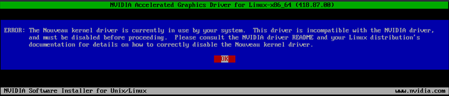
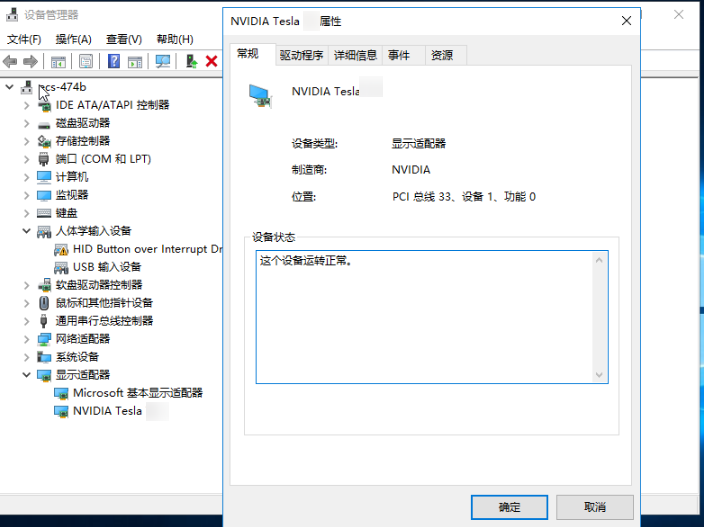
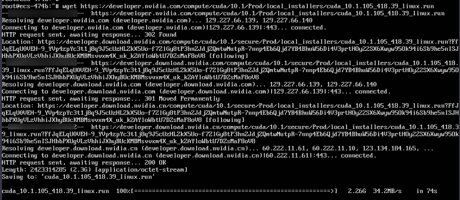
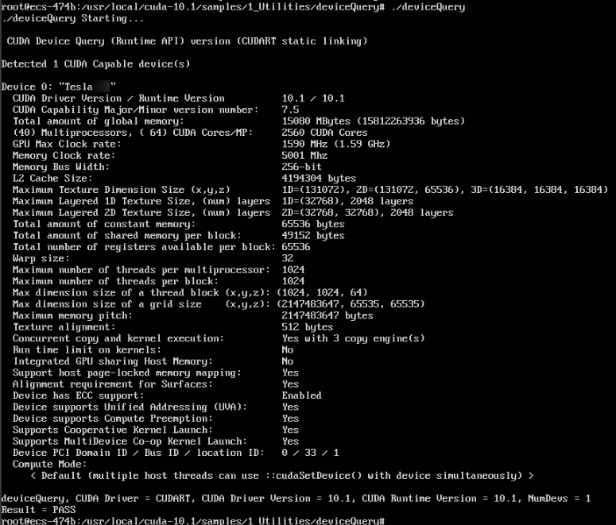
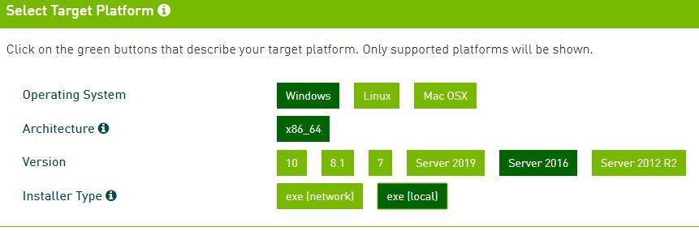
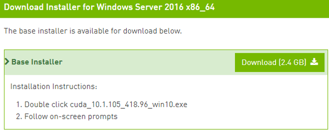

# GPU加速型实例安装Tesla驱动及CUDA工具包<a name="ZH-CN_TOPIC_0149470468"></a>

## 操作场景<a name="section11831857193910"></a>

GPU加速型云服务器，需要安装Tesla驱动和CUDA工具包以实现计算加速功能。

-   使用公共镜像创建的计算加速型（P系列）实例默认已安装特定版本的Tesla驱动。
-   使用私有镜像创建的GPU加速型云服务器，需在创建完成后安装Tesla驱动，否则无法实现计算加速功能。

本节操作介绍GPU云服务器安装Tesla驱动及CUDA工具包的操作步骤。

## 安装须知<a name="section14189185733910"></a>

-   云服务器已绑定弹性公网IP。
-   云服务器未安装Tesla驱动以及CUDA工具包。

> **说明：**   
>-   从NVIDIA官网下载CUDA工具包进行安装，通常会同时自动安装一个和CUDA版本匹配的Tesla驱动，免去用户单独安装Tesla驱动的步骤。  
>-   但是如果云服务器用作生产用途，请务必先单独从NVIDIA官网下载并安装匹配的Tesla驱动，然后在再安装CUDA工具包。  
>-   如果云服务器已经安装了Tesla驱动，请检查当前驱动版本是否可用。如需安装新版本的驱动请卸载旧版本的Tesla驱动，避免因驱动程序冲突导致安装失败。  

安装指引：

-   [Tesla驱动及CUDA工具包获取方式](Tesla驱动及CUDA工具包获取方式.md)
-   安装NVIDIA驱动
    -   [Linux操作系统云服务器安装Tesla驱动](#section1728514576397)
    -   [Windows操作系统云服务器安装Tesla驱动](#section244363219171)

-   安装CUDA驱动
    -   [Linux操作系统安装CUDA工具包](#section1034245773916)
    -   [Windows操作系统安装CUDA工具包](#section0337133719497)


## Linux操作系统云服务器安装Tesla驱动<a name="section1728514576397"></a>

以下操作以Ubuntu 16.04 64bit操作系统，GPU实例安装CUDA 10.1对应的Tesla驱动为例。

> **说明：**   
>Linux内核版本和驱动的版本存在兼容性关系。如果驱动安装失败，请检查驱动安装日志\(安装日志通常位于/var/log/nvidia-installer.log\)。 日志中如提示失败原因为驱动编译错误，例如 get\_user\_pages参数不匹配，说明当前内核版本与驱动版本不兼容，请选择合适的内核版本和驱动版本重新安装。建议内核版本与驱动版本发布时间不要相差过大。  

1.  登录云服务器。
2.  根据操作系统选择命令更新系统软件。
    -   Ubuntu

        更新软件安装源：**apt-get -y update**

        安装必要程序：**apt-get install gcc g++ make**

    -   CentOS

        更新软件安装源：**yum -y update --exclude=kernel\* --exclude=centos-release\* --exclude=initscripts\***

        安装必要程序：**yum install -y kernel-devel-\`uname -r\` gcc gcc-c++**

3.  下载NVIDIA驱动包。

    单击[NVIDIA驱动下载](https://www.nvidia.com/Download/index.aspx?lang=en-us)根据实例的类型，选择驱动版本。单击“SEARCH”。

    **图 1**  选择NVIDIA驱动<a name="fig545554125711"></a>  
    

4.  根据需求选择驱动版本，以下操作以选择Tesla 418.67为例。

    **图 2**  选择驱动版本<a name="fig52351103310"></a>  
    

5.  单击需要下载的驱动，进入“TESLA DRIVER FOR LINUX X64”界面，单击“DOWNLOAD”。
6.  复制下载链接地址。

    **图 3**  复制下载链接地址<a name="fig123801538205720"></a>  
    

7.  在云服务器内部执行如下命令进行下载。

    **wget 复制的链接地址**

    例如：**wget http://us.download.nvidia.com/tesla/418.67/NVIDIA-Linux-x86\_64-418.67.run**

    **图 4**  获取安装包<a name="fig187219205141"></a>  
    

8.  执行以下命令安装驱动。

    **sh NVIDIA-Linux-x86\_64-418.67.run**

9.  （可选）如果执行驱动安装命令后出现如下提示信息，需要禁用nouveau驱动。

    **图 5**  禁用nouveau驱动<a name="fig2682182345814"></a>  
    

    1.  执行以下命令，查看是否安装Nouveau驱动。

        **lsmod | grep nouveau**

        -   如果回显信息中包含Nouveau驱动信息，说明Nouveau驱动已安装，则需要禁用Nouveau驱动，请执行步骤[9.b](#li073251517124)。
        -   如果回显信息没有Nouveau驱动信息，说明Nouveau驱动已被禁用，请执行步骤[9.d](#li9819105753916)。

    2.  <a name="li073251517124"></a>执行如下命令编辑blacklist.conf文件。

        如果没有“/etc/modprobe.d/blacklist.conf”文件，请新建一个。

        **vi /etc/modprobe.d/blacklist.conf**

        添加如下语句添加至文件结尾。

        ```
        blacklist nouveau
        options nouveau modeset=0
        ```

    1.  执行以下命令，备份并新建一个initramfs。
        -   Ubuntu系统：

            **sudo update-initramfs -u**

        -   CentOS系统：

            **mv /boot/initramfs-$\(uname -r\).img /boot/initramfs-$\(uname -r\).img.bak**

            **dracut -v /boot/initramfs-$\(uname -r\).img $\(uname -r\)**


    1.  <a name="li9819105753916"></a>执行以下命令，重启云服务器。

        **reboot**

10. 根据安装提示，连续三次选择“OK”。完成驱动的安装。

    **图 6**  NVIDIA驱动安装完成<a name="fig1643713142594"></a>  
    

11. 执行命令设置systemd。

    **systemctl set-default multi-user.target**

12. 执行**reboot**，重启云服务器。
13. 登录云服务器，执行**nvidia-smi**，如果回显信息中包含了已安装的驱动版本，说明驱动安装成功。

    **图 7**  查看NVIDIA驱动的版本<a name="fig61971535809"></a>  
    


## Windows操作系统云服务器安装Tesla驱动<a name="section244363219171"></a>

以下操作以Windows Server 2016 Standard 64bit操作系统，GPU实例安装Tesla驱动为例。

1.  登录云服务器。
2.  下载NVIDIA驱动包。

    单击[NVIDIA驱动下载](https://www.nvidia.com/Download/index.aspx?lang=en-us)根据实例的类型，选择驱动版本。

    **图 8**  选择驱动类型（Windows）<a name="fig62897581106"></a>  
    

3.  根据需求选择驱动版本，本节操作以安装Tesla 425.25为例。

    **图 9**  选择驱动版本（Windows）<a name="fig5291626204819"></a>  
    

4.  单击需要下载的驱动，进入“TESLA DRIVER FOR WINDOWS”界面，单击“DOWNLOAD”。
5.  单击“Agree & Download”，下载安装包。

    **图 10**  下载NVIDIA驱动安装包<a name="fig37451434818"></a>  
    

6.  双击驱动安装驱动，单击“运行”。

    **图 11**  运行NVIDIA驱动安装程序<a name="fig177611624821"></a>  
    

7.  选择安装路径，单击“OK”。

    **图 12**  选择NVIDIA驱动安装路径<a name="fig1378440121"></a>  
    

8.  根据安装提示完成NVIDIA程序的安装。

    **图 13**  完成NVIDIA驱动的安装<a name="fig46181053128"></a>  
    

9.  重启云服务器。
10. 检查驱动是否安装成功。
    1.  进入“设备管理器”，查看“显示适配器”。

        **图 14**  显示适配器<a name="fig8540781030"></a>  
        

    1.  打开云服务器cmd窗口，执行以下命令：

        **cd C:\\Program Files\\NVIDIA Corporation\\NVSMI**

        **nvidia-smi**

        如果回显信息中包含了已安装的驱动版本，说明驱动安装成功。

        **图 15**  查看NVIDIA驱动安装版本<a name="fig125251621439"></a>  
        


## Linux操作系统安装CUDA工具包<a name="section1034245773916"></a>

以下操作以Ubuntu 16.04 64bit操作系统，GPU实例使用run包安装CUDA 10.1为例。

1.  登录云服务器。
2.  在CUDA下载页面中，按照[Tesla驱动及CUDA工具包获取方式](Tesla驱动及CUDA工具包获取方式.md)中的对应的索引项在页面中进行选择。

    **图 16**  选择CUDA的版本<a name="fig1930101643513"></a>  
    

3.  选择完成后，页面会自动呈现出Ubuntu 16.04 64bit对应的CUDA 10.1的下载地址，复制下载地址。

    **图 17**  复制CUDA下载地址<a name="fig970482862918"></a>  
    


1.  在云服务器内部执行如下命令进行下载。

    **wget 复制的链接地址**

    例如：**wget https://developer.nvidia.com/compute/cuda/10.1/Prod/local\_installers/cuda\_10.1.105\_418.39\_linux.run**

    **图 18**  Linux云服务器下载CUDA<a name="fig8354143184612"></a>  
    


1.  CUDA工具包下载完成后，按照NVIDIA官网安装指引进行安装。

    按照如下图的NVIDIA官网的Installation Instructions进行安装。

    **图 19**  Linux云服务器安装CUDA<a name="fig11827757103913"></a>  
    

2.  执行以下命令安装CUDA。

    **sh cuda\_10.1.243\_418.87.00\_linux.run**

3.  在安装界面输入“accept”，回车进入下一步。

    **图 20**  安装CUDA\_1<a name="fig514958145414"></a>  
    

4.  选择“Install”，回车进入安装过程。

    **图 21**  安装CUDA\_2<a name="fig20943181255411"></a>  
    

    **图 22**  安装CUDA完成<a name="fig148915619526"></a>  
    

5.  执行以下命令进入/usr/local/cuda-10.1/samples/1\_Utilities/deviceQuery 目录下。

    **cd /usr/local/cuda-10.1/samples/1\_Utilities/deviceQuery**

6.  执行**make**命令，自动编译deviceQuery程序。
7.  执行以下命令查看CUDA是否安装成功。

    **./deviceQuery**

    如回显信息中有CUDA的版本信息证明CUDA安装成功。

    **图 23**  deviceQuery回显信息<a name="fig1282815711392"></a>  
    

8.  执行以下命令查看CUDA的版本。

    **/usr/local/cuda/bin/nvcc -V**

    **图 24**  查看CUDA的版本<a name="fig18749997817"></a>  
    

9.  执行以下命令启动持久模式。

    **sudo nvidia-smi -pm 1**

    启用持久模式设置可以优化Linux实例上GPU设备的性能。


## Windows操作系统安装CUDA工具包<a name="section0337133719497"></a>

以下操作以Windows Server 2016 Standard 64bit操作系统GPU实例安装CUDA 10.1为例。

1.  登录云服务器。
2.  在CUDA下载页面中，按照[CUDA工具包下载地址](Tesla驱动及CUDA工具包获取方式.md#section10203125783920)中的对应的索引项在页面中进行选择。

    **图 25**  选择CUDA版本<a name="fig17127316719"></a>  
    

3.  选择完成后，页面会自动呈现出Windows Server 2016 Standard 64bit对应的CUDA 10.1的下载地址。

    **图 26**  Windows云服务器下载CUDA<a name="fig22798411673"></a>  
    

4.  单击“Download”下载CUDA工具包。
5.  双击打开安装文件，单击“运行”安装CUDA工具包。

    **图 27**  Windows云服务器安装CUDA<a name="fig696324171118"></a>  
    

6.  选择安装地址，在“CUDA Setup Package”界面，单击“OK”

    **图 28**  选择CUDA安装路径<a name="fig18644103851215"></a>  
    

7.  根据安装提示完成CUDA的安装。

    **图 29**  CUDA安装完成<a name="fig2266175711165"></a>  
    


1.  检查CUDA是否安装成功。

    打开cmd命令窗口，执行以下命令。

    **nvcc -V**

    如果回显信息中出现CUDA的版本信息，说明CUDA安装成功。

    **图 30**  CUDA安装成功<a name="fig6475101453"></a>  
    


