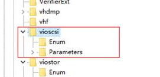

# KVM实例变更为QingTian实例（Windows）

## 操作场景

本节介绍将Windows操作系统的KVM实例变更为QingTian架构实例的操作步骤。

> **说明：** 
>-   KVM实例：参考[规格清单](https://support.huaweicloud.com/productdesc-ecs/zh-cn_topic_0159822360.html)，查询对应规格的虚拟化类型。
>-   QingTian架构实例：选择“通用计算增强型C7”、“内存优化型M7”。

## 约束与限制

-   变更规格时不支持修改网络类型。
-   QingTian实例仅支持使用SCSI磁盘模式挂载磁盘，不支持使用VBD磁盘模式挂载磁盘。即磁盘标识为wwn。
-   支持将“KVM实例”变更为“QingTian实例”，不支持将“QingTian实例”变更为“KVM实例”。
-   不支持“XEN” 实例变更为“QingTian实例”。

## 操作流程

KVM实例变更为QingTian实例的操作流程如[图1](#fig10268287430)所示。

**图 1**  Windows云服务器变更流程  

**表 1**  KVM实例变更为QingTian实例

<table><thead align="left"><tr id="row183651341145918"><th class="cellrowborder" valign="top" width="33.29%" id="mcps1.2.3.1.1">
序号

</th>
<th class="cellrowborder" valign="top" width="66.71000000000001%" id="mcps1.2.3.1.2">
任务

</th>
</tr>
</thead>
<tbody><tr id="row19366941115915"><td class="cellrowborder" valign="top" width="33.29%" headers="mcps1.2.3.1.1 ">
步骤1

</td>
<td class="cellrowborder" valign="top" width="66.71000000000001%" headers="mcps1.2.3.1.2 ">
<a href="#section15236154665218">步骤1：制作系统盘快照</a>

</td>
</tr>
<tr id="row156941633895"><td class="cellrowborder" valign="top" width="33.29%" headers="mcps1.2.3.1.1 ">
步骤2

</td>
<td class="cellrowborder" valign="top" width="66.71000000000001%" headers="mcps1.2.3.1.2 ">
<a href="#section17179613141114">步骤2：检查SCSI驱动</a>

</td>
</tr>
<tr id="row1136644155912"><td class="cellrowborder" valign="top" width="33.29%" headers="mcps1.2.3.1.1 ">
步骤3

</td>
<td class="cellrowborder" valign="top" width="66.71000000000001%" headers="mcps1.2.3.1.2 ">
<a href="#section1815152131917">步骤3：变更规格</a>

</td>
</tr>
<tr id="row03661441165910"><td class="cellrowborder" valign="top" width="33.29%" headers="mcps1.2.3.1.1 ">
步骤4

</td>
<td class="cellrowborder" valign="top" width="66.71000000000001%" headers="mcps1.2.3.1.2 ">
<a href="#section2625525131519">（可选）步骤4：检查磁盘挂载状态</a>

</td>
</tr>
</tbody>
</table>

## 步骤1：制作系统盘快照

如果云服务器未安装驱动就执行变更规格的操作，云服务器可能无法正常使用，造成您的系统盘数据丢失。因此，建议您先制作系统盘快照，防止数据丢失。

1.  制作系统盘快照前请对云服务器完成自检**。**

    对云服务器执行关机、开机操作，确保云服务器重启后业务可以正常运行。再启动制作系统盘快照。

2.  制作系统盘快照的操作，请参见《云硬盘用户指南》的“用户指南 \>  [创建快照](https://support.huaweicloud.com/usermanual-evs/zh-cn_topic_0066615262.html)”章节。

> **说明：** 
>变更规格完成后，如已确认业务恢复正常，请在快照页面手动删除快照。

## 步骤2：检查SCSI驱动

1.  登录弹性云服务器。
2.  打开“运行”对话框，输入“regedit”进入注册表编辑器。
3.  在注册表中找到以下路径：Computer\\HKEY\_LOCAL\_MACHINE\\SYSTEM\\ControlSet001\\Services\\vioscsi

    查看该目录下是否存在“StartOverride”项。

    -   若注册表该路径下只有“Enum”和“Parameters”项，则无需修改。

        **图 2**  注册表  
        

    -   若注册表该路径下存在“StartOverride”项，请执行步骤[4](#li14830195217191)。

4.  修改“StartOverride”项中类型为“REG\_DWORD”，数据为“3”的字段修改为“0”。

    **图 3**  “StartOverride”项  
    

    **图 4**  修改“REG\_DWORD”数据  
    

5.  重启弹性云服务器。
6.  再次执行步骤[2](#li143686671219)\~步骤[3](#li23683621211)，检查注册表路径下是否存在“StartOverride”项。

    若该路径下只有“Enum”和“Parameters”项，则表示修改成功。

## 步骤3：变更规格

1.  登录控制台。
2.  单击控制台左上角的，选择区域和项目。
3.  单击“”，选择“计算 \> 弹性云服务器”。
4.  在弹性云服务器列表，查询待变更弹性云服务器状态。

    如果不是关机状态，单击“操作”列下的“更多 \> 关机”。

5.  单击“操作”列下的“更多 \> 变更规格”。

    系统进入“云服务器变更规格”页面。

6.  根据界面提示，选择变更后的云服务器类型、vCPU和内存。
7.  （可选）选择“专属主机”。

    对于在专属主机上创建的弹性云服务器，系统支持更换云服务器所在的专属主机。

    此时，您可以单击下拉列表，选择更换专属主机。如果下拉列表中无可用的专属主机，说明专属主机所剩资源不足，不能用于创建变更规格后的弹性云服务器。

8.  单击“确定”。

    > **说明：** 
    >-   单击“确定”后云平台自动为您制作系统盘快照。变更规格完成后，如已确认业务恢复正常，请在快照页面手动删除快照。
    >-   如果变更规格失败后，弹性云服务器无法使用，可能会需要重装操作系统来恢复云服务器，请注意重装操作系统会清除系统盘数据，但不影响数据盘的数据。

## （可选）步骤4：检查磁盘挂载状态

KVM 实例变更为QingTian实例时，可能会发生磁盘挂载失败的情况，因此，变更规格后，需检查磁盘挂载状态是否正常。如果正常，则变更成功。

-   Windows弹性云服务器

    详细操作请参考[Windows云服务器变更规格后数据盘脱机怎么办？](https://support.huaweicloud.com/ecs_faq/ecs_faq_0618.html)

## 后续处理

如果控制台上云服务器列表页，显示弹性云服务器已变更规格成功，但是远程登录云服务器后，操作系统无法启动。此时，请联系客服进行恢复，或重装操作系统。重装系统的操作指导，请参见[重装操作系统](重装操作系统.md)。

> **说明：** 
>重装操作系统会清除系统盘数据，但不影响数据盘的数据。

变更规格完成后，如已确认业务恢复正常，请在快照页面手动删除快照。

