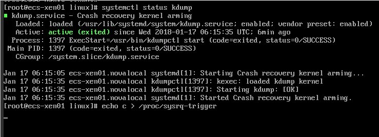
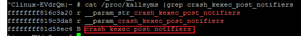

# Linux弹性云服务器发生kdump时，操作系统无响应

## 问题描述

采用XEN虚拟化技术的Linux弹性云服务器，发生kdump时系统卡住无响应，不能自动重启恢复。例如，用户执行命令**echo c\>/proc/sysrq-trigger**主动触发kdump功能，Linux弹性云服务器卡住，如[图1](#fig1529410182516)所示。

**图 1**  触发kdump功能  

> **说明：**   
>一般情况下，公有云提供的公共镜像已禁用kdump功能。使用公共镜像创建的弹性云服务器不存在该问题。  

## 可能原因

-   部分版本的Linux内核与XEN虚拟化平台不适配。
-   内核不支持soft\_rest的弹性云服务器，开启kdump服务时，弹性云服务器在dump时会卡死。

## 处理方法

**方法一：禁用kdump功能**

以CentOS 7.2为例：

1.  强制重启弹性云服务器。
    1.  登录控制台。
    2.  选择“计算 \> 弹性云服务器”。
    3.  在弹性云服务器列表中，勾选卡住的弹性云服务器，并单击“重启”。
    4.  勾选“强制重启”/“强制关机”，确定强制重启/强制关机弹性云服务器。
    5.  单击“确定”。

2.  关闭kdump功能。
    1.  以root帐号登录强制重启后的弹性云服务器。
    2.  执行以下命令，禁用kdump功能。

        **service kdump stop**

**方法二：**

对于支持"crash\_kexec\_post\_notifiers"函数的弹性云服务器，为解决kdump时不能自动重启的问题，可以在启动配置文件（menu.lst或者grub.cfg）中添加该函数。具体方法如下：

1.  执行以下命令，查询弹性云服务器是否支持"crash\_kexec\_post\_notifiers"函数，如[图2](#fig47912214815)所示。

    **cat /proc/kallsyms |grep crash\_kexec\_post\_notifiers**

    **图 2**  支持"crash\_kexec\_post\_notifiers"函数  
    

    -   是，执行[2](#li111921630135210)。
    -   否，请采用方法一。

2.  将"crash\_kexec\_post\_notifiers"函数添加至开机启动配置文件menu.lst或者grub.cfg。

    以menu.lst为例：

    1.  执行以下命令，打开menu.lst文件。

        **vi /boot/grub/menu.lst**

    2.  添加"crash\_kexec\_post\_notifiers"函数至开机启动项，如[图3](#fig14889173515520)所示。

        **图 3**  编辑menu.lst文件  
        

    3.  执行以下命令，重启弹性云服务器使其生效。

        **reboot**

