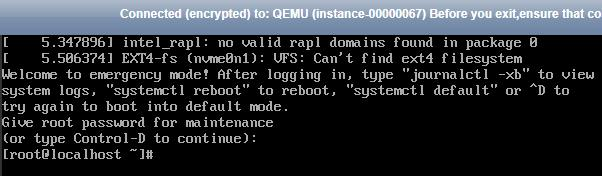
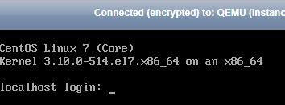

# Linux弹性云服务器挂载NVMe SSD盘异常，如何修复？

## 问题描述

挂载有NVMe SSD盘的Linux弹性云服务器（如P1型云服务器）发生故障时，需联系管理员通过异地重建的方式进行恢复，新建故障弹性云服务器。

如果故障弹性云服务器在/etc/fstab中设置了NVMe SSD盘的开机自动挂载功能，对于新建弹性云服务器，系统盘恢复，但挂载的NVMe SSD盘无文件系统，无法实现开机自动挂载，导致云服务器启动时进入紧急模式，如[图1](#fig13243412145029)所示。

**图 1**  紧急模式  

为保证新建弹性云服务器的正常使用，需要您手动删除/etc/fstab中的挂载信息，具体操作请参见本节内容。

> **说明：**   
>NVMe SSD盘发生故障后，数据会丢失。本指导仅用于恢复弹性云服务器自动挂载NVMe SSD盘的操作，不能恢复盘上的数据。  

## 处理方法

1.  登录弹性云服务器。
2.  输入root用户的密码，进入弹性云服务器。

    **图 2**  登录云服务器  
    

3.  执行以下命令，编辑/etc/fstab文件。

    **vi /etc/fstab**

4.  删除NVMe SSD盘的挂载信息并保存，如[图3](#fig6022199715759)所示。

    **图 3**  删除自动挂载信息  
    

5.  执行以下命令，重启弹性云服务器。

    **reboot**

6.  重启后，弹性云服务器恢复正常，可以正常登录， 如[图4](#fig42664483151146)所示。

    **图 4**  登录弹性云服务器  
    

