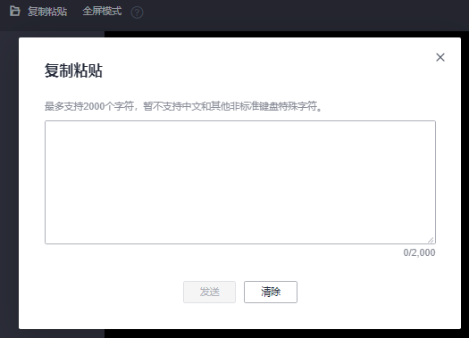

# Linux弹性云服务器远程登录（VNC方式）

## 操作场景

本节为您介绍如何通过控制台提供的远程登录功能（即VNC方式）登录到弹性云服务器上。

登录成功后，如需使用VNC界面提供的复制、粘贴功能，请参见[后续处理](#section13971028132616)。

> **说明：**   
>对于“密钥对”方式创建的Linux弹性云服务器，如需使用控制台提供的“远程登录”功能（VNC方式），需先使用“[SSH密钥方式](SSH密钥方式登录.md)”登录，并设置密码，然后才能使用VNC方式登录。  

## 前提条件

-   对于“密钥对”鉴权方式的弹性云服务器，已使用SSH密钥方式登录Linux弹性云服务器，并设置密码。
-   已绑定弹性公网IP。

## 登录Linux弹性云服务器（非FPGA加速型）

如果您登录的弹性云服务器不是FPGA加速型，登录方法如下：

1.  登录管理控制台。
2.  单击管理控制台左上角的，选择区域和项目。
3.  选择“计算 \> 弹性云服务器”。
4.  在弹性云服务器列表中的右上角，输入弹性云服务器名、IP地址或ID，并进行搜索。

    **图 1**  搜索弹性云服务器  
    

5.  单击“操作”列下的“远程登录”。
6.  （可选）如果界面提示“Press CTRL+ALT+DELETE to log on”，请单击远程登录操作面板上方的“Ctrl+Alt+Del”按钮进行登录。

    > **说明：**   
    >请勿使用物理键盘按“CTRL+ALT+DELETE”，该操作不生效。  

7.  （可选）登录G1型弹性云服务器时，远程登录界面上无法显示鼠标。此时，需单击远程登录操作面板上方的“Local Crusor”按钮，鼠标就可以正常显示了。

    **图 2**  Local Crusor  
    

8.  根据界面提示，输入弹性云服务器密码。

    **图 3**  输入用户名和密码（假设用户名为root）  
    

## 登录Linux弹性云服务器（FPGA加速型）

使用VNC方式登录弹性云服务器时，系统不支持复制粘贴操作，这将降低您使用云服务器的效率。如无特殊要求，建议使用SSH方式登录FPGA加速型云服务器，具体操作请参见[SSH密钥方式登录](SSH密钥方式登录.md)和[SSH密码方式登录](SSH密码方式登录.md)。

FPGA加速型云服务器的镜像使用CentOS 7.3 64bit图形化界面，如果您登录的是FPGA加速型云服务器，且该云服务器除了root帐号以外，没有其他帐号，系统会提示您新建一个用户。登录方法如下：

1.  登录管理控制台。
2.  单击管理控制台左上角的，选择区域和项目。
3.  选择“计算 \> 弹性云服务器”。
4.  在弹性云服务器列表中的右上角，输入弹性云服务器名、IP地址或ID，并进行搜索。

    **图 4**  搜索弹性云服务器  
    

5.  单击“操作”列下的“远程登录”。
6.  根据界面提示，选择系统语言（以选择“English”为例），并单击“Next”。

    **图 5**  选择语言  
    

7.  选择您使用的物理键盘的类型，并单击“Next”。

    **图 6**  选择键盘类型  
    

8.  根据需要设置隐私项，并单击“Next”。
9.  设置弹性云服务器的时区，并单击“Next”。
10. （可选）根据需要联动其他帐号，也可以直接单击“Skip”。

    **图 7**  绑定其他帐号  
    

11. 设置新创建用户的“Full Name”和“Username”，其中
    -   Full Name：全名，类似用户的昵称。
    -   Username：用户名，用于创建您的主目录，且无法更改。

12. 设置密码。
13. 单击“Start using CentOS Linux”，进入弹性云服务器。

## 后续处理

系统支持从本地拷贝命令行到弹性云服务器，实现本地数据与弹性云服务器之间的单向复制、粘贴功能，方法如下：

1.  使用VNC方式成功登录弹性云服务器。
2.  单击页面右上角的“Input Commands”。

    **图 8**  复制粘贴  
    

3.  使用快捷键Ctrl+C，复制本地计算机的数据。
4.  使用快捷键Ctrl+V，将本地数据粘贴至“Copy Commands”窗口。
5.  单击“Send”。

    将复制的数据发送至命令行窗口。

> **说明：**   
>对于使用图形化界面的Linux弹性云服务器，在使用VNC窗口提供的“Input Commands”功能时，会小概率出现数据丢失的情况。这是由于弹性云服务器CPU核数过低，图形化界面占用较多CPU资源导致。此时，建议您每次发送的字符数不超过5个，或者从图形化界面切换至命令行界面（也称“文本界面”），然后再使用“Input Commands”功能。  

## 相关链接

-   [云服务器登录前的准备工作有哪些？](https://support.huaweicloud.com/ecs_faq/zh-cn_topic_0163540201.html)
-   [无法登录到Linux云服务器怎么办？](https://support.huaweicloud.com/ecs_faq/zh-cn_topic_0105127983.html)

