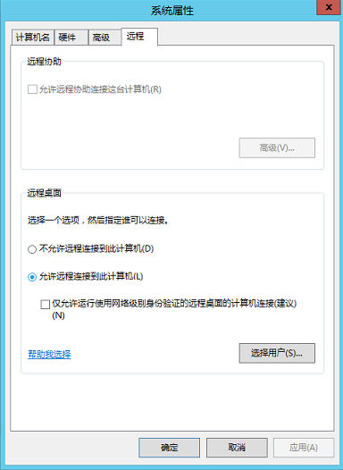

# MSTSC密码方式登录

本节为您介绍如何在本机使用远程登录工具mstsc登录Windows弹性云服务器。

## 前提条件

-   如果弹性云服务器采用密钥方式鉴权，已获取Windows弹性云服务器的密码，获取方式请参见[获取Windows弹性云服务器的密码](获取Windows弹性云服务器的密码.md)。
-   弹性云服务器已经绑定弹性公网IP，绑定方式请参见[查看详细信息](查看详细信息.md)。

-   已配置安全组入方向的访问规则，配置方式请参见[配置安全组规则](配置安全组规则.md)。
-   使用的登录工具与待登录的弹性云服务器之间网络连通。例如，默认的3389端口没有被防火墙屏蔽。

## 操作步骤

Windows弹性云服务器默认关闭远程桌面协议RDP（Remote Desktop Protocol），首次登录弹性云服务器时，请先使用VNC方式登录弹性云服务器，打开RDP，然后再使用mstsc方式连接。

1.  检查Windows弹性云服务器的RDP是否开启。
    1.  VNC方式登录弹性云服务器。

        登录方法请参见[Windows云服务器远程登录（VNC方式）](Windows云服务器远程登录（VNC方式）.md)。

    2.  单击“开始”菜单，选择“控制面板 \> 系统和安全 \> 系统 \> 远程设置”。

        系统进入“系统属性”页面。

        **图 1**  系统属性  
        

    3.  选择“远程”页签，在“远程桌面”栏，选择“允许远程连接到此计算机”。
    4.  单击“确定”。

2.  在用户本地计算机（即客户机），使用远程登录工具mstsc登录Windows弹性云服务器。
    1.  单击“开始”菜单。
    2.  在“搜索程序和文件”中，输入“mstsc”。
    3.  根据提示登录弹性云服务器。

        为安全起见，首次登录弹性云服务器，需更改密码。

3.  （可选）通过远程桌面连接（Remote Desktop Protocol, RDP）方式登录弹性云服务器后，如果需要使用RDP提供的“剪切板”功能，将本地的大文件（文件大小超过2GB）复制粘贴至远端的Windows弹性云服务器中，由于Windows系统的限制，会导致操作失败。

    具体的解决方法，请参见[https://support.microsoft.com/en-us/help/2258090/copying-files-larger-than-2-gb-over-a-remote-desktop-services-or-terminal-services-session-by-using-clipboard-redirection-copy-and-paste-fails-silently](https://support.microsoft.com/en-us/help/2258090/copying-files-larger-than-2-gb-over-a-remote-desktop-services-or-terminal-services-session-by-using-clipboard-redirection-copy-and-paste-fails-silently)。

## 相关链接

[MSTSC方式登录Windows 2012的弹性云服务器，登录失败怎么办？](MSTSC方式登录Windows-2012的弹性云服务器-登录失败怎么办.md)

