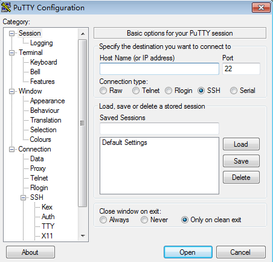

# SSH密码方式登录

## 操作场景

本节操作介绍在Windows和Linux环境中使用SSH密码方式远程登录Linux云服务器的操作步骤。

## 前提条件

-   弹性云服务器状态为“运行中”。
-   弹性云服务器已经绑定弹性公网IP，绑定方式请参见[绑定弹性公网IP](绑定弹性公网IP.md)。

-   所在安全组入方向已开放22端口，配置方式请参见[配置安全组规则](配置安全组规则.md)。
-   使用的登录工具（如PuTTY）与待登录的弹性云服务器之间网络连通。例如，默认的22端口没有被防火墙屏蔽。

## 本地使用Windows操作系统

如果本地主机为Windows操作系统，可以按照下面方式登录云服务器。

下面步骤以PuTTY为例。

1.  在以下路径中下载PuTTY和PuTTYgen。

    [https://www.chiark.greenend.org.uk/\~sgtatham/putty/latest.html](https://www.chiark.greenend.org.uk/~sgtatham/putty/latest.html)

2.  运行PuTTY。
3.  单击“Session”。
    1.  Host Name \(or IP address\)：输入云服务器的弹性公网IP。
    2.  Port：输入 22。
    3.  Connection Type：选择 SSH。
    4.  Saved Sessions：任务名称，在下一次使用putty时就可以单击保存的任务名称，即可打开远程连接。

        **图 1**  单击“Session”  
        

4.  单击“Window”，在“Translation”下的“Received data assumed to be in which character set:”选择“UTF-8”。
5.  单击“Open”。

    如果首次登录服务器，PuTTY会显示安全警告对话框，询问是否接受服务器的安全证书。单击“是”将证书保存到本地注册表中。

6.  建立到云服务器的SSH连接后，根据提示输入用户名和密码登录云服务器。

    > **说明：** 
    >如果是公共镜像（包括CoreOS），首次登录时，登录用户名、密码如下：
    >-   用户名：root
    >-   密码：购买云服务器时，您设置的密码

## 本地使用Linux操作系统

如果本地主机为Linux操作系统，您可以在计算机的命令行中运行如下命令登录弹性云服务器器。**ssh** **_弹性云服务器__绑定的_**_**弹性公网IP**_

## 相关链接

-   [云服务器登录前的准备工作有哪些？](https://support.huaweicloud.com/ecs_faq/zh-cn_topic_0163540201.html)
-   [无法登录到Linux云服务器怎么办？](https://support.huaweicloud.com/ecs_faq/zh-cn_topic_0105127983.html)

