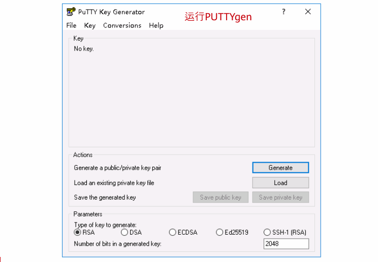
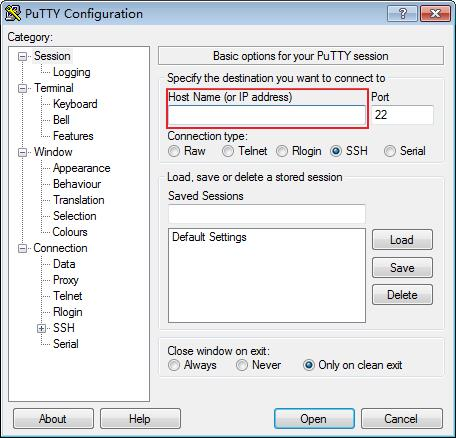
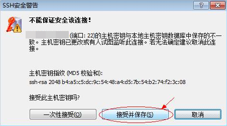

# SSH密钥方式登录

## 操作场景

本节操作介绍在Windows和Linux环境中使用SSH密钥对方式远程登录Linux云服务器的操作步骤。

## 前提条件

-   已获取创建该弹性云服务器时使用的密钥对私钥文件。
-   弹性云服务器已经绑定弹性公网IP，绑定方式请参见[查看弹性云服务器详细信息（列表视图）](查看弹性云服务器详细信息（列表视图）.md)。

-   已配置安全组入方向的访问规则，配置方式请参见[配置安全组规则](配置安全组规则.md)。
-   使用的登录工具（如PuTTY）与待登录的弹性云服务器之间网络连通。例如，默认的22端口没有被防火墙屏蔽。

## 本地使用Windows操作系统

如果您本地使用Windows操作系统登录Linux弹性云服务器，可以按照下面方式登录弹性云服务器。

**方式一：使用PuTTY登录**

以下示例演示了将私钥文件转化格式，并使用SSH密钥连接Linux实例的操作步骤。

**图 1**  SSH密钥连接Linux实例  

我们以PuTTY为例介绍如何登录弹性云服务器。使用PuTTY登录弹性云服务器前，需要先将私钥文件转化为.ppk格式。

1.  判断私钥文件是否为.ppk格式。
    -   是，执行[7](#li40879966111724)。
    -   否，执行[2](#li8851985111724)。

2.  在以下路径中下载PuTTY和PuTTYgen。

    [https://www.chiark.greenend.org.uk/\~sgtatham/putty/latest.html](https://www.chiark.greenend.org.uk/~sgtatham/putty/latest.html)

    > **说明：** 
    >PuTTYgen是密钥生成器，用于创建密钥对，生成一对公钥和私钥供PuTTY使用。

3.  运行PuTTYgen。
4.  在“Actions“区域，单击“Load“，并导入创建弹性云服务器时保存的私钥文件。

    导入时注意确保导入的格式要求为“All files \(\*.\*\)“。

5.  单击“Save private key”。
6.  保存转化后的私钥到本地。例如：kp-123.ppk
7.  双击“PUTTY.EXE”，打开“PuTTY Configuration”。
8.  单击“Session”，在“Host Name \(or IP address\)”下的输入框中输入弹性云服务器的弹性公网IP。

    **图 2**  配置弹性公网IP  
    

9.  选择“Connection \> data”，在Auto-login username处输入镜像的用户名。

    > **说明：** 
    >使用“SSH密钥方式”登录弹性云服务器时：
    >-   如果是“CoreOS”的公共镜像，镜像的用户名为“core”。
    >-   如果是“非CoreOS”的公共镜像，镜像的用户名为“root”。

10. 选择“Connection \> SSH \> Auth”，在最下面一个配置项“Private key file for authentication”中，单击“Browse”，选择[6](#li56738001111724)转化的密钥。
11. 单击“Open”。

    登录弹性云服务器。

**方式二：使用Xshell登录**

1.  打开Xshell工具。
2.  通过弹性公网IP，执行以下命令，SSH远程连接弹性云服务器。

    **ssh** _**用户名**_**@_弹性公网IP_**

    > **说明：** 
    >使用“SSH密钥方式”登录弹性云服务器时：
    >-   如果是“CoreOS”的公共镜像，镜像的用户名为“core”。
    >-   如果是“非CoreOS”的公共镜像，镜像的用户名为“root”。

3.  （可选）如果系统弹窗提示“SSH安全警告”，此时需单击“接受并保存”。

    **图 3**  SSH安全警告  
    

4.  选择“Public Key”，并单击“用户密钥\(K\)”栏的“浏览”。
5.  在“用户密钥”窗口中，单击“导入”。
6.  选择本地保存的密钥文件，并打击“打开”。
7.  单击“确定”，登录弹性云服务器。

## 本地使用Linux操作系统

如果您本地使用Linux操作系统登录Linux弹性云服务器，可以按照下面方式登录。下面步骤以私钥文件是kp-123.pem为例进行介绍。

1.  在您的linux计算机的命令行中执行如下命令，变更权限。

    **chmod 400 /_path_/kp-123.pem**

    > **说明：** 
    >上述命令的path为密钥文件的存放路径。

2.  执行如下命令，登录弹性云服务器。

    **ssh -i /_path_/kp-123.pem** _**默认用户名**_**@**_****_**_弹性公网IP_**

    假设Linux弹性云服务器的默认用户名是linux，弹性公网IP为123.123.123.123，则命令如下：

    **ssh -i /_path_/kp-123.pem linux@123.123.123.123**

    > **说明：** 
    >-   path为密钥文件的存放路径。
    >-   弹性公网IP地址为弹性云服务器绑定的弹性公网IP地址。

## 后续处理

-   以SSH密钥方式登录弹性云服务器后，可以通过设置密码，后续使用VNC方式登录Linux弹性云服务器。

## 相关链接

-   [忘记密码怎么办？](重置密码使用场景介绍.md)
-   [无法登录到Linux云服务器怎么办？](https://support.huaweicloud.com/ecs_faq/zh-cn_topic_0105127983.html)

