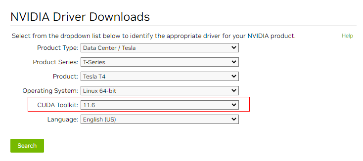
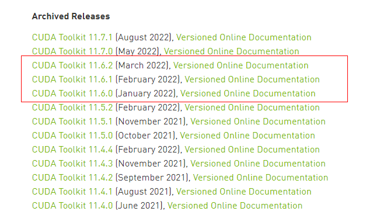

# Tesla驱动及CUDA工具包获取方式

## 操作场景

使用GPU加速型云服务器时，需确保已安装Tesla驱动和CUDA工具包，否则无法实现计算加速功能。本节内容提供Tesla驱动及CUDA工具包下载地址，请根据实例的类型，选择具体的驱动版本。

Tesla驱动及CUDA工具包安装操作指导请参考[GPU加速型实例安装Tesla驱动及CUDA工具包](GPU加速型实例安装Tesla驱动及CUDA工具包.md)。

> **说明：** 
>当前已支持使用自动化脚本安装GPU驱动，建议优先使用自动安装方式，脚本获取以及安装指导请参考[（推荐）GPU加速型实例自动安装GPU驱动（Linux）](（推荐）GPU加速型实例自动安装GPU驱动（Linux）.md)和[（推荐）GPU加速型实例自动安装GPU驱动（Windows）](（推荐）GPU加速型实例自动安装GPU驱动（Windows）.md)。
>GPU虚拟化型实例，需要严格按照[表1](GPU加速型实例安装GRID驱动.md#table188851534175019)选择合适的驱动版本下载使用。

## Tesla驱动下载地址

请单击[NVIDIA驱动下载](https://www.nvidia.com/Download/index.aspx?lang=en-us)，根据实例的类型，选择NVIDIA产品类型、产品系列和产品。

**表 1**  Tesla驱动产品类型对应关系

<table><thead align="left"><tr id="row1694195316175"><th class="cellrowborder" valign="top" width="25%" id="mcps1.2.5.1.1">
<strong id="b10871316141911">实例类型</strong>

</th>
<th class="cellrowborder" valign="top" width="24.97%" id="mcps1.2.5.1.2">
<strong id="b1687511163194">产品类型（Product Type）</strong>

</th>
<th class="cellrowborder" valign="top" width="25.03%" id="mcps1.2.5.1.3">
<strong id="b18881161621920">产品系列（Product Series）</strong>

</th>
<th class="cellrowborder" valign="top" width="25%" id="mcps1.2.5.1.4">
<strong id="b488111617195">产品（Product）</strong>

</th>
</tr>
</thead>
<tbody><tr id="row1922222222612"><td class="cellrowborder" valign="top" width="25%" headers="mcps1.2.5.1.1 ">
P2vs

</td>
<td class="cellrowborder" valign="top" width="24.97%" headers="mcps1.2.5.1.2 ">
Tesla

</td>
<td class="cellrowborder" valign="top" width="25.03%" headers="mcps1.2.5.1.3 ">
V-Series

</td>
<td class="cellrowborder" valign="top" width="25%" headers="mcps1.2.5.1.4 ">
V100

</td>
</tr>
<tr id="row921718111588"><td class="cellrowborder" valign="top" width="25%" headers="mcps1.2.5.1.1 ">
P2s

</td>
<td class="cellrowborder" valign="top" width="24.97%" headers="mcps1.2.5.1.2 ">
Tesla

</td>
<td class="cellrowborder" valign="top" width="25.03%" headers="mcps1.2.5.1.3 ">
V-Series

</td>
<td class="cellrowborder" valign="top" width="25%" headers="mcps1.2.5.1.4 ">
V100

</td>
</tr>
<tr id="row3941145391714"><td class="cellrowborder" valign="top" width="25%" headers="mcps1.2.5.1.1 ">
P2v

</td>
<td class="cellrowborder" valign="top" width="24.97%" headers="mcps1.2.5.1.2 ">
Tesla

</td>
<td class="cellrowborder" valign="top" width="25.03%" headers="mcps1.2.5.1.3 ">
V-Series

</td>
<td class="cellrowborder" valign="top" width="25%" headers="mcps1.2.5.1.4 ">
V100

</td>
</tr>
<tr id="row189411753181715"><td class="cellrowborder" valign="top" width="25%" headers="mcps1.2.5.1.1 ">
P1

</td>
<td class="cellrowborder" valign="top" width="24.97%" headers="mcps1.2.5.1.2 ">
Tesla

</td>
<td class="cellrowborder" valign="top" width="25.03%" headers="mcps1.2.5.1.3 ">
P-Series

</td>
<td class="cellrowborder" valign="top" width="25%" headers="mcps1.2.5.1.4 ">
P100

</td>
</tr>
<tr id="row9941185313172"><td class="cellrowborder" valign="top" width="25%" headers="mcps1.2.5.1.1 ">
Pi2

</td>
<td class="cellrowborder" valign="top" width="24.97%" headers="mcps1.2.5.1.2 ">
Tesla

</td>
<td class="cellrowborder" valign="top" width="25.03%" headers="mcps1.2.5.1.3 ">
T- Series

</td>
<td class="cellrowborder" valign="top" width="25%" headers="mcps1.2.5.1.4 ">
T4

</td>
</tr>
<tr id="row14941653101720"><td class="cellrowborder" valign="top" width="25%" headers="mcps1.2.5.1.1 ">
Pi1

</td>
<td class="cellrowborder" valign="top" width="24.97%" headers="mcps1.2.5.1.2 ">
Tesla

</td>
<td class="cellrowborder" valign="top" width="25.03%" headers="mcps1.2.5.1.3 ">
P-Series

</td>
<td class="cellrowborder" valign="top" width="25%" headers="mcps1.2.5.1.4 ">
P4

</td>
</tr>
<tr id="row16833141214111"><td class="cellrowborder" valign="top" width="25%" headers="mcps1.2.5.1.1 ">
G6

</td>
<td class="cellrowborder" valign="top" width="24.97%" headers="mcps1.2.5.1.2 ">
Tesla

</td>
<td class="cellrowborder" valign="top" width="25.03%" headers="mcps1.2.5.1.3 ">
T- Series

</td>
<td class="cellrowborder" valign="top" width="25%" headers="mcps1.2.5.1.4 ">
T4

</td>
</tr>
<tr id="row13941753161715"><td class="cellrowborder" valign="top" width="25%" headers="mcps1.2.5.1.1 ">
G5

</td>
<td class="cellrowborder" valign="top" width="24.97%" headers="mcps1.2.5.1.2 ">
Tesla

</td>
<td class="cellrowborder" valign="top" width="25.03%" headers="mcps1.2.5.1.3 ">
V-Series

</td>
<td class="cellrowborder" valign="top" width="25%" headers="mcps1.2.5.1.4 ">
V100

</td>
</tr>
</tbody>
</table>

## CUDA工具包下载地址

请从[CUDA软件包下载](https://developer.nvidia.com/cuda-toolkit-archive)获取CUDA软件包，您需要根据实例类型和驱动版本，选择对应的CUDA Toolkit软件包产品。

> **说明：** 
>驱动版本与CUDA Toolkit版本存在对应关系，如二者版本不匹配，可能导致驱动无法使用。
>版本对应关系，请参见[NVIDIA驱动下载](https://www.nvidia.com/Download/index.aspx?lang=en-us)。

下面以Tesla T4下载驱动软件包及CUDA Toolkit为例进行介绍。

1.  Tesla T4安装驱动软件包时，选择Linux操作系统，并指定CUDA Toolkit软件版本为11.6。

    **图 1**  指定CUDA Toolkit软件版本  
    

2.  下载CUDA软件包，需要选择CUDA Toolkit 11.6对应小版本。

    **图 2**  选择CUDA Toolkit对应版本  
    

