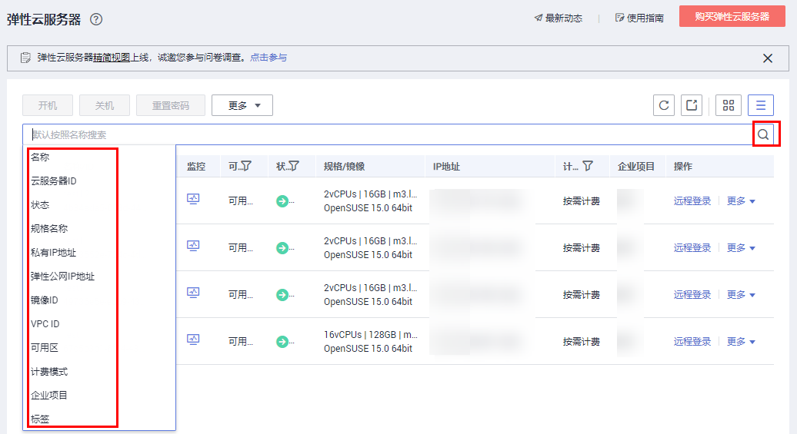
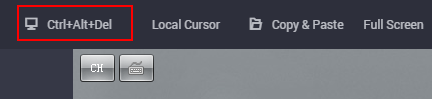

# Windows云服务器远程登录（VNC方式）

本节为您介绍如何通过控制台提供的远程登录功能（即VNC方式）登录到弹性云服务器上。

## 约束与限制

-   当前提供的远程登录功能是通过系统配置的自定义端口进行访问的，所以在使用远程登录功能时，请确保需要使用的端口未被防火墙屏蔽。例如：远程登录的链接为“xxx:8002”，则需要确保端口8002没有被防火墙屏蔽。
-   如果客户端操作系统使用了本地代理，且用户无法配置该本地代理的防火墙端口，请关闭代理模式后再使用远程登录功能。

## 登录Windows弹性云服务器

1.  登录管理控制台。
2.  选择“计算 \> 弹性云服务器”。
3.  获取弹性云服务器密码。

    VNC方式登录弹性云服务器时，需已知其密码，然后再采用VNC方式登录。

    -   当您的弹性云服务器是采用密码方式鉴权时，请直接使用创建云服务器时设置的密码进行登录。
    -   当您的弹性云服务器是采用密钥方式鉴权时，密码获取方式请参见[获取Windows弹性云服务器的密码](获取Windows弹性云服务器的密码.md)。

4.  在弹性云服务器列表中的右上角，输入弹性云服务器名、IP地址或ID，并进行搜索。

    **图 1**  搜索弹性云服务器  
    

5.  单击“操作”列下的“远程登录”。
6.  （可选）如果界面提示“Press CTRL+ALT+DELETE to log on”，请单击远程登录操作面板右上方的“Send CtrlAltDel”按钮进行登录。

    **图 2**  单击“Send CtrlAltDelete”  
    

7.  （可选）登录G1型弹性云服务器时，远程登录界面上无法显示鼠标。此时，需单击远程登录操作面板右上方的“Local Crusor”按钮，如[图3](#zh-cn_topic_0027268511_fig3022163194924)所示，鼠标就可以正常显示了。

    **图 3**  Local Crusor  
    

8.  根据界面提示，输入弹性云服务器密码。

