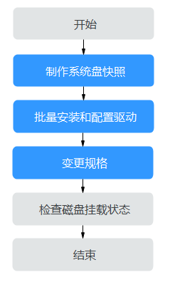
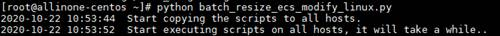

# XEN实例变更为KVM实例（Linux-批量自动配置）<a name="ZH-CN_TOPIC_0288245007"></a>

## 操作场景<a name="section18362920155819"></a>

Linux操作系统XEN实例变更为KVM实例前，必须已完成必要的驱动安装和配置。

当您需要变更的Linux操作系统的XEN实例比较多时候，推荐您使用本节的批量自动配置的方法安装驱动，通过自动化脚本的方式批量为Linux云服务器安装驱动、配置磁盘自动挂载。在驱动安装完成后使用控制台提供的“变更规格”功能将XEN实例变更为KVM实例。

> **说明：** 
>-   XEN实例：S1、C1、C2、M1型弹性云服务器。
>-   KVM实例：参考[规格清单](https://support.huaweicloud.com/productdesc-ecs/zh-cn_topic_0159822360.html)，查询对应规格的虚拟化类型。
>-   为了同时支持XEN虚拟化和KVM虚拟化，Linux弹性云服务器的正常运行需依赖于xen-pv驱动、virtio驱动等。XEN实例变更为KVM实例前，需要确保Linux弹性云服务器已完成相关配置，包括安装驱动、配置磁盘自动挂载等。

## 约束与限制<a name="section19369162055818"></a>

-   批量安装驱动仅支持Linux操作系统。
-   需要选取一台操作系统为CentOS 7且已绑定弹性公网IP的云服务器作为执行机，且与待批量安装驱动的弹性云服务器之间网络需要互通。

    > **说明：** 
    >若已配置yum内部源，可不需要绑定弹性公网IP。

-   需要提前准备待批量安装驱动的云服务器的IP地址、root用户的密码信息或者私钥文件。
-   仅支持对使用同一密钥对的云服务器执行批量安装驱动和配置的操作。

## 操作流程<a name="section1559115712815"></a>

XEN实例变更为KVM实例的操作流程如[图1](#fig11687951132115)所示。

**图 1**  Linux云服务器变更流程（批量自动配置）<a name="fig11687951132115"></a>  


**表 1**  XEN实例变更为KVM实例（批量自动配置）

<a name="table1286142613223"></a>
<table><thead align="left"><tr id="row38601426132214"><th class="cellrowborder" valign="top" width="35.4%" id="mcps1.2.3.1.1"><p id="p10860142632210"><a name="p10860142632210"></a><a name="p10860142632210"></a>序号</p>
</th>
<th class="cellrowborder" valign="top" width="64.60000000000001%" id="mcps1.2.3.1.2"><p id="p4860226192217"><a name="p4860226192217"></a><a name="p4860226192217"></a>任务</p>
</th>
</tr>
</thead>
<tbody><tr id="row12860162652214"><td class="cellrowborder" valign="top" width="35.4%" headers="mcps1.2.3.1.1 "><p id="p086062642211"><a name="p086062642211"></a><a name="p086062642211"></a>步骤1</p>
</td>
<td class="cellrowborder" valign="top" width="64.60000000000001%" headers="mcps1.2.3.1.2 "><p id="p982255113012"><a name="p982255113012"></a><a name="p982255113012"></a><a href="#section15236154665218">步骤1：制作系统盘快照</a></p>
</td>
</tr>
<tr id="row28601626182218"><td class="cellrowborder" valign="top" width="35.4%" headers="mcps1.2.3.1.1 "><p id="p5860192632218"><a name="p5860192632218"></a><a name="p5860192632218"></a>步骤2</p>
</td>
<td class="cellrowborder" valign="top" width="64.60000000000001%" headers="mcps1.2.3.1.2 "><p id="p78215512305"><a name="p78215512305"></a><a name="p78215512305"></a><a href="#section1837542012588">步骤2：批量安装和配置驱动</a></p>
</td>
</tr>
<tr id="row138618263229"><td class="cellrowborder" valign="top" width="35.4%" headers="mcps1.2.3.1.1 "><p id="p386032662215"><a name="p386032662215"></a><a name="p386032662215"></a>步骤3</p>
</td>
<td class="cellrowborder" valign="top" width="64.60000000000001%" headers="mcps1.2.3.1.2 "><p id="p1082055143014"><a name="p1082055143014"></a><a name="p1082055143014"></a><a href="#section1815152131917">步骤3：变更规格</a></p>
</td>
</tr>
<tr id="row38612269223"><td class="cellrowborder" valign="top" width="35.4%" headers="mcps1.2.3.1.1 "><p id="p1686111268228"><a name="p1686111268228"></a><a name="p1686111268228"></a>步骤4</p>
</td>
<td class="cellrowborder" valign="top" width="64.60000000000001%" headers="mcps1.2.3.1.2 "><p id="p58208513309"><a name="p58208513309"></a><a name="p58208513309"></a><a href="#section2625525131519">（可选）步骤4：检查磁盘挂载状态</a></p>
</td>
</tr>
</tbody>
</table>

## 步骤1：制作系统盘快照<a name="section15236154665218"></a>

如果云服务器未安装驱动就执行了变更规格的操作，云服务器无法正常使用，需要重装操作系统才能恢复，可能造成您的系统盘数据丢失。因此，建议您先制作系统盘快照，防止数据丢失。

1.  制作系统盘快照前请对云服务器完成自检**。**

    对云服务器执行关机、开机操作，确保云服务器重启后业务可以正常运行。再启动制作系统盘快照。

2.  制作系统盘快照的操作，请参见《云硬盘用户指南》的“用户指南 \>  [创建快照](https://support.huaweicloud.com/usermanual-evs/zh-cn_topic_0066615262.html)”章节。

> **说明：** 
>变更规格完成后，如已确认业务恢复正常，请在快照页面手动删除快照。

## 步骤2：批量安装和配置驱动<a name="section1837542012588"></a>

对于支持使用脚本方式批量配置的弹性云服务器，请参见本节操作内容。

不支持使用自动化脚本方式进行配置的云服务器，请直接参见[XEN实例变更为KVM实例（Linux-手动配置）](XEN实例变更为KVM实例（Linux-手动配置）.md)。

1.  登录已准备好的执行机，执行机需满足的条件请参考[约束与限制](#section19369162055818)。
2.  <a name="li1358119202588"></a>执行以下命令，安装批量脚本运行所需要的依赖。

    **yum install ansible -y**

3.  执行以下命令，将驱动安装脚本下载到root目录下。

    **curl  _URL_  \> \~/resize\_ecs\_modify\_linux.sh**

    其中，_URL_为驱动安装脚本的下载地址。

    请根据云服务器所在区域选择脚本的下载地址：

    -   华东-上海二：[https://cn-east-2-server-resize.obs.cn-east-2.myhuaweicloud.com/linux/server\_resize/resize\_ecs\_modify\_linux.sh](https://cn-east-2-server-resize.obs.cn-east-2.myhuaweicloud.com/linux/server_resize/resize_ecs_modify_linux.sh)
    -   华北-北京一：[https://cn-north-1-server-resize.obs.cn-north-1.myhuaweicloud.com/linux/server\_resize/resize\_ecs\_modify\_linux.sh](https://cn-north-1-server-resize.obs.cn-north-1.myhuaweicloud.com/linux/server_resize/resize_ecs_modify_linux.sh)
    -   华南-广州：[https://cn-south-1-server-resize.obs.cn-south-1.myhuaweicloud.com/linux/server\_resize/resize\_ecs\_modify\_linux.sh](https://cn-south-1-server-resize.obs.cn-south-1.myhuaweicloud.com/linux/server_resize/resize_ecs_modify_linux.sh)

4.  执行以下命令，将批量操作脚本下载到root目录下。

    **curl  _URL_  \> \~/batch\_resize\_ecs\_modify\_linux.py**

    其中，_URL_为批量操作的执行脚本。

    请根据云服务器所在区域选择脚本的下载地址：

    -   华东-上海二：[https://cn-east-2-server-resize.obs.cn-east-2.myhuaweicloud.com/linux/server\_resize/batch\_resize\_ecs\_modify\_linux.py](https://cn-east-2-server-resize.obs.cn-east-2.myhuaweicloud.com/linux/server_resize/batch_resize_ecs_modify_linux.py)
    -   华北-北京一：[https://cn-north-1-server-resize.obs.cn-north-1.myhuaweicloud.com/linux/server\_resize/batch\_resize\_ecs\_modify\_linux.py](https://cn-north-1-server-resize.obs.cn-north-1.myhuaweicloud.com/linux/server_resize/batch_resize_ecs_modify_linux.py)
    -   华南-广州：[https://cn-south-1-server-resize.obs.cn-south-1.myhuaweicloud.com/linux/server\_resize/batch\_resize\_ecs\_modify\_linux.py](https://cn-south-1-server-resize.obs.cn-south-1.myhuaweicloud.com/linux/server_resize/batch_resize_ecs_modify_linux.py)

5.  执行以下命令，新建并编辑host\_list.txt，按i进入编辑模式。

    **vi host\_list.txt**

    > **注意：** 
    >请将驱动安装脚本、批量操作执行脚本、host\_list.txt文件放在一个目录下。

6.  <a name="li146613713146"></a>将需要自动安装驱动的云服务器的相关信息填写到host\_list.txt文件中。

    文件填写格式与登录待切换弹性云服务器的方式需要匹配。

    -   使用密钥对方式鉴权的云服务器，填写方式如下：

        > **注意：** 
        >-   使用密钥对方式鉴权的云服务器，请将创建弹性云服务器时保存的私钥文件，上传至与host\_list.txt同一个文件夹下。
        >-   使用密钥对方式鉴权的云服务器，请确保私钥文件的权限为400。
        >    **chmod 400 **_**私钥文件**_

        每行仅需填写云服务器IP地址。

        示例：

        ```
        192.168.1.10
        192.168.1.11
        ```

    -   使用密码方式登录的云服务器，填写方式如下：

        请严格按照每行**ip,root用户密码**，中间以英文逗号隔开的格式填写。

        示例：

        ```
        192.168.1.10,**********
        192.168.1.11,**********
        ```

    确认输入完毕后，按**Esc**退出编辑模式，输入**:wq**保存退出。

7.  运行批量执行操作脚本“batch\_resize\_ecs\_modify\_linux.py”，该脚本会批量对配置好的云服务器进行自动检查并安装原生xen-pv驱动、virtio驱动。
    1.  执行以下命令，对配置好的云服务器安装驱动。
        -   密钥对鉴权方式的服务器

            如果私钥文件与批量操作执行脚本在一个目录下，则直接指定私钥文件名称即可。

            **python batch\_resize\_ecs\_modify\_linux.py  _\{_**_**私钥文件路径/私钥文件名称\}**_

            **图 2**  运行脚本<a name="fig1828395334018"></a>  
            

        -   密码方式鉴权的服务器。

            **python batch\_resize\_ecs\_modify\_linux.py**

            **图 3**  运行脚本<a name="fig2583720175813"></a>  
            


8.  查看运行结果。

    请耐心等待脚本运行结束，脚本在确认驱动安装成功后会自动为云服务器设置标签，标记驱动安装成功，没有设置标签的云服务器无法执行变更规格的操作。

    运行结果如[图4](#fig1134164933916)所示。[表2](#table19156132818409)，列举了常见的运行结果和说明。

    **图 4**  运行成功<a name="fig1134164933916"></a>  
    

    如果安装失败请参考[XEN实例变更为KVM实例（Linux-手动配置）](XEN实例变更为KVM实例（Linux-手动配置）.md)手动配置或者联系客服寻求技术支持。

    **表 2**  运行结果对照表

    <a name="table19156132818409"></a>
    <table><thead align="left"><tr id="row215617289407"><th class="cellrowborder" valign="top" width="50.78%" id="mcps1.2.3.1.1"><p id="p3156628164019"><a name="p3156628164019"></a><a name="p3156628164019"></a>回显信息</p>
    </th>
    <th class="cellrowborder" valign="top" width="49.220000000000006%" id="mcps1.2.3.1.2"><p id="p17156152824010"><a name="p17156152824010"></a><a name="p17156152824010"></a>说明</p>
    </th>
    </tr>
    </thead>
    <tbody><tr id="row1715632884010"><td class="cellrowborder" valign="top" width="50.78%" headers="mcps1.2.3.1.1 "><p id="p915602819406"><a name="p915602819406"></a><a name="p915602819406"></a>Total: {数量} Success: {数量} Failed: 0</p>
    </td>
    <td class="cellrowborder" valign="top" width="49.220000000000006%" headers="mcps1.2.3.1.2 "><p id="p21567281406"><a name="p21567281406"></a><a name="p21567281406"></a>全部弹性云主机完成检查并安装驱动成功。</p>
    </td>
    </tr>
    <tr id="row61561828174017"><td class="cellrowborder" valign="top" width="50.78%" headers="mcps1.2.3.1.1 "><p id="p6156102817403"><a name="p6156102817403"></a><a name="p6156102817403"></a>Total: {数量} Success: {数量} Failed: {数量}</p>
    </td>
    <td class="cellrowborder" valign="top" width="49.220000000000006%" headers="mcps1.2.3.1.2 "><p id="p19156132854014"><a name="p19156132854014"></a><a name="p19156132854014"></a>Failed数量不为零，表示部分弹性云主机检查或者安装驱动失败，可按照提示查看日志(logs/exec_origin.log)对应主机执行失败的原因。</p>
    </td>
    </tr>
    <tr id="row181568283403"><td class="cellrowborder" valign="top" width="50.78%" headers="mcps1.2.3.1.1 "><p id="p2156182810408"><a name="p2156182810408"></a><a name="p2156182810408"></a>Please check the format of host_list.txt</p>
    </td>
    <td class="cellrowborder" valign="top" width="49.220000000000006%" headers="mcps1.2.3.1.2 "><p id="p51564282404"><a name="p51564282404"></a><a name="p51564282404"></a>host_list.txt文件填写不符合要求，需要重新按照步骤<a href="#li146613713146">6</a>要求进行填写。</p>
    </td>
    </tr>
    <tr id="row015642818404"><td class="cellrowborder" valign="top" width="50.78%" headers="mcps1.2.3.1.1 "><p id="p1215632812409"><a name="p1215632812409"></a><a name="p1215632812409"></a>[Error] resize_ecs_modify_linux.sh not found.</p>
    </td>
    <td class="cellrowborder" valign="top" width="49.220000000000006%" headers="mcps1.2.3.1.2 "><p id="p12156142817408"><a name="p12156142817408"></a><a name="p12156142817408"></a>步骤<a href="#li146613713146">6</a>中的驱动安装脚本尚未下载，需要重新操作下载。</p>
    </td>
    </tr>
    <tr id="row71565283400"><td class="cellrowborder" valign="top" width="50.78%" headers="mcps1.2.3.1.1 "><p id="p11563285405"><a name="p11563285405"></a><a name="p11563285405"></a>Host(s) is unreachable, please check the network or password of user root.</p>
    </td>
    <td class="cellrowborder" valign="top" width="49.220000000000006%" headers="mcps1.2.3.1.2 "><p id="p31561428144010"><a name="p31561428144010"></a><a name="p31561428144010"></a>当前云服务器无法访问以上弹性云服务器，需要确认网络是否互通，或者host_list.txt文件中配置的root用户密码是否正确。</p>
    </td>
    </tr>
    <tr id="row6156202818403"><td class="cellrowborder" valign="top" width="50.78%" headers="mcps1.2.3.1.1 "><p id="p14156828114013"><a name="p14156828114013"></a><a name="p14156828114013"></a>[Error] host_list.txt not found.</p>
    </td>
    <td class="cellrowborder" valign="top" width="49.220000000000006%" headers="mcps1.2.3.1.2 "><p id="p8156112820408"><a name="p8156112820408"></a><a name="p8156112820408"></a>host_list.txt文件尚未创建，需要按照步骤<a href="#li146613713146">6</a>进行操作。</p>
    </td>
    </tr>
    <tr id="row6156102804019"><td class="cellrowborder" valign="top" width="50.78%" headers="mcps1.2.3.1.1 "><p id="p10156142854018"><a name="p10156142854018"></a><a name="p10156142854018"></a>[Error] key-file {私钥文件} not found.</p>
    </td>
    <td class="cellrowborder" valign="top" width="49.220000000000006%" headers="mcps1.2.3.1.2 "><p id="p4971551155511"><a name="p4971551155511"></a><a name="p4971551155511"></a>指定的私钥文件不存在，请确定私钥文件存在后，重新按照步骤<a href="#li146613713146">6</a>操作。</p>
    <p id="p1815618285405"><a name="p1815618285405"></a><a name="p1815618285405"></a>或者使用密码方式登录，重新按照操作流程步骤<a href="#li146613713146">6</a>进行操作。</p>
    </td>
    </tr>
    <tr id="row115614281409"><td class="cellrowborder" valign="top" width="50.78%" headers="mcps1.2.3.1.1 "><p id="p1515652844020"><a name="p1515652844020"></a><a name="p1515652844020"></a>Please confirm that the ansible has been installed.</p>
    </td>
    <td class="cellrowborder" valign="top" width="49.220000000000006%" headers="mcps1.2.3.1.2 "><p id="p1215619284404"><a name="p1215619284404"></a><a name="p1215619284404"></a>步骤<a href="#li1358119202588">2</a>中的运行所需依赖尚未安装，需要执行命令进行安装。</p>
    </td>
    </tr>
    </tbody>
    </table>


> **说明：** 
>-   驱动安装成功后，请妥善处理host\_list.txt中的弹性虚拟机密码以及私钥文件，防止出现环境密码、私钥文件泄露。
>-   请务必确保云服务器配置成功，否则，可能会导致变更规格后的弹性云服务器不可用。如果运行失败或者 ，请参考[XEN实例变更为KVM实例（Linux-手动配置）](XEN实例变更为KVM实例（Linux-手动配置）.md)。
>-   脚本安装失败常见问题请参考：
>    -   [CentOS5操作系统云服务器执行驱动安装脚本失败怎么办？](https://support.huaweicloud.com/ecs_faq/ecs_faq_0616.html)
>    -   [Linux云服务器变更规格时执行驱动安装脚本失败怎么办？](https://support.huaweicloud.com/ecs_faq/ecs_faq_0617.html)

## 步骤3：变更规格<a name="section1815152131917"></a>

-   **在管理控制台变更规格**
    1.  登录控制台。
    2.  单击控制台左上角的，选择区域和项目。
    3.  选择“计算 \> 弹性云服务器”。
    4.  在弹性云服务器列表，查询待变更弹性云服务器状态。

        如果不是关机状态，单击“操作”列下的“更多 \> 关机”。

    5.  单击“操作”列下的“更多 \> 变更规格”。

        系统进入“云服务器变更规格”页面。

    6.  根据界面提示，选择变更后的云服务器类型、vCPU和内存。
    7.  （可选）选择“专属主机”。

        对于在专属主机上创建的弹性云服务器，系统支持更换云服务器所在的专属主机。

        此时，您可以单击下拉列表，选择更换专属主机。如果下拉列表中无可用的专属主机，说明专属主机所剩资源不足，不能用于创建变更规格后的弹性云服务器。

    8.  勾选复选框“我确认已完成对弹性云服务器的配置”，确认已完成[步骤2：批量安装和配置驱动](#section1837542012588)。
    9.  单击“确定”。

        > **说明：** 
        >-   单击“确定”后云平台自动为您制作系统盘快照。变更规格完成后，如已确认业务恢复正常，请在快照页面手动删除快照。
        >-   如果变更规格失败后，弹性云服务器无法使用，可能会需要重装操作系统来恢复云服务器，请注意重装操作系统会清除系统盘数据，但不影响数据盘的数据。


-   使用API变更规格
    -   [变更云服务器规格](https://support.huaweicloud.com/api-ecs/ecs_02_0209.html)
    -   [变更云服务器规格（按需）](https://support.huaweicloud.com/api-ecs/ecs_02_0210.html)


## （可选）步骤4：检查磁盘挂载状态<a name="section2625525131519"></a>

XEN实例变更为KVM实例时，可能会发生磁盘脱机，因此，变更规格后，需检查磁盘挂载状态是否正常。如果正常，则变更成功。

-   Linux弹性云服务器

    详细操作请参考[Linux云服务器变更规格后数据盘脱机怎么办？](https://support.huaweicloud.com/ecs_faq/ecs_faq_0619.html)


## 后续处理<a name="section76661826131619"></a>

如果控制台上云服务器列表页，显示弹性云服务器已变更规格成功，但是远程登录云服务器后，操作系统无法启动，此时，请联系客服进行恢复，或重装操作系统进行恢复。重装系统的操作指导，请参见[重装操作系统](重装操作系统.md)。

> **说明：** 
>重装操作系统会清除系统盘数据，但不影响数据盘的数据。

变更规格完成后，如已确认业务恢复正常，请在快照页面手动删除快照。

