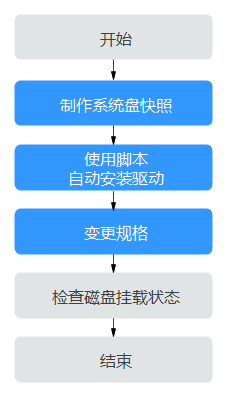
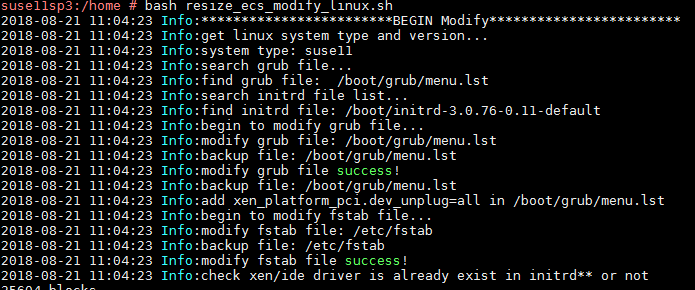
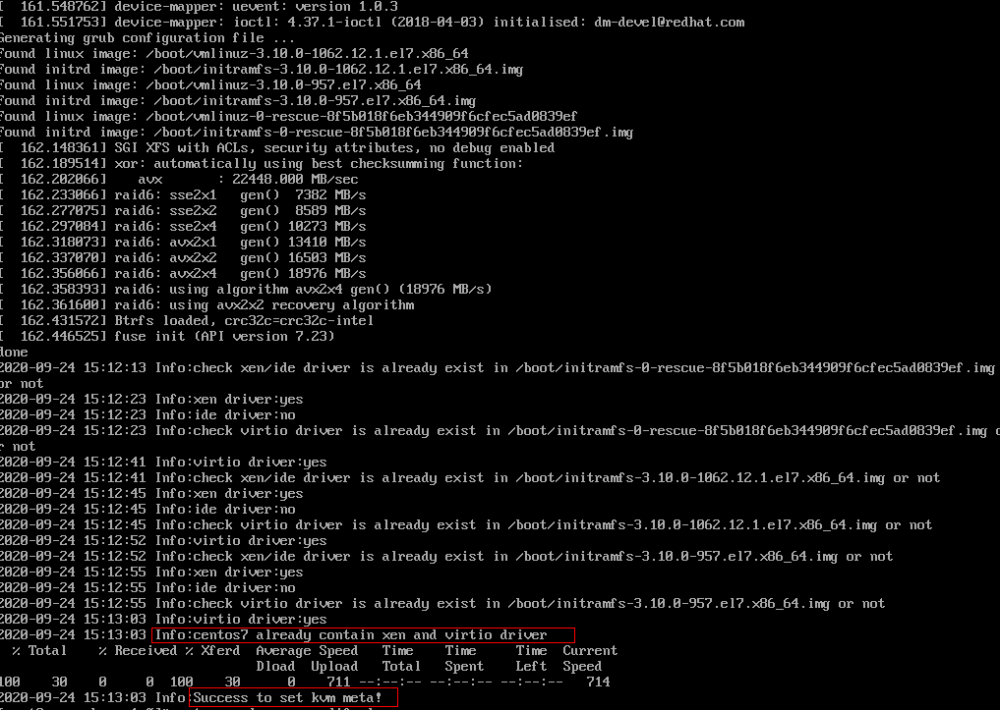

# XEN实例变更为KVM实例（Linux-自动配置）

## 操作场景

Linux操作系统XEN实例变更为KVM实例前，必须已完成必要的驱动安装和配置。

本节操作指导您使用自动化脚本的方式为Linux云服务器安装驱动、配置磁盘自动挂载等，并将XEN实例变更为KVM实例。

> **须知：**   
>-   XEN实例：S1、C1、C2、M1型弹性云服务器。  
>-   KVM实例：参考[规格清单](https://support.huaweicloud.com/productdesc-ecs/zh-cn_topic_0159822360.html)，查询对应规格的虚拟化类型。  
>-   为了同时支持XEN虚拟化和KVM虚拟化，Linux弹性云服务器的正常运行需依赖于xen-pv驱动、virtio驱动等。XEN实例变更为KVM实例前，需要确保Linux弹性云服务器已完成相关配置，包括安装驱动、配置磁盘自动挂载等。  

## 约束与限制

-   Linux操作系统云服务器如果存在由多个物理卷组成的LVM逻辑卷或组建了RAID磁盘阵列，均不支持变更规格，否则可能会导致数据丢失。
-   对于XEN实例，当挂载的VBD磁盘超过24块时，不支持将规格变更为KVM实例。
-   系统支持将“XEN实例”变更为“KVM实例”，不支持将“KVM实例”变更为“XEN实例”。

## 操作流程

XEN实例变更为KVM实例的操作流程如[图1](#fig11687951132115)所示。

**图 1**  Linux云服务器变更流程（自动配置）  

具体的变更操作如[表1](#table128603262223)所示。

**表 1**  XEN实例变更为KVM实例（自动配置）

<table><thead align="left"><tr id="row198591826152211"><th class="cellrowborder" valign="top" width="35.4%" id="mcps1.2.3.1.1">
序号

</th>
<th class="cellrowborder" valign="top" width="64.60000000000001%" id="mcps1.2.3.1.2">
任务

</th>
</tr>
</thead>
<tbody><tr id="row108591226182214"><td class="cellrowborder" valign="top" width="35.4%" headers="mcps1.2.3.1.1 ">
步骤1

</td>
<td class="cellrowborder" valign="top" width="64.60000000000001%" headers="mcps1.2.3.1.2 ">
<a href="#section15236154665218">步骤1：制作系统盘快照</a>

</td>
</tr>
<tr id="row18859122662211"><td class="cellrowborder" valign="top" width="35.4%" headers="mcps1.2.3.1.1 ">
步骤2

</td>
<td class="cellrowborder" valign="top" width="64.60000000000001%" headers="mcps1.2.3.1.2 ">
<a href="#section2599649145513">步骤2：使用脚本自动安装驱动</a>

</td>
</tr>
<tr id="row19859122619222"><td class="cellrowborder" valign="top" width="35.4%" headers="mcps1.2.3.1.1 ">
步骤3

</td>
<td class="cellrowborder" valign="top" width="64.60000000000001%" headers="mcps1.2.3.1.2 ">
<a href="#section1815152131917">步骤3：变更规格</a>

</td>
</tr>
<tr id="row1186042632210"><td class="cellrowborder" valign="top" width="35.4%" headers="mcps1.2.3.1.1 ">
步骤4

</td>
<td class="cellrowborder" valign="top" width="64.60000000000001%" headers="mcps1.2.3.1.2 ">
<a href="#section2625525131519">（可选）步骤4：检查磁盘挂载状态</a>

</td>
</tr>
</tbody>
</table>

## 步骤1：制作系统盘快照

变更规格前必须先配置弹性云服务器，安装相应驱动，否则规格变更后，弹性云服务器无法使用，可能会造成系统盘数据丢失。因此，建议您先制作系统盘快照，然后再配置弹性云服务器。

制作系统盘快照的操作，请参见《云硬盘用户指南》的“用户指南 \>  [创建快照](https://support.huaweicloud.com/usermanual-evs/zh-cn_topic_0066615262.html)”章节。

> **说明：**   
>变更规格完成后，如已确认业务恢复正常，请在快照页面手动删除快照。  

## 步骤2：使用脚本自动安装驱动

对于支持使用脚本方式配置的弹性云服务器，请参见本部分内容。部分操作系统的弹性云服务器暂不支持使用自动化脚本方式进行配置，请直接参见[XEN实例变更为KVM实例（Linux-手动配置）](XEN实例变更为KVM实例（Linux-手动配置）.md)。

> **说明：**   
>支持使用脚本方式配置的弹性云服务器，请参见[操作流程](#section117911026122211)。  

1.  登录弹性云服务器。
2.  执行以下命令，将驱动安装脚本下载到root目录下。

    **curl  _URL_  \> \~/resize\_ecs\_modify\_linux.sh**

    其中，_URL_为规格变更优化脚本的下载地址。

    请根据云服务器所在区域选择优化脚本的下载地址：

    -   华东-上海二：[https://cn-east-2-server-resize.obs.cn-east-2.myhuaweicloud.com/linux/server\_resize/resize\_ecs\_modify\_linux.sh](https://cn-east-2-server-resize.obs.cn-east-2.myhuaweicloud.com/linux/server_resize/resize_ecs_modify_linux.sh)
    -   华北-北京一：[https://cn-north-1-server-resize.obs.cn-north-1.myhuaweicloud.com/linux/server\_resize/resize\_ecs\_modify\_linux.sh](https://cn-north-1-server-resize.obs.cn-north-1.myhuaweicloud.com/linux/server_resize/resize_ecs_modify_linux.sh)
    -   华南-广州：[https://cn-south-1-server-resize.obs.cn-south-1.myhuaweicloud.com/linux/server\_resize/resize\_ecs\_modify\_linux.sh](https://cn-south-1-server-resize.obs.cn-south-1.myhuaweicloud.com/linux/server_resize/resize_ecs_modify_linux.sh)

3.  执行以下命令，运行脚本，该脚本会自动检查并安装原生xen-pv驱动、virtio驱动。

    **bash resize\_ecs\_modify\_linux.sh**

    **图 2**  运行脚本  
    

4.  请耐心等待脚本运行结束，如果回显提示“\{镜像名称\} already contain xen and virtio driver”，表示检查并安装驱动成功。

    如果安装失败或者 ，请参考[XEN实例变更为KVM实例（Linux-手动配置）](XEN实例变更为KVM实例（Linux-手动配置）.md)手动配置或者联系客服寻求技术支持。

    **图 3**  运行成功  
    

    > **须知：**   
    >请务必确保云服务器配置成功，否则，可能会导致变更规格后的弹性云服务器不可用。如果运行失败或者 ，请参考[XEN实例变更为KVM实例（Linux-手动配置）](XEN实例变更为KVM实例（Linux-手动配置）.md)手动配置 。  

## 步骤3：变更规格

1.  登录控制台。
2.  单击管理控制台左上角的，选择区域和项目。
3.  选择“计算 \> 弹性云服务器”。
4.  在弹性云服务器列表，查询待变更弹性云服务器状态。

    如果不是关机状态，单击“操作”列下的“更多 \> 关机”。

5.  单击“操作”列下的“更多 \> 变更规格”。

    系统进入“云服务器变更规格”页面。

6.  根据界面提示，选择变更后的云服务器类型、vCPU和内存。
7.  （可选）选择“专属主机”。

    对于在专属主机上创建的弹性云服务器，系统支持更换云服务器所在的专属主机。

    此时，您可以单击下拉列表，选择更换专属主机。如果下拉列表中无可用的专属主机，说明专属主机所剩资源不足，不能用于创建变更规格后的弹性云服务器。

8.  勾选复选框“我确认已完成对弹性云服务器的配置”，确认已完成“配置弹性云服务器”操作。
9.  单击“确定”。

    > **说明：**   
    >-   单击“确定”后云平台自动为您制作系统盘快照。变更规格完成后，如已确认业务恢复正常，请在快照页面手动删除快照。  
    >-   如果变更规格失败后，弹性云服务器无法使用，可能会需要重装操作系统来恢复云服务器，请注意重装操作系统会清除系统盘数据，但不影响数据盘的数据。  

## （可选）步骤4：检查磁盘挂载状态

XEN实例变更为KVM实例时，可能会发生磁盘挂载失败的情况，因此，变更规格后，需检查磁盘挂载状态是否正常。如果正常，则变更成功。

1.  以root用户登录弹性云服务器。
2.  执行以下命令，查询磁盘信息。

    **fdisk -l** **| grep 'Disk /dev/'**

    **图 4**  查询磁盘信息  
    

    如[图4](#fig10595124010458)所示，弹性云服务器共有3块磁盘：/dev/vda、/dev/vdb、/dev/vdc。

3.  执行以下命令，查看磁盘挂载情况。

    **df -h| grep '/dev/'**

    **图 5**  查询磁盘挂载情况  
    

    如[图5](#fig692535712437)所示，弹性云服务器只挂载了1块磁盘/dev/vda。

4.  对比[2](#li218141135312)和[3](#li161843557534)中查询的磁盘个数是否一致。
    -   是，表示变更成功，结束。
    -   否，表示存在磁盘挂载失败，执行[5](#li1478325211557)。

5.  使用**mount**命令挂载磁盘。

    示例：

    **mount /dev/vbd1 /mnt/vbd1**

    其中，/dev/vbd1是待挂载的磁盘，/mnt/vbd1是待挂载磁盘的路径。

    > **须知：**   
    >待挂载磁盘的文件夹/mnt/vbd1必须是空文件夹，否则会挂载失败。  

6.  再次执行以下命令，对比查询的磁盘个数是否一致。

    **fdisk -l** **| grep 'Disk /dev/'**

    **df -h| grep '/dev/'**

    -   是，结束。
    -   否，请联系客服获取技术支持。

    **图 6**  检查磁盘个数是否一致  
    

    如[图6](#fig722411124917)所示，使用两个命令查询的弹性云服务器磁盘个数一致，分别是：/dev/vda、/dev/vdb、/dev/vdc。

## 后续处理

如果控制台上云服务器列表页，显示弹性云服务器已变更规格成功，但是远程登录云服务器后，操作系统无法启动，此时，请联系技术支持进行恢复，或重装操作系统进行恢复。重装系统的操作指导，请参见[重装操作系统](重装操作系统.md)。

> **说明：**   
>重装操作系统会清除系统盘数据，但不影响数据盘的数据。  

变更规格完成后，如已确认业务恢复正常，请在快照页面手动删除快照。

