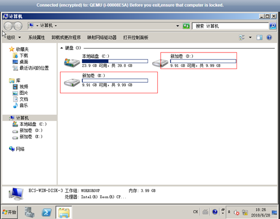
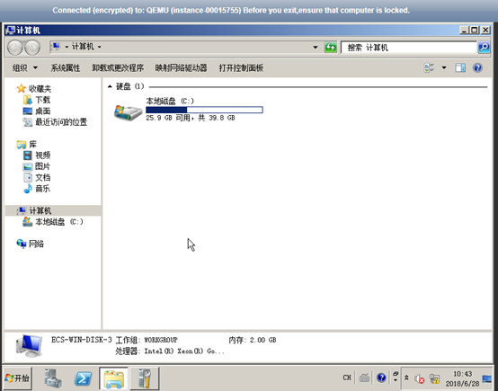
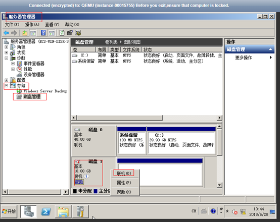

# XEN实例变更为KVM实例（Windows）<a name="ZH-CN_TOPIC_0100593628"></a>

## 操作场景<a name="section9265624184119"></a>

XEN实例变更为KVM实例前，需要确保Windows弹性云服务器已安装了PV driver和UVP VMTools。

本节指导您安装PV driver和UVP VMTools，将XEN实例变更为KVM实例。

> **须知：**   
>-   XEN实例：S1、C1、C2、M1型弹性云服务器。  
>-   KVM实例：参考[规格清单](https://support.huaweicloud.com/productdesc-ecs/zh-cn_topic_0159822360.html)，查询对应规格的虚拟化类型。  
>-   “XEN实例”变更为“KVM实例”必须先安装对应的驱动，然后再变更规格。否则，规格变更后的弹性云服务器不可用（如操作系统无法启动等问题）。  

## 约束与限制<a name="section1969981316489"></a>

-   Windows操作系统云服务器如果存在跨区卷，不支持变更规格，否则可能会导致数据丢失。
-   对于XEN实例，当挂载的VBD磁盘超过24块时，不支持将规格变更为KVM实例。
-   系统支持将“XEN实例”变更为“KVM实例”，不支持将“KVM实例”变更为“XEN实例”。

## 操作流程<a name="section1551105985918"></a>

XEN实例变更为KVM实例的操作流程如[图1](#fig125527421191)所示。

**图 1**  Windows云服务器变更流程<a name="fig125527421191"></a>  


具体的变更操作如[表1](#table53651941115913)所示。

**表 1**  XEN实例变更为KVM实例

<a name="table53651941115913"></a>
<table><thead align="left"><tr id="row183651341145918"><th class="cellrowborder" valign="top" width="33.29%" id="mcps1.2.3.1.1"><p id="p8365144115919"><a name="p8365144115919"></a><a name="p8365144115919"></a>序号</p>
</th>
<th class="cellrowborder" valign="top" width="66.71000000000001%" id="mcps1.2.3.1.2"><p id="p4365124113595"><a name="p4365124113595"></a><a name="p4365124113595"></a>任务</p>
</th>
</tr>
</thead>
<tbody><tr id="row19366941115915"><td class="cellrowborder" valign="top" width="33.29%" headers="mcps1.2.3.1.1 "><p id="p1242122753517"><a name="p1242122753517"></a><a name="p1242122753517"></a>步骤1</p>
</td>
<td class="cellrowborder" valign="top" width="66.71000000000001%" headers="mcps1.2.3.1.2 "><p id="p1542162717357"><a name="p1542162717357"></a><a name="p1542162717357"></a><a href="#section15236154665218">步骤1：制作系统盘快照</a></p>
</td>
</tr>
<tr id="row23661419599"><td class="cellrowborder" valign="top" width="33.29%" headers="mcps1.2.3.1.1 "><p id="zh-cn_topic_0100593628_p1636634114592"><a name="zh-cn_topic_0100593628_p1636634114592"></a><a name="zh-cn_topic_0100593628_p1636634114592"></a>步骤2</p>
</td>
<td class="cellrowborder" valign="top" width="66.71000000000001%" headers="mcps1.2.3.1.2 "><p id="zh-cn_topic_0100593628_p436634118592"><a name="zh-cn_topic_0100593628_p436634118592"></a><a name="zh-cn_topic_0100593628_p436634118592"></a><a href="#section1424018509446">步骤2：检查弹性云服务器是否安装驱动</a></p>
</td>
</tr>
<tr id="row636694135916"><td class="cellrowborder" valign="top" width="33.29%" headers="mcps1.2.3.1.1 "><p id="zh-cn_topic_0100593628_p14366164118597"><a name="zh-cn_topic_0100593628_p14366164118597"></a><a name="zh-cn_topic_0100593628_p14366164118597"></a>步骤3</p>
</td>
<td class="cellrowborder" valign="top" width="66.71000000000001%" headers="mcps1.2.3.1.2 "><p id="zh-cn_topic_0100593628_p53661441115918"><a name="zh-cn_topic_0100593628_p53661441115918"></a><a name="zh-cn_topic_0100593628_p53661441115918"></a><a href="#section013845014418">步骤3：安装驱动</a></p>
</td>
</tr>
<tr id="row1136644155912"><td class="cellrowborder" valign="top" width="33.29%" headers="mcps1.2.3.1.1 "><p id="zh-cn_topic_0100593628_p236624118593"><a name="zh-cn_topic_0100593628_p236624118593"></a><a name="zh-cn_topic_0100593628_p236624118593"></a>步骤4</p>
</td>
<td class="cellrowborder" valign="top" width="66.71000000000001%" headers="mcps1.2.3.1.2 "><p id="zh-cn_topic_0100593628_p12366104118596"><a name="zh-cn_topic_0100593628_p12366104118596"></a><a name="zh-cn_topic_0100593628_p12366104118596"></a><a href="#section1815152131917">步骤4：变更规格</a></p>
</td>
</tr>
<tr id="row03661441165910"><td class="cellrowborder" valign="top" width="33.29%" headers="mcps1.2.3.1.1 "><p id="zh-cn_topic_0100593628_p93661441145912"><a name="zh-cn_topic_0100593628_p93661441145912"></a><a name="zh-cn_topic_0100593628_p93661441145912"></a>步骤5</p>
</td>
<td class="cellrowborder" valign="top" width="66.71000000000001%" headers="mcps1.2.3.1.2 "><p id="zh-cn_topic_0100593628_p123666411590"><a name="zh-cn_topic_0100593628_p123666411590"></a><a name="zh-cn_topic_0100593628_p123666411590"></a><a href="#section2625525131519">（可选）步骤5：检查磁盘挂载状态</a></p>
</td>
</tr>
</tbody>
</table>

## 步骤1：制作系统盘快照<a name="section15236154665218"></a>

变更规格前必须先配置弹性云服务器，安装相应驱动，否则规格变更后，弹性云服务器无法使用，可能会造成系统盘数据丢失。因此，建议您先制作系统盘快照，然后再配置弹性云服务器。

制作系统盘快照的操作，请参见《云硬盘用户指南》的“用户指南 \>  [创建快照](https://support.huaweicloud.com/usermanual-evs/zh-cn_topic_0066615262.html)”章节。

> **说明：**   
>变更规格完成后，如已确认业务恢复正常，请在快照页面手动删除快照。  

## 步骤2：检查弹性云服务器是否安装驱动<a name="section1424018509446"></a>

1.  登录弹性云服务器。
2.  检查是否已安装5.0及以上版本的PV driver。

    进入目录“C:\\Program Files \(x86\)\\Xen PV Drivers\\bin“，打开文件“version.ini“，查看PV driver版本号。

    ```
    pvdriverVersion=5.0.104.010
    ```

    -   如果存在目录，且驱动版本高于5.0，表示PV driver已安装且满足版本要求。
    -   反之，表示PV driver未正常安装或版本不满足要求，请参见[步骤3：安装驱动](#section013845014418)重装PV driver。

3.  检查是否已安装2.5及以上版本的UVP VMTools。

    进入目录“C:\\Program Files \(x86\)\\virtio\\bin“，打开文件“version.ini“，查看UVP VMTools版本号。

    ```
    cur_vmtools_ver=2.5.0.105org_vmtools_ver=0cur_daemon_ver=2.5.0.105-010cur_drivers_ver=2.5.0.105-010
    ```

    -   如果存在目录，且驱动版本高于2.5，表示UVP VMTools已安装成功且满足版本要求。
    -   反之，表示UVP VMTools未正确安装或版本不满足要求，请参见[步骤3：安装驱动](#section013845014418)重装UVP VMTools。

    > **须知：**   
    >请务必确保云服务器配置成功，否则，可能会导致变更规格后的弹性云服务器不可用。  


## 步骤3：安装驱动<a name="section013845014418"></a>

1.  以Administrator用户登录弹性云服务器。
2.  安装PV Driver。

    详细操作请参考在[Windows系统中安装PV driver](https://support.huaweicloud.com/usermanual-ims/zh-cn_topic_0037352182.html)。

    > **说明：**   
    >安装完成后请根据提示重启云服务器。  

3.  安装UVP VMTools。

    详细操作请参考[Windows上安装UVP VMTools](https://support.huaweicloud.com/usermanual-ims/zh-cn_topic_0037352061.html)

    > **说明：**   
    >安装完成后请根据提示重启云服务器。  

4.  驱动安装完成后，需检查驱动是否安装成功。检查方法请参考[步骤2：检查弹性云服务器是否安装驱动](#section1424018509446)。

## 步骤4：变更规格<a name="section1815152131917"></a>

1.  登录控制台。
2.  单击控制台左上角的，选择区域和项目。
3.  选择“计算 \> 弹性云服务器”。
4.  在弹性云服务器列表，查询待变更弹性云服务器状态。

    如果不是关机状态，单击“操作”列下的“更多 \> 关机”。

5.  单击“操作”列下的“更多 \> 变更规格”。

    系统进入“云服务器变更规格”页面。

6.  根据界面提示，选择变更后的云服务器类型、vCPU和内存。
7.  （可选）选择“专属主机”。

    对于在专属主机上创建的弹性云服务器，系统支持更换云服务器所在的专属主机。

    此时，您可以单击下拉列表，选择更换专属主机。如果下拉列表中无可用的专属主机，说明专属主机所剩资源不足，不能用于创建变更规格后的弹性云服务器。

8.  勾选复选框“我确认已完成对弹性云服务器的配置”，确认已完成[步骤3：安装驱动](#section013845014418)。
9.  单击“确定”。

    > **说明：**   
    >-   单击“确定”后云平台自动为您制作系统盘快照。变更规格完成后，如已确认业务恢复正常，请在快照页面手动删除快照。  
    >-   如果变更规格失败后，弹性云服务器无法使用，可能会需要重装操作系统来恢复云服务器，请注意重装操作系统会清除系统盘数据，但不影响数据盘的数据。  


## （可选）步骤5：检查磁盘挂载状态<a name="section2625525131519"></a>

XEN实例变更为KVM实例时，可能会发生磁盘脱机，因此，变更规格后，需检查磁盘挂载状态是否正常。如果正常，则变更成功。

1.  对比规格变更前、后，在“计算机”中查询的磁盘个数是否一致。

    -   是，表示磁盘挂载状态正常，结束。
    -   否，表示存在磁盘脱机，执行[2](#li1476865113179)。

    示例：

    以使用Windows 2008镜像的弹性云服务器为例，假设变更规格前，弹性云服务器挂载有1块系统盘、2块数据盘，如[图2](#fig21898319615)所示。

    **图 2**  变更规格前磁盘挂载情况<a name="fig21898319615"></a>  
    

    变更规格后，查看磁盘挂载情况，如[图3](#fig577522321219)所示。

    **图 3**  变更规格后磁盘挂载情况<a name="fig577522321219"></a>  
    

    只查询到1块系统盘，因此，变更规格前、后，显示的磁盘个数不一致，表示数据盘处于“脱机”状态。

2.  <a name="li1476865113179"></a>将磁盘设置为“联机”状态。
    1.  选择“开始”菜单，右键单击“计算机”，并选择“管理”。

        系统弹窗显示“服务器管理器”页面。

    2.  在左侧导航栏，选择“存储 \> 磁盘管理”。

        进入“磁盘管理页面”。

    3.  在左侧窗格中出现磁盘列表，分别右键单击脱机的磁盘，并选择“联机”，将脱机磁盘进行联机。

        **图 4**  联机<a name="fig2680331163510"></a>  
        

3.  再次在“计算机”中查询磁盘的个数，检查与变更规格前是否一致。

    -   是，结束。
    -   否，请联系客服获取技术支持。

    **图 5**  联机后磁盘挂载情况<a name="fig746964620392"></a>  
    


## 后续处理<a name="section76661826131619"></a>

如果控制台上云服务器列表页，显示弹性云服务器已变更规格成功，但是远程登录云服务器后，操作系统无法启动，此时，请联系技术支持进行恢复，或重装操作系统进行恢复。重装系统的操作指导，请参见[重装操作系统](重装操作系统.md)。

> **说明：**   
>重装操作系统会清除系统盘数据，但不影响数据盘的数据。  

变更规格完成后，如已确认业务恢复正常，请在快照页面手动删除快照。

