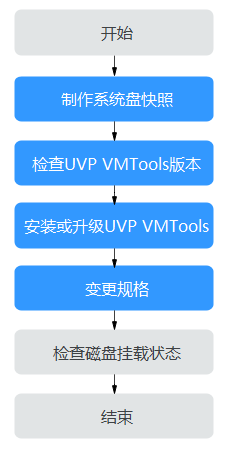
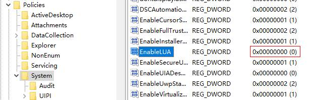

# XEN实例变更为KVM实例（Windows）<a name="ecs_03_0161"></a>

## 操作场景<a name="section9265624184119"></a>

XEN实例变更为KVM实例前，需要确保Windows弹性云服务器已安装了PV driver和UVP VMTools。

本节指导您安装PV driver和UVP VMTools，将XEN实例变更为KVM实例。

> **说明：** 
>-   XEN实例：S1、C1、C2、M1型弹性云服务器。
>-   KVM实例：参考[规格清单](https://support.huaweicloud.com/productdesc-ecs/zh-cn_topic_0159822360.html)，查询对应规格的虚拟化类型。
>-   “XEN实例”变更为“KVM实例”必须先安装对应的驱动，然后再变更规格。否则，规格变更后的弹性云服务器不可用（如操作系统无法启动等问题）。
>-   Linux操作系统的“XEN实例”变更为“KVM实例”时，优先推荐使用[XEN实例变更为KVM实例（Linux-自动配置）](XEN实例变更为KVM实例（Linux-自动配置）.md)。

## 约束与限制<a name="section1969981316489"></a>

-   Windows操作系统云服务器如果存在跨区卷，不支持变更规格，否则可能会导致数据丢失。
-   对于XEN实例，当挂载的VBD磁盘超过24块时，不支持将规格变更为KVM实例。
-   系统支持将“XEN实例”变更为“KVM实例”，不支持将“KVM实例”变更为“XEN实例”。

## 操作流程<a name="section1551105985918"></a>

XEN实例变更为KVM实例的操作流程如[图1](#fig125527421191)所示。

**图 1**  Windows云服务器变更流程<a name="fig125527421191"></a>  


具体的变更操作如[表1](#table53651941115913)所示。

**表 1**  XEN实例变更为KVM实例

<a name="table53651941115913"></a>
<table><thead align="left"><tr id="row183651341145918"><th class="cellrowborder" valign="top" width="33.29%" id="mcps1.2.3.1.1"><p id="p8365144115919"><a name="p8365144115919"></a><a name="p8365144115919"></a>序号</p>
</th>
<th class="cellrowborder" valign="top" width="66.71000000000001%" id="mcps1.2.3.1.2"><p id="p4365124113595"><a name="p4365124113595"></a><a name="p4365124113595"></a>任务</p>
</th>
</tr>
</thead>
<tbody><tr id="row19366941115915"><td class="cellrowborder" valign="top" width="33.29%" headers="mcps1.2.3.1.1 "><p id="p1242122753517"><a name="p1242122753517"></a><a name="p1242122753517"></a>步骤1</p>
</td>
<td class="cellrowborder" valign="top" width="66.71000000000001%" headers="mcps1.2.3.1.2 "><p id="p1542162717357"><a name="p1542162717357"></a><a name="p1542162717357"></a><a href="#section15236154665218">步骤1：制作系统盘快照</a></p>
</td>
</tr>
<tr id="row23661419599"><td class="cellrowborder" valign="top" width="33.29%" headers="mcps1.2.3.1.1 "><p id="ecs_03_0161_p1636634114592"><a name="ecs_03_0161_p1636634114592"></a><a name="ecs_03_0161_p1636634114592"></a>步骤2</p>
</td>
<td class="cellrowborder" valign="top" width="66.71000000000001%" headers="mcps1.2.3.1.2 "><p id="ecs_03_0161_p436634118592"><a name="ecs_03_0161_p436634118592"></a><a name="ecs_03_0161_p436634118592"></a><a href="#section1424018509446">步骤2：检查UVP VMTools版本</a></p>
</td>
</tr>
<tr id="row636694135916"><td class="cellrowborder" valign="top" width="33.29%" headers="mcps1.2.3.1.1 "><p id="ecs_03_0161_p14366164118597"><a name="ecs_03_0161_p14366164118597"></a><a name="ecs_03_0161_p14366164118597"></a>步骤3</p>
</td>
<td class="cellrowborder" valign="top" width="66.71000000000001%" headers="mcps1.2.3.1.2 "><p id="ecs_03_0161_p53661441115918"><a name="ecs_03_0161_p53661441115918"></a><a name="ecs_03_0161_p53661441115918"></a><a href="#section884919094417">步骤3：安装或升级UVP VMTools</a></p>
</td>
</tr>
<tr id="row1136644155912"><td class="cellrowborder" valign="top" width="33.29%" headers="mcps1.2.3.1.1 "><p id="ecs_03_0161_p236624118593"><a name="ecs_03_0161_p236624118593"></a><a name="ecs_03_0161_p236624118593"></a>步骤4</p>
</td>
<td class="cellrowborder" valign="top" width="66.71000000000001%" headers="mcps1.2.3.1.2 "><p id="ecs_03_0161_p12366104118596"><a name="ecs_03_0161_p12366104118596"></a><a name="ecs_03_0161_p12366104118596"></a><a href="#section1815152131917">步骤4：变更规格</a></p>
</td>
</tr>
<tr id="row03661441165910"><td class="cellrowborder" valign="top" width="33.29%" headers="mcps1.2.3.1.1 "><p id="ecs_03_0161_p93661441145912"><a name="ecs_03_0161_p93661441145912"></a><a name="ecs_03_0161_p93661441145912"></a>步骤5</p>
</td>
<td class="cellrowborder" valign="top" width="66.71000000000001%" headers="mcps1.2.3.1.2 "><p id="ecs_03_0161_p123666411590"><a name="ecs_03_0161_p123666411590"></a><a name="ecs_03_0161_p123666411590"></a><a href="#section2625525131519">（可选）步骤5：检查磁盘挂载状态</a></p>
</td>
</tr>
</tbody>
</table>

## 步骤1：制作系统盘快照<a name="section15236154665218"></a>

如果云服务器未安装驱动就执行了变更规格的操作，云服务器无法正常使用，需要重装操作系统才能恢复，可能造成您的系统盘数据丢失。因此，建议您先制作系统盘快照，防止数据丢失。

1.  制作系统盘快照前请对云服务器完成自检**。**

    对云服务器执行关机、开机操作，确保云服务器重启后业务可以正常运行。再启动制作系统盘快照。

2.  制作系统盘快照的操作，请参见《云硬盘用户指南》的“用户指南 \>  [创建快照](https://support.huaweicloud.com/usermanual-evs/zh-cn_topic_0066615262.html)”章节。

> **说明：** 
>变更规格完成后，如已确认业务恢复正常，请在快照页面手动删除快照。

## 步骤2：检查UVP VMTools版本<a name="section1424018509446"></a>

变更规格前请先检查UVP VMTools版本。

1.  登录弹性云服务器。
2.  下载驱动检查脚本

    下载驱动检查脚本，用管理员权限执行脚本，等待检查结果。

    请根据云服务器所在区域选择脚本的下载地址：

    -   华东-上海二：[https://cn-east-2-server-resize.obs.cn-east-2.myhuaweicloud.com/windows/server\_resize/check\_kvm\_drivers.vbs](https://cn-east-2-server-resize.obs.cn-east-2.myhuaweicloud.com/windows/server_resize/check_kvm_drivers.vbs)
    -   华北-北京一：[https://cn-north-1-server-resize.obs.cn-north-1.myhuaweicloud.com/windows/server\_resize/check\_kvm\_drivers.vbs](https://cn-north-1-server-resize.obs.cn-north-1.myhuaweicloud.com/windows/server_resize/check_kvm_drivers.vbs)
    -   华南-广州：[https://cn-south-1-server-resize.obs.cn-south-1.myhuaweicloud.com/windows/server\_resize/check\_kvm\_drivers.vbs](https://cn-south-1-server-resize.obs.cn-south-1.myhuaweicloud.com/windows/server_resize/check_kvm_drivers.vbs)

    驱动检查脚本在确认驱动安装成功后会自动为云服务器设置标签，标记驱动安装成功，没有设置标签的云服务器无法执行变更规格的操作。

    -   检查结果为“Check version success!”说明驱动版本符合要求，且为云服务器设置标签标记驱动安装成功。您可以执行[步骤4：变更规格](#section1815152131917)。
    -   检查结果为“Check version success but set metadata failed! Please run this script again later.”说明驱动版本符合要求，但为云服务器设置标签失败，请稍后重试。
    -   检查结果为“Check version failed! Please install drivers at first. ”说明驱动版本不符合要求，请参见[步骤3：安装或升级UVP VMTools](#section884919094417)安装或升级UVP VMTools。


## 步骤3：安装或升级UVP VMTools<a name="section884919094417"></a>

安装或升级UVP VMTools时，如果云服务器中已安装PV Driver，会对其版本进行校验，为了避免在云服务器上安装UVP VMTools失败，需确保PV Driver版本满足要求。本小节介绍检查安装PV Driver、UVP VMTools的操作步骤。

> **注意：** 
>安装PV Driver或UVP VMTools前请确保云服务器满足以下条件：
>-   云服务器的系统盘的剩余空间必须大于2GB。
>-   为了避免在云服务器上安装驱动失败，安装前请先卸载第三方虚拟化平台的工具（例如：Citrix Xen Tools、VMware Tools），相关卸载方法请参考对应的工具的官方文档。
>-   禁用防病毒软件或入侵检测软件，您可以在驱动安装完成后，再启用这些软件。

1.  安装前请先检查PV Driver版本是否满足UVP VMTools依赖。

    进入目录“C:\\Program Files \(x86\)\\Xen PV Drivers\\bin“，打开文件“version.ini“，查看PV driver版本号。

    ```
    pvdriverVersion=5.0.104.010
    ```

    -   如果存在目录，且驱动版本高于5.0，表示PV driver已安装且满足版本要求，请执行[6](#li1950201211120)安装UVP VMTools。
    -   反之，表示PV driver未正常安装或版本不满足要求，请执行以下步骤卸载旧版本PV driver，安装新版本的PV driver。

2.  <a name="li20502191213114"></a>记录当前云服务器的UAC（User Account Control）配置。

    > **说明：** 
    >PV Driver版本低于5.0时，为实现静默升级功能（防止升级过程中弹窗过多），安装PV Driver时在注册表中加入了Disable LUA操作，卸载PV Driver时在注册表中加入了Enable LUA操作（5.0及以上版本已优化解决此问题）。为避免对您的业务造成影响，如果PV Driver版本低于5.0，请在卸载前先记录UAC配置，并在安装新版本PV Driver后检查并恢复注册表中Enable LUA配置。了解更多UAC配置请参考[微软官方文档](https://docs.microsoft.com/en-us/windows/security/identity-protection/user-account-control/user-account-control-overview)。

    1.  打开“运行”窗口，输入“regedit”，打开“注册表编辑器”。
    2.  记录HKEY\_LOCAL\_MACHINE\\SOFTWARE\\Microsoft\\Windows\\CurrentVersion\\Policies\\System\\EnableLUA 键值。

        **图 2**  EnableLUA<a name="fig1757419164344"></a>  
        

3.  卸载旧版本PV driver。
    1.  在云服务器云主机操作系统界面，选择“开始 \> 控制面板”。
    2.  单击“卸载程序”。
    3.  按照提示，卸载“GPL PV Drivers for Windows x.x.x.xx”。
    4.  在控制台重启云服务器。

4.  安装新版本PV driver。
    1.  下载PV Driver的安装包。

        PV Driver下载地址：[https://ecs-instance-driver.obs.cn-north-1.myhuaweicloud.com/pvdriver-windows.zip](https://ecs-instance-driver.obs.cn-north-1.myhuaweicloud.com/pvdriver-windows.zip)

    2.  解压PV driver软件包。
    3.  双击“pvdriver-windows.iso”。
    4.  运行“Setup.exe”，根据界面提示安装PV Driver。

        请耐心等待驱动安装完成，请勿重复点击“Setup.exe”。

    5.  根据提示重启云服务器，使PV driver生效。

5.  检查并恢复UAC配置。
    1.  打开“运行”窗口，输入“regedit”，打开“注册表编辑器”。
    2.  查看HKEY\_LOCAL\_MACHINE\\SOFTWARE\\Microsoft\\Windows\\CurrentVersion\\Policies\\System\\EnableLUA 键值，与卸载PV Driver前记录的键值比较，如果不同请将键值修改为[2](#li20502191213114)中记录的值。

6.  <a name="li1950201211120"></a>安装或升级UVP VMTools。
    1.  下载UVP VMTools的安装包。

        UVP VMTools下载地址：[https://ecs-instance-driver.obs.cn-north-1.myhuaweicloud.com/vmtools-windows.zip](https://ecs-instance-driver.obs.cn-north-1.myhuaweicloud.com/vmtools-windows.zip)

    2.  解压UVP VMTools的安装包。
    3.  双击“vmtools-windows.iso”。
    4.  运行“Setup.exe”，根据界面提示安装UVP VMTools。

        安装程序会自动匹配当前操作系统版本，并识别新安装或升级场景。

        请耐心等待驱动安装完成，请勿重复点击“Setup.exe”

    5.  根据提示重启云服务器，使UVP VMTools驱动生效。
    6.  驱动安装完成并重启云服务器后，需检查驱动是否安装成功。检查方法请参考[步骤2：检查UVP VMTools版本](#section1424018509446)。


## 步骤4：变更规格<a name="section1815152131917"></a>

1.  登录控制台。
2.  单击控制台左上角的，选择区域和项目。
3.  单击“”，选择“计算 \> 弹性云服务器”。
4.  在弹性云服务器列表，查询待变更弹性云服务器状态。

    如果不是关机状态，单击“操作”列下的“更多 \> 关机”。

5.  单击“操作”列下的“更多 \> 变更规格”。

    系统进入“云服务器变更规格”页面。

6.  根据界面提示，选择变更后的云服务器类型、vCPU和内存。
7.  （可选）选择“专属主机”。

    对于在专属主机上创建的弹性云服务器，系统支持更换云服务器所在的专属主机。

    此时，您可以单击下拉列表，选择更换专属主机。如果下拉列表中无可用的专属主机，说明专属主机所剩资源不足，不能用于创建变更规格后的弹性云服务器。

8.  勾选复选框“我确认已完成对弹性云服务器的配置”，确认已完成[步骤3：安装或升级UVP VMTools](#section884919094417)。
9.  单击“确定”。

    > **说明：** 
    >-   单击“确定”后云平台自动为您制作系统盘快照。变更规格完成后，如已确认业务恢复正常，请在快照页面手动删除快照。
    >-   如果变更规格失败后，弹性云服务器无法使用，可能会需要重装操作系统来恢复云服务器，请注意重装操作系统会清除系统盘数据，但不影响数据盘的数据。


## （可选）步骤5：检查磁盘挂载状态<a name="section2625525131519"></a>

XEN实例变更为KVM实例时，可能会发生磁盘脱机，因此，变更规格后，需检查磁盘挂载状态是否正常。如果正常，则变更成功。

-   Windows弹性云服务器

    详细操作请参考[Windows云服务器变更规格后数据盘脱机怎么办？](https://support.huaweicloud.com/ecs_faq/ecs_faq_0618.html)


## 后续处理<a name="section76661826131619"></a>

如果控制台上云服务器列表页，显示弹性云服务器已变更规格成功，但是远程登录云服务器后，操作系统无法启动，此时，请联系客服进行恢复，或重装操作系统进行恢复。重装系统的操作指导，请参见[重装操作系统](重装操作系统.md)。

> **说明：** 
>重装操作系统会清除系统盘数据，但不影响数据盘的数据。

变更规格完成后，如已确认业务恢复正常，请在快照页面手动删除快照。

