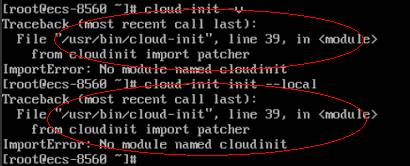

# python升级导致cloud-init不工作

## 问题描述

以CentOS 6.8镜像的弹性云服务器为例，将python从python 2.6升级到python 2.7版本后，可能会引起cloud-init不工作，具体表现为：弹性云服务器的密码、密钥、hostname等信息无法通过cloud-init注入。

执行命令**cloud-init -v**查询cloud-init的版本，回显报错，如[图1](#fig311825713493)所示。

**图 1**  Cloudinit运行异常  

## 可能原因

cloud-init使用的python版本不正确。

## 处理方法

将cloud-init使用的python版本修改为升级前版本，即将/usr/bin/cloud-init环境变量从默认的“\#!/usr/bin/python“修改为升级前的“\#!/usr/bin/python2.6“路径。

**图 2**  修改python版本  

