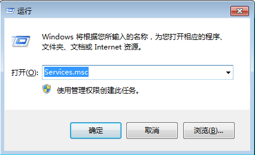
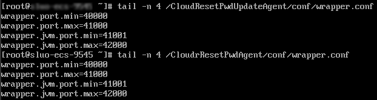

# 业务端口被一键式重置密码插件占用

## 问题描述

在弹性云服务器上运行某业务时，系统提示所需端口被一键式重置密码Agent插件占用。那么，一键式重置密码插件占用的端口与业务端口发生冲突时，应当如何处理？

## 问题原因

对于采用AUTO模式的弹性云服务器，一键式重置密码插件启动时，会随机选取端口进行使用，可能占用了业务端口。

> **说明：**   
>一键式重置密码插件已经升级，默认采用PIPE模式。  
>-   对于新创建的弹性云服务器，默认采用PIPE模式，不会占用端口。  
>-   对于已创建的弹性云服务器，仍采用AUTO模式，随机占用31000\~32999中的一个端口。占用端口的原则是：在该范围内，系统会按照自小到大的顺序，占用当前空闲的端口。  

## 方法一（推荐）：将一键式重置密码插件wraper修改为PIPE模式

推荐您将一键式重置密码插件wraper从AUTO模式（SOCKET）修改为PIPE模式，修改后，插件运行时不再占用端口。

1.  打开CloudResetPwdAgent配置文件。
    -   Linux弹性云服务器文件位置：

        “/CloudrResetPwdAgent/conf/wrapper.conf“和“/CloudResetPwdUpdateAgent/conf/wrapper.conf“

    -   Windows弹性云服务器文件位置：

        “C:\\CloudResetPwdUpdateAgent\\conf\\wrapper.conf“和“C:\\CloudResetPwdUpdateAgent\\conf\\wrapper.conf“

2.  在末尾新增如下配置：

    **wrapper.backend.type=PIPE**

3.  重启CloudResetPwdUpdateAgent服务。
    -   Linux弹性云服务器

        **/CloudResetPwdUpdateAgent/bin/cloudResetPwdUpdateAgent.script restart**

    -   Windows弹性云服务器
        1.  使用快捷键“Win+R”，打开“运行”窗口。
        2.  输入“Services.msc”，并单击“确定”。

            **图 1**  运行  
            

        3.  右键单击服务“cloud reset password update agent”，选择“重新启动”。

            **图 2**  服务（本地）  
            

## 方法二：修改配置，更换端口范围

您可以修改CloudResetPwdAgent配置，更换默认随机端口选取的范围（31000\~32999），确保业务端口不在一键式重置密码插件的端口选择范围内。

假设将一键式重置密码插件随机占用的端口范围修改为：40000\~42000，则操作如下：

1.  打开CloudResetPwdAgent配置文件。
    -   Linux弹性云服务器文件位置：

        “/CloudrResetPwdAgent/conf/wrapper.conf“和“/CloudResetPwdUpdateAgent/conf/wrapper.conf“

    -   Windows弹性云服务器文件位置：

        “C:\\CloudResetPwdUpdateAgent\\conf\\wrapper.conf“和“C:\\CloudResetPwdUpdateAgent\\conf\\wrapper.conf“

2.  新增如下配置：

    **wrapper.port.min=40000**

    **wrapper.port.max=41000**

    **wrapper.jvm.port.min=41001**

    **wrapper.jvm.port.max=42000**

    **图 3**  修改配置文件  
    

3.  重启CloudResetPwdUpdateAgent服务。
    -   Linux弹性云服务器

        **/CloudResetPwdUpdateAgent/bin/cloudResetPwdUpdateAgent.script restart**

    -   Windows弹性云服务器
        1.  使用快捷键“Win+R”，打开“运行”窗口。
        2.  输入“Services.msc”，并单击“确定”。

            **图 4**  运行  
            

        3.  右键单击服务“cloud reset password update agent”，选择“重新启动”。

            **图 5**  服务（本地）  
            

