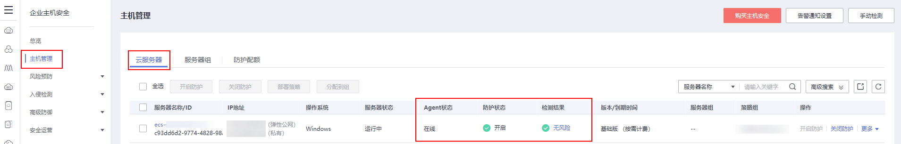

# 主机安全

## 什么是主机安全

企业主机安全（Host Security Service，HSS）是提升服务器整体安全性的服务，通过主机管理、风险防御、入侵检测、安全运营、网页防篡改功能，可全面识别并管理云服务器中的信息资产，实时监测云服务器中的风险，降低服务器被入侵的风险。

使用主机安全需要在云服务器中安装Agent。安装Agent后，您的云服务器将受到HSS云端防护中心全方位的安全保障，在安全控制台可视化界面上，您可以统一查看并管理同一区域内所有主机的防护状态和主机安全风险。

## 怎样使用主机安全服务

您在使用企业主机安全服务前，需要先在弹性云服务器上安装Agent。针对新创建的云服务器和已有的云服务器，提供不同的安装方式：

-   **场景一：新创建云服务器**

    购买弹性云服务器，选择部分操作系统的公共镜像时，系统推荐您配套使用企业主机安全服务（Host Security Service, HSS）。

    开启“主机安全”需要设置“安全防护”参数：

    -   免费开启主机安全基础防护：开启后，为您的主机提供四大安全防御能力，包括主机安全基础版防御（免费赠送一个月）、账号破解防护、弱口令检测、恶意程序检测等功能。

        > **说明：** 
        >主机安全基础版免费使用期限结束后，该防护配额将自动释放，停止相应的实时防护能力。
        >如您需要保留或升级原有安全能力，建议您购买主机安全。详细情况，请参见主机安全的[版本功能特性](https://support.huaweicloud.com/productdesc-hss2.0/hss_01_0136.html)。
        >购买弹性云服务器时，默认设置该选项。

    -   购买高阶防护：高阶防护属于企业版，需付费使用，支持漏洞修复、病毒查杀、等保必备。
    -   不使用安全防护：若您不需要进行安全防护，可选择此选项。

    选择主机安全后系统自动安装主机安全Agent，开启帐号防御，启用主机安全服务的功能。

    企业主机安全支持基础版、企业版、旗舰版和网页防篡改版 ，请参考[企业主机安全服务版本差异](https://support.huaweicloud.com/productdesc-hss2.0/hss_01_0136.html)。

    若基础版或企业版不满足要求，您可以[购买其他版本配额](https://support.huaweicloud.com/usermanual-hss2.0/hss_01_0229.html)，在企业主机安全控制台切换不同版本，获取更高级的防护，且不需要重新安装Agent。

    **图 1**  开通主机安全  
    

-   **场景二：未配置主机安全的云服务器**

    对于已经创建完成的弹性云服务器，可能由于创建时尚未支持主机安全服务或未设置“安全防护”参数。如需使用主机安全，您需要手动安装Agent。

    具体操作请参见[手动安装Agent](https://support.huaweicloud.com/usermanual-hss2.0/hss_01_0234.html)、[手动开启防护](https://support.huaweicloud.com/usermanual-hss2.0/hss_01_0230.html)。

## 怎样查看主机安全状态

在云服务器的列表页，您可以查看当前区域下的云服务器的主机安全状态。

1.  登录管理控制台。
2.  单击“”，选择“安全 \> 企业主机安全”。
3.  在“云服务器”界面，查看服务器的防护状态。

    **图 2**  查看主机安全状态  
    

    **表 1**  状态说明

    
    <table><thead align="left"><tr id="row84873614571"><th class="cellrowborder" valign="top" width="19.05%" id="mcps1.2.3.1.1">
参数

    </th>
    <th class="cellrowborder" valign="top" width="80.95%" id="mcps1.2.3.1.2">
说明

    </th>
    </tr>
    </thead>
    <tbody><tr id="row34819364575"><td class="cellrowborder" valign="top" width="19.05%" headers="mcps1.2.3.1.1 ">
Agent状态

    </td>
    <td class="cellrowborder" valign="top" width="80.95%" headers="mcps1.2.3.1.2 "><ul id="ul103471113205817"><li>未安装：未安装Agent，或Agent已安装但未成功启动。</li><li>在线：Agent运行正常。</li><li>离线：Agent与HSS服务器通信异常，HSS无法提供安全防护功能。
单击“离线”，您可以查看Agent不在线的华为云主机列表，并查看“离线原因”。

    </li></ul>
    </td>
    </tr>
    <tr id="row124883617572"><td class="cellrowborder" valign="top" width="19.05%" headers="mcps1.2.3.1.1 ">
防护状态

    </td>
    <td class="cellrowborder" valign="top" width="80.95%" headers="mcps1.2.3.1.2 "><ul id="ul19463397580"><li>开启：HSS为该服务器提供全面的主机安全防护。</li><li>关闭：单击“关闭防护”可以暂停HSS对服务器的防护，降低该服务器的资源消耗。</li></ul>
    </td>
    </tr>
    <tr id="row14813369578"><td class="cellrowborder" valign="top" width="19.05%" headers="mcps1.2.3.1.1 ">
检测结果

    </td>
    <td class="cellrowborder" valign="top" width="80.95%" headers="mcps1.2.3.1.2 "><ul id="ul198495145820"><li>有风险：主机存在风险。</li><li>无风险：主机暂未发现风险。</li><li>未检测：主机未开启防护。</li></ul>
    </td>
    </tr>
    </tbody>
    </table>

更多关于企业主机安全服务的使用，请参见[企业主机安全](https://support.huaweicloud.com/productdesc-hss2.0/hss_01_0001.html)。

