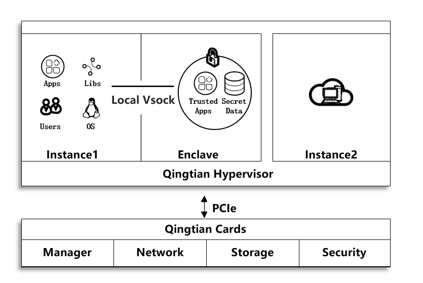

# 什么是擎天Enclave?

-   擎天Enclave是基于华为云擎天架构部分虚拟机实例的一个高级安全特性，为客户提供了一个安全的，隔离的执行环境，我们称其为擎天Enclave。擎天Enclave是完全独立的虚拟机，无持久化存储、交互式访问和外部网络连接。父虚拟机与擎天Enclave之间通过安全的本地通道进行通信。即使您是父实例上的root用户，也不能访问或通过 SSH 连接到擎天Enclave。
-   擎天Hypervisor可以将擎天Enclave的CPU 和内存与父实例上的用户、应用程序和库隔离开，提供给您一个完全隔离的可执行环境，显著减少了攻击面。因此，使用擎天Enclave，您能保护敏感的核心数据和应用程序，为您的服务增加安全保障。
-   擎天Enclave还提供了证明（Attestation）的功能。您可以通过该功能验证擎天Enclave实例的可信度量值。华为云密钥管理服务KMS为擎天证明功能提供了内在支持，您能限制应用程序必须在预期的擎天Enclave运行环境中才能调用KMS API处理敏感数据。

## 约束条件

擎天Enclave有以下约束：

<table><thead align="left"><tr id="zh-cn_topic_0000001359553230_row5447141117713"><th class="cellrowborder" valign="top" width="31.7%" id="mcps1.1.3.1.1">
虚拟机名称

</th>
<th class="cellrowborder" valign="top" width="68.30000000000001%" id="mcps1.1.3.1.2">
限制要求

</th>
</tr>
</thead>
<tbody><tr id="zh-cn_topic_0000001359553230_row184478119718"><td class="cellrowborder" valign="top" width="31.7%" headers="mcps1.1.3.1.1 ">
父实例（主虚拟机）

</td>
<td class="cellrowborder" valign="top" width="68.30000000000001%" headers="mcps1.1.3.1.2 ">
1. 至少预留2个vCPU，至少预留512M以上内存空间。

2. 必须为Linux操作系统。

</td>
</tr>
<tr id="zh-cn_topic_0000001359553230_row744761111710"><td class="cellrowborder" valign="top" width="31.7%" headers="mcps1.1.3.1.1 ">
擎天Enclave（从虚拟机）

</td>
<td class="cellrowborder" valign="top" width="68.30000000000001%" headers="mcps1.1.3.1.2 ">
1. 裸金属实例不支持擎天Enclave；必须为Linux操作系统。

2. 擎天Enclave的默认规格为1G大页，1G内存，2vcpu。

3. 启动擎天Enclave最低内存规格为128M，并且不能小于Enclave镜像eif文件大小的4倍。

4. 大页使用2M大页时，擎天Enclave启动支持的最大内存为512M。

5. 大页使用1G时，启动擎天Enclave支持的最大内存为256G。

6. vcpu数量配置需要为偶数，最高不超过父虚拟机单node cpu数量减 2；总数量最高不超过62。

7. 擎天Enclave所使用的内存和CPU都必须来自同一个NUMA节点。

8. 在擎天Enclave中运行的应用程序需要和OS（内核，ramdisk，init程序）一起被打包成擎天Enclave镜像。

</td>
</tr>
</tbody>
</table>

父实例和擎天Enclave关系：

1.  每个父实例可以创建一个或两个擎天Enclave，后续可扩充多个。
2.  不支持与父实例共Core分别使用超线程核。
3.  只有在父实例处于运行状态时，擎天Enclave才处于活动状态。如果父实例被停止或终止，则擎天Enclave被终止。
4.  擎天Enclave分配的资源（内存和CPU等），都是从父实例中分割出来的，内存区间要求是2M/1G对齐的连续物理区间。

另外还需要注意：

1.  支持擎天Enclave特性的父虚拟机规格： c7e
2.  支持擎天Enclave特性的Region： 上海一
3.  如果您在擎天Enclave中的业务被意外终止，您需要手动重拉该业务

## 计费标准

使用擎天Enclave并不会收取额外费用。您只需要支付ECS及其他华为云服务的购买费用。

## 相关服务

擎天Enclave与以下华为云服务集成：

1.  密钥管理服务

    密钥管理服务（KMS）是华为云数据加密服务族中的一个核心服务。KMS提供可用性高的密钥生成、存储、管理和审计解决方案。KMS密钥由硬件安全模块HSM保护，并与许多华为云数据存储服务集成。您可以借此服务开发自己的加密应用。

2.  华为统一身份认证服务

    统一身份认证（Identity and Access Management，简称IAM）是华为云提供权限管理的基础服务，可以帮助您安全地控制华为云服务和资源的访问权限。

