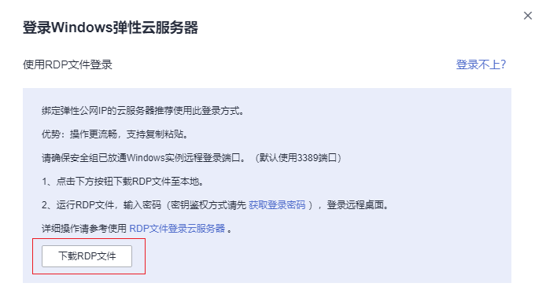

# 使用RDP文件登录Windows云服务器

## 操作场景

远程桌面协议（Remote Desktop Protocol，RDP），是微软提供的多通道的远程登录协议。本节为您介绍如何使用RDP文件远程登录Windows弹性云服务器。

> **说明：**   
>从管理控制台下载的RDP文件对应唯一的云服务器，当前RDP文件命名规则为“云服务器名称-弹性IP”。  

## 前提条件

-   弹性云服务器状态为“运行中”。
-   如果弹性云服务器采用密钥方式鉴权，已获取Windows弹性云服务器的密码，获取方式请参见[获取Windows弹性云服务器的密码](获取Windows弹性云服务器的密码.md)。
-   弹性云服务器已经绑定弹性公网IP，绑定方式请参见[绑定弹性公网IP](绑定弹性公网IP.md)。

-   所在安全组入方向已开放3389端口，配置方式请参见[配置安全组规则](配置安全组规则.md)。
-   使用的登录工具与待登录的弹性云服务器之间网络连通。例如，默认的3389端口没有被防火墙屏蔽。
-   弹性云服务器开启远程桌面协议RDP（Remote Desktop Protocol）。使用公共镜像创建的弹性云服务器默认已打开RDP。打开RDP方法请参考[开启远程桌面协议RDP](远程桌面连接（MSTSC方式）.md#section65216898112059)。

## Windows操作系统使用RDP文件登录Windows弹性云服务器

本地主机为Windows操作系统，那么您可以使用RDP文件登录Windows弹性云服务器。

1.  登录管理控制台。
2.  单击管理控制台左上角的，选择区域和项目。
3.  选择“计算 \> 弹性云服务器”。
4.  选择要登录的弹性云服务器，单击“操作”列下的“远程登录”。

    **图 1**  远程登录  
    

5.  在弹出的“登录Windows弹性云服务器”窗口中，选择“使用 RDP 文件登录”，单击“下载RDP文件”，将 RDP 文件下载到本地。

    **图 2**  单击“下载RDP文件”  
    

6.  双击已下载到本地的 RDP 文件，即可远程连接到 Windows 云服务器。
    -   当您的弹性云服务器是采用密码方式鉴权时，请直接使用创建云服务器时设置的密码进行登录。
    -   当您的弹性云服务器是采用密钥方式鉴权时，密码获取方式请参见[获取Windows弹性云服务器的密码](获取Windows弹性云服务器的密码.md)。
    -   如果您忘记密码，请参见[在控制台重置弹性云服务器密码](在控制台重置弹性云服务器密码.md)。

