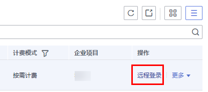

# 使用创建时的用户名和密码无法SSH方式登录GPU加速云服务器

## 处理方法

先使用VNC方式远程登录弹性云服务器，并修改配置文件，然后再使用SSH方式登录。

1.  进入弹性云服务器运行页面，单击“远程登录”。

    

2.  自动跳转至登录页面，登录root用户，输入密码。

    > **说明：**   
    >密码为创建弹性云服务器时设置的密码。  

    

3.  在“/etc/ssh/”目录下，修改sshd\_config文件中3个配置项，修改参数如下图所示。

    

4.  修改完成后保存退出，执行如下命令，重启SSH服务。ervice sshd restartservice sshd restart

    **service sshd restart**

5.  重启后，重新使用SSH密码方式登录弹性云服务器。
6.  通过以上步骤依然无法登录，请联系技术人员进行处理。

