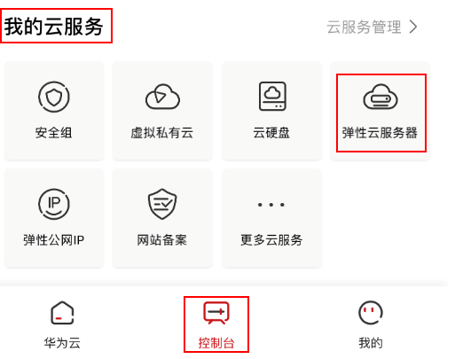
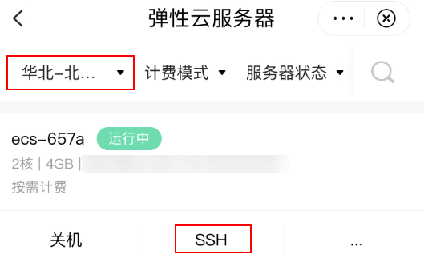
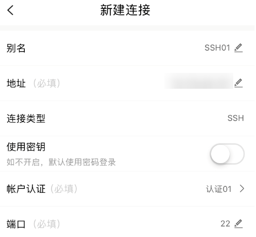
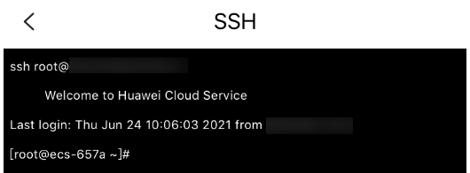

# 使用华为云APP连接Linux云服务器

## 操作场景

本节操作介绍通过华为云APP连接Linux实例的操作步骤。

## 前提条件

-   云服务器状态为“运行中”。
-   已获取Linux云服务器用户名和密码。忘记密码请参考[在控制台重置弹性云服务器密码](在控制台重置弹性云服务器密码.md)重置密码。
-   弹性云服务器已经绑定弹性公网IP，绑定方式请参见[绑定弹性公网IP](绑定弹性公网IP.md)。

-   所在安全组入方向已开放22端口，配置方式请参见[配置安全组规则](配置安全组规则.md)。

## 操作步骤

请确保已经在移动端安装了华为云APP。本示例中使用CentOS 8.2操作系统，使用root用户名和密码进行认证。

1.  打开华为云APP，选择“控制台”。

    **图 1**  华为云APP  
    

2.  在控制台页面上选择“我的云服务器 \> 弹性云服务器”。

    **图 2**  华为云APP控制台  
    

3.  选择待连接的云服务器。

    可通过单击页面左上方的区域，切换至云服务器所在的区域。

4.  单击“SSH”。使用华为云APP链接云服务器需要创建连接信息和认证信息。

    **图 3**  选择待登录的云服务器  
    

5.  创建认证信息。
    1.  单击“添加认证”。
    2.  填写认证信息，并单击“确定”保存。

        -   别名：创建的认证名称，如本例中，设置为“认证01”。
        -   登录名：输入用户名root。
        -   密码：输入实例登录密码。
        -   密钥：如果使用密钥认证请输如密钥信息。

        **图 4**  新建认证  
        

6.  创建连接信息。
    1.  单击“创建连接”。
    2.  选择“手动创建连接”。
    3.  填写连接信息。

        -   别名：创建的连接名称，如本例中，设置为“SSH01”。
        -   地址：输入需要连接的 Linux 实例的公网IP地址。
        -   连接类型：默认为SSH。
        -   使用密钥：默认关闭，使用密码登录。
        -   账户认证：选择已创建认证信息。本例选择在[5](#li1839910291065)中创建的认证信息。
        -   端口：默认端口号22。

        **图 5**  新建连接  
        

7.  单击“连接”，当出现如[图6](#fig6556832191218)所示页面时，您已经成功地连接了Linux云服务器。

    **图 6**  成功连接云服务器  
    

