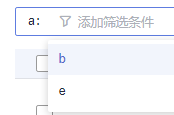
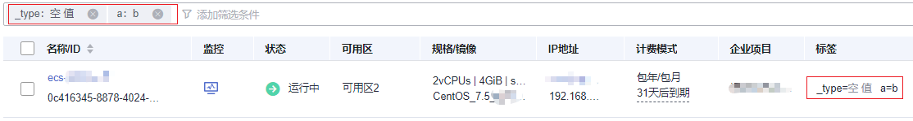

# 使用标签检索资源

为云资源添加标签后，您可以通过本文所述的两种方法使用标签检索资源。

## 使用标签搜索云服务器

在弹性云服务器列表页，按标签键或键值对搜索目标云服务器。

1.  登录管理控制台。
2.  单击管理控制台左上角的，选择区域和项目。
3.  单击“”，选择“计算 \> 弹性云服务器”。
4.  在云服务器列表页搜索的输入框中选择“标签”，选择标签键值对后自动搜索。

    支持多个标签搜索，按“与”的关系搜索目标云服务器。

    **图 1**  按标签搜索云服务器  
    

    **图 2**  按标签搜索云服务器  
    

## 通过标签管理筛选资源

1.  登录管理控制台。
2.  在右上角的用户名下选择“标签管理”，进入标签管理服务页面。
3.  在“资源标签”页面，设置搜索条件（包括区域、资源类型、资源标签）。
4.  单击“搜索”。

    搜索结果区域将列出所有符合搜索条件的资源。

