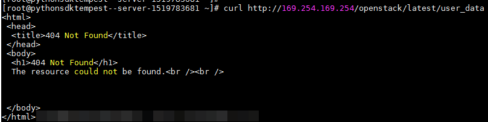

# 元数据获取<a name="ZH-CN_TOPIC_0042400609"></a>

弹性云服务器元数据包含了弹性云服务器在云平台的基本信息，例如云服务ID、主机名、网络信息等。弹性云服务器元数据支持两种风格，可以分别通过兼容Openstack和兼容EC2的API获取，如[表1](#table273552371680)所示。

**表 1**  弹性云服务器元数据类别支持列表

<a name="table273552371680"></a>
<table><thead align="left"><tr id="row459785021680"><th class="cellrowborder" valign="top" width="24.490000000000002%" id="mcps1.2.4.1.1"><p id="p1611763716833"><a name="p1611763716833"></a><a name="p1611763716833"></a>元数据类型</p>
</th>
<th class="cellrowborder" valign="top" width="23.05%" id="mcps1.2.4.1.2"><p id="p304933271680"><a name="p304933271680"></a><a name="p304933271680"></a>实例元数据项</p>
</th>
<th class="cellrowborder" valign="top" width="52.459999999999994%" id="mcps1.2.4.1.3"><p id="p213207321680"><a name="p213207321680"></a><a name="p213207321680"></a>约束说明</p>
</th>
</tr>
</thead>
<tbody><tr id="row378821081680"><td class="cellrowborder" rowspan="5" valign="top" width="24.490000000000002%" headers="mcps1.2.4.1.1 "><p id="p809695916822"><a name="p809695916822"></a><a name="p809695916822"></a>OpenStack类型</p>
</td>
<td class="cellrowborder" valign="top" width="23.05%" headers="mcps1.2.4.1.2 "><p id="p175787921680"><a name="p175787921680"></a><a name="p175787921680"></a>/meta_data.json</p>
</td>
<td class="cellrowborder" valign="top" width="52.459999999999994%" headers="mcps1.2.4.1.3 "><p id="p426193551680"><a name="p426193551680"></a><a name="p426193551680"></a>查询弹性云服务器的元数据信息。</p>
<p id="p63391215141014"><a name="p63391215141014"></a><a name="p63391215141014"></a>元数据的关键字段请参见<a href="#table2373623012315">表2</a>。</p>
</td>
</tr>
<tr id="row292374981680"><td class="cellrowborder" valign="top" headers="mcps1.2.4.1.1 "><p id="p163874991680"><a name="p163874991680"></a><a name="p163874991680"></a>/password</p>
</td>
<td class="cellrowborder" valign="top" headers="mcps1.2.4.1.2 "><p id="p409248351680"><a name="p409248351680"></a><a name="p409248351680"></a>查询弹性云服务器的密码。</p>
<p id="p661917247101"><a name="p661917247101"></a><a name="p661917247101"></a>Windows系统使用keypairs创建弹性云服务器初始化时cloudbase-init用于保存密文密码。</p>
</td>
</tr>
<tr id="row104562411680"><td class="cellrowborder" valign="top" headers="mcps1.2.4.1.1 "><p id="p11850321680"><a name="p11850321680"></a><a name="p11850321680"></a>/user_data</p>
</td>
<td class="cellrowborder" valign="top" headers="mcps1.2.4.1.2 "><p id="p98983401680"><a name="p98983401680"></a><a name="p98983401680"></a>查询弹性云服务器的用户数据。</p>
<p id="p465163616106"><a name="p465163616106"></a><a name="p465163616106"></a>用户根据需要自行指定脚本和配置文件用于弹性云服务器初始化，详细操作请参考<a href="用户数据注入.md">用户数据注入</a>。</p>
<p id="p865193611107"><a name="p865193611107"></a><a name="p865193611107"></a>若linux虚拟化使用密码方式，则保存注入密码的脚本。</p>
</td>
</tr>
<tr id="row216681141680"><td class="cellrowborder" valign="top" headers="mcps1.2.4.1.1 "><p id="p21457114512"><a name="p21457114512"></a><a name="p21457114512"></a>/network_data.json</p>
</td>
<td class="cellrowborder" valign="top" headers="mcps1.2.4.1.2 "><p id="p31455115119"><a name="p31455115119"></a><a name="p31455115119"></a>查询弹性云服务器的网络信息。</p>
</td>
</tr>
<tr id="row19335028144551"><td class="cellrowborder" valign="top" headers="mcps1.2.4.1.1 "><p id="p714571205111"><a name="p714571205111"></a><a name="p714571205111"></a>/securitykey</p>
</td>
<td class="cellrowborder" valign="top" headers="mcps1.2.4.1.2 "><p id="p17145915518"><a name="p17145915518"></a><a name="p17145915518"></a>获取临时的AK、SK。</p>
<p id="p11608355141017"><a name="p11608355141017"></a><a name="p11608355141017"></a>对弹性云服务器获取临时的AK、SK，需要在IAM上对op_svc_ecs帐户授权，并对相应的弹性云服务器资源进行授权委托管理。</p>
</td>
</tr>
<tr id="row16772135161746"><td class="cellrowborder" rowspan="8" valign="top" width="24.490000000000002%" headers="mcps1.2.4.1.1 "><p id="p4373564516822"><a name="p4373564516822"></a><a name="p4373564516822"></a>兼容EC2类型</p>
</td>
<td class="cellrowborder" valign="top" width="23.05%" headers="mcps1.2.4.1.2 "><p id="p10396761161746"><a name="p10396761161746"></a><a name="p10396761161746"></a>/meta-data/hostname</p>
</td>
<td class="cellrowborder" valign="top" width="52.459999999999994%" headers="mcps1.2.4.1.3 "><p id="p45518664161746"><a name="p45518664161746"></a><a name="p45518664161746"></a>查询弹性云服务器的主机名称。</p>
<p id="p138091329218"><a name="p138091329218"></a><a name="p138091329218"></a>请参考以下链接为弹性云服务器去掉后缀.novalocal:</p>
<p id="p1417418715444"><a name="p1417418715444"></a><a name="p1417418715444"></a><a href="https://support.huaweicloud.com/ecs_faq/zh-cn_topic_0094874138.html" target="_blank" rel="noopener noreferrer">弹性云服务器的主机名带后缀.novalocal</a></p>
</td>
</tr>
<tr id="row35033331161746"><td class="cellrowborder" valign="top" headers="mcps1.2.4.1.1 "><p id="p24758917161746"><a name="p24758917161746"></a><a name="p24758917161746"></a>/meta-data/instance-type</p>
</td>
<td class="cellrowborder" valign="top" headers="mcps1.2.4.1.2 "><p id="p21785021161746"><a name="p21785021161746"></a><a name="p21785021161746"></a>查询弹性云服务器的规格名称。</p>
</td>
</tr>
<tr id="row25345840161746"><td class="cellrowborder" valign="top" headers="mcps1.2.4.1.1 "><p id="p177222426305"><a name="p177222426305"></a><a name="p177222426305"></a>/meta-data/local-ipv4</p>
</td>
<td class="cellrowborder" valign="top" headers="mcps1.2.4.1.2 "><p id="p39741144528"><a name="p39741144528"></a><a name="p39741144528"></a>查询弹性云服务器的固定IP地址。</p>
<p id="p15298182161746"><a name="p15298182161746"></a><a name="p15298182161746"></a>多网卡情况下，只显示主网卡的地址。</p>
</td>
</tr>
<tr id="row898531716190"><td class="cellrowborder" valign="top" headers="mcps1.2.4.1.1 "><p id="p2079227616190"><a name="p2079227616190"></a><a name="p2079227616190"></a>/meta-data/placement/availability-zone</p>
</td>
<td class="cellrowborder" valign="top" headers="mcps1.2.4.1.2 "><p id="p1219338216190"><a name="p1219338216190"></a><a name="p1219338216190"></a>查询弹性云服务器的AZ信息。</p>
</td>
</tr>
<tr id="row1017501716190"><td class="cellrowborder" valign="top" headers="mcps1.2.4.1.1 "><p id="p631251216190"><a name="p631251216190"></a><a name="p631251216190"></a>/meta-data/public-ipv4</p>
</td>
<td class="cellrowborder" valign="top" headers="mcps1.2.4.1.2 "><p id="p1836582505313"><a name="p1836582505313"></a><a name="p1836582505313"></a>查询弹性云服务器的弹性公网IP地址。</p>
<p id="p308179816190"><a name="p308179816190"></a><a name="p308179816190"></a>多网卡情况下，只显示主网卡的弹性公网IP地址。</p>
</td>
</tr>
<tr id="row6185333416190"><td class="cellrowborder" valign="top" headers="mcps1.2.4.1.1 "><p id="p158411821163117"><a name="p158411821163117"></a><a name="p158411821163117"></a>/meta-data/public-keys/0/openssh-key</p>
</td>
<td class="cellrowborder" valign="top" headers="mcps1.2.4.1.2 "><p id="p2942083216190"><a name="p2942083216190"></a><a name="p2942083216190"></a>查询弹性云服务器的公钥。</p>
</td>
</tr>
<tr id="row2268075016190"><td class="cellrowborder" valign="top" headers="mcps1.2.4.1.1 "><p id="p4362812316190"><a name="p4362812316190"></a><a name="p4362812316190"></a>/user-data</p>
</td>
<td class="cellrowborder" valign="top" headers="mcps1.2.4.1.2 "><p id="p5919884816190"><a name="p5919884816190"></a><a name="p5919884816190"></a>查询弹性云服务器的用户数据。</p>
</td>
</tr>
<tr id="row3380124162159"><td class="cellrowborder" valign="top" headers="mcps1.2.4.1.1 "><p id="p21312452162159"><a name="p21312452162159"></a><a name="p21312452162159"></a>/meta-data/security-groups</p>
</td>
<td class="cellrowborder" valign="top" headers="mcps1.2.4.1.2 "><p id="p7578912162159"><a name="p7578912162159"></a><a name="p7578912162159"></a>查询弹性云服务器所使用的安全组名称。</p>
</td>
</tr>
</tbody>
</table>

**表 2**  metadata关键字段

<a name="table2373623012315"></a>
<table><thead align="left"><tr id="row4787810512315"><th class="cellrowborder" valign="top" width="24.959999999999997%" id="mcps1.2.4.1.1"><p id="p135337462439"><a name="p135337462439"></a><a name="p135337462439"></a>参数</p>
</th>
<th class="cellrowborder" valign="top" width="20.349999999999998%" id="mcps1.2.4.1.2"><p id="p2054974617431"><a name="p2054974617431"></a><a name="p2054974617431"></a>参数类型</p>
</th>
<th class="cellrowborder" valign="top" width="54.690000000000005%" id="mcps1.2.4.1.3"><p id="p75495461436"><a name="p75495461436"></a><a name="p75495461436"></a>描述</p>
</th>
</tr>
</thead>
<tbody><tr id="row1717815342412"><td class="cellrowborder" valign="top" width="24.959999999999997%" headers="mcps1.2.4.1.1 "><p id="p91796345418"><a name="p91796345418"></a><a name="p91796345418"></a>uuid</p>
</td>
<td class="cellrowborder" valign="top" width="20.349999999999998%" headers="mcps1.2.4.1.2 "><p id="p1438181511138"><a name="p1438181511138"></a><a name="p1438181511138"></a>String</p>
</td>
<td class="cellrowborder" valign="top" width="54.690000000000005%" headers="mcps1.2.4.1.3 "><p id="p138151561316"><a name="p138151561316"></a><a name="p138151561316"></a>弹性云服务器的ID。</p>
</td>
</tr>
<tr id="row7197172751211"><td class="cellrowborder" valign="top" width="24.959999999999997%" headers="mcps1.2.4.1.1 "><p id="p171982279122"><a name="p171982279122"></a><a name="p171982279122"></a>availability_zone</p>
</td>
<td class="cellrowborder" valign="top" width="20.349999999999998%" headers="mcps1.2.4.1.2 "><p id="p131981527161214"><a name="p131981527161214"></a><a name="p131981527161214"></a>String</p>
</td>
<td class="cellrowborder" valign="top" width="54.690000000000005%" headers="mcps1.2.4.1.3 "><p id="p819818276124"><a name="p819818276124"></a><a name="p819818276124"></a>弹性云服务器所在可用区。</p>
</td>
</tr>
<tr id="row1961315241786"><td class="cellrowborder" valign="top" width="24.959999999999997%" headers="mcps1.2.4.1.1 "><p id="p156131424089"><a name="p156131424089"></a><a name="p156131424089"></a>meta</p>
</td>
<td class="cellrowborder" valign="top" width="20.349999999999998%" headers="mcps1.2.4.1.2 "><p id="p66147241387"><a name="p66147241387"></a><a name="p66147241387"></a>Dict</p>
</td>
<td class="cellrowborder" valign="top" width="54.690000000000005%" headers="mcps1.2.4.1.3 "><p id="p11614124384"><a name="p11614124384"></a><a name="p11614124384"></a>元数据信息，包括镜像名称、镜像ID、VPC ID等信息。</p>
</td>
</tr>
<tr id="row4117204012123"><td class="cellrowborder" valign="top" width="24.959999999999997%" headers="mcps1.2.4.1.1 "><p id="p8117040181218"><a name="p8117040181218"></a><a name="p8117040181218"></a>hostname</p>
</td>
<td class="cellrowborder" valign="top" width="20.349999999999998%" headers="mcps1.2.4.1.2 "><p id="p51174405125"><a name="p51174405125"></a><a name="p51174405125"></a>String</p>
</td>
<td class="cellrowborder" valign="top" width="54.690000000000005%" headers="mcps1.2.4.1.3 "><p id="p1555373117469"><a name="p1555373117469"></a><a name="p1555373117469"></a>弹性云服务器主机名。</p>
<p id="p144362417139"><a name="p144362417139"></a><a name="p144362417139"></a>请参考以下链接为弹性云服务器去掉后缀.novalocal:</p>
<p id="p12901181816439"><a name="p12901181816439"></a><a name="p12901181816439"></a><a href="https://support.huaweicloud.com/ecs_faq/zh-cn_topic_0094874138.html" target="_blank" rel="noopener noreferrer">弹性云服务器的主机名带后缀.novalocal</a></p>
</td>
</tr>
<tr id="row162411232141311"><td class="cellrowborder" valign="top" width="24.959999999999997%" headers="mcps1.2.4.1.1 "><p id="p924253261317"><a name="p924253261317"></a><a name="p924253261317"></a>vpc_id</p>
</td>
<td class="cellrowborder" valign="top" width="20.349999999999998%" headers="mcps1.2.4.1.2 "><p id="p152427325137"><a name="p152427325137"></a><a name="p152427325137"></a>String</p>
</td>
<td class="cellrowborder" valign="top" width="54.690000000000005%" headers="mcps1.2.4.1.3 "><p id="p6242103211134"><a name="p6242103211134"></a><a name="p6242103211134"></a>弹性云服务器所属的虚拟私有云ID</p>
</td>
</tr>
</tbody>
</table>

对于支持的元数据类型，本节详细介绍了其URI和使用方法。

## 前提条件<a name="section36703712181817"></a>

-   已登录弹性云服务器。
-   请确保安全组出方向规则满足如下要求，否则访问元数据请求失败：

    -   协议：TCP
    -   端口范围：80
    -   远端地址：169.254.0.0/16

    > **说明：**   
    >如果您使用的是默认安全组出方向规则，则已经包括了如上要求，可以正常访问元数据。默认安全组出方向规则为：  
    >-   协议：ANY  
    >-   端口范围：ANY  
    >-   远端地址：0.0.0.0/0  


## Metadata（OpenStack元数据API）<a name="section29573104171554"></a>

用于查询弹性云服务器的元数据。

-   URI

    /169.254.169.254/openstack/latest/meta\_data.json

-   方法

    支持GET请求。

-   示例：

    以使用cURL工具为例，介绍查询弹性云服务器元数据的方法。

    **curl http://169.254.169.254/openstack/latest/meta\_data.json**

    ```
    {
        "random_seed": "rEocCViRS+dNwlYdGIxJHUp+00poeUsAdBFkbPbYQTmpNwpoEb43k9z+96TyrekNKS+iLYDdRNy4kKGoNPEVBCc05Hg1TcDblAPfJwgJS1okqEtlcofUhKmL3K0fto+5KXEDU3GNuGwyZXjdVb9HQWU+E1jztAJjjqsahnU+g/tawABTVySLBKlAT8fMGax1mTGgArucn/WzDcy19DGioKPE7F8ILtSQ4Ww3VClK5VYB/h0x+4r7IVHrPmYX/bi1Yhm3Dc4rRYNaTjdOV5gUOsbO3oAeQkmKwQ/NO0N8qw5Ya4l8ZUW4tMav4mOsRySOOB35v0bvaJc6p+50DTbWNeX5A2MLiEhTP3vsPrmvk4LRF7CLz2J2TGIM14OoVBw7LARwmv9cz532zHki/c8tlhRzLmOTXh/wL36zFW10DeuReUGmxth7IGNmRMQKV6+miI78jm/KMPpgAdK3vwYF/GcelOFJD2HghMUUCeMbwYnvijLTejuBpwhJMNiHA/NvlEsxJDxqBCoss/Jfe+yCmUFyxovJ+L8oNkTzkmtCNzw3Ra0hiKchGhqK3BIeToV/kVx5DdF081xrEA+qyoM6CVyfJtEoz1zlRRyoo9bJ65Eg6JJd8dj1UCVsDqRY1pIjgzE/Mzsw6AaaCVhaMJL7u7YMVdyKzA6z65Xtvujz0Vo=",
        "uuid": "ca9e8b7c-f2be-4b6d-a639-f10b4d994d04",
        "availability_zone": "lt-test-1c",
        "hostname": "ecs-ddd4-l00349281.novalocal",
        "launch_index": 0,
        "meta": {
            "metering.image_id": "3a64bd37-955e-40cd-ab9e-129db56bc05d",
            "metering.imagetype": "gold",
            "metering.resourcespeccode": "s3.medium.1.linux",
            "image_name": "CentOS 7.6 64bit",
            "os_bit": "64",
            "vpc_id": "3b6c201f-aeb3-4bce-b841-64756e66cb49",
            "metering.resourcetype": "1",
            "cascaded.instance_extrainfo": "pcibridge:2",
            "os_type": "Linux",
            "charging_mode": "0"
        },
        "project_id": "6e8b0c94265645f39c5abbe63c4113c6",
        "name": "ecs-ddd4-l00349281"
    }
    ```


## User data（OpenStack元数据API）<a name="section51339028173755"></a>

用于查询弹性云服务器的用户数据。该值仅在创建弹性云服务器时指定，不支持修改。

-   URI

    /169.254.169.254/openstack/latest/user\_data

-   方法

    支持GET请求。

-   示例

    **curl http://169.254.169.254/openstack/latest/user\_data**

    ```
    ICAgICAgDQoiQSBjbG91ZCBkb2VzIG5vdCBrbm93IHdoeSBpdCBtb3ZlcyBpbiBqdXN0IHN1Y2ggYSBkaXJlY3Rpb24gYW5kIGF0IHN1Y2ggYSBzcGVlZC4uLkl0IGZlZWxzIGFuIGltcHVsc2lvbi4uLnRoaXMgaXMgdGhlIHBsYWNlIHRvIGdvIG5vdy4gQnV0IHRoZSBza3kga25vd3MgdGhlIHJlYXNvbnMgYW5kIHRoZSBwYXR0ZXJucyBiZWhpbmQgYWxsIGNsb3VkcywgYW5kIHlvdSB3aWxsIGtub3csIHRvbywgd2hlbiB5b3UgbGlmdCB5b3Vyc2VsZiBoaWdoIGVub3VnaCB0byBzZWUgYmV5b25kIGhvcml6b25zLiINCg0KLVJpY2hhcmQgQmFjaA==
    ```

    > **说明：**   
    >如果创建弹性云服务器时未注入用户数据，此时，该接口的查询结果是404，如[图1](#fig4761957537)所示。  
    >**图 1**  404 Not Found<a name="fig4761957537"></a>    
    >  


## Network data（OpenStack元数据API）<a name="section374011381441"></a>

查询弹性云服务器的网络信息

-   URI

    /openstack/latest/network\_data.json

-   方法

    支持GET请求

-   示例

    **curl http://169.254.169.254/openstack/**latest**/network\_data.json**

    ```
    {
        "services": [{
            "type": "dns",
            "address": "xxx.xx.x.x"
        },
        {
            "type": "dns",
            "address": "100.1
    25.21.250"
        }],
        "networks": [{
            "network_id": "67dc10ce-441f-4592-9a80-cc709f6436e7",
            "type": "i
    pv4_dhcp",
            "link": "tap68a9272d-71",
            "id": "network0"
        }],
        "links": [{
            "type": "cascading",
            "vi
    f_id": "68a9272d-7152-4ae7-a138-3ef53af669e7",
            "ethernet_mac_address": "fa:16:3e:f7:c1:47",
            "id": "tap68a9272d-71",
            "mtu": null
        }]
    }
    ```


## Security Key（OpenStack元数据API）<a name="section921029416614"></a>

获取临时的AK、SK。

> **说明：**   
>-   您如果需要在弹性云服务器获取临时的AK、SK，需要在IAM上对op\_svc\_ecs帐户授权，并对相应的弹性云服务器资源进行授权委托管理。  
>-   临时的AK、SK有效期一个小时。临时AK、SK更新时间早于失效时间10分钟，10分钟内新旧临时AK、SK均可用。  
>-   使用临时AK、SK时，需要在消息的header中增加'X-Security-Token':\{securitytoken\}。其中，securitytoken就是调用接口返回的值。  

-   URI

    /openstack/latest/securitykey

-   方法

    支持GET请求

-   示例

    **curl http://169.254.169.254/openstack/**latest**/securitykey**


## User data（EC2-兼容的API）<a name="section1526795182322"></a>

用于查询弹性云服务器的用户数据。该值仅在创建弹性云服务器时指定，不支持修改。

-   URI

    /169.254.169.254/latest/user-data

-   方法

    支持GET请求。

-   示例

    **curl http://169.254.169.254/latest/user-data**

    ```
    ICAgICAgDQoiQSBjbG91ZCBkb2VzIG5vdCBrbm93IHdoeSBpdCBtb3ZlcyBpbiBqdXN0IHN1Y2ggYSBkaXJlY3Rpb24gYW5kIGF0IHN1Y2ggYSBzcGVlZC4uLkl0IGZlZWxzIGFuIGltcHVsc2lvbi4uLnRoaXMgaXMgdGhlIHBsYWNlIHRvIGdvIG5vdy4gQnV0IHRoZSBza3kga25vd3MgdGhlIHJlYXNvbnMgYW5kIHRoZSBwYXR0ZXJucyBiZWhpbmQgYWxsIGNsb3VkcywgYW5kIHlvdSB3aWxsIGtub3csIHRvbywgd2hlbiB5b3UgbGlmdCB5b3Vyc2VsZiBoaWdoIGVub3VnaCB0byBzZWUgYmV5b25kIGhvcml6b25zLiINCg0KLVJpY2hhcmQgQmFjaA==
    ```


## Hostname（EC2-兼容的API）<a name="section370431618033"></a>

用于查询弹性云服务器的主机名称，后面会追加.novalocal后缀。

-   URI

    /169.254.169.254/latest/meta-data/hostname

-   方法

    支持GET请求。

-   示例

    **curl http://169.254.169.254/latest/meta-data/hostname**

    ```
    vm-test.novalocal
    ```


## Instance Type（EC2-兼容的API）<a name="section5678065318623"></a>

用于查询弹性云服务器的规格名称。

-   URI

    /169.254.169.254/latest/meta-data/instance-type

-   方法

    支持GET请求。

-   示例

    **curl http://169.254.169.254/latest/meta-data/instance-type**

    ```
    s3.medium.1
    ```


## Local IPv4（EC2-兼容的API）<a name="section3229992918750"></a>

用于查询弹性云服务器的固定IP地址。多网卡情况下，只显示主网卡的地址。

-   URI

    /169.254.169.254/latest/meta-data/local-ipv4

-   方法

    支持GET请求。

-   示例

    **curl http://169.254.169.254/latest/meta-data/local-ipv4**

    ```
    192.1.1.2
    ```


## Availability Zone（EC2-兼容的API）<a name="section4087782618925"></a>

用于查询弹性云服务器的AZ信息。

-   URI

    /169.254.169.254/latest/meta-data/placement/availability-zone

-   方法

    支持GET请求。

-   示例

    **curl http://169.254.169.254/latest/meta-data/placement/availability-zone**

    ```
    az1.dc1
    ```


## Public IPv4（EC2-兼容的API）<a name="section5999198518129"></a>

用于查询弹性云服务器的弹性公网IP地址。多网卡情况下，只显示主网卡的弹性公网IP地址。

-   URI

    /169.254.169.254/latest/meta-data/public-ipv4

-   方法

    支持GET请求。

-   示例

    **curl http://169.254.169.254/latest/meta-data/public-ipv4**

    ```
    46.1.1.2
    ```


## Public Keys（EC2-兼容的API）<a name="section51581190181532"></a>

用于查询弹性云服务器的公钥。

-   URI

    /169.254.169.254/latest/meta-data/public-keys/0/openssh-key

-   方法

    支持GET请求。

-   示例

    **curl http://169.254.169.254/latest/meta-data/public-keys/0/openssh-key**

    ```
    ssh-rsa AAAAB3NzaC1yc2EAAAADAQABAAABAQDI5Fw5k8Fgzajn1zJwLoV3+wMP+6CyvsSiIc/hioggSnYu/AD0Yqm8vVO0kWlun1rFbdO+QUZKyVr/OPUjQSw4SRh4qsTKf/+eFoWTjplFvd1WCBZzS/WRenxIwR00KkczHSJro763+wYcwKieb4eKRxaQoQvoFgVjLBULXAjH4eKoKTVNtMXAvPP9aMy2SLgsJNtMb9ArfziAiblQynq7UIfLnN3VclzPeiWrqtzjyOp6CPUXnL0lVPTvbLe8sUteBsJZwlL6K4i+Y0lf3ryqnmQgC21yW4Dzu+kwk8FVT2MgWkCwiZd8gQ/+uJzrJFyMfUOBIklOBfuUENIJUhAB Generated-by-Nova
    ```


