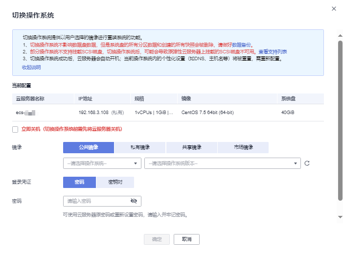

# 切换操作系统

## 操作场景

切换操作系统是为您的弹性云服务器重新切换一个系统盘。切换完成后弹性云服务器的系统盘ID会发生改变，并删除原有系统盘。

如果弹性云服务器当前使用的操作系统不能满足业务需求（如软件要求的操作系统版本较高），您可以选择切换弹性云服务器的操作系统。

云服务平台支持不同镜像类型（包括公共镜像、私有镜像、共享镜像以及市场镜像）与不同操作系统之间的互相切换。您可以将现有的操作系统切换为不同镜像类型的操作系统。

## 约束与限制

-   切换操作系统操作预计需等待10\~20分钟。切换操作系统过程中，弹性云服务器会显示任务状态为“切换操作系统中”。
-   切换操作系统完成后的几分钟，系统正在注入密码或密钥信息，在此期间请勿对云服务器执行其他操作，避免密码或密钥信息注入失败导致云服务器无法登录。
-   待切换操作系统的弹性云服务器需挂载有系统盘。
-   “包年/包月”方式购买的弹性云服务器切换操作系统时，由于所选镜像不同，当前云服务器的系统盘容量可能不足，不支持切换后的镜像使用。此时，需先卸载系统盘并进行扩容，然后再重新切换操作系统。
-   “包年/包月”方式购买的弹性云服务器切换操作系统时，支持如下场景：

    -   支持Linux操作系统之间互相切换。
    -   支持Linux操作系统与部分云市场Windows操作系统互相切换。
    -   支持部分云市场Windows操作系统不同版本之间互相切换。

    > **说明：** 
    >-   “包年/包月”方式购买的弹性云服务器，除了部分云市场Windows操作系统之外，仅支持由免费的操作系统切换至免费的操作系统。
    >-   使用源镜像为市场镜像（除了部分云市场Windows镜像）的私有镜像创建，且购买方式为“包年/包月”的云服务器不支持切换操作系统 。
    >-   仅中国大陆区域的“包年/包月”方式购买的弹性云服务器支持“Linux操作系统与部分云市场Windows操作系统互相切换”和“部分云市场Windows操作系统不同版本之间互相切换”这两个场景。
    >    支持的区域包括：华北-北京一、华北-北京四、华北-乌兰察布一、华东-上海一、华东-上海二、华南-广州、华南-广州-友好用户环境、华南-深圳、西南-贵阳一。

-   云硬盘的配额需大于0。
-   不支持更换系统盘的磁盘类型。
-   H2型弹性云服务器不支持操作系统的切换功能。
-   不支持使用ISO文件创建的ISO镜像切换操作系统，必须完成操作系统和驱动安装将ISO镜像做成系统盘镜像后才能使用。
-   不支持BIOS启动方式与UEFI启动方式的操作系统互相切换。
-   不支持x86架构的弹性云服务器切换为鲲鹏架构类型的操作系统，也不支持鲲鹏架构的弹性云服务器切换到x86架构类型的操作系统。

## 切换须知

切换操作系统后，弹性云服务器的原操作系统和系统盘均不再保留，您的业务运行环境也需要在新的操作系统中重新部署，可能造成较长时间的业务中断，因此，在进行操作前，请仔细阅读切换须知并谨慎操作。

**表 1**  切换须知

<table><thead align="left"><tr id="row98325613163"><th class="cellrowborder" valign="top" width="19.7%" id="mcps1.2.3.1.1">
资源及环境

</th>
<th class="cellrowborder" valign="top" width="80.30000000000001%" id="mcps1.2.3.1.2">
切换操作系统后影响

</th>
</tr>
</thead>
<tbody><tr id="row1187735419269"><td class="cellrowborder" valign="top" width="19.7%" headers="mcps1.2.3.1.1 ">
操作系统

</td>
<td class="cellrowborder" valign="top" width="80.30000000000001%" headers="mcps1.2.3.1.2 ">
不保留原操作系统。

当进行不同操作系统间的切换时：<ul id="ul35298192274"><li>Windows系统切换为Linux系统：需安装读写Windows系统的NTFS分区工具，例如NTFS-3G等。</li><li>Linux系统切换为Windows系统：需安装可以识别ext3、ext4等分区的识别软件，例如Ext2Read、Ext2Fsd等。
 说明： 

当Linux系统中存在LVM分区时，切换为Windows系统后可能会导致LVM逻辑分区无法识别。因此，不建议您将Linux系统更换为Windows系统。

</li></ul>

</td>
</tr>
<tr id="row13163141282910"><td class="cellrowborder" valign="top" width="19.7%" headers="mcps1.2.3.1.1 ">
实例规格

</td>
<td class="cellrowborder" valign="top" width="80.30000000000001%" headers="mcps1.2.3.1.2 ">
不变。

</td>
</tr>
<tr id="row2834560161"><td class="cellrowborder" valign="top" width="19.7%" headers="mcps1.2.3.1.1 ">
系统盘

</td>
<td class="cellrowborder" valign="top" width="80.30000000000001%" headers="mcps1.2.3.1.2 "><ul id="ul2244544133818"><li>由于所选镜像不同，系统盘的容量可能会增大。</li><li>系统盘磁盘类型不变，系统盘ID变化。</li><li>删除原系统盘，并清除系统盘数据，包括系统盘上的所有分区数据和创建的所有快照。
请提前做好数据备份。详细内容，请参考<a href="https://support.huaweicloud.com/cbr/index.html" target="_blank" rel="noopener noreferrer">备份弹性云服务器</a>。

</li></ul>
</td>
</tr>
<tr id="row2854564166"><td class="cellrowborder" valign="top" width="19.7%" headers="mcps1.2.3.1.1 ">
数据盘

</td>
<td class="cellrowborder" valign="top" width="80.30000000000001%" headers="mcps1.2.3.1.2 ">
不影响数据盘数据。

</td>
</tr>
<tr id="row105990914287"><td class="cellrowborder" valign="top" width="19.7%" headers="mcps1.2.3.1.1 ">
IP地址和MAC地址

</td>
<td class="cellrowborder" valign="top" width="80.30000000000001%" headers="mcps1.2.3.1.2 ">
不变。

</td>
</tr>
<tr id="row459914982814"><td class="cellrowborder" valign="top" width="19.7%" headers="mcps1.2.3.1.1 ">
个性化设置（如DNS、主机名等）

</td>
<td class="cellrowborder" valign="top" width="80.30000000000001%" headers="mcps1.2.3.1.2 ">
个性化设置会被重置，需重新配置。

<ul id="ul18350213347"><li>重新配置云服务器DNS信息请参考：<a href="https://support.huaweicloud.com/ecs_faq/zh-cn_topic_0074825901.html" target="_blank" rel="noopener noreferrer">怎样配置弹性云服务器的DNS和NTP信息？</a></li><li>重新配置主机名请参考：<a href="https://support.huaweicloud.com/ecs_faq/zh-cn_topic_0050735736.html" target="_blank" rel="noopener noreferrer">怎样使修改的静态主机名永久生效？</a></li></ul>
</td>
</tr>
<tr id="row14599109162813"><td class="cellrowborder" valign="top" width="19.7%" headers="mcps1.2.3.1.1 ">
运行状态

</td>
<td class="cellrowborder" valign="top" width="80.30000000000001%" headers="mcps1.2.3.1.2 ">
自动开机。

</td>
</tr>
<tr id="row111227133120"><td class="cellrowborder" valign="top" width="19.7%" headers="mcps1.2.3.1.1 ">
本地保存的RDP文件

</td>
<td class="cellrowborder" valign="top" width="80.30000000000001%" headers="mcps1.2.3.1.2 ">
对于Windows操作系统的云服务器，如果切换操作系统时设置了新密码，则本地保存的RDP文件会失效，需重新下载RDP文件登录云服务器。

</td>
</tr>
<tr id="row16261154218"><td class="cellrowborder" valign="top" width="19.7%" headers="mcps1.2.3.1.1 ">
业务运行环境

</td>
<td class="cellrowborder" valign="top" width="80.30000000000001%" headers="mcps1.2.3.1.2 ">
需要在新的系统中重新部署。

</td>
</tr>
</tbody>
</table>

## 计费规则

-   切换操作系统功能不收费。按需计费的云服务器切换成功后，系统将按照新的配置费用（系统盘、规格、市场镜像）进行计费。
-   “按需付费”方式购买的弹性云服务器切换操作系统后，由于所选镜像不同，系统盘的容量可能会增大，由此将带来费用的变更，具体收费请参见[产品价格详情](https://support.huaweicloud.com/pro_price/index.html)。

## 前提条件

-   完成云服务器的数据备份。

    详细内容，请参见[备份弹性云服务器](https://support.huaweicloud.com/cbr/index.html)。

-   若在切换操作系统过程中，要将云服务器的登录鉴权方式由密码改为密钥，请提前创建密钥文件。

    详细内容，请参见[（推荐）通过管理控制台创建密钥对](（推荐）通过管理控制台创建密钥对.md)。

-   如果您使用私有镜像切换操作系统请参考[《镜像服务用户指南》](https://support.huaweicloud.com/usermanual-ims/zh-cn_topic_0013901628.html)提前完成私有镜像的制作。
    -   如果需要指定弹性云服务器的镜像，请提前使用指定弹性云服务器创建私有镜像。
    -   如果需要使用本地的镜像文件，请提前将镜像文件导入并注册为云平台的私有镜像。
    -   如果需要使用其他区域的私有镜像，请提前复制镜像。
    -   如果需要使用其他账号的私有镜像，请提前完成镜像共享。

## 操作步骤

1.  登录管理控制台。
2.  单击管理控制台左上角的，选择区域和项目。
3.  单击“”，选择“计算 \> 弹性云服务器”。
4.  在待切换操作系统的弹性云服务器的“操作”列下，单击“更多 \> 镜像/磁盘/备份 \> 切换操作系统”。

    切换操作系统前请先将云服务器关机，或根据页面提示勾选“立即关机（切换操作系统前需先将云服务器关机）”。

5.  根据需求选择需要切换的弹性云服务器镜像。

    > **说明：** 
    >对于“包年/包月”方式购买的弹性云服务器，如果系统盘容量小于您选择的待切换镜像的大小，此时，您需要先卸载系统盘，并进行扩容，然后再挂载至原弹性云服务器执行切换操作。
    >扩容系统盘的操作指导，请参见[“扩容云硬盘”](https://support.huaweicloud.com/usermanual-evs/evs_01_0006.html)章节。

    **图 1**  切换操作系统  
    

6.  设置登录方式。

    如果待切换操作系统的弹性云服务器是使用密钥登录方式创建的，此时可以更换使用新密钥。

    使用私有镜像切换操作系统时，可以选择使用私有镜像密码。

7.  单击“确定”。
8.  在“确认切换云服务器操作系统”页面，确认切换的操作系统规格无误后，阅读并勾选相关协议或声明，单击“确定”。

    提交切换操作系统的申请后，弹性云服务器的状态变为“切换中”，当该状态消失后，表示切换结束。

    > **说明：** 
    >切换操作系统过程中，会创建一台临时弹性云服务器，切换操作系统结束后会自动删除。

## 后续处理

-   如果切换操作系统前后都是Linux系统，且数据盘设置了开机自动挂载分区。切换操作系统后，数据盘分区挂载信息会丢失，请更新/etc/fstab配置。
    1.  在/etc/fstab写入切换后的分区信息。

        建议您先备份/etc/fstab文件。

        详细操作请参考[初始化Linux数据盘（fdisk）](https://support.huaweicloud.com/qs-evs/evs_01_0033.html)，设置开机自动挂载磁盘分区。

    2.  挂载分区。挂载分区后即可开始使用数据盘。

        **mount  _磁盘分区_ **_**挂载目录**_

    3.  执行以下命令，查看挂载结果。

        **df -TH**

-   如果操作系统切换失败，云服务平台支持重试功能，用户可重新执行[3](#zh-cn_topic_0031523135_zh-cn_topic_0024911405_li45082966143628)-[8](#zh-cn_topic_0031523135_zh-cn_topic_0024911405_li45992498111556)，切换弹性云服务器的操作系统。
-   重试后，如果仍未成功，可直接联系客服，客服会在后台进行人工恢复。

