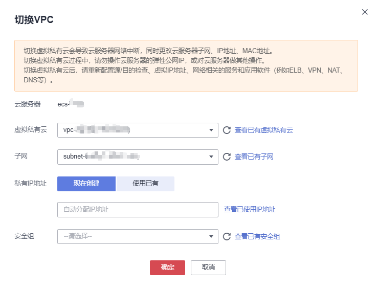

# 切换虚拟私有云

## 操作场景

本节操作介绍为弹性云服务器切换虚拟私有云的操作步骤。

为云耀云服务器切换虚拟私有云的操作指导，请参见[切换虚拟私有云](https://support.huaweicloud.com/usermanual-hecs/hecs_03_0060.html)。

## 约束限制

-   仅支持处于“运行中”或“关机”状态的弹性云服务器执行此操作。
-   仅支持单网卡切换虚拟私有云。
-   切换虚拟私有云前如果重装/切换过云服务器的操作系统，请先登录云服务器，验证重装/切换时设置的密码或密钥是否注入成功。
    -   如果成功登录云服务器，说明密码或密钥注入完成，可继续执行其他操作。
    -   否则说明系统正在注入密码或密钥信息，在此期间请勿对云服务器执行其他操作。

-   切换虚拟私有云过程中，请勿执行绑定、解绑或更换弹性公网IP等操作，若执行会提示权限不足，无需处理。
-   如果网卡上有IPv6地址，无法切换虚拟私有云。

## 切换须知

-   切换虚拟私有云支持在开机状态下操作，但是过程中会导致云服务器网络中断。

    > **说明：** 
    >若弹性云服务器处于开机状态，可能由于网卡有流量访问而导致切换虚拟私有云失败，建议您稍后重试或关机后再进行切换。

-   切换虚拟私有云后，云服务器子网、私有IP地址、MAC地址、操作系统内网卡名称都会发生改变。
-   切换虚拟私有云后，请重新配置源/目的检查和虚拟IP地址。
-   虚拟私有云切换完成后，与网络配置相关的应用软件需要重新配置。与网络相关的服务也需要重新配置，例如ELB、VPN、NAT、DNS等。

## 前提条件

已准备好待切换的目标VPC、子网、私有IP地址和安全组。

## 操作步骤

1.  登录管理控制台。
2.  单击“”，选择“计算 \> 弹性云服务器”。
3.  在弹性云服务器列表中，单击“操作”列下的“更多 \> 网络设置 \> 切换VPC”。

    系统弹窗显示“切换VPC”页面。

    **图 1**  切换虚拟私有云  
    

4.  根据界面提示，在下拉列表中选择可用的虚拟私有云、子网，设置私有IP地址和安全组。

    您可以同时勾选多个安全组，此时，弹性云服务器的访问规则遵循几个安全组规则的并集。

    > **说明：** 
    >使用多个安全组可能会影响弹性云服务器的网络性能，建议您选择安全组的数量不多于5个。

5.  单击“确定”。

