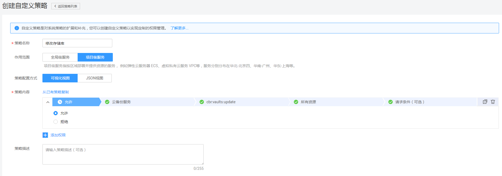
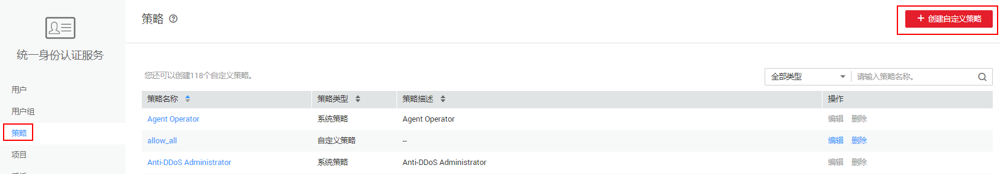
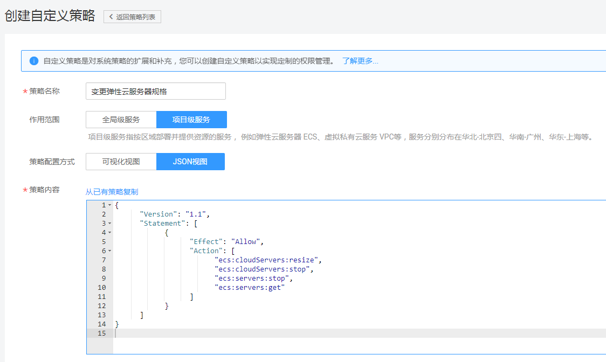

# 创建ECS自定义策略<a name="ZH-CN_TOPIC_0170265914"></a>

如果系统预置的ECS权限，不满足您的授权要求，可以创建自定义策略。自定义策略中可以添加的授权项（Action）请参考[《ECS API参考》](https://support.huaweicloud.com/api-ecs/zh-cn_topic_0020805967.html)中“ 策略及授权项说明”章节_。_

目前华为云支持以下两种方式创建自定义策略：

-   可视化视图创建自定义策略：无需了解策略语法，按可视化视图导航栏选择云服务、操作、资源、条件等策略内容，可自动生成策略。
-   JSON视图创建自定义策略：可以在选择策略模板后，根据具体需求编辑策略内容；也可以直接在编辑框内编写JSON格式的策略内容。

如下以定制一个用户仅能变更云服务器规格的策略为例。

## 前提条件<a name="section688116253204"></a>

-   请先在IAM控制台中开通细粒度策略，开通方法请参见：[申请细粒度访问控制公测](https://support.huaweicloud.com/usermanual-iam/iam_01_019.html)。
-   自定义策略需要编写策略（JSON格式），请您先熟悉策略结构，具体请参见[策略语法：细粒度策略](策略语法-细粒度策略.md)。
-   请确定自定义策略需要允许哪些操作，拒绝哪些操作，并获取操作对应的授权项。

## 可视化视图配置自定义策略<a name="section74081856106"></a>

1.  在IAM控制台，单击左侧导航栏的“策略”，在右上角选择“创建自定义策略”。

    **图 1**  创建自定义策略<a name="fig1447123814172"></a>  
    

2.  在“创建自定义策略”中，配置如下信息：

    **图 2**  配置策略信息<a name="fig1645562819536"></a>  
    

    -   “策略名称”：填写“变更云服务器规格”。
    -   “作用范围”：根据服务的属性填写，ECS为项目级服务，选择“项目级服务”。
    -   “策略配置方式”：选择可视化视图。
    -   “策略内容”：
        1.  选择“允许”。
        2.  在“云服务”中选择“弹性云服务器”。
        3.  在“操作”中勾选“ReadWrite”中的"ecs:cloudServers:resize"、"ecs:cloudServers:stop"、"ecs:servers:stop"。
        4.  勾选“ReadOnly”中的"ecs:servers:get"。

    单击“确定”后，自定义策略创建成功。


## JSON视图配置自定义策略<a name="section189441025132015"></a>

如下以创建名为“变更云服务器规格”的策略为例，创建一个仅支持变更弹性云服务器规格的自定义策略。

1.  在IAM控制台，单击左侧导航栏的“策略”，在右上角选择“创建自定义策略”。

    **图 3**  JSON视图下创建自定义策略<a name="fig11293135610531"></a>  
    

2.  在“创建自定义策略”中，填写如下参数：

    **图 4**  JSON视图下配置策略信息<a name="fig833113095416"></a>  
    

    -   “策略名称”：填写“变更云服务器规格”。
    -   “作用范围”：根据服务的属性填写，ECS为项目级服务，选择“项目级服务”。
    -   “策略配置方式”：JSON视图。
    -   _“_策略信息”：将如下内容拷贝至策略信息中，并单击“检验语法”。如下策略表示允许变更ECS规格、允许执行云服务器关机操作（变更云规格需要首先关机）。

        ```
        {
              "Version": "1.1",
              "Statement": [
                    {
                          "Effect": "Allow",
                          "Action": [                       
                                "ecs:cloudServers:resize",
                                "ecs:cloudServers:stop",
                                "ecs:servers:stop",
                                "ecs:servers:get"
                          ]
                    }
              ]
        }
        ```

3.  单击“确定”，自定义策略创建成功。

## 验证自定义策略权限<a name="section311912520169"></a>

1.  将新创建的自定义策略和ECS Viewer策略授予用户组，使得用户组中的用户具备变更云服务器规格的权限。
2.  用户登录并验证自定义策略定义的权限：变更云服务器规格。

    权限授予成功后，用户可以通过控制台以及REST API等多种方式验证。此处以登录控制台为例，介绍用户如何验证变更云服务器规格的权限。

    1.  使用新创建的用户登录华为云，登录方法选择为“IAM用户登录”。
        -   账号名为该IAM用户所属华为云账号的名称。
        -   用户名和密码为账号在IAM创建用户时输入的用户名和密码。

    2.  在弹性云服务页面，进行变更云服务器规格操作，操作成功，权限配置正确并已生效。
    3.  尝试进行其他操作，例如：创建弹性云服务器

        系统显示“权限不足”，权限配置正确并已生效。


## 策略样例<a name="section51981826152017"></a>

-   示例1：授权用户批量关闭云服务、删除云服务

    ```
    { 
        "Version": "1.1", 
        "Statement": [ 
            { 
                "Effect": "Allow", 
                "Action": [ 
                    " 
                         ecs:servers:stop 
                         ecs:servers:get 
                     " 
                ] 
            } 
        ] 
    }
    ```

-   示例2：拒绝用户删除云服务器

    拒绝策略需要同时配合其他策略使用，否则没有实际作用。用户被授予的策略中，一个授权项的作用如果同时存在Allow和Deny，则遵循Deny优先。

    如果您给用户授予ECS Admin的系统策略，但不希望用户拥有ECS admin中定义的删除云服务器权限，您可以创建一条拒绝删除云服务的自定义策略，然后同时将ECS Admin和拒绝策略授予用户，根据Deny优先原则，则用户可以对ECS执行除了删除云服务器外的所有操作。拒绝策略示例如下：

    ```
    { 
          "Version": "1.1", 
          "Statement": [ 
                { 
    		  "Effect": "Deny", 
                      "Action": [ 
                            "ecs:cloudServers:delete" 
                      ] 
                } 
          ] 
    }
    ```


