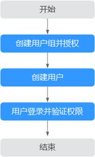

# 创建用户并授权使用ECS

如果您需要对您所拥有的ECS进行精细的权限管理，您可以使用[统一身份认证服务](https://support.huaweicloud.com/usermanual-iam/iam_01_0001.html)（Identity and Access Management，简称IAM），通过IAM，您可以：

-   根据企业的业务组织，在您的华为云账号中，给企业中不同职能部门的员工创建IAM用户，让员工拥有唯一安全凭证，并使用ECS资源。
-   根据企业用户的职能，设置不同的访问权限，以达到用户之间的权限隔离。
-   将ECS资源委托给更专业、高效的其他华为云账号或者云服务，这些账号或者云服务可以根据权限进行代运维。

如果华为云账号已经能满足您的要求，不需要创建独立的IAM用户，您可以跳过本章节，不影响您使用ECS服务的其它功能。

本章节为您介绍对用户授权的方法，操作流程如[示例流程](#section197617372174)所示。

## 前提条件

给用户组授权之前，请您了解用户组可以添加的ECS系统策略，并结合实际需求进行选择，ECS支持的系统策略及策略间的对比，请参见：[ECS系统策略](https://support.huaweicloud.com/productdesc-ecs/ecs_01_0059.html)。若您需要对除ECS之外的其它服务授权，IAM支持服务的所有策略请参见[权限策略](https://support.huaweicloud.com/permissions/policy_list.html?product=ecs)。

## 示例流程

**图 1**  给用户授权ECS权限流程  

1.  创建用户组并授权

    在IAM控制台创建用户组，并授予弹性云服务只读权限“ECS ReadOnlyAccess”。

2.  创建用户

    在IAM控制台创建用户，并将其加入[1.创建用户组并授权](#li8447183891715)中创建的用户组。

3.  用户登录并验证权限

    新创建的用户登录控制台，验证弹性云服务的只读权限。

    -   在“服务列表”中选择弹性云服务器，进入ECS主界面，单击右上角“购买弹性云服务器”，尝试购买弹性云服务器，如果无法购买弹性云服务器（假设当前权限仅包含ECS ReadOnlyAccess），表示“ECS ReadOnlyAccess”已生效。
    -   在“服务列表”中选择除弹性云服务器外（假设当前策略仅包含ECS ReadOnlyAccess）的任一服务，若提示权限不足，表示“ECS ReadOnlyAccess”已生效。

