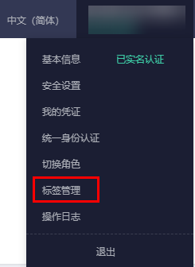

# 删除标签

如果某个标签已经不再适用于您的资源管理，您可以删除资源标签。有三种途径删除资源标签：

-   [在弹性云服务器详情页删除](#section8763326153815)
-   [在标签管理页面单个删除](#section167319315388)
-   [在标签管理页面批量删除](#section13142241209)

## 在弹性云服务器详情页删除

1.  登录管理控制台。
2.  单击管理控制台左上角的，选择区域和项目。
3.  单击“”，选择“计算 \> 弹性云服务器”，进入弹性云服务器页面。
4.  在弹性云服务器列表中，单击待删除标签的弹性云服务器名称。

    系统跳转至该弹性云服务器详情页面。

5.  选择“标签”页签，单击标签所在行“操作”列下的“删除”，如果确认删除，在弹出的“删除标签”窗口，单击“确定”。

## 在标签管理页面单个删除

1.  登录管理控制台。
2.  在右上角的用户名下选择“标签管理”，进入标签管理服务页面。

    **图 1**  标签管理  
    

3.  在“资源标签”页面，设置弹性云服务器资源搜索条件，单击“搜索”。
4.  页面下方展示的搜索结果包含“编辑”与“只读”两种状态，单击“编辑”，切换资源标签列表为可编辑状态。

    若需要删除的标签的“键”没有展示在列表中，单击，在下拉列表中勾选需要删除的标签的“键”。勾选需要展示的标签键建议不超过10个。

5.  单击待删除标签的弹性云服务器资源所在行的，资源标签删除完成。
6.  （可选）单击搜索结果区域右侧的按钮。

    资源标签列表刷新为最新状态，并更新列表刷新时间。

## 在标签管理页面批量删除

> **须知：** 
>在批量删除标签时，请谨慎操作。执行删除操作后，其所标识的所有弹性云服务器资源对应的该标签均会被删除，且不可恢复。

1.  登录管理控制台。
2.  在右上角的用户名下选择“标签管理”，进入标签管理服务页面。
3.  在“资源标签”页面，设置弹性云服务器资源搜索条件，单击“搜索”。
4.  勾选待删除标签的弹性云服务器资源。
5.  单击列表上方的“管理标签”，进入管理标签页面。
6.  单击待删除标签所在行的“删除”。单击“确认”，资源标签删除完成。
7.  （可选）单击搜索结果区域右侧的按钮。

    资源标签列表刷新为最新状态，并更新列表刷新时间。

