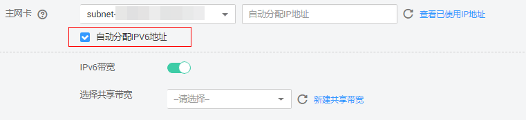
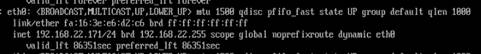
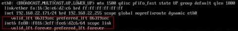
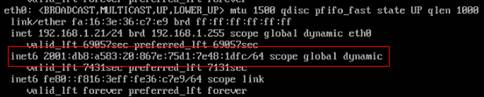
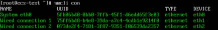
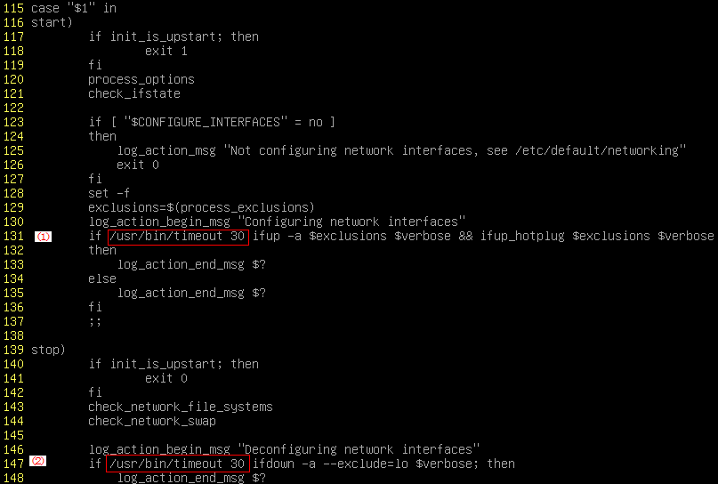

# 动态获取IPv6地址<a name="ZH-CN_TOPIC_0140963099"></a>

## 操作场景<a name="zh-cn_topic_0129883696_section1279812018442"></a>

如果当前云服务器使用 IPv4，则启用 IPv6 后， 云服务器可在双堆栈模式下运行，即云服务器可以拥有两个不同版本的IP地址：IPv4地址和IPv6地址。此时云服务器通过 IPv4 和 IPv6 进行通信，且IPv4 和 IPv6 通信彼此独立。本节介绍如何在华为云公共镜像创建的云服务器内部配置动态获取IPv6地址的方法。

## 约束与限制<a name="zh-cn_topic_0129883696_section196731247131618"></a>

-   请确保云服务器所在的VPC和子网已开启IPv6配置。

    VPC和子网开启IPv6功能请参考[IPv4/IPv6双栈网络](https://support.huaweicloud.com/usermanual-vpc/vpc_0002.html)。

-   请确保创建云服务器时已勾选“自动分配IPV6地址”。

    **图 1**  启用“自动分配IPV6地址”<a name="zh-cn_topic_0129883696_fig11529132722116"></a>  
    

    当前VPC的IPv6双栈服务处于公测阶段，只有在“华北-北京4”Region，“AZ2可用区”，选择“sn3”类型的云服务器才支持IPv6双栈。

-   云服务器启动之后动态插拔的网卡不支持IPv6地址自动获取功能。

    > **注意：**   
    >IPv6自动获取功能\(IPv6双栈\)和IPv6转换功能不同，IPv6转换功能请参考链接[IPv6弹性公网IP](https://support.huaweicloud.com/usermanual-vpc/eip_0001.html)， IPv6转换功能不需要在云服务器内部配置IPv6自动获取。  

-   仅弹性云服务器支持IPv6双栈，裸金属服务器不支持。
-   云服务器开启IPv6，如需访问外网，需要开启“IPv6带宽”且支持选择共享带宽，此时云服务器可以通过IPv6地址与互联网上的IPv6网络进行访问。
-   同一个网卡上，只能绑定一个IPv6地址。

## Windows操作系统<a name="zh-cn_topic_0129883696_section73943214713"></a>

1.  <a name="zh-cn_topic_0129883696_li0281164019453"></a>打开cmd窗口，执行如下命令，查看当前云服务器是否启用IPV6。

    **ipconfig**

    -   如果已启用IPv6，则会显示IPv6的地址。
    -   如果显示只有本地链接IPv6地址，则表示无法动态获取到IPv6地址。请执行操作步骤[2](#zh-cn_topic_0129883696_li163121855114515)。
    -   如果未启用IPv6，则不会显示IPv6的地址。请执行操作步骤[3](#zh-cn_topic_0129883696_li17876141612467)。

        > **说明：**   
        >华为云Windows公共镜像默认已经配置了IPv6自动获取功能，无需特殊配置。  


2.  <a name="zh-cn_topic_0129883696_li163121855114515"></a>配置动态获取IPv6。（以Windows Server 2008操作版本为例。）
    1.  单击“开始 \> 控制面板”。
    2.  单击“网络和共享中心”。
    3.  左键单击“更改适配器设置”。
    4.  右键单击“本地连接”并选择“属性”。
    5.  选中 Internet 协议版本 6 \(TCP/IPv6\) 复选框，然后选择确定。
    6.  执行步骤[1](#zh-cn_topic_0129883696_li0281164019453)检查是否已启动动态获取IPv6。

3.  <a name="zh-cn_topic_0129883696_li17876141612467"></a>启用和配置 IPv6。
    1.  选择“开始 \> 控制面板 \> 网络连接 \> 本地连接”。
    2.  选择“属性”，确认勾选以下选项后单击“安装”。

        **图 2**  启用和配置 IPv6<a name="zh-cn_topic_0129883696_fig3215821216479"></a>  
        

    3.  选择“协议”，然后选择“添加”。

        **图 3**  添加协议<a name="zh-cn_topic_0129883696_fig142302587297"></a>  
        

    4.  在网络协议列表中选择“ Microsoft TCP/IP 版本 6”，然后选择“确定”。

        **图 4**  网络协议列表<a name="zh-cn_topic_0129883696_fig9233896302"></a>  
        

    5.  根据操作系统不同请分别执行以下命令。（可选配置）
        -   Windows server 2008操作系统云服务器请在powershell或者cmd中执行如下命令：

            **netsh interface ipv6 set global randomizeidentifiers=disable**

            设置云服务器先禁用本地连接，再重启本地连接。

            禁用本地连接：单击“开始 \> 控制面板 \> 网络和共享中心 \> 更改适配器配置”，选择本地连接，单击右键选择“禁用”。

            重启本地连接：单击“开始 \> 控制面板 \> 网络和共享中心 \> 更改适配器配置”，选择本地连接，单击右键选择“启用”。

        -   Windows server2012/2016操作系统云服务器请在powershell中执行如下命令：

            **Set-NetIPv6Protocol –RandomizeIdentifiers  disabled**


    6.  执行步骤[1](#zh-cn_topic_0129883696_li0281164019453)检查是否已启动动态获取IPV6。


## Linux操作系统<a name="zh-cn_topic_0129883696_section7426172116710"></a>

> **注意：**   
>CentOS6._X_和Debian操作系统的云服务器内部配置IPv6自动获取功能之后，将该云服务器制作为私有镜像，使用该镜像在非IPv6网络环境中创建云服务器时，由于等待获取IPv6地址超时，导致云服务器启动较慢，您可以参考[设置云服务器获取IPv6地址超时时间](#zh-cn_topic_0129883696_section814912855814)设置获取IPv6地址超时时间为30s，然后再重新制作私有镜像。  

1.  执行如下命令，查看当前云服务器是否启用IPv6。

    **ip addr**

    -   如果没有开启IPv6协议栈，则只能看到IPv4地址，如下图所示，请参考[2](#zh-cn_topic_0129883696_li615511220439)先配置开启IPv6协议栈。

        **图 5**  未开启开启IPv6协议栈<a name="zh-cn_topic_0129883696_fig16330172413301"></a>  
        

    -   如果已开启IPv6协议栈，则可以看到LLA地址（fe80开头）

        **图 6**  已开启IPv6协议栈<a name="zh-cn_topic_0129883696_fig1176932510308"></a>  
        

    -   如果已开启IPv6协议栈并且已获取到IPv6地址，则会看到如下地址

        **图 7**  已开启IPv6协议栈并且已获取到IPv6地址<a name="zh-cn_topic_0129883696_fig785442117429"></a>  
        


2.  <a name="zh-cn_topic_0129883696_li615511220439"></a>开启Linux虚拟机IPv6协议栈。

    确认内核是否支持IPv6协议栈，执行如下命令

    **sysctl –a | grep ipv6**

    如果没有任何输出，说明内核不支持ipv6协议栈，需要先加载IPv6模块

    **modprobe ipv6**

    修改/etc/sysctl.conf配置文件，增加如下配置：

    **net.ipv6.conf.all.disable\_ipv6=0**

    保存配置并退出，然后执行如下命令，加载配置

    **sysctl –p**

    > **说明：**   
    >华为云Linux公共镜像均已开启IPv6协议栈。  

3.  启用IPv6。操作系统不同，步骤有所差别。
    -   Ubuntu操作系统云服务器配置动态获取IPv6。

        Ubuntu16.04请执行以下操作步骤，Ubuntu14.04操作系统不需要做任何配置操作。

        1.  修改/etc/network/interface.d/50-cloud-init.cfg配置文件，在iface eth0 inet dhcp下增加一行配置：

            ```
            iface eth0 inet6 dhcp
            ```

            在配置文件/etc/cloud/cloud.cfg中禁用Cloud-init接管网络

            ```
            network:
                config:disabled
            ```

        2.  配置网卡IPv6 LLA地址的生成方式为eui64。（可选配置）

            ```
            nmcli con modify “Wired connection 1” ipv6.addr-gen-mode eui64
            ```


    -   Debian操作系统云服务器配置动态获取IPv6。
        1.  编辑 /etc/network/interfaces 文件，使之包含以下内容：

            ```
            auto lo 
            iface lo inet loopback 
            auto eth0
            iface eth0 inet dhcp
            iface eth0 inet6 dhcp 
                 pre-up sleep 3
            ```

        2.  如果有多个网卡，则在/etc/network/interfaces文件中，增加对应网卡的配置，以eth1为例，需要增加：

            ```
            auto eth1
            iface eth1 inet dhcp
            iface eth1 inet6 dhcp 
                 pre-up sleep 3
            ```

        3.  执行如下命令重启网络服务

            **service networking restart**

            > **说明：**   
            >如果将网卡进行down/up操作之后无法获取IPv6地址，也可以通过此命令重启网络服务。  

        4.  执行步骤[1](#zh-cn_topic_0129883696_li0281164019453)检查是否已启动动态IPV6。

    -   RHEL/CentOS/EulerOS/Fedora操作系统云服务器配置动态获取IPv6。
        1.  编辑主网卡配置文件 /etc/sysconfig/network-scripts/ifcfg-eth0。

            补充如下配置项：

            ```
            IPV6INIT=yes
            DHCPV6C=yes
            ```

        2.  编辑 /etc/sysconfig/network，按如下所示添加或修改以下行。

            ```
            NETWORKING_IPV6=yes
            ```

        3.  RHEL/Centos 6系列从网卡需要编辑对应的配置文件，以eth1为例，编辑/etc/sysconfg/network-script/ifcfg-eth1。

            补充如下配置项：

            ```
            IPV6INIT=yes
            DHCPV6C=yes
            ```

            CentOS 6.3系统中默认ip6tables会过滤dhcpv6-client 请求，所以CentOS6.3 需要额外添加一条允许dhcpv6-client 请求的ip6tables规则

            编辑/etc/sysconfig/ip6tables

            补充一条dhcpv6-client 请求规则：

            ```
            -A INPUT –m state –state NEW –m udp –p udp –dport 546 –d fe80::/64 –j ACCEPT
            ```

            **图 8**  dhcpv6-client 请求规则<a name="zh-cn_topic_0129883696_fig858811198222"></a>  
            

        4.  RHEL/CentOS 7系列从网卡需要先通过nmcli con查看网卡信息。（可选配置）
            1.  执行如下命令通过nmcli con查看网卡信息

                **nmcli con**

                **图 9**  查看网卡信息<a name="zh-cn_topic_0129883696_fig1174640133111"></a>  
                

            2.  将eth1的IPv6 LLA地址模式按以下命令修改为EUI64：

                **nmcli con modify “Wired connection 1” ipv6.addr-gen-mode eui64**

            3.  通过ifconfig命令将eth1 进行down/up操作

                **ifdown eth1**

                **ifup eth1**


        5.  重启网络服务。
            1.  RHEL/CentOS 6系列执行以下命令重启网络服务

                **service network restart**

            2.  RHEL/CentOS 7 系列执行以下命令重启网络服务

                **systemctl restart NetworkManager**


        6.  执行步骤[1](#zh-cn_topic_0129883696_li0281164019453)检查是否已启动动态IPV6。

    -   Suse/OpenSuse/CoreOS操作系统云服务器配置动态获取IPv6。

        Suse11sp4不支持IPv6自动获取。

        Suse12sp1，Suse12sp2无需特殊配置。

        OpenSuse13.2、OpenSuse42.2无需特殊配置。

        CoreOS10.10.5无需特殊配置。


## 设置云服务器获取IPv6地址超时时间<a name="zh-cn_topic_0129883696_section814912855814"></a>

CentOS6._X_和Debian操作系统的云服务器内部配置IPv6自动获取功能之后，将该云服务器制作为私有镜像，使用该镜像在非IPv6网络环境中创建云服务器时，由于等待获取IPv6地址超时，导致云服务器启动较慢，您可以参考本节操作设置获取IPv6地址超时时间为30s，然后再重新制作私有镜像。

-   CentOS6.x：
    1.  执行以下命令编辑dhclient.conf文件。

        **vi /etc/dhcp/dhclient.conf**

    2.  按"**i**"进入编辑模式，在文件中增加timeout 属性。

        ```
        timeout  30;
        ```

    3.  输入“**:wq**”保存后退出。

-   Debian7.5：
    1.  执行以下命令编辑networking文件。

        **vi /etc/init.d/networking**


    1.  按"**i**"进入编辑模式，增加延迟命令timeout，修改点如下图所示。

        **图 10**  修改networking文件<a name="zh-cn_topic_0129883696_fig7627125616220"></a>  
        

        **图 11**  编辑networking文件<a name="zh-cn_topic_0129883696_fig1614158182317"></a>  
        


-   Debian 8.2.0/8.8.0
    1.  执行以下命令编辑network-pre.conf文件。

        **vi  **/lib/systemd/system/networking.service.d/network-pre.conf****

    2.  按"**i**"进入编辑模式，在文件中增加timeout 属性。

        ```
        [Service]
        TimeoutStartSec=30
        ```


-   Debian 9.0
    1.  执行以下命令编辑networking.service文件。

        **vi /etc/system/system/network-online.target.wants/networking.service**

    2.  按"**i**"进入编辑模式，将TimeoutStartSec=5min 改为 TimeoutStartSec=30


