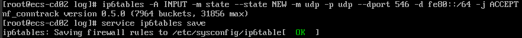

# 动态获取IPv6地址<a name="ZH-CN_TOPIC_0140963099"></a>

## 操作场景<a name="zh-cn_topic_0129883696_section1279812018442"></a>

IPv6的使用，可以有效弥补IPv4网络地址资源有限的问题。如果当前云服务器使用IPv4，那么启用IPv6后，云服务器可在双栈模式下运行，即云服务器可以拥有两个不同版本的IP地址：IPv4地址和IPv6地址，这两个IP地址都可以进行内网/公网访问。

按照[约束与限制](#zh-cn_topic_0129883696_section196731247131618)中的网络环境要求创建的云服务器，有些不能动态获取到IPv6地址，需要进行相关配置才行。如果云服务器使用的是公共镜像，则支持情况如下：

-   Windows公共镜像默认已开启IPv6动态获取功能，无需配置，文中的[Windows 2012操作系统](#zh-cn_topic_0129883696_section0206266172)和[Windows 2008操作系统](#zh-cn_topic_0129883696_section73943214713)部分供您验证、参考。
-   Linux公共镜像开启动态获取IPv6功能时，需要先判断是否支持IPv6协议栈，再判断是否已开启动态获取IPv6。目前，所有Linux公共镜像均已支持IPv6协议栈，并且Ubuntu 16操作系统已默认开启动态获取IPv6。即Ubuntu 16操作系统无需配置，其他Linux公共镜像需要执行开启动态获取IPv6的操作。

## 约束与限制<a name="zh-cn_topic_0129883696_section196731247131618"></a>

-   请确保云服务器所在的子网已开启IPv6功能。

    子网开启IPv6功能请参考“[IPv4/IPv6双栈网络](https://support.huaweicloud.com/usermanual-vpc/vpc_0002.html)”。

-   请确保创建云服务器时已选择“自动分配IPv6地址”。

    **图 1**  选择“自动分配IPv6地址”<a name="zh-cn_topic_0129883696_fig1422543474910"></a>  
    

    只有以下云服务器才支持IPv6双栈：

    -   “华北-北京四”区域的“可用区2”下，选择sn3规格
    -   “华北-北京四”区域的“可用区7”下，选择s6、c6、kc1规格
    -   “华东-上海一”区域的“可用区1”下，选择s6、c6s、c6、m6、c3、m3规格
    -   “华东-上海一”区域的“可用区2”下，选择c6、m6、c3规格
    -   “华东-上海一”区域的“可用区3”下，选择c6s、c6规格
    -   “西南-贵阳一”区域的“可用区1”下，选择s6、c6s、c6、m6规格
    -   “中国-香港”区域的“可用区1”下，选择c6规格
    -   “中国-香港”区域的“可用区2”下，选择c6规格


-   云服务器启动之后动态插拔的网卡不支持IPv6地址动态获取功能。
-   仅弹性云服务器支持IPv6双栈，裸金属服务器不支持。
-   同一个网卡上，只能绑定一个IPv6地址。

## 操作步骤<a name="zh-cn_topic_0129883696_section56481520354"></a>

-   Windows系统：本文以Windows 2012版本、Windows 2008版本为例，介绍Windows操作系统启用IPv6的方法，如[表1](#zh-cn_topic_0129883696_table1091729658)所示。
-   Linux系统：本文提供了自动配置、手动配置两种方式启用IPv6，推荐您使用自动配置方法，如[表1](#zh-cn_topic_0129883696_table1091729658)所示。

    对于CentOS 6.x和Debian操作系统，云服务器内部配置IPv6自动获取功能之后，将该云服务器制作为私有镜像，使用该镜像在非IPv6网络环境中创建云服务器时，由于等待获取IPv6地址超时，导致云服务器启动较慢，此时您可以参考[设置云服务器获取IPv6地址超时时间](#zh-cn_topic_0129883696_section814912855814)操作。


**表 1**  不同操作系统启用IPv6操作指导

<a name="zh-cn_topic_0129883696_table1091729658"></a>
<table><thead align="left"><tr id="zh-cn_topic_0129883696_row14919291855"><th class="cellrowborder" valign="top" width="28.14281428142814%" id="mcps1.2.4.1.1"><p id="zh-cn_topic_0129883696_p391152916511"><a name="zh-cn_topic_0129883696_p391152916511"></a><a name="zh-cn_topic_0129883696_p391152916511"></a>操作系统</p>
</th>
<th class="cellrowborder" valign="top" width="31.503150315031505%" id="mcps1.2.4.1.2"><p id="zh-cn_topic_0129883696_p891162915517"><a name="zh-cn_topic_0129883696_p891162915517"></a><a name="zh-cn_topic_0129883696_p891162915517"></a>方式</p>
</th>
<th class="cellrowborder" valign="top" width="40.35403540354036%" id="mcps1.2.4.1.3"><p id="zh-cn_topic_0129883696_p1491029857"><a name="zh-cn_topic_0129883696_p1491029857"></a><a name="zh-cn_topic_0129883696_p1491029857"></a>操作指导</p>
</th>
</tr>
</thead>
<tbody><tr id="zh-cn_topic_0129883696_row16914291453"><td class="cellrowborder" valign="top" width="28.14281428142814%" headers="mcps1.2.4.1.1 "><p id="zh-cn_topic_0129883696_p291129259"><a name="zh-cn_topic_0129883696_p291129259"></a><a name="zh-cn_topic_0129883696_p291129259"></a>Windows 2012</p>
</td>
<td class="cellrowborder" valign="top" width="31.503150315031505%" headers="mcps1.2.4.1.2 "><p id="zh-cn_topic_0129883696_p29115298517"><a name="zh-cn_topic_0129883696_p29115298517"></a><a name="zh-cn_topic_0129883696_p29115298517"></a>自动配置启用IPv6</p>
</td>
<td class="cellrowborder" valign="top" width="40.35403540354036%" headers="mcps1.2.4.1.3 "><p id="zh-cn_topic_0129883696_p791102917511"><a name="zh-cn_topic_0129883696_p791102917511"></a><a name="zh-cn_topic_0129883696_p791102917511"></a><a href="#zh-cn_topic_0129883696_section0206266172">Windows 2012操作系统</a></p>
</td>
</tr>
<tr id="zh-cn_topic_0129883696_row991182916513"><td class="cellrowborder" valign="top" width="28.14281428142814%" headers="mcps1.2.4.1.1 "><p id="zh-cn_topic_0129883696_p9911291456"><a name="zh-cn_topic_0129883696_p9911291456"></a><a name="zh-cn_topic_0129883696_p9911291456"></a>Windows 2008</p>
</td>
<td class="cellrowborder" valign="top" width="31.503150315031505%" headers="mcps1.2.4.1.2 "><p id="zh-cn_topic_0129883696_p5911229750"><a name="zh-cn_topic_0129883696_p5911229750"></a><a name="zh-cn_topic_0129883696_p5911229750"></a>自动配置启用IPv6</p>
</td>
<td class="cellrowborder" valign="top" width="40.35403540354036%" headers="mcps1.2.4.1.3 "><p id="zh-cn_topic_0129883696_p1291152915519"><a name="zh-cn_topic_0129883696_p1291152915519"></a><a name="zh-cn_topic_0129883696_p1291152915519"></a><a href="#zh-cn_topic_0129883696_section73943214713">Windows 2008操作系统</a></p>
</td>
</tr>
<tr id="zh-cn_topic_0129883696_row209118291759"><td class="cellrowborder" valign="top" width="28.14281428142814%" headers="mcps1.2.4.1.1 "><p id="zh-cn_topic_0129883696_p11911829750"><a name="zh-cn_topic_0129883696_p11911829750"></a><a name="zh-cn_topic_0129883696_p11911829750"></a>Linux</p>
</td>
<td class="cellrowborder" valign="top" width="31.503150315031505%" headers="mcps1.2.4.1.2 "><p id="zh-cn_topic_0129883696_p59182918517"><a name="zh-cn_topic_0129883696_p59182918517"></a><a name="zh-cn_topic_0129883696_p59182918517"></a>自动配置启用IPv6（推荐）</p>
</td>
<td class="cellrowborder" valign="top" width="40.35403540354036%" headers="mcps1.2.4.1.3 "><p id="zh-cn_topic_0129883696_p6916295512"><a name="zh-cn_topic_0129883696_p6916295512"></a><a name="zh-cn_topic_0129883696_p6916295512"></a><a href="#zh-cn_topic_0129883696_section106971627556">Linux操作系统（自动配置启用IPv6）</a></p>
</td>
</tr>
<tr id="zh-cn_topic_0129883696_row540918291584"><td class="cellrowborder" valign="top" width="28.14281428142814%" headers="mcps1.2.4.1.1 "><p id="zh-cn_topic_0129883696_p144091729386"><a name="zh-cn_topic_0129883696_p144091729386"></a><a name="zh-cn_topic_0129883696_p144091729386"></a>Linux</p>
</td>
<td class="cellrowborder" valign="top" width="31.503150315031505%" headers="mcps1.2.4.1.2 "><p id="zh-cn_topic_0129883696_p94091129681"><a name="zh-cn_topic_0129883696_p94091129681"></a><a name="zh-cn_topic_0129883696_p94091129681"></a>手动配置启用IPv6</p>
</td>
<td class="cellrowborder" valign="top" width="40.35403540354036%" headers="mcps1.2.4.1.3 "><p id="zh-cn_topic_0129883696_p174091629388"><a name="zh-cn_topic_0129883696_p174091629388"></a><a name="zh-cn_topic_0129883696_p174091629388"></a><a href="#zh-cn_topic_0129883696_section7426172116710">Linux操作系统（手动配置启用IPv6）</a></p>
</td>
</tr>
</tbody>
</table>

## Windows 2012操作系统<a name="zh-cn_topic_0129883696_section0206266172"></a>

1.  <a name="zh-cn_topic_0129883696_li64771254152011"></a>检查是否启用IPv6。

    打开**cmd**窗口，执行如下命令，查看当前云服务器是否启用IPv6。

    **ipconfig**

    -   <a name="zh-cn_topic_0129883696_li101591516152112"></a>如果已启用IPv6，则会显示IPv6的地址。

        **图 2**  显示IPv6的地址<a name="zh-cn_topic_0129883696_fig9159201613216"></a>  
        

    -   如果显示只有本地链接IPv6地址，则表示无法动态获取到IPv6地址。请执行[2](#zh-cn_topic_0129883696_li2024825592115)。

        **图 3**  本地链接IPv6地址<a name="zh-cn_topic_0129883696_fig1415910169218"></a>  
        

    -   如果未启用IPv6，则不会显示IPv6的地址。请执行[3](#zh-cn_topic_0129883696_li35521349132511)。

        **图 4**  未启用IPv6<a name="zh-cn_topic_0129883696_fig171591916152113"></a>  
        

        > **说明：** 
        >Windows公共镜像默认已经配置了IPv6动态获取功能，即回显为[情况一](#zh-cn_topic_0129883696_li101591516152112)，无需特殊配置。


2.  <a name="zh-cn_topic_0129883696_li2024825592115"></a>配置动态获取IPv6。
    1.  单击“开始 \> 控制面板”。
    2.  单击“网络和共享中心”。
    3.  单击以太网连接。

        **图 5**  以太网连接<a name="zh-cn_topic_0129883696_fig48126812315"></a>  
        

    4.  在以太网状态的弹窗中单击左下角的“属性”。
    5.  勾选“Internet协议版本 6 \(TCP/IPv6\)”，然后单击“确定”。

        **图 6**  配置动态获取IPv6<a name="zh-cn_topic_0129883696_fig875054216245"></a>  
        

    6.  执行[1](#zh-cn_topic_0129883696_li64771254152011)检查是否已开启动态获取IPv6。

3.  <a name="zh-cn_topic_0129883696_li35521349132511"></a>启用和配置IPv6。
    1.  在“Internet 协议版本 6（TCP/IPv6）属性”弹窗中，配置云服务器的IPv6地址和DNS服务器地址。

        -   IPv6地址：创建云服务器时分配的IPv6地址，请从控制台云服务器的列表页面获取。
        -   子网前缀长度：64
        -   DNS服务器：推荐使用240c::6666

        **图 7**  在控制台获取IPv6地址<a name="zh-cn_topic_0129883696_fig5267143722717"></a>  
        

    2.  （可选配置）根据操作系统不同请分别执行以下命令。

        Windows Server 2012操作系统云服务器请在PowerShell或者cmd中执行如下命令：

        **Set-NetIPv6Protocol -RandomizeIdentifiers disabled**

    3.  执行[1](#zh-cn_topic_0129883696_li64771254152011)检查是否已开启动态获取IPv6。


## Windows 2008操作系统<a name="zh-cn_topic_0129883696_section73943214713"></a>

1.  <a name="zh-cn_topic_0129883696_li1183617234192"></a>检查是否启用IPv6。

    打开**cmd**窗口，执行如下命令，查看当前云服务器是否启用IPv6。

    **ipconfig**

    -   <a name="zh-cn_topic_0129883696_li147374450710"></a>如果已启用IPv6，则会显示IPv6的地址。

        **图 8**  显示IPv6的地址<a name="zh-cn_topic_0129883696_fig15843174118353"></a>  
        

    -   如果显示只有本地链接IPv6地址，则表示无法动态获取到IPv6地址。请执行[2](#zh-cn_topic_0129883696_li163121855114515)。

        **图 9**  本地链接IPv6地址<a name="zh-cn_topic_0129883696_fig14741755113514"></a>  
        

    -   如果未启用IPv6，则不会显示IPv6的地址。请执行[3](#zh-cn_topic_0129883696_li17876141612467)。

        **图 10**  未启用IPv6<a name="zh-cn_topic_0129883696_fig1176055812351"></a>  
        

        > **说明：** 
        >Windows公共镜像默认已经配置了IPv6动态获取功能，即回显为[情况一](#zh-cn_topic_0129883696_li147374450710)，无需特殊配置。


2.  <a name="zh-cn_topic_0129883696_li163121855114515"></a>配置动态获取IPv6。
    1.  单击“开始 \> 控制面板”。
    2.  单击“网络和共享中心”。
    3.  左键单击“更改适配器设置”。
    4.  右键单击网络连接并选择“属性”。
    5.  勾选“Internet协议版本 6 \(TCP/IPv6\)”，然后单击“确定”。

        **图 11**  配置动态获取IPv6<a name="zh-cn_topic_0129883696_fig1018018532017"></a>  
        

    6.  执行[1](#zh-cn_topic_0129883696_li1183617234192)检查是否已开启动态获取IPv6。

3.  <a name="zh-cn_topic_0129883696_li17876141612467"></a>启用和配置IPv6。
    1.  选择“开始 \> 控制面板 \> 网络连接 \> 本地连接”。
    2.  选择“属性”，确认勾选以下选项后单击“安装”。

        **图 12**  启用和配置IPv6<a name="zh-cn_topic_0129883696_fig3215821216479"></a>  
        

    3.  选择“协议”，然后单击“添加”。

        **图 13**  添加协议<a name="zh-cn_topic_0129883696_fig142302587297"></a>  
        

    4.  在网络协议列表中选择“Microsoft TCP/IP版本 6”，然后单击“确定”。

        **图 14**  网络协议列表<a name="zh-cn_topic_0129883696_fig9233896302"></a>  
        

    5.  （可选配置）根据操作系统不同请分别执行以下命令。

        Windows Server 2008操作系统云服务器请在PowerShell或者cmd中执行如下命令：

        **netsh interface ipv6 set global randomizeidentifiers=disable**

        设置云服务器先禁用本地连接，再重启本地连接。

        禁用本地连接：单击“开始 \> 控制面板 \> 网络和共享中心 \> 更改适配器配置”，选择本地连接，单击右键选择“禁用”。

        重启本地连接：单击“开始 \> 控制面板 \> 网络和共享中心 \> 更改适配器配置”，选择本地连接，单击右键选择“启用”。

    6.  执行[1](#zh-cn_topic_0129883696_li1183617234192)检查是否已开启动态获取IPv6。


## Linux操作系统（自动配置启用IPv6）<a name="zh-cn_topic_0129883696_section106971627556"></a>

ipv6-setup-xxx工具能为开启IPv6协议栈的Linux操作系统自动配置动态获取IPv6地址。其中，xxx表示工具系列：rhel或debian。

您也可以参考[Linux操作系统（手动配置启用IPv6）](#zh-cn_topic_0129883696_section7426172116710)手动配置启用IPv6。

> **注意：** 
>-   ipv6-setup-xxx工具运行时会自动重启网络服务，导致网络短暂不可用。
>-   CentOS 6.x和Debian操作系统的云服务器内部配置IPv6自动获取功能之后，将该云服务器制作为私有镜像，使用该镜像在非IPv6网络环境中创建云服务器时，由于等待获取IPv6地址超时，导致云服务器启动较慢，您可以参考[设置云服务器获取IPv6地址超时时间](#zh-cn_topic_0129883696_section814912855814)设置获取IPv6地址超时时间为30s，然后再重新制作私有镜像。

1.  执行如下命令，查看当前云服务器是否启用IPv6。

    **ip addr**

    -   如果没有开启IPv6协议栈，则只能看到IPv4地址，如下图所示，请参考[2](#zh-cn_topic_0129883696_li4950165016451)先开启IPv6协议栈。

        **图 15**  云服务器未开启IPv6协议栈<a name="zh-cn_topic_0129883696_zh-cn_topic_0129883696_fig620715214343"></a>  
        

    -   <a name="zh-cn_topic_0129883696_zh-cn_topic_0129883696_li146859301702"></a>如果已开启IPv6协议栈，则可以看到LLA地址（fe80开头）。

        **图 16**  云服务器已开启IPv6协议栈<a name="zh-cn_topic_0129883696_zh-cn_topic_0129883696_fig1176932510308"></a>  
        

    -   <a name="zh-cn_topic_0129883696_zh-cn_topic_0129883696_li86861936114113"></a>如果已开启IPv6协议栈并且已获取到IPv6地址，则会看到如下地址：

        **图 17**  云服务器已开启IPv6协议栈并且已获取到IPv6地址<a name="zh-cn_topic_0129883696_zh-cn_topic_0129883696_fig785442117429"></a>  
        

    > **说明：** 
    >Linux公共镜像均已开启IPv6协议栈（即[情况二](#zh-cn_topic_0129883696_zh-cn_topic_0129883696_li146859301702)）；Ubuntu 16公共镜像不仅已开启IPv6协议栈，而且可以获取到IPv6地址（即[情况三](#zh-cn_topic_0129883696_zh-cn_topic_0129883696_li86861936114113)），无需特殊配置。

2.  <a name="zh-cn_topic_0129883696_li4950165016451"></a>开启Linux云服务器IPv6协议栈。
    1.  执行如下命令，确认内核是否支持IPv6协议栈。

        **sysctl -a | grep ipv6**

        -   如果有输出信息，表示内核支持IPv6协议栈。
        -   如果没有任何输出，说明内核不支持IPv6协议栈，需要执行[2.b](#zh-cn_topic_0129883696_zh-cn_topic_0129883696_li193875248395)加载IPv6模块。

    2.  <a name="zh-cn_topic_0129883696_zh-cn_topic_0129883696_li193875248395"></a>执行以下命令，加载IPv6模块。

        **modprobe ipv6**

    3.  修改“/etc/sysctl.conf”配置文件，增加如下配置：

        **net.ipv6.conf.all.disable\_ipv6=0**

    4.  保存配置并退出，然后执行如下命令，加载配置。

        **sysctl -p**

3.  自动配置启用IPv6。
    1.  下载对应系统版本的工具ipv6-setup-rhel或ipv6-setup-debian，并上传至待操作的云服务器。

        ipv6-setup-xxx工具会添加或者修改网卡设备的配置文件，添加IPv6动态获取的配置信息，然后重启网卡或者网络服务。ipv6-setup-rhel和ipv6-setup-debian的工具下载地址如[表2](#zh-cn_topic_0129883696_table1384413483118)所示。

        **表 2**  工具下载地址

        <a name="zh-cn_topic_0129883696_table1384413483118"></a>
        <table><thead align="left"><tr id="zh-cn_topic_0129883696_row384574861114"><th class="cellrowborder" valign="top" width="22.31223122312231%" id="mcps1.2.4.1.1"><p id="zh-cn_topic_0129883696_p584514841119"><a name="zh-cn_topic_0129883696_p584514841119"></a><a name="zh-cn_topic_0129883696_p584514841119"></a>系列</p>
        </th>
        <th class="cellrowborder" valign="top" width="34.233423342334234%" id="mcps1.2.4.1.2"><p id="zh-cn_topic_0129883696_p118457489116"><a name="zh-cn_topic_0129883696_p118457489116"></a><a name="zh-cn_topic_0129883696_p118457489116"></a>发行版</p>
        </th>
        <th class="cellrowborder" valign="top" width="43.45434543454345%" id="mcps1.2.4.1.3"><p id="zh-cn_topic_0129883696_p1845184817112"><a name="zh-cn_topic_0129883696_p1845184817112"></a><a name="zh-cn_topic_0129883696_p1845184817112"></a>下载地址</p>
        </th>
        </tr>
        </thead>
        <tbody><tr id="zh-cn_topic_0129883696_row1384519480119"><td class="cellrowborder" valign="top" width="22.31223122312231%" headers="mcps1.2.4.1.1 "><p id="zh-cn_topic_0129883696_p98451648111115"><a name="zh-cn_topic_0129883696_p98451648111115"></a><a name="zh-cn_topic_0129883696_p98451648111115"></a>RHEL</p>
        </td>
        <td class="cellrowborder" valign="top" width="34.233423342334234%" headers="mcps1.2.4.1.2 "><a name="zh-cn_topic_0129883696_ul12172135212132"></a><a name="zh-cn_topic_0129883696_ul12172135212132"></a><ul id="zh-cn_topic_0129883696_ul12172135212132"><li>CentOS 6/7</li><li>EulerOS 2.2/2.3</li><li>Fedora 25</li></ul>
        </td>
        <td class="cellrowborder" valign="top" width="43.45434543454345%" headers="mcps1.2.4.1.3 "><p id="zh-cn_topic_0129883696_p1630413457125"><a name="zh-cn_topic_0129883696_p1630413457125"></a><a name="zh-cn_topic_0129883696_p1630413457125"></a><a href="https://ecs-instance-driver.obs.cn-north-1.myhuaweicloud.com/ipv6/ipv6-setup-rhel" target="_blank" rel="noopener noreferrer">https://ecs-instance-driver.obs.cn-north-1.myhuaweicloud.com/ipv6/ipv6-setup-rhel</a></p>
        </td>
        </tr>
        <tr id="zh-cn_topic_0129883696_row38451248121114"><td class="cellrowborder" valign="top" width="22.31223122312231%" headers="mcps1.2.4.1.1 "><p id="zh-cn_topic_0129883696_p78450485119"><a name="zh-cn_topic_0129883696_p78450485119"></a><a name="zh-cn_topic_0129883696_p78450485119"></a>Debian</p>
        </td>
        <td class="cellrowborder" valign="top" width="34.233423342334234%" headers="mcps1.2.4.1.2 "><a name="zh-cn_topic_0129883696_ul16899164014137"></a><a name="zh-cn_topic_0129883696_ul16899164014137"></a><ul id="zh-cn_topic_0129883696_ul16899164014137"><li>Ubuntu 16/18</li><li>Debian 8/9</li></ul>
        </td>
        <td class="cellrowborder" valign="top" width="43.45434543454345%" headers="mcps1.2.4.1.3 "><p id="zh-cn_topic_0129883696_p17845104815119"><a name="zh-cn_topic_0129883696_p17845104815119"></a><a name="zh-cn_topic_0129883696_p17845104815119"></a><a href="https://ecs-instance-driver.obs.cn-north-1.myhuaweicloud.com/ipv6/ipv6-setup-debian" target="_blank" rel="noopener noreferrer">https://ecs-instance-driver.obs.cn-north-1.myhuaweicloud.com/ipv6/ipv6-setup-debian</a></p>
        </td>
        </tr>
        </tbody>
        </table>

    2.  执行以下命令，添加执行权限。

        **chmod** **+x** **ipv6-setup-xxx**

    3.  执行以下命令，指定一个网卡设备，配置动态获取IPv6地址。

        **./ipv6-setup-xxx --dev \[dev\]**

        示例：

        **./ipv6-setup-xxx --dev eth0**

        > **说明：** 
        >-   如需对所有网卡配置动态获取IPv6地址，命令为**./ipv6-setup-**_xxx_，即不带参数。
        >-   如需查询工具的用法，请执行命令**./ipv6-setup-**_xxx_ **--help**。


## Linux操作系统（手动配置启用IPv6）<a name="zh-cn_topic_0129883696_section7426172116710"></a>

> **注意：** 
>CentOS 6.x和Debian操作系统的云服务器内部配置IPv6自动获取功能之后，将该云服务器制作为私有镜像，使用该镜像在非IPv6网络环境中创建云服务器时，由于等待获取IPv6地址超时，导致云服务器启动较慢，您可以参考[设置云服务器获取IPv6地址超时时间](#zh-cn_topic_0129883696_section814912855814)设置获取IPv6地址超时时间为30s，然后再重新制作私有镜像。

1.  <a name="zh-cn_topic_0129883696_li967053013012"></a>执行如下命令，查看当前云服务器是否启用IPv6。

    **ip addr**

    -   如果没有开启IPv6协议栈，则只能看到IPv4地址，如下图所示，请参考[2](#zh-cn_topic_0129883696_li615511220439)先开启IPv6协议栈。

        **图 18**  未开启IPv6协议栈<a name="zh-cn_topic_0129883696_fig620715214343"></a>  
        

    -   <a name="zh-cn_topic_0129883696_li146859301702"></a>如果已开启IPv6协议栈，则可以看到LLA地址（fe80开头）。

        **图 19**  已开启IPv6协议栈<a name="zh-cn_topic_0129883696_fig1176932510308"></a>  
        

    -   <a name="zh-cn_topic_0129883696_li86861936114113"></a>如果已开启IPv6协议栈并且已获取到IPv6地址，则会看到如下地址：

        **图 20**  已开启IPv6协议栈并且已获取到IPv6地址<a name="zh-cn_topic_0129883696_fig785442117429"></a>  
        

    > **说明：** 
    >Linux公共镜像均已开启IPv6协议栈（即[情况二](#zh-cn_topic_0129883696_li146859301702)）；Ubuntu 16公共镜像不仅已开启IPv6协议栈，而且可以获取到IPv6地址（即[情况三](#zh-cn_topic_0129883696_li86861936114113)），无需特殊配置。

2.  <a name="zh-cn_topic_0129883696_li615511220439"></a>开启Linux云服务器IPv6协议栈。
    1.  执行如下命令，确认内核是否支持IPv6协议栈。

        **sysctl -a | grep ipv6**

        -   如果有输出信息，表示内核支持IPv6协议栈。
        -   如果没有任何输出，说明内核不支持IPv6协议栈，需要执行[2.b](#zh-cn_topic_0129883696_li193875248395)加载IPv6模块。

    2.  <a name="zh-cn_topic_0129883696_li193875248395"></a>执行以下命令，加载IPv6模块。

        **modprobe ipv6**

    3.  修改“/etc/sysctl.conf”配置文件，增加如下配置：

        **net.ipv6.conf.all.disable\_ipv6=0**

    4.  保存配置并退出，然后执行如下命令，加载配置。

        **sysctl -p**

3.  手动配置启用IPv6。操作系统不同，步骤有所差别。
    -   Ubuntu操作系统云服务器配置动态获取IPv6。

        > **说明：** 
        >Ubuntu 18.04请执行以下操作步骤；Ubuntu 16.04操作系统已默认启用IPv6，不需要做任何配置操作。

        1.  修改“/etc/network/interface”配置文件，在“iface eth0 inet dhcp”下增加一行配置：

            ```
            iface eth0 inet6 dhcp
            ```

        2.  （可选配置）配置网卡IPv6 LLA地址的生成方式为EUI64。

            ```
            nmcli con modify "Wired connection 1" ipv6.addr-gen-mode eui64
            ```

        3.  执行以下命令，重启网络服务。

            **ifdown eth0**

            **ifup eth0**

    -   Debian操作系统云服务器配置动态获取IPv6。
        1.  编辑“/etc/network/interfaces”文件，使之包含以下内容：

            ```
            auto lo 
            iface lo inet loopback 
            auto eth0
            iface eth0 inet dhcp
            iface eth0 inet6 dhcp 
                 pre-up sleep 3
            ```

        2.  如果有多个网卡，则在“/etc/network/interfaces”文件中，增加对应网卡的配置，以eth1为例，需要增加：

            ```
            auto eth1
            iface eth1 inet dhcp
            iface eth1 inet6 dhcp 
                 pre-up sleep 3
            ```

        3.  执行如下命令重启网络服务。

            **service networking restart**

            > **说明：** 
            >如果将网卡进行down/up操作之后无法获取IPv6地址，也可以通过此命令重启网络服务。

        4.  执行步骤[1](#zh-cn_topic_0129883696_li967053013012)检查是否已开启动态IPv6。

    -   CentOS/EulerOS/Fedora操作系统云服务器配置动态获取IPv6。
        1.  编辑主网卡配置文件“/etc/sysconfig/network-scripts/ifcfg-eth0”。

            补充如下配置项：

            ```
            IPV6INIT=yes
            DHCPV6C=yes
            ```

        2.  编辑“/etc/sysconfig/network”，按如下所示添加或修改以下行。

            ```
            NETWORKING_IPV6=yes
            ```

        3.  CentOS 6系列从网卡需要编辑对应的配置文件，以eth1为例，编辑“/etc/sysconfig/network-scripts/ifcfg-eth1”。

            补充如下配置项：

            ```
            IPV6INIT=yes
            DHCPV6C=yes
            ```

            CentOS 6.3系统中默认ip6tables会过滤dhcpv6-client请求，所以CentOS 6.3除了需要编辑“ifcfg-eth\*”文件外，还需要额外添加一条允许dhcpv6-client请求的ip6tables规则。操作如下：

            1.  执行以下命令，添加ip6tables规则。

                **ip6tables -A INPUT -m state --state NEW -m udp -p udp --dport 546 -d fe80::/64 -j ACCEPT**

            2.  执行以下命令，保存ip6tables规则。

                **service ip6tables save**

                **图 21**  命令示例<a name="zh-cn_topic_0129883696_fig858811198222"></a>  
                

        4.  （可选配置）CentOS 7系列需要将扩展网卡的IPv6 LLA地址模式修改为EUI64。
            1.  执行如下命令查看网卡信息。

                **nmcli con**

                **图 22**  查看网卡信息<a name="zh-cn_topic_0129883696_fig1174640133111"></a>  
                

            2.  将eth1的IPv6 LLA地址模式按以下命令修改为EUI64：

                **nmcli con modify "Wired connection 1" ipv6.addr-gen-mode eui64**

            3.  通过ifconfig命令将eth1进行down/up操作。

                **ifdown eth1**

                **ifup eth1**

        5.  重启网络服务。
            1.  CentOS 6系列执行以下命令，重启网络服务。

                **service network restart**

            2.  CentOS 7/EulerOS/Fedora系列执行以下命令，重启网络服务。

                **systemctl restart NetworkManager**

        6.  执行步骤[1](#zh-cn_topic_0129883696_li967053013012)检查是否已开启动态IPv6。

    -   SUSE/openSUSE/CoreOS操作系统云服务器配置动态获取IPv6。

        SUSE 11 SP4不支持IPv6自动获取。

        SUSE 12 SP1、SUSE 12 SP2无需特殊配置。

        openSUSE 13.2、openSUSE 42.2无需特殊配置。

        CoreOS 10.10.5无需特殊配置。


## 设置云服务器获取IPv6地址超时时间<a name="zh-cn_topic_0129883696_section814912855814"></a>

CentOS 6.x和Debian操作系统的云服务器内部配置IPv6自动获取功能之后，将该云服务器制作为私有镜像，使用该镜像在非IPv6网络环境中创建云服务器时，由于等待获取IPv6地址超时，导致云服务器启动较慢，您可以参考本节操作设置获取IPv6地址超时时间为30s，然后再重新制作私有镜像。

-   CentOS 6.x：
    1.  执行以下命令编辑“dhclient.conf”文件。

        **vi /etc/dhcp/dhclient.conf**

    2.  按“i”进入编辑模式，在文件中增加timeout属性。

        ```
        timeout  30;
        ```

    3.  输入**:wq**保存后退出。

-   Debian 7.5：
    1.  执行以下命令编辑“networking”文件。

        **vi /etc/init.d/networking**

    1.  按“i”进入编辑模式，增加延迟命令timeout，修改点如下图所示。

        **图 23**  修改点1<a name="zh-cn_topic_0129883696_fig754774645719"></a>  
        

        **图 24**  修改点2<a name="zh-cn_topic_0129883696_fig14593974597"></a>  
        


-   Debian 8.2.0/8.8.0
    1.  执行以下命令编辑“network-pre.conf”文件。

        **vi  **/lib/systemd/system/networking.service.d/network-pre.conf****

    2.  按“i”进入编辑模式，在文件中增加timeout属性。

        ```
        [Service]
        TimeoutStartSec=30
        ```


-   Debian 9.0
    1.  执行以下命令编辑“networking.service”文件。

        **vi /etc/system/system/network-online.target.wants/networking.service**

    2.  按“i”进入编辑模式，将TimeoutStartSec=5min改为TimeoutStartSec=30。


