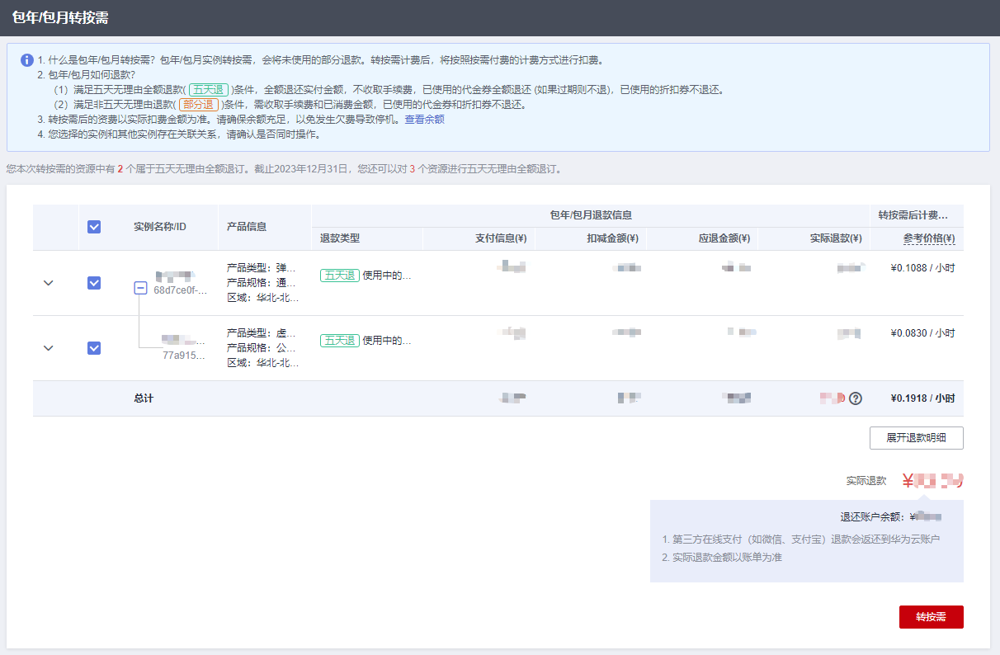
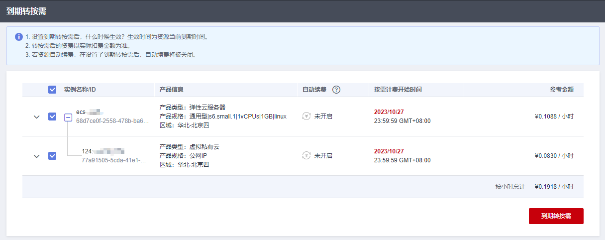
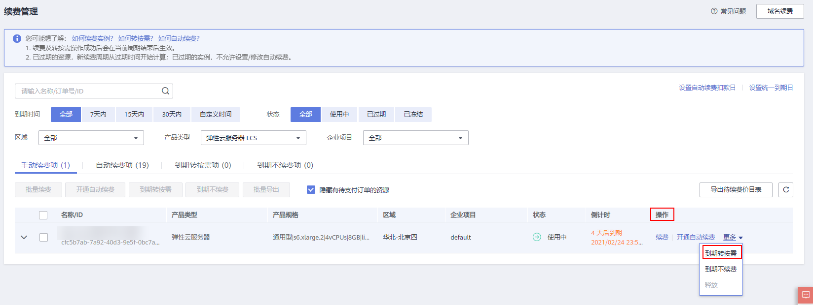

# 包年/包月转按需

## 操作场景

包年/包月是预付费模式，按订单的购买周期计费，适用于可预估资源使用周期的场景。

如果您需要更灵活的计费方式，按照弹性云服务器的实际使用时长计费，您可以将实例的计费方式转为按需付费。

> **说明：** 
>包年/包月转按需，支持两种方式：
>-   即时转按需：按需的资费模式立即生效。
>-   到期转按需：包年/包月资费模式到期后，按需的资费模式才会生效。

## 约束与限制

-   只有通过实名认证的客户，才可以执行包年/包月转按需操作。
-   在续费管理页面，订单状态是“使用中”的云服务器资源才能执行包年/包月转按需。
-   解决方案组合产品不支持包年/包月转按需。
-   已开票资源不支持包年/包月转按需。

## 即时转按需

1.  登录管理控制台。
2.  单击管理控制台左上角的，选择区域和项目。
3.  选择“计算 \> 弹性云服务器”。
4.  在弹性云服务器列表中，勾选需要进行操作的弹性云服务器。
5.  单击弹性云服务器列表左上角的“更多 \> 即时转按需”。
6.  单击“是”，跳转至费用中心的“包年/包月转按需”页面。

    **图 1**  包年/包月转按需  
    

7.  根据界面提示，勾选需要转按需的资源。
8.  确认退款信息后，单击“转按需”。
9.  再次根据界面信息确认要转按需的资源后，单击“确定”。

## 到期转按需（云服务器控制台）

1.  登录管理控制台。
2.  单击管理控制台左上角的，选择区域和项目。
3.  选择“计算 \> 弹性云服务器”。
4.  在弹性云服务器列表中，勾选需要进行操作的弹性云服务器。
5.  单击弹性云服务器列表左上角的“更多 \> 到期转按需”。
6.  单击“是”，跳转至费用中心的“到期转按需”页面。

    **图 2**  到期转按需  
    

7.  根据界面提示，勾选需要转按需的资源。
8.  单击“到期转按需”。

## 到期转按需（费用中心）

1.  登录管理控制台。
2.  单击“控制台”页面上方“费用”，在下拉菜单中选择“续费管理”。

    系统进入“续费管理”页面。

3.  自定义查询条件。

    -   可在“到期转按需项”页签查询已经设置到期转按需的资源。
    -   可对“手动续费项”、“自动续费项”、“到期不续费项”页签的资源设置到期转按需的操作。

    **图 3**  续费管理  
    

4.  设置包年/包月资源到期后转按需。
    -   单个资源到期转按需：选择需要更改计费方式的弹性云服务器，单击操作列“更多 \> 到期转按需”。

        **图 4**  单个资源转按需  
        

    -   批量资源到期转按需：选择需要更改计费方式的弹性云服务器，单击列表左上角的“到期转按需”。

        **图 5**  多个资源转按需  
        

5.  查看资费变更的相关信息后，单击“转按需”。

