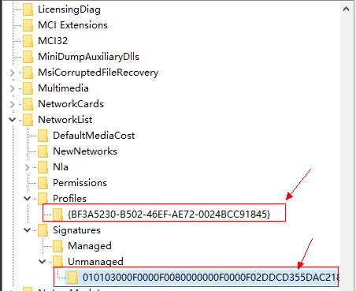
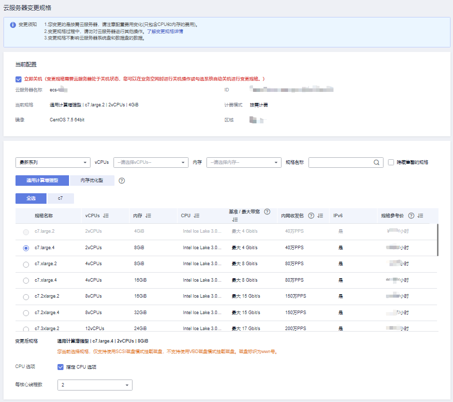

# 变更规格通用操作

## 操作场景

当您购买的弹性云服务器规格无法满足业务需要时，可参考本章节变更规格，升级vCPU、内存。对于部分类型的弹性云服务器，您还可以在变更规格时，更换弹性云服务器的类型。

-   “XEN实例”变更为“KVM实例”操作指引如下。对于其他类型弹性云服务器的规格变更，请直接参见本节内容。
    -   [XEN实例变更为KVM实例（Windows）](XEN实例变更为KVM实例（Windows）.md)
    -   [XEN实例变更为KVM实例（Linux-自动配置）](XEN实例变更为KVM实例（Linux-自动配置）.md)
    -   [XEN实例变更为KVM实例（Linux-手动配置）](XEN实例变更为KVM实例（Linux-手动配置）.md)

-   对于其他类型弹性云服务器的规格变更（例如“KVM实例”变更为“KVM实例”），请直接参见本节内容。

> **说明：** 
>-   XEN实例：S1、C1、C2、M1型弹性云服务器。
>-   KVM实例：参考[规格清单](https://support.huaweicloud.com/productdesc-ecs/zh-cn_topic_0159822360.html)，查询对应规格的虚拟化类型。
>-   “XEN实例”变更为“KVM实例”必须先安装对应的驱动，然后再变更规格。否则，规格变更后的弹性云服务器不可用（如操作系统无法启动等问题）。
>-   Linux操作系统的“XEN实例”变更为“KVM实例”时，优先推荐使用[XEN实例变更为KVM实例（Linux-自动配置）](XEN实例变更为KVM实例（Linux-自动配置）.md)。

## 变更须知

-   变更弹性云服务器规格时，用户不能选择已售罄的CPU和内存资源。
-   弹性云服务器规格（CPU或内存）变小，会影响弹性云服务器的性能。
-   对于部分类型的弹性云服务器，暂不支持规格变更操作。[实例类型](https://support.huaweicloud.com/productdesc-ecs/zh-cn_topic_0035470096.html)章节列举了提供的云服务器类型，并对每种云服务器类型的功能、使用进行介绍，具体请以各类型云服务器的“使用须知”为准。
-   当云硬盘状态为“正在扩容”时，不支持变更所挂载的弹性云服务器规格。
-   Windows操作系统的弹性云服务器，执行变更过个操作前建议您参考[磁盘脱机怎么办？](https://support.huaweicloud.com/ecs_faq/zh-cn_topic_0114225937.html)修改Windows操作系统SAN策略，避免变更规格后磁盘处于脱机状态。

## 费用说明

变更规格会引起费用的变化，具体费用说明请参见[变更资源费用说明](https://support.huaweicloud.com/usermanual-billing/zh-cn_topic_0045348012.html)。

## 变更前准备

变更规格后，可能会出现网卡漂移现象，如果对网卡有依赖，请在变更规格前做如下操作：

-   Linux系统：

    在云服务器中执行以下命令，删除网络规则目录下，文件名同时包含**persistent**和**net**的规则文件

    **rm -fr /etc/udev/rules.d/\*net\*persistent\*.rules**

    **rm -fr /etc/udev/rules.d/\*persistent\*net\*.rules**

-   Windows系统：

    在云服务器中删除如下注册表下的目录。

    HKEY\_LOCAL\_MACHINE\\SOFTWARE\\Microsoft\\Windows NT\\CurrentVersion\\NetworkList\\Profiles

    HKEY\_LOCAL\_MACHINE\\SOFTWARE\\Microsoft\\Windows NT\\CurrentVersion\\NetworkList\\Signatures\\Unmanaged

    **图 1**  注册表  
    

## 步骤1：变更规格

1.  登录管理控制台。
2.  单击管理控制台左上角的，选择区域和项目。
3.  选择“计算 \> 弹性云服务器”。
4.  单击“操作”列下的“更多 \> 变更规格”。

    系统进入“云服务器变更规格”页面。

5.  根据界面提示，选择变更后的弹性云服务器类型、vCPU和内存。

    变更规格前请先将云服务器关机，或根据页面提示勾选“系统自动关机后变更规格”。

    **图 2**  变更规格  
    

6.  （可选）选择“专属主机”。

    对于在专属主机上创建的弹性云服务器，系统支持更换云服务器所在的专属主机。

    请展开下拉列表，选择更换的专属主机。如果下拉列表中无可用的专属主机，说明所剩资源不足，不能用于创建变更规格后的弹性云服务器。

7.  单击“确定”。
8.  确认变更后的配置无误后，阅读并勾选同意服务协议，单击“提交申请”。
9.  查询规格是否变更成功。

    申请变更规格后，可以通过“异常任务”栏查看规格是否变更成功。

    1.  查看控制台是否显示“异常任务”栏，查看操作请参见[查看失败任务](查看失败任务.md)。
        -   是，执行[9.b](#li6253192246)。
        -   否，变更规格成功。

    2.  打开“异常任务”，根据弹性云服务器的“名称/ID”、“操作时间”和“任务”，确认列表中是否有刚刚执行的变更规格任务。
        -   是，变更规格失败，失败原因请参见[后续处理](#section9461027528)。
        -   否，变更规格成功。

## 步骤2：检查磁盘挂载状态

变更规格时，可能会发生磁盘挂载失败的情况，因此，变更规格后，需检查磁盘挂载状态是否正常。如果正常，则变更成功。

-   Windows弹性云服务器

    详细操作请参考[Windows云服务器变更规格后数据盘脱机怎么办？](https://support.huaweicloud.com/ecs_faq/ecs_faq_0618.html)

-   Linux弹性云服务器

    详细操作请参考[Linux云服务器变更规格后数据盘脱机怎么办？](https://support.huaweicloud.com/ecs_faq/ecs_faq_0619.html)

## 后续处理

如果变更规格失败，请到云审计页面查看失败原因。具体操作如下：

1.  登录管理控制台。
2.  选择“管理与部署 \> 云审计服务”。
3.  在左侧导航栏，选择“云审计 \> 事件列表”。
4.  在“事件名称”栏，根据“资源ID”查找到名称为“resizeServer”的规格变更失败事件。

    其中，“资源ID”为规格变更失败的弹性云服务器ID。

5.  单击“操作”列下的“查看事件”，查看失败原因。

    如果无法根据日志解决问题，可联系客服。

