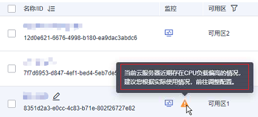
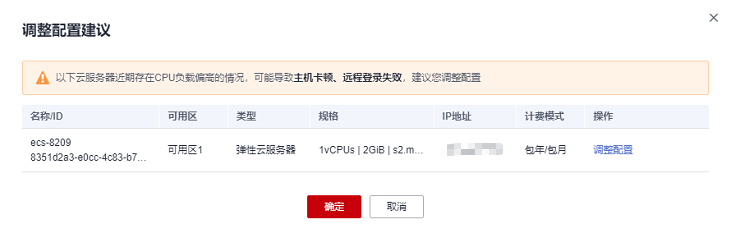
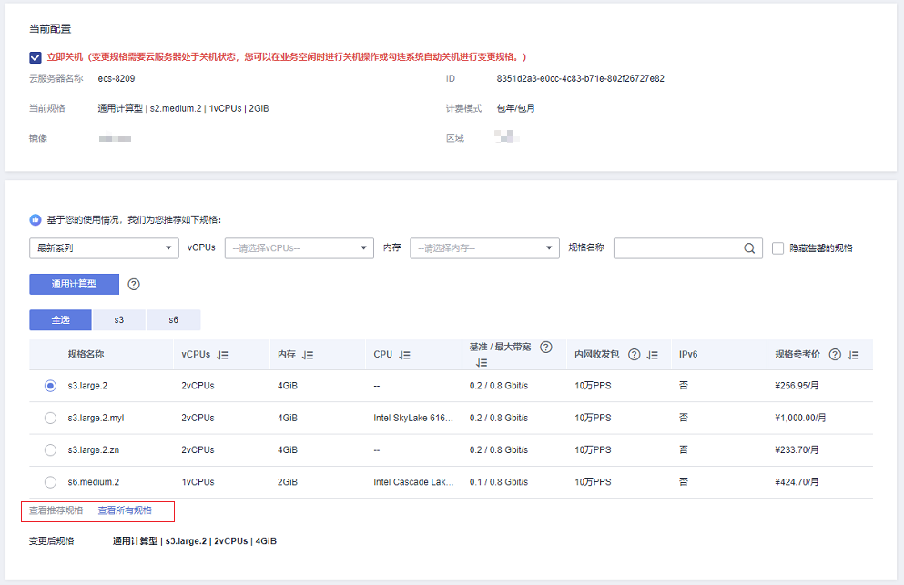

# 变更规格（性能助手版）

## 操作场景

弹性云服务器支持性能助手功能，实时检测云服务器的CPU负载情况。当云服务器的CPU负载超过阈值时，会提示您调整配置，并提供推荐规格。

触发“调整配置”提醒的阈值为：云服务器在最近72小时内，开机时间超过36小时，且“CPU使用率”的中位数超过75%。

关于监控指标“CPU使用率”的详细描述，请参见[弹性云服务器支持的基础监控指标](弹性云服务器支持的基础监控指标.md)。

本章节介绍当云服务器CPU偏高、超过阈值时，系统提示调整配置时的操作指导。

## 变更须知

-   当云服务器状态为“已冻结”时，不支持变更规格。
-   变更弹性云服务器规格时，用户不能选择已售罄的CPU和内存资源。
-   弹性云服务器规格（CPU或内存）变小，会影响弹性云服务器的性能。
-   对于部分类型的弹性云服务器，暂不支持规格变更操作。[实例类型](https://support.huaweicloud.com/productdesc-ecs/zh-cn_topic_0035470096.html)章节列举了提供的云服务器类型，并对每种云服务器类型的功能、使用进行介绍，具体请以各类型云服务器的“使用须知”为准。

## 费用说明

变更规格会引起费用的变化，具体费用说明请参见[变更资源费用说明](https://support.huaweicloud.com/usermanual-billing/renewals_topic_60000001.html)。

## 操作步骤

1.  登录管理控制台。
2.  单击管理控制台左上角的，选择区域和项目。
3.  单击“”，选择“计算 \> 弹性云服务器”。
4.  查看弹性云服务器列表，若云服务器CPU负载偏高，会出现如下提示。

    **图 1**  云服务器列表上方提示信息  
    

    **图 2**  云服务器列表“监控”列提示信息  
    

5.  在云服务器列表上方提示信息中，单击“查看详情”，显示“调整配置建议”页面，包含所有CPU负载偏高，需要调整配置的云服务器。

    **图 3**  调整配置建议  
    

6.  在待调整配置的云服务器“操作”列，单击“调整配置”，进入“云服务器变更规格”页面。

    > **说明：** 
    >您也可以在云服务器列表页面，单击如[图2](#fig173581221102811)所示的“”，直接进入该云服务器的“云服务器变更规格”页面。

7.  设置变更规格相关参数。
    1.  勾选“立即关机”。
    2.  在推荐规格的规格列表中，选择待变更的目标规格。

        若推荐规格不满足需要，您可以单击“查看所有规格”，切换至完整规格列表页面进行选择。

        > **说明：** 
        >弹性云服务器规格（CPU或内存）变小，会影响弹性云服务器的性能。

        **图 4**  云服务器变更规格  
        

    3.  单击“下一步”。
    4.  确认变更后的配置无误后，阅读并勾选“我已阅读《镜像免责声明》”，单击“提交订单”。
    5.  支付订单，完成云服务器规格的变更。

8.  返回云服务器列表，查询规格是否变更成功。
    1.  在云服务器列表上方的提示信息中单击“查看详情”。
    2.  在“调整配置建议”页面，若云服务器“操作”列显示“已调整”，表示云服务器变更规格完成。

