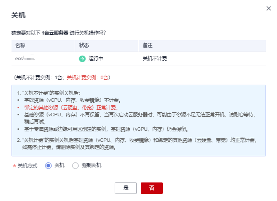
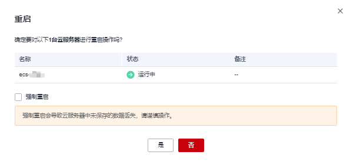
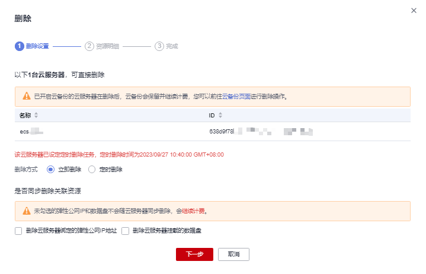

# 启、停弹性云服务器

在弹性云服务器的使用过程中，您可以进行开机、关机、重启或删除/退订等操作。

-   大量弹性云服务器同时开机或关机时，会加重主机的负载。如果需要同时对大量弹性云服务器执行开机或关机操作，建议分批进行，避免对其他弹性云服务器的业务造成影响。
-   重启/关机弹性云服务器时，如果弹性云服务器长时间处于“正在重启”/“正在关机”状态，可以执行强制重启/强制关机操作。强制重启/强制关机操作会导致弹性云服务器中未保存的数据丢失，请谨慎操作。

> **说明：** 
>对于裸金属类型的规格实例（规格名称中包含physical），建议您参考本章节进行弹性云服务器的启、停操作。
>如果通过操作系统的shutdown，poweoff，half等命令进行操作，可能会导致命令无效或关机后无法启动。

## 开机

1.  登录管理控制台。
2.  单击管理控制台左上角的，选择区域和项目。
3.  选择“计算 \> 弹性云服务器”。
4.  在弹性云服务器列表中，勾选需要进行操作的弹性云服务器实例。
5.  单击弹性云服务器列表左上角的“开机”。
6.  参考界面提示信息，单击“是”，完成弹性云服务器的“开机”操作。

    > **说明：** 
    >如果弹性云服务器处于“开机中”中间状态超过30分钟，则说明出现异常，需要联系管理员处理。

## 关机

1.  登录管理控制台。
2.  单击管理控制台左上角的，选择区域和项目。
3.  选择“计算 \> 弹性云服务器”。
4.  在弹性云服务器列表中，勾选需要进行操作的弹性云服务器实例。
5.  单击弹性云服务器列表左上角的“关机”。

    **图 1**  关机  
    

6.  在“关机”页面，您可以根据需要选择“关机方式”。

    在当前页面，您还可以查看按需计费的弹性云服务器的关机计费策略，更多内容，请参见[关机计费策略](https://support.huaweicloud.com/price-ecs/ecs_billing_2003.html#section6)。

    > **须知：** 
    >“强制关机”方式会导致云服务器中未保存的数据丢失，请谨慎操作。

7.  单击“是”，完成弹性云服务器的“关机”操作。

    > **说明：** 
    >如果弹性云服务器处于“关机中”中间状态超过30分钟，则说明出现异常，需要联系管理员处理。

## 重启

1.  登录管理控制台。
2.  单击管理控制台左上角的，选择区域和项目。
3.  选择“计算 \> 弹性云服务器”。
4.  在弹性云服务器列表中，勾选需要进行操作的弹性云服务器实例。
5.  单击弹性云服务器列表左上角的“更多 \> 重启”。

    **图 2**  重启  
    

    > **须知：** 
    >勾选“强制重启”会导致云服务器中未保存的数据丢失，请谨慎操作。

6.  单击“是”，完成弹性云服务器的“重启”操作。

    > **说明：** 
    >如果弹性云服务器处于“重启中”或“强制重启中”中间状态超过30分钟，则说明出现异常，需要联系管理员处理。

## 删除/退订

1.  登录管理控制台。
2.  单击管理控制台左上角的，选择区域和项目。
3.  选择“计算 \> 弹性云服务器”。
4.  在弹性云服务器列表中，勾选需要进行操作的弹性云服务器实例。
5.  单击弹性云服务器列表左上角的“更多 \> 删除”或“更多 \> 退订”。

    -   删除按需计费的弹性云服务器。

        **图 3**  删除  
        

        1.  选择“删除方式”。
            -   立即删除：立即删除弹性云服务器。
            -   定时删除：在设置的“删除时间”删除弹性云服务器。

                > **说明：** 
                >仅部分区域支持删除支持方式，请参见[功能总览](https://support.huaweicloud.com/function-ecs/index.html)。
                >定时删除任务时间设置不可小于当前时间1小时。
                >系统每5分钟执行一次定时删除任务，按照系统删除服务器的时间停止计费。

        2.  （可选）勾选“删除云服务器绑定的弹性公网IP地址”和“删除云服务器挂载的数据盘”，同步删除弹性云服务器绑定的资源。

            当“删除方式”选择“立即删除”时，该参数可见。

        3.  （可选）单击“下一步”，确认删除的资源明细。

            当“删除方式”选择“立即删除”时，该参数可见。

        4.  （可选）确认删除资源明细后，输入“DELETE”。

            当“删除方式”选择“立即删除”时，该参数可见。

        5.  单击“确定”，完成弹性云服务器的“删除”操作。

    -   退订包年/包月的弹性云服务器。

        **图 4**  退订  
        

        1.  单击“是”，跳转至费用中心的“退订资源”页面。
        2.  根据界面提示，勾选需要退订的资源，并选择退订原因。
        3.  确认退订信息无误后，勾选“资源退订后……”提示信息。
        4.  单击“退订”，再次根据界面信息确认要退订的资源。
        5.  再次单击“退订”，完成包年/包月资源的退订操作。

    > **说明：** 
    >如果弹性云服务器处于“正在删除”中间状态超过30分钟，则说明出现异常，需要联系管理员处理。

