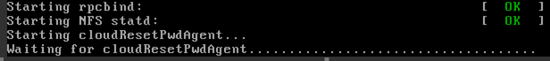
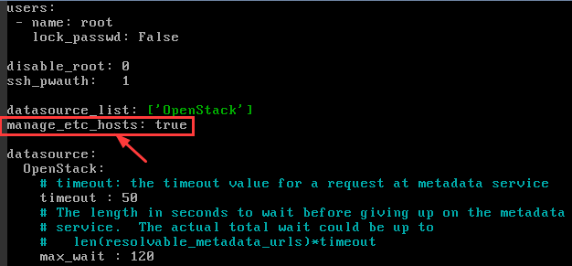

# 启动弹性云服务器时卡在“Waiting for cloudResetPwdAgent”

## 问题描述

启动弹性云服务器时，系统长时间卡在“Waiting for cloudResetPwdAgent”状态，需要等待20s\~30s，如[图1](#fig91501834144111)所示。

**图 1**  启动cloudResetPwdAgent  

## 可能原因

内网DNS和客户自定义DNS设置导致启动一键重置密码插件时卡慢。

## 处理方法

1.  以root用户登录弹性云服务器。
2.  执行以下命令，修改配置文件“/etc/cloud/cloud.cfg“。

    vi /etc/cloud/cloud.cfg

3.  添加如下语句，如[图2](#fig185292502435)所示。

    **manage\_etc\_hosts: true**

    **图 2**  编辑配置文件  
    

