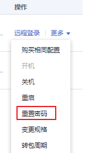

# 在控制台重置弹性云服务器密码

## 操作场景

如果在创建弹性云服务器时未设置密码，或密码丢失、过期，可以参见本节操作重置密码。

## 前提条件

-   密码丢失或过期前，已安装密码重置插件。
    -   公共镜像创建的弹性云服务器默认已安装一键重置密码插件。
    -   私有镜像创建的云服务器且未安装密码重置插件，可参考[未安装重置密码插件且忘记密码时，如何重置密码\(Windows\)？](https://support.huaweicloud.com/ecs_faq/zh-cn_topic_0179487873.html)和[未安装重置密码插件且忘记密码时，如何重置密码\(Linux\)？](https://support.huaweicloud.com/ecs_faq/zh-cn_topic_0179487874.html)。

-   请勿删除重置密码进程CloudResetPwdAgent和CloudResetPwdUpdateAgent，否则，会导致一键式重装密码功能不可用。
-   使用SUSE 11 SP4镜像创建的弹性云服务器，内存需要大于等于4GB时才能支持一键式重置密码功能。
-   弹性云服务器使用的VPC网络DHCP不能禁用。
-   弹性云服务器网络正常通行。

## 操作步骤

您可参考以下步骤在控制台上修改一台或多台弹性云服务器的登录密码。

> **说明：** 
>开机状态下重置密码后需重启云服务器，新密码才会生效。您可以重置密码后手动重启，或在重置密码时候勾选“自动重启”。

1.  登录管理控制台。
2.  选择“计算 \> 弹性云服务器”。
3.  选中待重置密码的弹性云服务器，并选择“操作”列下的“更多 \> 重置密码”。

    **图 1**  重置密码  
    

    > **说明：** 
    >对于已安装一键式重置密码插件的弹性云服务器，系统支持批量重置密码功能。批量重置的操作如下：
    >1.  勾选待重置密码的多台弹性云服务器。
    >2.  单击云服务器列表页上方的“更多 \> 重置密码”。
    >3.  根据界面提示，设置新密码。
    >    设置成功后，批量重置密码的多台弹性云服务器登录密码相同。

4.  根据界面提示，设置弹性云服务器的新密码，并确认新密码。

    新密码的复杂度应满足[表1](#zh-cn_topic_0021426802_table4381109318958)。

    **表 1**  重置密码规则

    
    <table><thead align="left"><tr id="zh-cn_topic_0035643949_zh-cn_topic_0067909751_zh-cn_topic_0021426802_row925712618958"><th class="cellrowborder" valign="top" width="18.000000000000004%" id="mcps1.2.4.1.1">
参数

    </th>
    <th class="cellrowborder" valign="top" width="58.910000000000004%" id="mcps1.2.4.1.2">
规则

    </th>
    <th class="cellrowborder" valign="top" width="23.090000000000003%" id="mcps1.2.4.1.3">
样例

    </th>
    </tr>
    </thead>
    <tbody><tr id="zh-cn_topic_0035643949_zh-cn_topic_0067909751_zh-cn_topic_0021426802_row4260571318958"><td class="cellrowborder" valign="top" width="18.000000000000004%" headers="mcps1.2.4.1.1 ">
密码

    </td>
    <td class="cellrowborder" valign="top" width="58.910000000000004%" headers="mcps1.2.4.1.2 "><ul id="zh-cn_topic_0035643949_zh-cn_topic_0067909751_zh-cn_topic_0021426802_ul5961106018958"><li>密码长度范围为8到26位。</li><li>密码至少包含以下4种字符中的3种：<ul id="zh-cn_topic_0035643949_zh-cn_topic_0067909751_zh-cn_topic_0021426802_ul24583583181022"><li>大写字母</li><li>小写字母</li><li>数字</li><li>Windows操作系统云服务器特殊字符：包括“$”、“!”、“@”、“%”、“-”、“_”、“=”、“+”、“[”、“]”、“:”、“.”、“/”、“,”和“?”</li><li>Linux操作系统特云服务器特殊字符：包括“!”、“@”、“%”、“-”、“_”、“=”、“+”、“[”、“]”、“:”、“.”、“/”、“^”、“,”、“{”、“}”和“?”</li></ul>
    </li><li>密码不能包含用户名或用户名的逆序。</li><li>Windows操作系统的云服务器，不能包含用户名中超过两个连续字符的部分。</li></ul>
    </td>
    <td class="cellrowborder" valign="top" width="23.090000000000003%" headers="mcps1.2.4.1.3 ">
YNbUwp!dUc9MClnv

    
 说明： 

样例密码随机生成，请勿复制使用样例。

    

    </td>
    </tr>
    </tbody>
    </table>

5.  单击“确认”。

    系统执行重置密码操作，该操作预计需要10分钟，请勿频繁执行。

    -   如果在开机状态下重置密码，需手动重启使新密码生效。
    -   如果在关机状态下重置密码，待重新开机后新密码生效。

## 相关链接

-   [一键重置密码后无法使用新密码登录弹性云服务器](https://support.huaweicloud.com/ecs_faq/zh-cn_topic_0105187294.html)
-   [业务端口被一键式重置密码插件占用](https://support.huaweicloud.com/ecs_faq/zh-cn_topic_0109414935.html)

