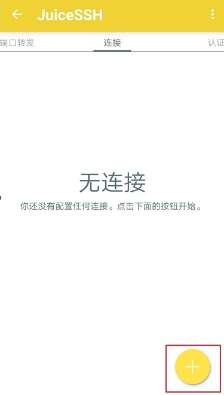
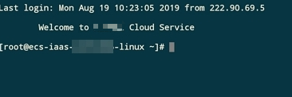

# 在移动设备上登录Linux云服务器

## 操作场景

本节操作介绍如何在移动设备上连接Linux实例。

-   以iTerminal-SSH Telnet为例介绍如何在iOS设备上连接 Linux 实例，详细操作请参考[IOS设备上登录Linux云服务器](#zh-cn_topic_0186706399_section647707162512)。
-   以JuiceSSH为例介绍如何在Android设备上连接 Linux 实例，详细操作请参考[Android设备上登录Linux云服务器](#zh-cn_topic_0186706399_section1218111313258)。

## 前提条件

-   云服务器状态为“运行中”。
-   已获取Linux云服务器用户名和密码。忘记密码请参考[在控制台重置弹性云服务器密码](在控制台重置弹性云服务器密码.md)重置密码。
-   弹性云服务器已经绑定弹性公网IP，绑定方式请参见[绑定弹性公网IP](绑定弹性公网IP.md)。

-   所在安全组入方向已开放22端口，配置方式请参见[配置安全组规则](配置安全组规则.md)。

## IOS设备上登录Linux云服务器

如果您使用 iOS 设备，请确保已经安装了SSH客户端工具，我们以Termius为例。本示例中使用CentOS 7.6操作系统，使用用户名和密码进行认证。

1.  启动Termius，单击New Host。

    **图 1**  New Host  
    

2.  在SSH页面上，输入连接信息后，单击 Save。需要输入的连接信息包括：
    -   Alias：指定Host名称，如本例中，设置为ecs01。
    -   Hostname：输入需要连接的 Linux 实例的公网 IP 地址。
    -   Use SSH：打开SSH登录配置。
    -   Host：输入需要连接的 Linux 实例的公网 IP 地址。
    -   Port：输入端口号 22。
    -   用户名：输入用户名 root。
    -   密码：输入实例登录密码。

        **图 2**  输入连接信息  
        

3.  单击右上角的“Save”，保存登录信息，在Hosts页面，单击连接的名称远程连接服务器。

    **图 3**  保存登录信息  
    

    当出现如下页面时，您已经成功地连接了Linux云服务器。

    **图 4**  已连接  
    

## Android设备上登录Linux云服务器

如果您使用Android设备，请确保已经安装了JuiceSSH。本示例中使用CentOS 7.6操作系统，通过用户名和密码进行认证。

1.  启动JuiceSSH，单击“连接”。

    **图 5**  启动JuiceSSH  
    

2.  在“连接”页面单击图标。

    **图 6**  连接  
    

3.  在“新建连接”页面上，添加基本设置和高级设置的信息并保存。需要添加的信息如下：
    -   昵称：指定登录会话的名称，如本例中，设置为“linux\_test”。
    -   类型：使用默认值“SSH”。
    -   地址：输入需要登录的Linux实例的弹性公网IP地址。
    -   按以下步骤设置认证：
        1.  单击“认证”，在下拉列表里单击“新建”。
        2.  在“新建认证”页面上，添加如下信息后，单击图标。
            -   昵称：可选项，您可以根据需要设置一个身份名称，方便后续管理。如本示例中，设置为“linux\_test”。
            -   用户名：输入用户名“root”。
            -   密码：单击“设置（可选）”后，输入实例的登录密码，单击“确定”。

                **图 7**  新建认证  
                

    -   端口：输入端口号“22”。

        **图 8**  端口号  
        

4.  在“连接”页面单击创建好的连接。

    **图 9**  单击连接  
    

5.  确认提示信息后，单击“接受”。

    **图 10**  确认提示信息  
    

6.  （可选）第一次连接时，JuiceSSH会提示您如何设置字体大小，如何弹出键盘等。确认信息后，单击“好的，我知道了！”。

    **图 11**  教程  
    

至此，您已经成功登录Linux实例。

**图 12**  登录Linux实例  

