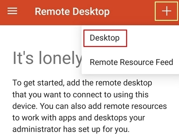
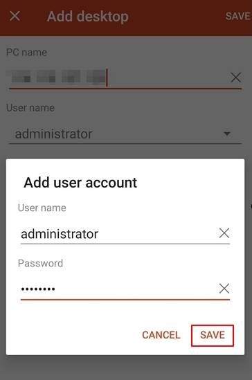
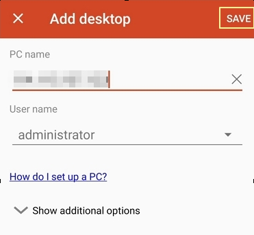
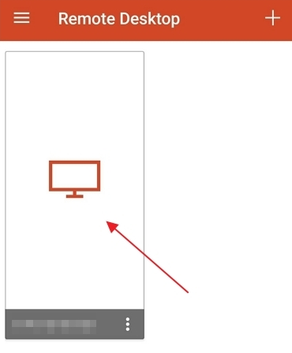
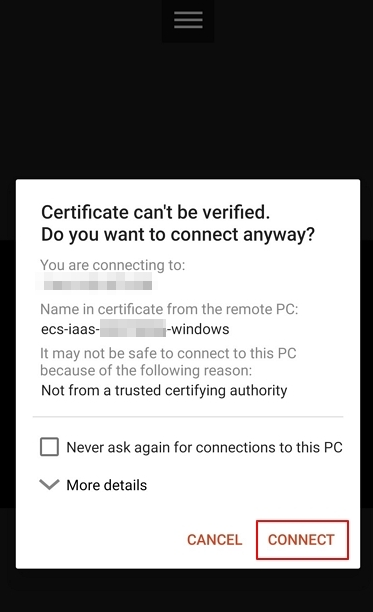
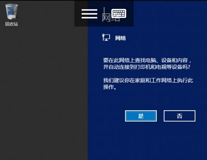

# 在移动设备上登录Windows弹性云服务器

## 操作场景

本节操作以“Windows Server 2012 R2 数据中心版 64位”操作系统为例，介绍如何通过Microsoft Remote Desktop客户端登录Windows实例。

## 前提条件

-   云服务器状态为“运行中”。
-   已获取Windows云服务器用户名和密码，忘记密码请参考[在控制台重置云服务器密码](在控制台重置云服务器密码.md)重置密码。
-   弹性云服务器已经绑定弹性公网IP，绑定方式请参见[绑定弹性公网IP](绑定弹性公网IP.md)。

-   所在安全组入方向已开放3389端口，配置方式请参见[配置安全组规则](配置安全组规则.md)。
-   移动设备已安装Microsoft Remote Desktop。

## 操作步骤

1.  启动RD Client。
2.  在“Remote Desktop”页面右上角，单击图标，选择“Desktop”。

    **图 1**  Remote Desktop  
    

3.  在“Add desktop”页面，设置登录信息后，单击“SAVE”。
    -   PC name：输入需要登录的Windows实例的弹性公网IP地址。
    -   按以下步骤设置“User name”：
        1.  单击“User name”，在下拉列表中选择“Add user account”。

            弹出“Add user account”对话框。

        2.  输入Windows实例帐号“administrator”，并输入实例的登录密码，单击“SAVE”。

            **图 2**  输入登录信息  
            

            **图 3**  保存填写的登录信息  
            

4.  在“Remote Desktop”页面，单击需要登录的Windows实例图标。

    **图 4**  登录Windows实例  
    

5.  确认信息后，单击“CONNECT”。

    **图 5**  CONNECT  
    

至此，您已经登录Windows实例。

**图 6**  登录成功  

