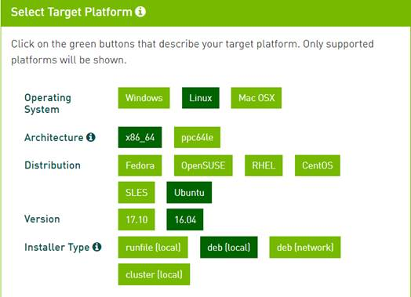
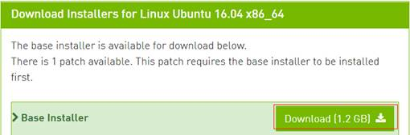
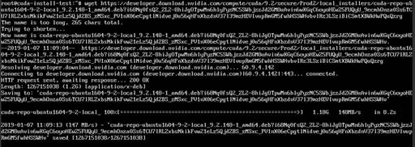
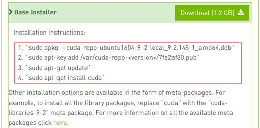
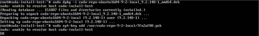

# 安装NVIDIA GPU驱动及CUDA工具包

## 操作场景

使用P1型、P2v型、Pi1型弹性云服务器时，需确保云服务器已安装GPU驱动和CUDA工具包，否则无法实现计算加速功能。

## 前提条件

1.  已绑定弹性公网IP。
2.  云服务器未安装GPU驱动以及CUDA工具包。

> **说明：**   
>从NVIDIA官网下载安装CUDA工具包后，会自动将对应GPU驱动安装，无需再单独安装GPU驱动  

## CUDA工具包下载地址

**表 1**  CUDA工具包下载地址

<table><tbody><tr id="row1823381018183"><td class="cellrowborder" rowspan="2" valign="top">
<strong id="b132332010191813">实例</strong>

<strong id="b523310105184">类型</strong>

</td>
<td class="cellrowborder" rowspan="2" valign="top">
<strong id="b32336108188">操作系统</strong>

</td>
<td class="cellrowborder" rowspan="2" valign="top">
<strong id="b18233191012188">CUDA版本</strong>

</td>
<td class="cellrowborder" rowspan="2" valign="top">
<strong id="b182330103182">下载路径</strong>

</td>
<td class="cellrowborder" colspan="5" valign="top">
<strong id="b19233151061818">索引项</strong>

</td>
</tr>
<tr id="row18234171011816"><td class="cellrowborder" valign="top">
<strong id="b1523461012188">Operating</strong>

<strong id="b72345105183">System</strong>

</td>
<td class="cellrowborder" valign="top">
<strong id="b16234111016185">Architecture</strong>

</td>
<td class="cellrowborder" valign="top">
<strong id="b1223419100185">Distribution</strong>

</td>
<td class="cellrowborder" valign="top">
<strong id="b92341010161820">Version</strong>

</td>
<td class="cellrowborder" valign="top">
<strong id="b3234131019186">Installer</strong>

<strong id="b19234181013184">Type</strong>

</td>
</tr>
<tr id="row102341510181817"><td class="cellrowborder" rowspan="4" valign="top" width="6.270627062706271%">
P2v

(V100)

</td>
<td class="cellrowborder" valign="top" width="11.101110111011101%">
CentOS 7.4 64bit

</td>
<td class="cellrowborder" rowspan="4" valign="top" width="9.21092109210921%">
9.2

</td>
<td class="cellrowborder" rowspan="4" valign="top" width="21.56215621562156%">
https://developer.nvidia.com/cuda-92-download-archive

</td>
<td class="cellrowborder" valign="top" width="10.371037103710371%">
Linux

</td>
<td class="cellrowborder" valign="top" width="10.371037103710371%">
x86_64

</td>
<td class="cellrowborder" valign="top" width="10.371037103710371%">
CentOS

</td>
<td class="cellrowborder" valign="top" width="10.371037103710371%">
7

</td>
<td class="cellrowborder" valign="top" width="10.371037103710371%">
rpm(local)

</td>
</tr>
<tr id="row4234910171815"><td class="cellrowborder" valign="top">
Ubuntu 16.04 64bit

</td>
<td class="cellrowborder" valign="top">
Linux

</td>
<td class="cellrowborder" valign="top">
x86_64

</td>
<td class="cellrowborder" valign="top">
Ubuntu

</td>
<td class="cellrowborder" valign="top">
16.04

</td>
<td class="cellrowborder" valign="top">
deb(local)

</td>
</tr>
<tr id="row423561031812"><td class="cellrowborder" valign="top">
Windows Server 2016 Standard 64bit

</td>
<td class="cellrowborder" valign="top">
Windows

</td>
<td class="cellrowborder" valign="top">
x86_64

</td>
<td class="cellrowborder" valign="top">
-

</td>
<td class="cellrowborder" valign="top">
Server 2016

</td>
<td class="cellrowborder" valign="top">
exe(local)

</td>
</tr>
<tr id="row1923521018188"><td class="cellrowborder" valign="top">
Windows Server 2012 R2 Standard 64bit

</td>
<td class="cellrowborder" valign="top">
Windows

</td>
<td class="cellrowborder" valign="top">
x86_64

</td>
<td class="cellrowborder" valign="top">
-

</td>
<td class="cellrowborder" valign="top">
Server 2012 R2

</td>
<td class="cellrowborder" valign="top">
exe(local)

</td>
</tr>
<tr id="row11235510131813"><td class="cellrowborder" rowspan="3" valign="top" width="6.270627062706271%">
P1

(P100)

</td>
<td class="cellrowborder" valign="top" width="11.101110111011101%">
CentOS 7.3 64bit

</td>
<td class="cellrowborder" rowspan="3" valign="top" width="9.21092109210921%">
9

</td>
<td class="cellrowborder" rowspan="3" valign="top" width="21.56215621562156%">
https://developer.nvidia.com/cuda-90-download-archive

</td>
<td class="cellrowborder" valign="top" width="10.371037103710371%">
Linux

</td>
<td class="cellrowborder" valign="top" width="10.371037103710371%">
x86_64

</td>
<td class="cellrowborder" valign="top" width="10.371037103710371%">
CentOS

</td>
<td class="cellrowborder" valign="top" width="10.371037103710371%">
7

</td>
<td class="cellrowborder" valign="top" width="10.371037103710371%">
rpm(local)

</td>
</tr>
<tr id="row13236141001819"><td class="cellrowborder" valign="top">
Ubuntu 16.04 64bit

</td>
<td class="cellrowborder" valign="top">
Linux

</td>
<td class="cellrowborder" valign="top">
x86_64

</td>
<td class="cellrowborder" valign="top">
Ubuntu

</td>
<td class="cellrowborder" valign="top">
16.04

</td>
<td class="cellrowborder" valign="top">
deb(local)

</td>
</tr>
<tr id="row14236111091815"><td class="cellrowborder" valign="top">
Windows Server 2012 R2 Standard 64bit

</td>
<td class="cellrowborder" valign="top">
Windows

</td>
<td class="cellrowborder" valign="top">
x86_64

</td>
<td class="cellrowborder" valign="top">
-

</td>
<td class="cellrowborder" valign="top">
Server 2012 R2

</td>
<td class="cellrowborder" valign="top">
exe(local)

</td>
</tr>
<tr id="row2236181031812"><td class="cellrowborder" rowspan="2" valign="top" width="6.270627062706271%">
Pi1

(P4)

</td>
<td class="cellrowborder" valign="top" width="11.101110111011101%">
CentOS 7.3 64bit

</td>
<td class="cellrowborder" rowspan="2" valign="top" width="9.21092109210921%">
9

</td>
<td class="cellrowborder" rowspan="2" valign="top" width="21.56215621562156%">
https://developer.nvidia.com/cuda-90-download-archive

</td>
<td class="cellrowborder" valign="top" width="10.371037103710371%">
Linux

</td>
<td class="cellrowborder" valign="top" width="10.371037103710371%">
x86_64

</td>
<td class="cellrowborder" valign="top" width="10.371037103710371%">
CentOS

</td>
<td class="cellrowborder" valign="top" width="10.371037103710371%">
7

</td>
<td class="cellrowborder" valign="top" width="10.371037103710371%">
rpm(local)

</td>
</tr>
<tr id="row18237111091810"><td class="cellrowborder" valign="top">
Ubuntu 16.04 64bit

</td>
<td class="cellrowborder" valign="top">
Linux

</td>
<td class="cellrowborder" valign="top">
x86_64

</td>
<td class="cellrowborder" valign="top">
Ubuntu

</td>
<td class="cellrowborder" valign="top">
16.04

</td>
<td class="cellrowborder" valign="top">
deb(local)

</td>
</tr>
</tbody>
</table>

## 安装CUDA工具包

1.  登录GPU弹性云服务器；

1.  在CUDA下载页面中，按照[表1](#table1925059201814)中的对应的索引项在页面中进行选择。

    以下操作以P2v实例使用Ubuntu 16.04 64bit安装CUDA 9.2为例

    **图 1**  选择CUDA版本  
    

2.  选择完成后，页面会自动呈现出Ubuntu 16.04 64bit对应的CUDA 9.2的下载地址按钮。

    **图 2**  下载CUDA  
    

3.  下载CUDA工具包
    -   如果是windows虚拟机，直接点击Download按钮进行下载
    -   如果是linux虚拟机，浏览器中右键点击“复制链接地址”，然后在云服务器内部执行如下命令进行下载。

        **wget \[复制的链接地址\]**

        **图 3**  Linux云服务器下载CUDA  
        

4.  待CUDA工具包下载完成后，按照NVIDIA官网安装指引进行安装
    -   如果是Windows虚拟机，双击打开exe文件，然后按照安装指引进行安装。
    -   如果是Linux虚拟机，按照如下图的NVIDIA官网的Installation Instructions进行安装。

        **图 4**  Linux云服务器安装CUDA  
        

        执行以下命令安装CUDA。

        **sudo dpkg -i cuda-repo-ubuntu1604-9-2-local\_9.2.148-1\_amd64.deb**

        **sudo apt-key add /var/cuda-repo-9-2/7fa2af80.pub**

        **sudo apt-get update**

        **sudo apt-get install cuda**

        **图 5**  安装CUDA回显01  
        

        **图 6**  安装CUDA回显02  
        

