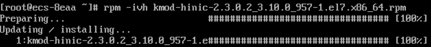
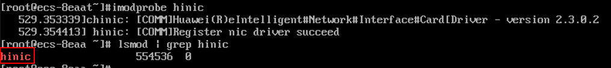
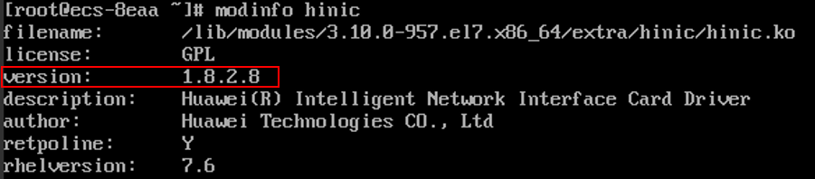
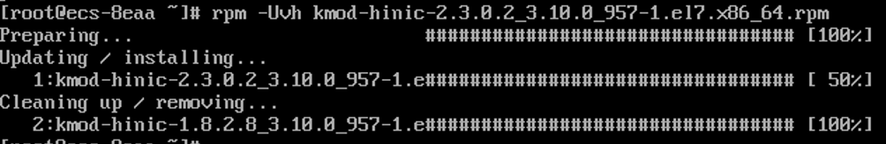
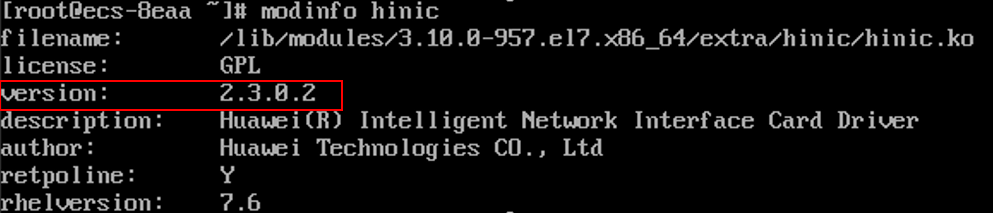
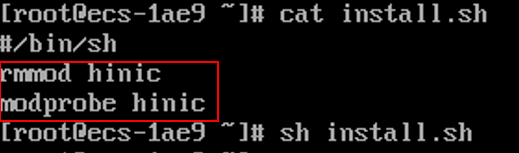

# 安装SRIOV驱动

## 操作场景

本节操作介绍弹性云服务器安装SRIOV驱动的操作步骤。

以C6网络增强功能云服务器为例，如果选择私有镜像创建C6网络增强功能云服务器，那么必须确保私有镜像已安装SRIOV驱动，且镜像已标记“支持SRIOV驱动”的标签，把智能网卡的SRIOV驱动直通到云服务器，并在智能网卡上实现网络报文业务处理的全部转发动作，提升云服务器网络性能。

当前仅C6网络增强功能EulerOS 2.3和CentOS 7.6操作系统的云服务器支持安装SRIOV驱动。

-   安装SRIOV驱动操作请参考[安装SRIOV驱动](#section1839413497159)，安装前请确保云服务器可以访问外网。
-   升级SRIOV驱动请参考[升级SRIOV驱动](#section229411784219)。

## 驱动下载地址

**表 1**  SRIOV驱动获取路径

<table><thead align="left"><tr id="zh-cn_topic_0179097324_row3191990095645"><th class="cellrowborder" valign="top" width="23.330000000000002%" id="mcps1.2.4.1.1">
软件包

</th>
<th class="cellrowborder" valign="top" width="35.88%" id="mcps1.2.4.1.2">
适用操作系统

</th>
<th class="cellrowborder" valign="top" width="40.79%" id="mcps1.2.4.1.3">
获取方式

</th>
</tr>
</thead>
<tbody><tr id="zh-cn_topic_0179097324_row3356146095645"><td class="cellrowborder" rowspan="2" valign="top" width="23.330000000000002%" headers="mcps1.2.4.1.1 ">
kmod-hinic.zip

</td>
<td class="cellrowborder" valign="top" width="35.88%" headers="mcps1.2.4.1.2 ">
EulerOS2.3

</td>
<td class="cellrowborder" valign="top" width="40.79%" headers="mcps1.2.4.1.3 ">
<a href="https://ecs-instance-driver.obs.cn-north-1.myhuaweicloud.com/hinic/EulerOS2.3/kmod-hinic.zip" target="_blank" rel="noopener noreferrer">https://ecs-instance-driver.obs.cn-north-1.myhuaweicloud.com/hinic/EulerOS2.3/kmod-hinic.zip</a>

</td>
</tr>
<tr id="zh-cn_topic_0179097324_row1143107795758"><td class="cellrowborder" valign="top" headers="mcps1.2.4.1.1 ">
CentOS7.6

</td>
<td class="cellrowborder" valign="top" headers="mcps1.2.4.1.2 ">
<a href="https://ecs-instance-driver.obs.cn-north-1.myhuaweicloud.com/hinic/CentOS7.6/kmod-hinic.zip" target="_blank" rel="noopener noreferrer">https://ecs-instance-driver.obs.cn-north-1.myhuaweicloud.com/hinic/CentOS7.6/kmod-hinic.zip</a>

</td>
</tr>
</tbody>
</table>

## 安装SRIOV驱动

以下操作步骤以CentOS 7.6 64bit为例。

1.  登录弹性云服务器，执行以下命令下载SRIOV驱动。

    **wget  _驱动下载链接_**

2.  执行以下命令解压SRIOV驱动安装包。

    **unzip** **_安装包名称_**

3.  执行以下命令，安装SRIOV驱动。

    **rpm** **-ivh** _**安装程序名称**_

    **图 1**  安装SRIOV驱动  
    

4.  执行以下命令加载SRIOV驱动。

    **modprobe hinic**

5.  执行以下命令验证驱动是否加载成功。

    **lsmod | grep hinic**

    如果可以查询到hinic表示程序安装成功并且可以正常加载。

    **图 2**  验证驱动是否加载成功  
    

6.  执行以下命令删除安装程序。

    **rm -f 安装程序名称**

## 制作私有镜像

驱动安装成功后，请将云服务器制作为私有镜像。

制作私有镜像请参考《镜像服务用户指南》。

私有镜像制作完成后为镜像添加“支持SRIOV驱动”的标签，否则在云服务器创建页面无法选择该私有镜像。

## 为镜像添加“支持SRIOV驱动”的标签

用户可以选择以下任一种方式设置镜像的网卡多队列属性。

**方式1**：

1.  登录管理控制台。
2.  单击“计算”下的“镜像服务”。
3.  单击“私有镜像”进入对应的镜像列表。
4.  在镜像所在行的“操作”列下，单击“修改”。
5.  设置镜像的支持SRIOV驱动标签。

**方式2**：

1.  登录管理控制台。
2.  单击“计算”下的“镜像服务”。
3.  单击“私有镜像”进入对应的镜像列表。
4.  在镜像列表中，单击镜像名称，进入镜像详情页面。
5.  在镜像详情页面单击“修改”，在弹出的“修改镜像”对话框中，设置镜像的“支持SRIOV驱动”标签。

## 升级SRIOV驱动

以下操作步骤以CentOS 7.6 64bit为例，介绍升级SRIOV驱动版本的操作步骤。

1.  登录待升级SRIOV驱动的云服务器，执行以下命令查看当前安装的SRIOV版本信息。

    **modinfo hinic**

    如[图3](#zh-cn_topic_0179097324_fig153664314718)所示，当前驱动版本为1.8.2.8

    **图 3**  查询SRIOV驱动版本  
    

2.  执行以下命令，下载最新的SRIOV驱动。

    **wget  _驱动下载链接_**

3.  执行以下命令解压SRIOV驱动安装包。

    **unzip  _安装包名称_**

4.  执行以下命令升级SRIOV驱动。

    **rpm -Uvh  _安装程序名称_**

    **图 4**  升级SRIOV驱动  
    

5.  执行以下命令查看升级后SRIOV驱动版本。

    **modinfo hinic**

    如[图5](#zh-cn_topic_0179097324_fig133983116527)所示，当前驱动版本为2.3.0.2

    **图 5**  查询更新的SRIOV驱动版本  
    

6.  驱动更新之后并没有加载到云服务器内核，请重启云服务器或者执行以下步骤使新版本驱动生效。

    1.  执行**rmmod hinic**命令，卸载旧版本驱动。
    2.  执行**modprobe hinic**命令，加载新版本驱动。

        > **须知：**   
        >卸载驱动之后会导致网络中断，请立即执行**modprobe hinic**命令加载新驱动，建议可以将卸载及加载命令写入脚本执行，减少网络中断时间。  

    **图 6**  加载新版本驱动  
    

