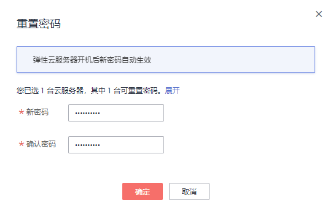
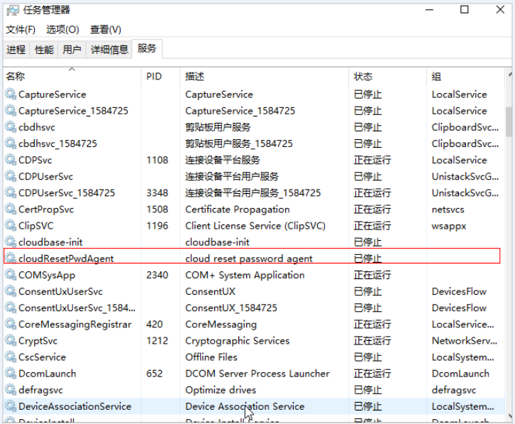

# 安装一键式重置密码插件（可选）

公有云平台提供了一键式重置密码功能。弹性云服务器的密码丢失或过期时，如果您的弹性云服务器提前安装了一键式重置密码插件，则可以应用一键式重置密码功能，给弹性云服务器设置新密码。

该方法方便、有效，建议您成功创建、登录弹性云服务器后，安装密码重置插件，具体操作请参见本节内容。

> **说明：** 
>-   使用公共镜像创建的弹性云服务器默认已安装一键重置密码插件。检查是否已安装一键式重置密码插件，请参见[1](#li44330716114226)。

## 安装须知

1.  该一键式重置密码插件仅适用于弹性云服务器，不支持裸金属服务器使用。
2.  用户自行决定是否安装一键式重置密码插件，使弹性云服务器具备一键式重置密码功能。
3.  安装完成后，请勿自行卸载插件，否则可能导致管理控制台判断失误，从而无法完成密码重置。
4.  重装/切换弹性云服务器操作系统后，一键式重置密码功能失效。如需继续使用该功能，请重新安装一键式重置密码插件。
5.  更换弹性云服务器系统盘后，一键式重置密码功能失效。如需继续使用该功能，请重新安装一键式重置密码插件。
6.  CoreOS操作系统的弹性云服务器，不支持安装一键式重置密码插件。
7.  如果没有提前安装一键式重置密码插件，密码丢失或过期后，不能使用一键式重置密码功能。。
8.  弹性云服务器需绑定弹性公网IP，才能自动更新一键式重置密码插件。
9.  一键重置密码插件CloudResetPwdAgent已按照GNU General Public License v2.0协议开源至[Github开源平台](https://github.com/huaweicloud/cloudresetpwdagent)，开放、透明、安全，请您放心使用。

## 前提条件

-   对于Windows弹性云服务器，需保证C盘可写入，且剩余空间大于300MB。

    对于Linux弹性云服务器，需保证根目录可写入，且剩余空间大于300MB。

-   使用SUSE 11 SP4镜像创建的弹性云服务器，内存需要大于等于4GB时才能支持一键式重置密码功能。
-   弹性云服务器使用的VPC网络DHCP不能禁用。
-   弹性云服务器网络正常通行。
-   弹性云服务器安全组出方向规则满足如下要求：

    -   协议：TCP
    -   端口范围：80
    -   远端地址：169.254.0.0/16

    如果您使用的是默认安全组出方向规则，则已经包括了如上要求，可以正常初始化。默认安全组出方向规则为：

    -   协议：ANY
    -   端口范围：ANY
    -   远端地址：0.0.0.0/16

## Linux弹性云服务器插件安装方法

1.  提供如下两种方法，供您检查弹性云服务器是否已安装一键式重置密码插件。

    方法一：登录控制台查询

    1.  登录管理控制台。
    2.  选择“计算 \> 弹性云服务器”。
    3.  选中待检查的弹性云服务器，并选择“操作”列下的“更多 \> 重置密码”。
        -   如果界面弹窗出现输入新密码的提示，表示已安装一键式重置密码插件，结束。

            **图 1**  已安装插件重置密码  
            

        -   如果界面弹窗提示下载重置密码脚本，表示未安装一键式重置密码插件，请继续执行如下操作进行安装。

            **图 2**  未安装插件重置密码  
            

    方法二：登录弹性云服务器查询

    1.  以root用户登录弹性云服务器。
    2.  执行以下命令，查询是否已安装CloudResetPwdAgent和CloudResetPwdUpdateAgent。

        **ls -lh /Cloud\***

        **图 3**  查询是否已安装一键式重置密码插件  
        

        检查结果是否如[图3](#fig10541015151310)所示。

        -   是，表示已安装一键式重置密码插件，结束。
        -   否，表示未安装一键式重置密码插件，请继续执行如下操作进行安装。

2.  根据您的操作系统是32位还是64位，执行以下命令，下载对应的一键式重置密码插件CloudResetPwdAgent.zip。

    安装一键式重置密码插件对插件的具体放置目录无特殊要求，请您自定义。

    -   32位操作系统

        **wget http://cn-south-1-cloud-reset-pwd.obs.cn-south-1.myhuaweicloud.com/linux/32/reset\_pwd\_agent/CloudResetPwdAgent.zip**

        其中，下载地址为：[https://cn-south-1-cloud-reset-pwd.obs.cn-south-1.myhuaweicloud.com/linux/32/reset\_pwd\_agent/CloudResetPwdAgent.zip](https://cn-south-1-cloud-reset-pwd.obs.cn-south-1.myhuaweicloud.com/linux/32/reset_pwd_agent/CloudResetPwdAgent.zip)

    -   64位操作系统

        **wget http://cn-south-1-cloud-reset-pwd.obs.cn-south-1.myhuaweicloud.com/linux/64/reset\_pwd\_agent/CloudResetPwdAgent.zip**

        其中，下载地址：[https://cn-south-1-cloud-reset-pwd.obs.cn-south-1.myhuaweicloud.com/linux/64/reset\_pwd\_agent/CloudResetPwdAgent.zip](https://cn-south-1-cloud-reset-pwd.obs.cn-south-1.myhuaweicloud.com/linux/64/reset_pwd_agent/CloudResetPwdAgent.zip)

3.  执行以下命令，解压软件包CloudResetPwdAgent.zip。

    安装一键式重置密码插件对插件的解压目录无特殊要求，请您自定义。

    **unzip** **-o** **-d** _**插件解压目录**_ **CloudResetPwdAgent.zip**

    示例：

    假设插件解压的目录为/home/linux/test，则命令行如下：

    **unzip -o -d /home/linux/test CloudResetPwdAgent.zip**

4.  安装一键式重置密码插件。
    1.  执行以下命令，进入文件CloudResetPwdUpdateAgent.Linux。

        **cd CloudResetPwdAgent/CloudResetPwdUpdateAgent.Linux**

    2.  执行以下命令，添加文件setup.sh的运行权限。

        **chmod +x setup.sh**

    3.  执行以下命令，安装插件。

        **sudo sh setup.sh**

    4.  执行以下命令，检查密码重置插件是否安装成功。

        **service cloudResetPwdAgent status**

        **service cloudResetPwdUpdateAgent status**

        如果服务CloudResetPwdAgent和CoudResetPwdUpdateAgent的状态均不是“unrecognized service”，表示插件安装成功，否则安装失败。

        > **说明：** 
        >-   您也可以根据[1](#li44330716114226)，检查密码重置插件是否安装成功。
        >-   如果密码重置插件安装失败，请检查安装环境是否符合要求，并重试安装操作。

## Windows弹性云服务器插件安装方法

1.  登录弹性云服务器。
2.  检查弹性云服务器是否已安装密码重置插件CloudResetPwdAgent和CloudResetPwdUpdateAgent。检查方法如下：

    查看任务管理器，如果找到cloudResetPwdAgent服务和cloudResetPwdUpdateAgent服务，如[图4](#fig20634396144544)所示，表示弹性云服务器已安装密码重置插件。

    **图 4**  安装插件成功  
    

    -   是，结束。
    -   否，执行[3](#li522879691322)。

3.  下载一键式重置密码插件CloudResetPwdAgent.zip。

    安装一键式重置密码插件对插件的具体放置目录无特殊要求，请您自定义。

    下载地址：[https://cn-south-1-cloud-reset-pwd.obs.cn-south-1.myhuaweicloud.com/windows/reset\_pwd\_agent/CloudResetPwdAgent.zip](https://cn-south-1-cloud-reset-pwd.obs.cn-south-1.myhuaweicloud.com/windows/reset_pwd_agent/CloudResetPwdAgent.zip)

4.  解压软件包CloudResetPwdAgent.zip。

    安装一键式重置密码插件对插件的解压目录无特殊要求，请您自定义。

5.  安装一键式重置密码插件。
    1.  依次双击“CloudResetPwdAgent.Windows“和“CloudResetPwdUpdateAgent.Windows“文件夹下的“setup.bat“文件。

        安装密码重置插件。

    2.  查看任务管理器，检查密码重置插件是否安装成功。

        如果在任务管理器中查找到了cloudResetPwdAgent服务和cloudResetPwdUpdateAgent 服务，如[图4](#fig20634396144544)所示，表示安装成功，否则安装失败。

        > **说明：** 
        >如果密码重置插件安装失败，请检查安装环境是否符合要求，并重试安装操作。

## 后续处理

-   安装一键式重置密码插件后，如果无法通过弹性云服务器开机自动启动该插件，可以将其添加至开机启动项。具体方法请参见[一键式密码重置插件启动失败时如何操作？](https://support.huaweicloud.com/ims_faq/ims_faq_0031.html)。
-   一键式重置密码插件安装成功后，请勿删除重置密码进程CloudResetPwdAgent和CloudResetPwdUpdateAgent，否则，会导致一键式重装密码功能不可用。
-   公有云对一键式重置密码插件进行了升级，对于新创建的弹性云服务器，默认采用PIPE模式，不会占用端口。对于已创建云服务器，仍采用AUTO模式，随机占用31000\~32999中的一个端口。占用端口的原则是：在该范围内，系统会按照自小到大的顺序，占用当前空闲的端口。

## 关于插件更新

您无需特别关注插件的更新操作，系统会自动更新，获取最新的一键式重置密码插件供您的弹性云服务器使用。

## 关于插件卸载

如果不再继续使用一键重置密码功能，您可以根据如下指导进行操作：

-   Linux弹性云服务器
    1.  登录弹性云服务器。
    2.  执行以下命令，进入bin目录，删除服务**cloudResetPwdAgent**。

        **cd /CloudrResetPwdAgent/bin**

        **sudo ./cloudResetPwdAgent.script remove**

    3.  执行以下命令，进入bin目录，删除服务**cloudResetPwdUpdateAgent**。

        **cd /CloudResetPwdUpdateAgent/bin**

        **sudo ./cloudResetPwdUpdateAgent.script remove**

    4.  执行以下命令，删除插件。

        **sudo rm -rf /CloudrResetPwdAgent**

        **sudo rm -rf /CloudResetPwdUpdateAgent**

-   Windows弹性云服务器
    1.  进入C:\\CloudResetPwdUpdateAgent\\bin文件夹。
    2.  双击“UninstallApp-NT.bat”。
    3.  删除C:\\CloudResetPwdUpdateAgent的文件。
    4.  进入C:\\CloudResetPwdAgent\\bin文件夹。
    5.  双击“UninstallApp-NT.bat”。
    6.  删除C:\\CloudResetPwdAgent的文件。

