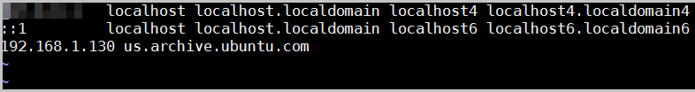
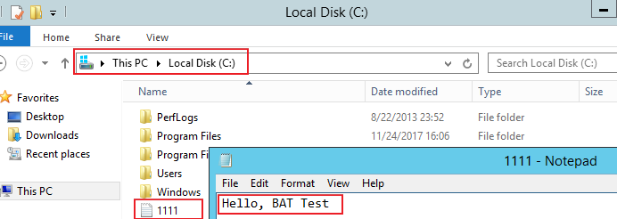
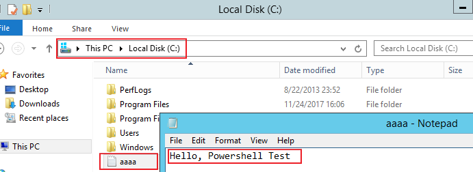
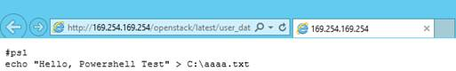

# 实例自定义数据注入<a name="ZH-CN_TOPIC_0032380449"></a>

## 使用场景<a name="section59120639141539"></a>

当您有如下需求时，可以考虑使用实例自定义数据注入功能来配置弹性云服务器：

-   需要通过脚本简化弹性云服务器配置
-   通过脚本初始化系统
-   已有脚本，在创建弹性云服务器的时候一并上传到服务器
-   其他可以使用脚本完成的功能

## 使用限制<a name="section31714110141539"></a>

-   Linux：
    -   用于创建弹性云服务器的镜像安装了Cloud-init组件。

    -   实例自定义数据大小限制：小于等于32KB。
    -   如果通过文本方式上传实例自定义数据，数据只能包含ASCII码字符；如果通过文件方式上传实例自定义数据，可以包含任意字符，同时，要求文件大小小于等于32KB。
    -   必须是公共镜像，或继承于公共镜像的私有镜像，或自行安装了Cloud-init组件的私有镜像。
    -   必须满足相应Linux弹性云服务器自定义脚本类型的格式要求。
    -   使用的VPC网络必须开启DHCP，安全组出方向规则保证80端口开放。
    -   选择“密码”登录方式时，不支持实例自定义数据注入功能。

-   Windows
    -   用于创建弹性云服务器的镜像安装了Cloudbase-init组件。
    -   实例自定义数据大小限制：小于等于32KB。
    -   如果通过文本方式上传实例自定义数据，数据只能包含ASCII码字符；如果通过文件方式上传实例自定义数据，可以包含任意字符，同时，要求文件大小小于等于32KB。
    -   必须是公共镜像，或继承于公共镜像的私有镜像，或自行安装了Cloudbase-init组件的私有镜像。
    -   使用 VPC网络必须开启DHCP，安全组出方向规则保证80端口开放。

## 使用方法<a name="section60709488141539"></a>

1.  根据实际需要写User-Data脚本，脚本格式必须符合User-Data脚本，详细规范请参见[相关链接](#section54344118153243)。
2.  创建弹性云服务器时，需将实例自定义数据脚本内容粘贴到“高级选项 \> 现在配置 \> 实例自定义数据注入”的文本框，或选择实例自定义数据文件上传。

    > **说明：** 
    >实例自定义数据注入支持使用文件和文本两种方式：
    >文本：将实例自定义数据脚本内容粘贴到文本框中。
    >文件：将实例自定义数据脚本内容保存至文本文件后再将上传。

    **图 1**  实例自定义数据注入<a name="fig5970191513404"></a>  
    

3.  系统创建弹性云服务器，弹性云服务器启动后自动执行Cloud-init或Cloudbase-init组件，读取实例自定义数据脚本。

## 关于Linux云服务器的实例自定义数据脚本<a name="section0609912614"></a>

Linux弹性云服务器的自定义实例自定义数据脚本（简称“脚本”）采用开源的Cloud-init架构实现，该架构以云服务器的元数据为数据来源，对弹性云服务器进行各项自动化配置。自定义脚本类型兼容开源Cloud-init，详情请参考Cloud-init开源说明：[http://cloudinit.readthedocs.io/en/latest/topics/format.html](http://cloudinit.readthedocs.io/en/latest/topics/format.html)。

-   脚本的执行时间：弹性云服务器的状态变为“running”之后，执行文件/etc/init之前。

    > **说明：** 
    >脚本默认以root用户权限执行。

-   脚本类型：包括“User-Data Script”和“Cloud-Config Data”。

    **表 1**  Linux云服务器脚本类型介绍

    <a name="table039994053718"></a>
    <table><thead align="left"><tr id="row4399194017376"><th class="cellrowborder" valign="top" width="9%" id="mcps1.2.4.1.1"><p id="p1239916402370"><a name="p1239916402370"></a><a name="p1239916402370"></a>-</p>
    </th>
    <th class="cellrowborder" valign="top" width="43%" id="mcps1.2.4.1.2"><p id="p1939914407374"><a name="p1939914407374"></a><a name="p1939914407374"></a>User-Data Script</p>
    </th>
    <th class="cellrowborder" valign="top" width="48%" id="mcps1.2.4.1.3"><p id="p1439913405374"><a name="p1439913405374"></a><a name="p1439913405374"></a>Cloud-Config Data</p>
    </th>
    </tr>
    </thead>
    <tbody><tr id="row3399194012374"><td class="cellrowborder" valign="top" width="9%" headers="mcps1.2.4.1.1 "><p id="p3399174019374"><a name="p3399174019374"></a><a name="p3399174019374"></a>描述</p>
    </td>
    <td class="cellrowborder" valign="top" width="43%" headers="mcps1.2.4.1.2 "><p id="p239984053714"><a name="p239984053714"></a><a name="p239984053714"></a>以脚本作为自定义配置的手段，如shell和python脚本。</p>
    </td>
    <td class="cellrowborder" valign="top" width="48%" headers="mcps1.2.4.1.3 "><p id="p839964053718"><a name="p839964053718"></a><a name="p839964053718"></a>Cloud-init中预定义的对云服务器部分服务进行配置的手段，如yum源、SSH 密钥。</p>
    </td>
    </tr>
    <tr id="row73991405372"><td class="cellrowborder" valign="top" width="9%" headers="mcps1.2.4.1.1 "><p id="p1399174073719"><a name="p1399174073719"></a><a name="p1399174073719"></a>格式</p>
    </td>
    <td class="cellrowborder" valign="top" width="43%" headers="mcps1.2.4.1.2 "><p id="p17890114419597"><a name="p17890114419597"></a><a name="p17890114419597"></a>首行必须是<span class="parmvalue" id="parmvalue089018443596"><a name="parmvalue089018443596"></a><a name="parmvalue089018443596"></a>“#!”</span>（如<span class="parmvalue" id="parmvalue15890644105916"><a name="parmvalue15890644105916"></a><a name="parmvalue15890644105916"></a>“#!/bin/bash和#!/usr/bin/env python”</span>），且前面不能有空格。</p>
    <p id="p173991540123716"><a name="p173991540123716"></a><a name="p173991540123716"></a>首次启动时，将在rc.local-like级别上执行，rc.local-like意味着“在启动序列中非常靠后”。</p>
    </td>
    <td class="cellrowborder" valign="top" width="48%" headers="mcps1.2.4.1.3 "><p id="p113991340193713"><a name="p113991340193713"></a><a name="p113991340193713"></a>首行必须是<span class="parmvalue" id="parmvalue9576171115445"><a name="parmvalue9576171115445"></a><a name="parmvalue9576171115445"></a>“#cloud-config”</span>，且前面不能有空格。</p>
    </td>
    </tr>
    <tr id="row3399114093716"><td class="cellrowborder" valign="top" width="9%" headers="mcps1.2.4.1.1 "><p id="p73991440103715"><a name="p73991440103715"></a><a name="p73991440103715"></a>限制</p>
    </td>
    <td class="cellrowborder" valign="top" width="43%" headers="mcps1.2.4.1.2 "><p id="p7399104013377"><a name="p7399104013377"></a><a name="p7399104013377"></a>在采用Base64编码前，脚本内容（包括首行在内）不能超过32KB。</p>
    </td>
    <td class="cellrowborder" valign="top" width="48%" headers="mcps1.2.4.1.3 "><p id="p5400134023711"><a name="p5400134023711"></a><a name="p5400134023711"></a>在采用Base64编码前，脚本内容（包括首行在内）不能超过32KB。</p>
    </td>
    </tr>
    <tr id="row11400540123715"><td class="cellrowborder" valign="top" width="9%" headers="mcps1.2.4.1.1 "><p id="p7599171419383"><a name="p7599171419383"></a><a name="p7599171419383"></a>频率</p>
    </td>
    <td class="cellrowborder" valign="top" width="43%" headers="mcps1.2.4.1.2 "><p id="p144004404378"><a name="p144004404378"></a><a name="p144004404378"></a>仅在首次启动<span id="text3547134918436"><a name="text3547134918436"></a><a name="text3547134918436"></a>弹性云服务器</span>时执行一次。</p>
    </td>
    <td class="cellrowborder" valign="top" width="48%" headers="mcps1.2.4.1.3 "><p id="p7400164012372"><a name="p7400164012372"></a><a name="p7400164012372"></a>配置的服务不同，执行频率也会不同。</p>
    </td>
    </tr>
    </tbody>
    </table>

-   如何查看注入Linux弹性云服务器的自定义数据？
    1.  登录弹性云服务器。
    2.  执行以下命令，以root用户权限查看实例自定义数据。

        **curl http://169.254.169.254/openstack/latest/user\_data**

-   脚本使用示例：

    该示例介绍如何以不同格式输入Linux弹性云服务器的脚本，并查看脚本的运行结果。

    **示例一：脚本类型为User-Data Script**

    创建弹性云服务器时，选择“文本”形式并输入实例自定义数据脚本，脚本如下：

    ```
    #!/bin/bash
    echo "Hello, the time is now $(date -R)" | tee /root/output.txt
    ```

    创建成功后，连接并启动弹性云服务器，执行命令**cat  _\[file\]_**，查看脚本的运行结果。

    ```
    [root@XXXXXXXX ~]# cat /root/output.txt
    Hello, the time is now Mon, 16 Jul 2016 16:03:18+0800
    ```

    **示例二：脚本类型为Cloud-Config Data**

    创建弹性云服务器时，选择“文本”形式并输入实例自定义数据脚本，脚本如下：

    ```
    #cloud-config
    bootcmd:
    - echo 192.168.1.130 us.archive.ubuntu.com >> /etc/hosts
    ```

    创建成功后，连接并启动弹性云服务器，执行命令**cat /etc/hosts**查看脚本的运行结果。

    **图 2**  查看运行结果<a name="fig1787242875415"></a>  
    

## 关于Windows弹性云服务器的实例自定义数据脚本<a name="section104417127157"></a>

Windows弹性云服务器的实例自定义数据脚本（简称“脚本”）采用开源的cloudbase-init架构实现，该架构以弹性云服务器的元数据为数据来源，对弹性云服务器进行各项自动化配置，为Windows弹性云服务器提供执行初始化脚本的能力。自定义脚本类型兼容开源Cloudbase-init，详情请参考Cloudbase-init开源说明：[https://cloudbase-init.readthedocs.io/en/latest/userdata.html](https://cloudbase-init.readthedocs.io/en/latest/userdata.html)。

-   脚本类型：包括“Batch批处理程序”和“PowerShell脚本”。

    **表 2**  Windows云服务器脚本类型介绍

    <a name="table17839134102219"></a>
    <table><thead align="left"><tr id="row168401412224"><th class="cellrowborder" valign="top" width="8.91089108910891%" id="mcps1.2.4.1.1"><p id="p9840194120228"><a name="p9840194120228"></a><a name="p9840194120228"></a>-</p>
    </th>
    <th class="cellrowborder" valign="top" width="43.56435643564357%" id="mcps1.2.4.1.2"><p id="p1584013415223"><a name="p1584013415223"></a><a name="p1584013415223"></a>Batch批处理程序</p>
    </th>
    <th class="cellrowborder" valign="top" width="47.524752475247524%" id="mcps1.2.4.1.3"><p id="p884014192212"><a name="p884014192212"></a><a name="p884014192212"></a>PowerShell脚本</p>
    </th>
    </tr>
    </thead>
    <tbody><tr id="row1384019418223"><td class="cellrowborder" valign="top" width="8.91089108910891%" headers="mcps1.2.4.1.1 "><p id="p784064142212"><a name="p784064142212"></a><a name="p784064142212"></a>格式</p>
    </td>
    <td class="cellrowborder" valign="top" width="43.56435643564357%" headers="mcps1.2.4.1.2 "><p id="p984016414220"><a name="p984016414220"></a><a name="p984016414220"></a>以<span class="parmvalue" id="parmvalue10976115811236"><a name="parmvalue10976115811236"></a><a name="parmvalue10976115811236"></a>“rem cmd”</span>开头且作为首行，且前面不能有空格。</p>
    </td>
    <td class="cellrowborder" valign="top" width="47.524752475247524%" headers="mcps1.2.4.1.3 "><p id="p138409411221"><a name="p138409411221"></a><a name="p138409411221"></a>以<span class="parmvalue" id="parmvalue17450145257"><a name="parmvalue17450145257"></a><a name="parmvalue17450145257"></a>“#ps1”</span>开头且作为首行，且前面不能有空格。</p>
    </td>
    </tr>
    <tr id="row11840841202215"><td class="cellrowborder" valign="top" width="8.91089108910891%" headers="mcps1.2.4.1.1 "><p id="p1840174162220"><a name="p1840174162220"></a><a name="p1840174162220"></a>限制</p>
    </td>
    <td class="cellrowborder" valign="top" width="43.56435643564357%" headers="mcps1.2.4.1.2 "><p id="p19840184112223"><a name="p19840184112223"></a><a name="p19840184112223"></a>在采用Base64编码前，脚本内容（包括首行在内）不能超过32KB。</p>
    </td>
    <td class="cellrowborder" valign="top" width="47.524752475247524%" headers="mcps1.2.4.1.3 "><p id="p384017415229"><a name="p384017415229"></a><a name="p384017415229"></a>在采用Base64编码前，脚本内容（包括首行在内）不能超过32KB。</p>
    </td>
    </tr>
    </tbody>
    </table>

-   如何查看注入Windows弹性云服务器的实例自定义数据？
    1.  登录弹性云服务器。
    2.  在浏览器栏访问如下地址，查看注入的实例自定义数据。

        **http://169.254.169.254/openstack/latest/user\_data**

-   脚本使用示例

    该示例介绍如何以不同格式输入Windows弹性云服务器的脚本，并查看脚本的运行结果。

    **示例一：Batch批处理程序**

    创建弹性云服务器时，选择“文本”形式并输入实例自定义数据，脚本如下：

    ```
    rem cmd
    echo "Hello, BAT Test" > C:\1111.txt
    ```

    创建成功后，连接并启动弹性云服务器，查看脚本的运行结果：在C:\\盘添加了一个名称为 “1111” 的文本文档，如[图3](#fig8622411077)所示。

    **图 3**  新建文本文档\_Batch<a name="fig8622411077"></a>  
    

    如需查看注入Windows弹性云服务器的实例自定义数据，可以在浏览器访问：http://169.254.169.254/openstack/latest/user\_data，如[图4](#fig14281122141212)所示。

    **图 4**  查看实例自定义数据\_Batch<a name="fig14281122141212"></a>  
    

    **示例二：PowerShell脚本**

    创建弹性云服务器时，选择“文本”形式并输入实例自定义数据，脚本如下：

    ```
    #ps1
    echo "Hello, Powershell Test" > C:\aaaa.txt
    ```

    创建成功后，连接并启动弹性云服务器，查看脚本的运行结果：在C:\\盘添加了一个名称为 “aaaa” 的文本文档。

    **图 5**  新建文本文档\_PowerShell<a name="fig103618447159"></a>  
    

    如需查看注入Windows弹性云服务器的实例自定义数据，可以在浏览器访问：http://169.254.169.254/openstack/latest/user\_data，如[图6](#fig124617204176)所示。

    **图 6**  查看实例自定义数据\_PowerShell<a name="fig124617204176"></a>  
    

## 案例1<a name="section24296060141539"></a>

该样例介绍如何通过实例自定义数据注入，为Linux弹性云服务器简化云服务器配置。

当您需要设置vim的“语法高亮显示”、“制表符占用4个空格”和“显示行数”属性时，就可以写一个脚本.vimrc，并将其注入到“/root/.vimrc”。在您创建完云服务器时，您的vim配置便完成了。这样做可以大幅提高系统配置的效率，特别是在您一次性创建多台弹性云服务器时。

实例自定义数据注入示例：

```
#cloud-config
write_files:
  - path: /root/.vimrc
    content: |
      syntax on
      set tabstop=4
      set number      
```

## 案例2<a name="section378450257"></a>

该样例介绍如何通过实例自定义数据注入，设置Linux弹性云服务器密码。

> **说明：** 
>新密码必须符合密码复杂度要求，密码规则如[表3](#ecs_03_0405_table4381109318958)所示。

**表 3**  密码设置规则

<a name="ecs_03_0405_table4381109318958"></a>
<table><thead align="left"><tr id="ecs_03_0401_zh-cn_topic_0067909751_ecs_03_0405_row925712618958"><th class="cellrowborder" valign="top" width="23.403978676374987%" id="mcps1.2.3.1.1"><p id="ecs_03_0401_zh-cn_topic_0067909751_ecs_03_0405_p1162970218958"><a name="ecs_03_0401_zh-cn_topic_0067909751_ecs_03_0405_p1162970218958"></a><a name="ecs_03_0401_zh-cn_topic_0067909751_ecs_03_0405_p1162970218958"></a>参数</p>
</th>
<th class="cellrowborder" valign="top" width="76.59602132362502%" id="mcps1.2.3.1.2"><p id="ecs_03_0401_zh-cn_topic_0067909751_ecs_03_0405_p248177818958"><a name="ecs_03_0401_zh-cn_topic_0067909751_ecs_03_0405_p248177818958"></a><a name="ecs_03_0401_zh-cn_topic_0067909751_ecs_03_0405_p248177818958"></a>规则</p>
</th>
</tr>
</thead>
<tbody><tr id="ecs_03_0401_zh-cn_topic_0067909751_ecs_03_0405_row4260571318958"><td class="cellrowborder" valign="top" width="23.403978676374987%" headers="mcps1.2.3.1.1 "><p id="ecs_03_0401_zh-cn_topic_0067909751_ecs_03_0405_p2851073918958"><a name="ecs_03_0401_zh-cn_topic_0067909751_ecs_03_0405_p2851073918958"></a><a name="ecs_03_0401_zh-cn_topic_0067909751_ecs_03_0405_p2851073918958"></a>密码</p>
</td>
<td class="cellrowborder" valign="top" width="76.59602132362502%" headers="mcps1.2.3.1.2 "><a name="ecs_03_0401_zh-cn_topic_0067909751_ecs_03_0405_ul5961106018958"></a><a name="ecs_03_0401_zh-cn_topic_0067909751_ecs_03_0405_ul5961106018958"></a><ul id="ecs_03_0401_zh-cn_topic_0067909751_ecs_03_0405_ul5961106018958"><li>密码长度范围为8到26位。</li><li>密码至少包含以下4种字符中的3种：<a name="ecs_03_0401_zh-cn_topic_0067909751_ecs_03_0405_ul24583583181022"></a><a name="ecs_03_0401_zh-cn_topic_0067909751_ecs_03_0405_ul24583583181022"></a><ul id="ecs_03_0401_zh-cn_topic_0067909751_ecs_03_0405_ul24583583181022"><li>大写字母</li><li>小写字母</li><li>数字</li><li>Windows操作系统<span id="ecs_03_0401_text13313716705"><a name="ecs_03_0401_text13313716705"></a><a name="ecs_03_0401_text13313716705"></a>云服务器</span>特殊字符：包括<span class="parmvalue" id="ecs_03_0401_zh-cn_topic_0067909751_parmvalue82532885311"><a name="ecs_03_0401_zh-cn_topic_0067909751_parmvalue82532885311"></a><a name="ecs_03_0401_zh-cn_topic_0067909751_parmvalue82532885311"></a>“$”</span>、<span class="parmvalue" id="ecs_03_0401_zh-cn_topic_0067909751_parmvalue172652895318"><a name="ecs_03_0401_zh-cn_topic_0067909751_parmvalue172652895318"></a><a name="ecs_03_0401_zh-cn_topic_0067909751_parmvalue172652895318"></a>“!”</span>、<span class="parmvalue" id="ecs_03_0401_zh-cn_topic_0067909751_parmvalue12662865312"><a name="ecs_03_0401_zh-cn_topic_0067909751_parmvalue12662865312"></a><a name="ecs_03_0401_zh-cn_topic_0067909751_parmvalue12662865312"></a>“@”</span>、<span class="parmvalue" id="ecs_03_0401_zh-cn_topic_0067909751_parmvalue15263281530"><a name="ecs_03_0401_zh-cn_topic_0067909751_parmvalue15263281530"></a><a name="ecs_03_0401_zh-cn_topic_0067909751_parmvalue15263281530"></a>“%”</span>、<span class="parmvalue" id="ecs_03_0401_zh-cn_topic_0067909751_parmvalue7269283538"><a name="ecs_03_0401_zh-cn_topic_0067909751_parmvalue7269283538"></a><a name="ecs_03_0401_zh-cn_topic_0067909751_parmvalue7269283538"></a>“-”</span>、<span class="parmvalue" id="ecs_03_0401_zh-cn_topic_0067909751_parmvalue426628125315"><a name="ecs_03_0401_zh-cn_topic_0067909751_parmvalue426628125315"></a><a name="ecs_03_0401_zh-cn_topic_0067909751_parmvalue426628125315"></a>“_”</span>、<span class="parmvalue" id="ecs_03_0401_zh-cn_topic_0067909751_parmvalue226102815533"><a name="ecs_03_0401_zh-cn_topic_0067909751_parmvalue226102815533"></a><a name="ecs_03_0401_zh-cn_topic_0067909751_parmvalue226102815533"></a>“=”</span>、<span class="parmvalue" id="ecs_03_0401_zh-cn_topic_0067909751_parmvalue52662825314"><a name="ecs_03_0401_zh-cn_topic_0067909751_parmvalue52662825314"></a><a name="ecs_03_0401_zh-cn_topic_0067909751_parmvalue52662825314"></a>“+”</span>、<span class="parmvalue" id="ecs_03_0401_zh-cn_topic_0067909751_parmvalue172618286538"><a name="ecs_03_0401_zh-cn_topic_0067909751_parmvalue172618286538"></a><a name="ecs_03_0401_zh-cn_topic_0067909751_parmvalue172618286538"></a>“[”</span>、<span class="parmvalue" id="ecs_03_0401_zh-cn_topic_0067909751_ecs_03_0405_parmvalue60359257144629"><a name="ecs_03_0401_zh-cn_topic_0067909751_ecs_03_0405_parmvalue60359257144629"></a><a name="ecs_03_0401_zh-cn_topic_0067909751_ecs_03_0405_parmvalue60359257144629"></a>“]”</span>、<span class="parmvalue" id="ecs_03_0401_zh-cn_topic_0067909751_ecs_03_0405_parmvalue60561486144642"><a name="ecs_03_0401_zh-cn_topic_0067909751_ecs_03_0405_parmvalue60561486144642"></a><a name="ecs_03_0401_zh-cn_topic_0067909751_ecs_03_0405_parmvalue60561486144642"></a>“:”</span>、<span class="parmvalue" id="ecs_03_0401_zh-cn_topic_0067909751_ecs_03_0405_parmvalue9333307144657"><a name="ecs_03_0401_zh-cn_topic_0067909751_ecs_03_0405_parmvalue9333307144657"></a><a name="ecs_03_0401_zh-cn_topic_0067909751_ecs_03_0405_parmvalue9333307144657"></a>“.”</span>、<span class="parmvalue" id="ecs_03_0401_zh-cn_topic_0067909751_ecs_03_0405_parmvalue6070704514474"><a name="ecs_03_0401_zh-cn_topic_0067909751_ecs_03_0405_parmvalue6070704514474"></a><a name="ecs_03_0401_zh-cn_topic_0067909751_ecs_03_0405_parmvalue6070704514474"></a>“/”</span>、<span class="parmvalue" id="ecs_03_0401_zh-cn_topic_0067909751_parmvalue19441647111215"><a name="ecs_03_0401_zh-cn_topic_0067909751_parmvalue19441647111215"></a><a name="ecs_03_0401_zh-cn_topic_0067909751_parmvalue19441647111215"></a>“,”</span>和<span class="parmvalue" id="ecs_03_0401_zh-cn_topic_0067909751_ecs_03_0405_parmvalue12765627144711"><a name="ecs_03_0401_zh-cn_topic_0067909751_ecs_03_0405_parmvalue12765627144711"></a><a name="ecs_03_0401_zh-cn_topic_0067909751_ecs_03_0405_parmvalue12765627144711"></a>“?”</span></li><li>Linux操作系统<span id="ecs_03_0401_text14704122114019"><a name="ecs_03_0401_text14704122114019"></a><a name="ecs_03_0401_text14704122114019"></a>云服务器</span>特殊字符：包括<span class="parmvalue" id="ecs_03_0401_zh-cn_topic_0067909751_parmvalue2087442019399"><a name="ecs_03_0401_zh-cn_topic_0067909751_parmvalue2087442019399"></a><a name="ecs_03_0401_zh-cn_topic_0067909751_parmvalue2087442019399"></a>“!”</span>、<span class="parmvalue" id="ecs_03_0401_zh-cn_topic_0067909751_parmvalue587413204392"><a name="ecs_03_0401_zh-cn_topic_0067909751_parmvalue587413204392"></a><a name="ecs_03_0401_zh-cn_topic_0067909751_parmvalue587413204392"></a>“@”</span>、<span class="parmvalue" id="ecs_03_0401_zh-cn_topic_0067909751_parmvalue1687452023910"><a name="ecs_03_0401_zh-cn_topic_0067909751_parmvalue1687452023910"></a><a name="ecs_03_0401_zh-cn_topic_0067909751_parmvalue1687452023910"></a>“%”</span>、<span class="parmvalue" id="ecs_03_0401_zh-cn_topic_0067909751_parmvalue1887513207391"><a name="ecs_03_0401_zh-cn_topic_0067909751_parmvalue1887513207391"></a><a name="ecs_03_0401_zh-cn_topic_0067909751_parmvalue1887513207391"></a>“-”</span>、<span class="parmvalue" id="ecs_03_0401_zh-cn_topic_0067909751_parmvalue787582043918"><a name="ecs_03_0401_zh-cn_topic_0067909751_parmvalue787582043918"></a><a name="ecs_03_0401_zh-cn_topic_0067909751_parmvalue787582043918"></a>“_”</span>、<span class="parmvalue" id="ecs_03_0401_zh-cn_topic_0067909751_parmvalue1387515204397"><a name="ecs_03_0401_zh-cn_topic_0067909751_parmvalue1387515204397"></a><a name="ecs_03_0401_zh-cn_topic_0067909751_parmvalue1387515204397"></a>“=”</span>、<span class="parmvalue" id="ecs_03_0401_zh-cn_topic_0067909751_parmvalue8875162015399"><a name="ecs_03_0401_zh-cn_topic_0067909751_parmvalue8875162015399"></a><a name="ecs_03_0401_zh-cn_topic_0067909751_parmvalue8875162015399"></a>“+”</span>、<span class="parmvalue" id="ecs_03_0401_zh-cn_topic_0067909751_parmvalue387518203396"><a name="ecs_03_0401_zh-cn_topic_0067909751_parmvalue387518203396"></a><a name="ecs_03_0401_zh-cn_topic_0067909751_parmvalue387518203396"></a>“[”</span>、<span class="parmvalue" id="ecs_03_0401_zh-cn_topic_0067909751_parmvalue2087592073917"><a name="ecs_03_0401_zh-cn_topic_0067909751_parmvalue2087592073917"></a><a name="ecs_03_0401_zh-cn_topic_0067909751_parmvalue2087592073917"></a>“]”</span>、<span class="parmvalue" id="ecs_03_0401_zh-cn_topic_0067909751_parmvalue13875102053917"><a name="ecs_03_0401_zh-cn_topic_0067909751_parmvalue13875102053917"></a><a name="ecs_03_0401_zh-cn_topic_0067909751_parmvalue13875102053917"></a>“:”</span>、<span class="parmvalue" id="ecs_03_0401_zh-cn_topic_0067909751_parmvalue13875152013397"><a name="ecs_03_0401_zh-cn_topic_0067909751_parmvalue13875152013397"></a><a name="ecs_03_0401_zh-cn_topic_0067909751_parmvalue13875152013397"></a>“.”</span>、<span class="parmvalue" id="ecs_03_0401_zh-cn_topic_0067909751_parmvalue13875202013919"><a name="ecs_03_0401_zh-cn_topic_0067909751_parmvalue13875202013919"></a><a name="ecs_03_0401_zh-cn_topic_0067909751_parmvalue13875202013919"></a>“/”</span>、<span class="parmvalue" id="ecs_03_0401_zh-cn_topic_0067909751_parmvalue5875102093915"><a name="ecs_03_0401_zh-cn_topic_0067909751_parmvalue5875102093915"></a><a name="ecs_03_0401_zh-cn_topic_0067909751_parmvalue5875102093915"></a>“^”</span>、<span class="parmvalue" id="ecs_03_0401_zh-cn_topic_0067909751_parmvalue20875132012393"><a name="ecs_03_0401_zh-cn_topic_0067909751_parmvalue20875132012393"></a><a name="ecs_03_0401_zh-cn_topic_0067909751_parmvalue20875132012393"></a>“,”</span>、<span class="parmvalue" id="ecs_03_0401_zh-cn_topic_0067909751_parmvalue88762020113912"><a name="ecs_03_0401_zh-cn_topic_0067909751_parmvalue88762020113912"></a><a name="ecs_03_0401_zh-cn_topic_0067909751_parmvalue88762020113912"></a>“{”</span>、<span class="parmvalue" id="ecs_03_0401_zh-cn_topic_0067909751_parmvalue128761420163911"><a name="ecs_03_0401_zh-cn_topic_0067909751_parmvalue128761420163911"></a><a name="ecs_03_0401_zh-cn_topic_0067909751_parmvalue128761420163911"></a>“}”</span>和<span class="parmvalue" id="ecs_03_0401_zh-cn_topic_0067909751_parmvalue178764203393"><a name="ecs_03_0401_zh-cn_topic_0067909751_parmvalue178764203393"></a><a name="ecs_03_0401_zh-cn_topic_0067909751_parmvalue178764203393"></a>“?”</span></li></ul>
</li><li>密码不能包含用户名或用户名的逆序。</li><li>Windows操作系统的<span id="ecs_03_0401_text153189271104"><a name="ecs_03_0401_text153189271104"></a><a name="ecs_03_0401_text153189271104"></a>云服务器</span>，不能包含用户名中超过两个连续字符的部分。</li><li>Windows操作系统的<span id="ecs_03_0401_text1737613813119"><a name="ecs_03_0401_text1737613813119"></a><a name="ecs_03_0401_text1737613813119"></a>云服务器</span>，不能以<span class="parmvalue" id="ecs_03_0401_parmvalue53516816106"><a name="ecs_03_0401_parmvalue53516816106"></a><a name="ecs_03_0401_parmvalue53516816106"></a>“/”</span>为密码首字符。</li></ul>
</td>
</tr>
</tbody>
</table>

实例自定义数据注入示例:

使用密文密码（推荐使用）：

```
#!/bin/bash 
echo 'root:$6$V6azyeLwcD3CHlpY$BN3VVq18fmCkj66B4zdHLWevqcxlig' | chpasswd -e;
```

其中，$6$V6azyeLwcD3CHlpY$BN3VVq18fmCkj66B4zdHLWevqcxlig为密文密码，生成方法如下：

1.  执行以下命令，生成加密盐值

    **python -c "import crypt, getpass, pwd;print crypt.mksalt\(\)"**

    回显信息如下：

    ```
    $6$V6azyeLwcD3CHlpY
    ```

2.  执行以下命令，根据盐值生成密文密码

    **python -c "import crypt, getpass, pwd;print crypt.crypt\('Cloud.1234','\\$6\\$V6azyeLwcD3CHlpY'\)"**

    回显信息如下：

    ```
    $6$V6azyeLwcD3CHlpY$BN3VVq18fmCkj66B4zdHLWevqcxlig
    ```

弹性云服务器创建成功后，您可以使用该密码登录。

## 案例3<a name="section852885517018"></a>

该样例介绍如何通过实例自定义数据注入，重置Linux弹性云服务器密码。

假设您需要将root用户密码重置为”\*\*\*\*\*\*“。

> **说明：** 
>新密码必须符合密码复杂度要求，密码规则如[表4](#table580060101120)所示。

**表 4**  密码设置规则

<a name="table580060101120"></a>
<table><thead align="left"><tr id="ecs_03_0401_zh-cn_topic_0067909751_ecs_03_0405_row925712618958_1"><th class="cellrowborder" valign="top" width="23.403978676374987%" id="mcps1.2.3.1.1"><p id="ecs_03_0401_zh-cn_topic_0067909751_ecs_03_0405_p1162970218958_1"><a name="ecs_03_0401_zh-cn_topic_0067909751_ecs_03_0405_p1162970218958_1"></a><a name="ecs_03_0401_zh-cn_topic_0067909751_ecs_03_0405_p1162970218958_1"></a>参数</p>
</th>
<th class="cellrowborder" valign="top" width="76.59602132362502%" id="mcps1.2.3.1.2"><p id="ecs_03_0401_zh-cn_topic_0067909751_ecs_03_0405_p248177818958_1"><a name="ecs_03_0401_zh-cn_topic_0067909751_ecs_03_0405_p248177818958_1"></a><a name="ecs_03_0401_zh-cn_topic_0067909751_ecs_03_0405_p248177818958_1"></a>规则</p>
</th>
</tr>
</thead>
<tbody><tr id="ecs_03_0401_zh-cn_topic_0067909751_ecs_03_0405_row4260571318958_1"><td class="cellrowborder" valign="top" width="23.403978676374987%" headers="mcps1.2.3.1.1 "><p id="ecs_03_0401_zh-cn_topic_0067909751_ecs_03_0405_p2851073918958_1"><a name="ecs_03_0401_zh-cn_topic_0067909751_ecs_03_0405_p2851073918958_1"></a><a name="ecs_03_0401_zh-cn_topic_0067909751_ecs_03_0405_p2851073918958_1"></a>密码</p>
</td>
<td class="cellrowborder" valign="top" width="76.59602132362502%" headers="mcps1.2.3.1.2 "><a name="ecs_03_0401_zh-cn_topic_0067909751_ecs_03_0405_ul5961106018958_1"></a><a name="ecs_03_0401_zh-cn_topic_0067909751_ecs_03_0405_ul5961106018958_1"></a><ul id="ecs_03_0401_zh-cn_topic_0067909751_ecs_03_0405_ul5961106018958_1"><li>密码长度范围为8到26位。</li><li>密码至少包含以下4种字符中的3种：<a name="ecs_03_0401_zh-cn_topic_0067909751_ecs_03_0405_ul24583583181022_1"></a><a name="ecs_03_0401_zh-cn_topic_0067909751_ecs_03_0405_ul24583583181022_1"></a><ul id="ecs_03_0401_zh-cn_topic_0067909751_ecs_03_0405_ul24583583181022_1"><li>大写字母</li><li>小写字母</li><li>数字</li><li>Windows操作系统<span id="ecs_03_0401_text13313716705_1"><a name="ecs_03_0401_text13313716705_1"></a><a name="ecs_03_0401_text13313716705_1"></a>云服务器</span>特殊字符：包括<span class="parmvalue" id="ecs_03_0401_zh-cn_topic_0067909751_parmvalue82532885311_1"><a name="ecs_03_0401_zh-cn_topic_0067909751_parmvalue82532885311_1"></a><a name="ecs_03_0401_zh-cn_topic_0067909751_parmvalue82532885311_1"></a>“$”</span>、<span class="parmvalue" id="ecs_03_0401_zh-cn_topic_0067909751_parmvalue172652895318_1"><a name="ecs_03_0401_zh-cn_topic_0067909751_parmvalue172652895318_1"></a><a name="ecs_03_0401_zh-cn_topic_0067909751_parmvalue172652895318_1"></a>“!”</span>、<span class="parmvalue" id="ecs_03_0401_zh-cn_topic_0067909751_parmvalue12662865312_1"><a name="ecs_03_0401_zh-cn_topic_0067909751_parmvalue12662865312_1"></a><a name="ecs_03_0401_zh-cn_topic_0067909751_parmvalue12662865312_1"></a>“@”</span>、<span class="parmvalue" id="ecs_03_0401_zh-cn_topic_0067909751_parmvalue15263281530_1"><a name="ecs_03_0401_zh-cn_topic_0067909751_parmvalue15263281530_1"></a><a name="ecs_03_0401_zh-cn_topic_0067909751_parmvalue15263281530_1"></a>“%”</span>、<span class="parmvalue" id="ecs_03_0401_zh-cn_topic_0067909751_parmvalue7269283538_1"><a name="ecs_03_0401_zh-cn_topic_0067909751_parmvalue7269283538_1"></a><a name="ecs_03_0401_zh-cn_topic_0067909751_parmvalue7269283538_1"></a>“-”</span>、<span class="parmvalue" id="ecs_03_0401_zh-cn_topic_0067909751_parmvalue426628125315_1"><a name="ecs_03_0401_zh-cn_topic_0067909751_parmvalue426628125315_1"></a><a name="ecs_03_0401_zh-cn_topic_0067909751_parmvalue426628125315_1"></a>“_”</span>、<span class="parmvalue" id="ecs_03_0401_zh-cn_topic_0067909751_parmvalue226102815533_1"><a name="ecs_03_0401_zh-cn_topic_0067909751_parmvalue226102815533_1"></a><a name="ecs_03_0401_zh-cn_topic_0067909751_parmvalue226102815533_1"></a>“=”</span>、<span class="parmvalue" id="ecs_03_0401_zh-cn_topic_0067909751_parmvalue52662825314_1"><a name="ecs_03_0401_zh-cn_topic_0067909751_parmvalue52662825314_1"></a><a name="ecs_03_0401_zh-cn_topic_0067909751_parmvalue52662825314_1"></a>“+”</span>、<span class="parmvalue" id="ecs_03_0401_zh-cn_topic_0067909751_parmvalue172618286538_1"><a name="ecs_03_0401_zh-cn_topic_0067909751_parmvalue172618286538_1"></a><a name="ecs_03_0401_zh-cn_topic_0067909751_parmvalue172618286538_1"></a>“[”</span>、<span class="parmvalue" id="ecs_03_0401_zh-cn_topic_0067909751_ecs_03_0405_parmvalue60359257144629_1"><a name="ecs_03_0401_zh-cn_topic_0067909751_ecs_03_0405_parmvalue60359257144629_1"></a><a name="ecs_03_0401_zh-cn_topic_0067909751_ecs_03_0405_parmvalue60359257144629_1"></a>“]”</span>、<span class="parmvalue" id="ecs_03_0401_zh-cn_topic_0067909751_ecs_03_0405_parmvalue60561486144642_1"><a name="ecs_03_0401_zh-cn_topic_0067909751_ecs_03_0405_parmvalue60561486144642_1"></a><a name="ecs_03_0401_zh-cn_topic_0067909751_ecs_03_0405_parmvalue60561486144642_1"></a>“:”</span>、<span class="parmvalue" id="ecs_03_0401_zh-cn_topic_0067909751_ecs_03_0405_parmvalue9333307144657_1"><a name="ecs_03_0401_zh-cn_topic_0067909751_ecs_03_0405_parmvalue9333307144657_1"></a><a name="ecs_03_0401_zh-cn_topic_0067909751_ecs_03_0405_parmvalue9333307144657_1"></a>“.”</span>、<span class="parmvalue" id="ecs_03_0401_zh-cn_topic_0067909751_ecs_03_0405_parmvalue6070704514474_1"><a name="ecs_03_0401_zh-cn_topic_0067909751_ecs_03_0405_parmvalue6070704514474_1"></a><a name="ecs_03_0401_zh-cn_topic_0067909751_ecs_03_0405_parmvalue6070704514474_1"></a>“/”</span>、<span class="parmvalue" id="ecs_03_0401_zh-cn_topic_0067909751_parmvalue19441647111215_1"><a name="ecs_03_0401_zh-cn_topic_0067909751_parmvalue19441647111215_1"></a><a name="ecs_03_0401_zh-cn_topic_0067909751_parmvalue19441647111215_1"></a>“,”</span>和<span class="parmvalue" id="ecs_03_0401_zh-cn_topic_0067909751_ecs_03_0405_parmvalue12765627144711_1"><a name="ecs_03_0401_zh-cn_topic_0067909751_ecs_03_0405_parmvalue12765627144711_1"></a><a name="ecs_03_0401_zh-cn_topic_0067909751_ecs_03_0405_parmvalue12765627144711_1"></a>“?”</span></li><li>Linux操作系统<span id="ecs_03_0401_text14704122114019_1"><a name="ecs_03_0401_text14704122114019_1"></a><a name="ecs_03_0401_text14704122114019_1"></a>云服务器</span>特殊字符：包括<span class="parmvalue" id="ecs_03_0401_zh-cn_topic_0067909751_parmvalue2087442019399_1"><a name="ecs_03_0401_zh-cn_topic_0067909751_parmvalue2087442019399_1"></a><a name="ecs_03_0401_zh-cn_topic_0067909751_parmvalue2087442019399_1"></a>“!”</span>、<span class="parmvalue" id="ecs_03_0401_zh-cn_topic_0067909751_parmvalue587413204392_1"><a name="ecs_03_0401_zh-cn_topic_0067909751_parmvalue587413204392_1"></a><a name="ecs_03_0401_zh-cn_topic_0067909751_parmvalue587413204392_1"></a>“@”</span>、<span class="parmvalue" id="ecs_03_0401_zh-cn_topic_0067909751_parmvalue1687452023910_1"><a name="ecs_03_0401_zh-cn_topic_0067909751_parmvalue1687452023910_1"></a><a name="ecs_03_0401_zh-cn_topic_0067909751_parmvalue1687452023910_1"></a>“%”</span>、<span class="parmvalue" id="ecs_03_0401_zh-cn_topic_0067909751_parmvalue1887513207391_1"><a name="ecs_03_0401_zh-cn_topic_0067909751_parmvalue1887513207391_1"></a><a name="ecs_03_0401_zh-cn_topic_0067909751_parmvalue1887513207391_1"></a>“-”</span>、<span class="parmvalue" id="ecs_03_0401_zh-cn_topic_0067909751_parmvalue787582043918_1"><a name="ecs_03_0401_zh-cn_topic_0067909751_parmvalue787582043918_1"></a><a name="ecs_03_0401_zh-cn_topic_0067909751_parmvalue787582043918_1"></a>“_”</span>、<span class="parmvalue" id="ecs_03_0401_zh-cn_topic_0067909751_parmvalue1387515204397_1"><a name="ecs_03_0401_zh-cn_topic_0067909751_parmvalue1387515204397_1"></a><a name="ecs_03_0401_zh-cn_topic_0067909751_parmvalue1387515204397_1"></a>“=”</span>、<span class="parmvalue" id="ecs_03_0401_zh-cn_topic_0067909751_parmvalue8875162015399_1"><a name="ecs_03_0401_zh-cn_topic_0067909751_parmvalue8875162015399_1"></a><a name="ecs_03_0401_zh-cn_topic_0067909751_parmvalue8875162015399_1"></a>“+”</span>、<span class="parmvalue" id="ecs_03_0401_zh-cn_topic_0067909751_parmvalue387518203396_1"><a name="ecs_03_0401_zh-cn_topic_0067909751_parmvalue387518203396_1"></a><a name="ecs_03_0401_zh-cn_topic_0067909751_parmvalue387518203396_1"></a>“[”</span>、<span class="parmvalue" id="ecs_03_0401_zh-cn_topic_0067909751_parmvalue2087592073917_1"><a name="ecs_03_0401_zh-cn_topic_0067909751_parmvalue2087592073917_1"></a><a name="ecs_03_0401_zh-cn_topic_0067909751_parmvalue2087592073917_1"></a>“]”</span>、<span class="parmvalue" id="ecs_03_0401_zh-cn_topic_0067909751_parmvalue13875102053917_1"><a name="ecs_03_0401_zh-cn_topic_0067909751_parmvalue13875102053917_1"></a><a name="ecs_03_0401_zh-cn_topic_0067909751_parmvalue13875102053917_1"></a>“:”</span>、<span class="parmvalue" id="ecs_03_0401_zh-cn_topic_0067909751_parmvalue13875152013397_1"><a name="ecs_03_0401_zh-cn_topic_0067909751_parmvalue13875152013397_1"></a><a name="ecs_03_0401_zh-cn_topic_0067909751_parmvalue13875152013397_1"></a>“.”</span>、<span class="parmvalue" id="ecs_03_0401_zh-cn_topic_0067909751_parmvalue13875202013919_1"><a name="ecs_03_0401_zh-cn_topic_0067909751_parmvalue13875202013919_1"></a><a name="ecs_03_0401_zh-cn_topic_0067909751_parmvalue13875202013919_1"></a>“/”</span>、<span class="parmvalue" id="ecs_03_0401_zh-cn_topic_0067909751_parmvalue5875102093915_1"><a name="ecs_03_0401_zh-cn_topic_0067909751_parmvalue5875102093915_1"></a><a name="ecs_03_0401_zh-cn_topic_0067909751_parmvalue5875102093915_1"></a>“^”</span>、<span class="parmvalue" id="ecs_03_0401_zh-cn_topic_0067909751_parmvalue20875132012393_1"><a name="ecs_03_0401_zh-cn_topic_0067909751_parmvalue20875132012393_1"></a><a name="ecs_03_0401_zh-cn_topic_0067909751_parmvalue20875132012393_1"></a>“,”</span>、<span class="parmvalue" id="ecs_03_0401_zh-cn_topic_0067909751_parmvalue88762020113912_1"><a name="ecs_03_0401_zh-cn_topic_0067909751_parmvalue88762020113912_1"></a><a name="ecs_03_0401_zh-cn_topic_0067909751_parmvalue88762020113912_1"></a>“{”</span>、<span class="parmvalue" id="ecs_03_0401_zh-cn_topic_0067909751_parmvalue128761420163911_1"><a name="ecs_03_0401_zh-cn_topic_0067909751_parmvalue128761420163911_1"></a><a name="ecs_03_0401_zh-cn_topic_0067909751_parmvalue128761420163911_1"></a>“}”</span>和<span class="parmvalue" id="ecs_03_0401_zh-cn_topic_0067909751_parmvalue178764203393_1"><a name="ecs_03_0401_zh-cn_topic_0067909751_parmvalue178764203393_1"></a><a name="ecs_03_0401_zh-cn_topic_0067909751_parmvalue178764203393_1"></a>“?”</span></li></ul>
</li><li>密码不能包含用户名或用户名的逆序。</li><li>Windows操作系统的<span id="ecs_03_0401_text153189271104_1"><a name="ecs_03_0401_text153189271104_1"></a><a name="ecs_03_0401_text153189271104_1"></a>云服务器</span>，不能包含用户名中超过两个连续字符的部分。</li><li>Windows操作系统的<span id="ecs_03_0401_text1737613813119_1"><a name="ecs_03_0401_text1737613813119_1"></a><a name="ecs_03_0401_text1737613813119_1"></a>云服务器</span>，不能以<span class="parmvalue" id="ecs_03_0401_parmvalue53516816106_1"><a name="ecs_03_0401_parmvalue53516816106_1"></a><a name="ecs_03_0401_parmvalue53516816106_1"></a>“/”</span>为密码首字符。</li></ul>
</td>
</tr>
</tbody>
</table>

实例自定义数据注入示例（请严格遵守下面示例中的缩进标准）:

```
#cloud-config
chpasswd:
  list: |
    root:******
  expire: False
```

弹性云服务器创建成功后，您可以使用重置的密码登录弹性云服务器。为了保证密码安全，建议您在第一次登录弹性云服务器后，修改root用户密码。

## 案例4<a name="section2212289417182"></a>

该样例介绍如何通过实例自定义数据注入，为Windows弹性云服务器新增用户并设置密码。

假设您要创建的用户名为abc、密码为“\*\*\*\*\*\*”的普通用户，并将其添加至administrators用户组。

> **说明：** 
>新密码必须符合密码复杂度要求，密码规则如[表4](#table580060101120)所示。

实例自定义数据注入示例：

```
rem cmd
net user abc ****** /add
net localgroup administrators abc /add
```

弹性云服务器创建成功后，您可以使用新创建的用户名和密码登录弹性云服务器。

## 案例5<a name="section19429115512011"></a>

该样例介绍如何通过实例自定义数据注入，为Linux弹性云服务器更新系统软件包，并且开启httpd相关服务。注入成功后，您的弹性云服务器就可以使用httpd服务了。

实例自定义数据注入示例：

```
#!/bin/bash
yum update -y
service httpd start
chkconfig httpd on
```

## 案例6<a name="section22603169194910"></a>

该样例介绍如何通过实例自定义数据注入，激活Linux弹性云服务器的root用户远程登录权限。注入成功后，您可以使用SSH密钥方式，以root账户登录弹性云服务器。

实例自定义数据注入示例：

```
#cloud-config
disable_root: false
runcmd:
- sed -i 's/^PermitRootLogin.*$/PermitRootLogin without-password/' /etc/ssh/sshd_config
- sed -i '/^KexAlgorithms.*$/d' /etc/ssh/sshd_config
- service sshd restart
```

## 相关链接<a name="section54344118153243"></a>

更多关于实例自定义数据注入案例的介绍，请参见Cloud-init/Cloudbase-init官网：

-   [https://cloudinit.readthedocs.io/en/latest/](https://cloudinit.readthedocs.io/en/latest/)

-   [https://cloudbase-init.readthedocs.io/en/latest/](https://cloudbase-init.readthedocs.io/en/latest/)

