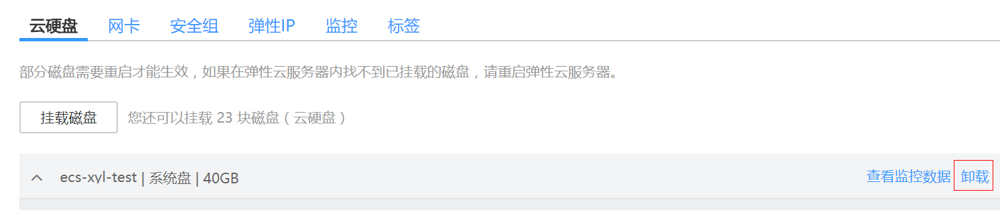
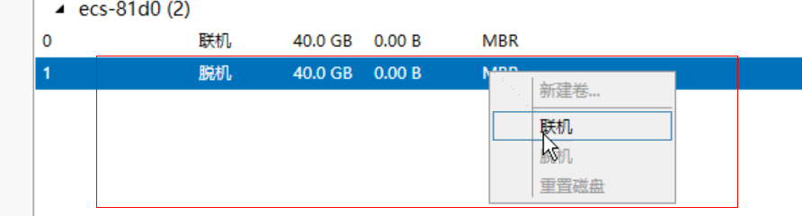

# 密钥对方式购买的弹性云服务器，使用私钥文件获取登录密码失败

## 可能原因

1.  出现获取密码失败一般原因是弹性云服务器cloudinit失败，没有通过cloudinit注入密码。
2.  Cloudinit注入密码失败原因有：
    -   网络原因导致弹性云服务器无法连接到cloudinit服务器。
    -   镜像上cloudinit没有获取密码相关配置。
    -   弹性云服务器上其他问题导致弹性云服务器cloudinit无法获取。

## 处理办法

1.  检查弹性云服务器的网络配置，是否导致弹性云服务器cloudinit失败，操作如下：
    -   弹性云服务器所在安全组80端口的“出方向”和“入方向”是否放通。

        **图 1**  安全组80端口规则  
        

    -   弹性云服务器所在子网DHCP是否放通。

        **图 2**  DHCP  
        

2.  检查镜像上cloudinit是否配置了获取密码，当前HEC环境中的所有公共镜像均已正确配置cloudinit。
    -   如果客户使用公共镜像则无需检查此项。
    -   如果客户使用私有镜像创建弹性云服务器，则需要确认镜像中已正确配置了cloudinit。

3.  其他方面：大规格弹性云服务器的虚拟内存导致客户弹性云服务器cloudinit执行失败。
4.  通过查看日志检查原因，cloudinit日志查看步骤如下：
    1.  将无法获取密钥的弹性云服务器关机后，将系统盘卸载。

        **图 3**  卸载系统盘  
        

    2.  使用公共镜像创建一个临时windows弹性云服务器，将[4.a](#zh-cn_topic_0096364086_li16969123912115)中卸载的卷挂载在此弹性云服务器上。
    3.  登录临时创建的弹性云服务器，打开服务器管理器，选择“文件和存储服务 \> 卷 \> 磁盘”，单击鼠标右键选择“脱机”状态的磁盘，单击“联机”。

        **图 4**  磁盘联机  
        

    4.  打开新联机的磁盘，查看“/Programe Files/Cloudbase Solution/Cloudbase-Init/log”路径下的“cloudbase-init”文件，通过日志查看原因。

        **图 5**  查看cloudbase-init文件  
        

