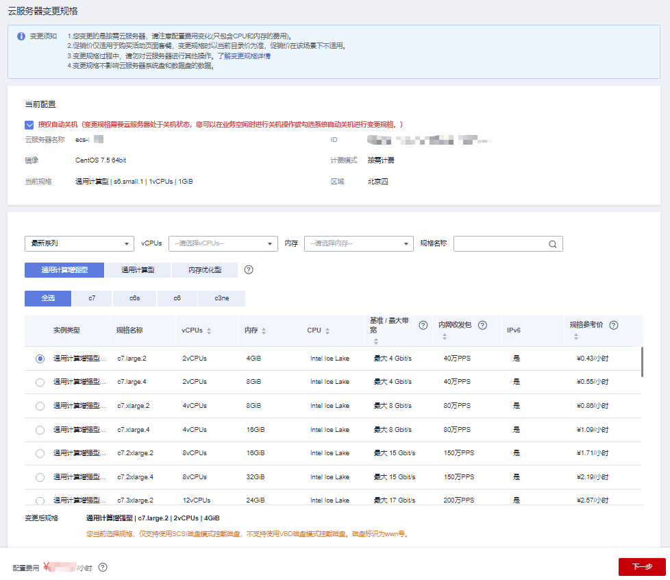

# 开启/关闭超线程

## 操作场景

购买弹性云服务器时，您可以通过设置“CPU选项”，开启或关闭超线程。若不设置，则默认开启超线程。

对于支持开启/关闭超线程的X86架构弹性云服务器实例：

-   开启超线程：适用于需要CPU内核在同一时间并行处理更多的信息和后台任务的场景，开启多线程可以大幅提升计算体验。
-   关闭超线程：适用于计算密集型，且关闭超线程时性能优于开启超线程的场景，例如风机荷载、材料计算等HPC场景。

您可以在购买弹性云服务器或变更规格时，开启或关闭超线程。

## 背景知识

弹性云服务器的处理器运用超线程HT（Hyper-Threading）技术，允许在CPU的每个物理内核上公开两个执行上下文，即一个物理内核包含两个虚拟的“逻辑内核”，可以处理不同的软件线程。vCPU（virtual CPU）即为虚拟的“逻辑内核”。

规格名称展示vCPU数，即逻辑内核数。在弹性云服务器上可以查看实际的逻辑CPU内核数。

当前绝大多数规格已经默认开启了超线程，如果在创建弹性云服务器或者变更规格时关闭了超线程，则在弹性云服务器上查看到的CPU核数是规格的Flavor名称中展示的vCPU数量的一半。

例如，对于c7.xlarge.2，其vCPU数，即逻辑内核数为4，2核的物理CPU包含4个vCPU（线程）。若关闭了超线程，则在c7.xlarge.2弹性云服务器上查看到的CPU核数是2。

## 约束与限制

-   弹性云服务器购买完成后无法修改超线程状态，需要通过变更规格的方式修改ECS实例的超线程状态。
-   该操作不涉及收费。
-   支持开启或关闭超线程的规格，请参见[规格清单（X86）](https://support.huaweicloud.com/productdesc-ecs/zh-cn_topic_0159822360.html)

## 开启/关闭超线程（购买时）

1.  登录控制台，进入[购买弹性云服务器](https://console.huaweicloud.com/ecm/?locale=zh-cn#/ecs/createVm)页面。

    根据业务需要，完成基础配置、网络配置以及高级配置。详细内容，请参见[购买弹性云服务器](https://support.huaweicloud.com/qs-ecs/ecs_02_0009.html)。

2.  勾选“现在配置”，展开“高级选项”。
3.  勾选“指定CPU选项”。

    **图 1**  设置CPU选项  
    

4.  设置“每核心线程数”。

    当勾选“指定CPU选项”时，显示该参数。在“每核心线程数”下拉框进行设置。

    -   1：关闭超线程
    -   2：开启超线程，默认开启

5.  单击“下一步：确认配置”，确认参数并完成弹性云服务器的购买。

## 开启/关闭超线程（变更规格时）

1.  登录管理控制台。
2.  单击管理控制台左上角的，选择区域和项目。
3.  单击“”，选择“计算 \> 弹性云服务器”。
4.  在弹性云服务器列表，单击待变更的弹性云服务器“操作”列下的“更多 \> 变更规格”。

    系统进入“云服务器变更规格”页面。

5.  根据界面提示，选择变更后的弹性云服务器类型、vCPU和内存。

    变更规格前请先将云服务器关机，或根据页面提示勾选“授权自动关机”。

    **图 2**  变更规格  
    

6.  （可选）勾选“指定CPU选项”。

    当需要为云服务器实例开启或关闭超线程时，勾选“指定CPU选项”。

7.  （可选）设置“每核心线程数”。

    当勾选“指定CPU选项”时，显示该参数。在“每核心线程数”下拉框进行设置。

    -   1：关闭超线程
    -   2：开启超线程，默认开启

8.  单击“下一步”。
9.  确认变更后的配置无误后，阅读并勾选同意服务协议，单击“提交申请”开始变更。

