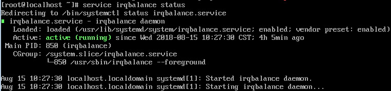

# 开启网卡多队列功能<a name="ZH-CN_TOPIC_0058758453"></a>

随着网络IO的带宽不断提升，单核CPU处理网络中断存在瓶颈，不能完全满足网卡的需求，通过开启网卡多队列功能，您可以将弹性云服务器中的网卡中断分散给不同的CPU处理，以满足网卡的需求，从而提升网络PPS和带宽性能。

## 网卡多队列支持列表<a name="section61531153105531"></a>

虚拟化类型为XEN的弹性云服务器，不支持开启网卡多队列。

虚拟化类型为KVM的弹性云服务器，使用[表1](#table156182325381)镜像时，支持开启网卡多队列功能。

**表 1**  KVM云服务器网卡多队列支持列表

<a name="table156182325381"></a>
<table><thead align="left"><tr id="row1861863233810"><th class="cellrowborder" valign="top" width="16.831683168316832%" id="mcps1.2.4.1.1"><p id="p1661843273818"><a name="p1661843273818"></a><a name="p1661843273818"></a>类别</p>
</th>
<th class="cellrowborder" valign="top" width="60.396039603960396%" id="mcps1.2.4.1.2"><p id="p15634163243813"><a name="p15634163243813"></a><a name="p15634163243813"></a>镜像</p>
</th>
<th class="cellrowborder" valign="top" width="22.772277227722775%" id="mcps1.2.4.1.3"><p id="p1663433217381"><a name="p1663433217381"></a><a name="p1663433217381"></a>支持度</p>
</th>
</tr>
</thead>
<tbody><tr id="row196345329389"><td class="cellrowborder" rowspan="6" valign="top" width="16.831683168316832%" headers="mcps1.2.4.1.1 "><p id="p18634123218389"><a name="p18634123218389"></a><a name="p18634123218389"></a>Windows</p>
</td>
<td class="cellrowborder" valign="top" width="60.396039603960396%" headers="mcps1.2.4.1.2 "><p id="p20634032193811"><a name="p20634032193811"></a><a name="p20634032193811"></a>Windows Server 2008 WEB R2 64bit</p>
</td>
<td class="cellrowborder" valign="top" width="22.772277227722775%" headers="mcps1.2.4.1.3 "><p id="p126346327381"><a name="p126346327381"></a><a name="p126346327381"></a>可通过私有镜像支持</p>
</td>
</tr>
<tr id="row1268063514814"><td class="cellrowborder" valign="top" headers="mcps1.2.4.1.1 "><p id="p1068023518488"><a name="p1068023518488"></a><a name="p1068023518488"></a>Windows Server 2008 Enterprise SP2 64bit</p>
</td>
<td class="cellrowborder" valign="top" headers="mcps1.2.4.1.2 "><p id="p13577102491"><a name="p13577102491"></a><a name="p13577102491"></a>可通过私有镜像支持</p>
</td>
</tr>
<tr id="row1963413283814"><td class="cellrowborder" valign="top" headers="mcps1.2.4.1.1 "><p id="p11650832113816"><a name="p11650832113816"></a><a name="p11650832113816"></a>Windows Server 2008 R2 Standard/Datacenter/Enterprise 64bit</p>
</td>
<td class="cellrowborder" valign="top" headers="mcps1.2.4.1.2 "><p id="p9592180194915"><a name="p9592180194915"></a><a name="p9592180194915"></a>可通过私有镜像支持</p>
</td>
</tr>
<tr id="row8869203794714"><td class="cellrowborder" valign="top" headers="mcps1.2.4.1.1 "><p id="p1586943715479"><a name="p1586943715479"></a><a name="p1586943715479"></a>Windows Server 2008 R2 Enterprise 64bit_WithGPUdriver</p>
</td>
<td class="cellrowborder" valign="top" headers="mcps1.2.4.1.2 "><p id="p1859280134920"><a name="p1859280134920"></a><a name="p1859280134920"></a>可通过私有镜像支持</p>
</td>
</tr>
<tr id="row146911394484"><td class="cellrowborder" valign="top" headers="mcps1.2.4.1.1 "><p id="p106912974812"><a name="p106912974812"></a><a name="p106912974812"></a>Windows Server 2012 R2 Standard 64bit_WithGPUdriver</p>
</td>
<td class="cellrowborder" valign="top" headers="mcps1.2.4.1.2 "><p id="p2059216014914"><a name="p2059216014914"></a><a name="p2059216014914"></a>可通过私有镜像支持</p>
</td>
</tr>
<tr id="row136506329389"><td class="cellrowborder" valign="top" headers="mcps1.2.4.1.1 "><p id="p1865017329388"><a name="p1865017329388"></a><a name="p1865017329388"></a>Windows Server 2012 R2 Standard/Datacenter 64bit</p>
</td>
<td class="cellrowborder" valign="top" headers="mcps1.2.4.1.2 "><p id="p265019321387"><a name="p265019321387"></a><a name="p265019321387"></a>可通过私有镜像支持</p>
</td>
</tr>
<tr id="row13650193283817"><td class="cellrowborder" rowspan="9" valign="top" width="16.831683168316832%" headers="mcps1.2.4.1.1 "><p id="p18650132133812"><a name="p18650132133812"></a><a name="p18650132133812"></a>Linux</p>
<p id="p15351416135520"><a name="p15351416135520"></a><a name="p15351416135520"></a></p>
</td>
<td class="cellrowborder" valign="top" width="60.396039603960396%" headers="mcps1.2.4.1.2 "><p id="p186501032113812"><a name="p186501032113812"></a><a name="p186501032113812"></a>Ubuntu 14.04 server 32bit</p>
</td>
<td class="cellrowborder" valign="top" width="22.772277227722775%" headers="mcps1.2.4.1.3 "><p id="p465013215382"><a name="p465013215382"></a><a name="p465013215382"></a>支持</p>
</td>
</tr>
<tr id="row76501532123814"><td class="cellrowborder" valign="top" headers="mcps1.2.4.1.1 "><p id="p17665332153814"><a name="p17665332153814"></a><a name="p17665332153814"></a>Ubuntu 14.04/16.04 server 64bit</p>
</td>
<td class="cellrowborder" valign="top" headers="mcps1.2.4.1.2 "><p id="p1366593219388"><a name="p1366593219388"></a><a name="p1366593219388"></a>支持</p>
</td>
</tr>
<tr id="row2665332173810"><td class="cellrowborder" valign="top" headers="mcps1.2.4.1.1 "><p id="p3665103283820"><a name="p3665103283820"></a><a name="p3665103283820"></a>OpenSUSE 13.2/42.2 64bit</p>
</td>
<td class="cellrowborder" valign="top" headers="mcps1.2.4.1.2 "><p id="p106652329386"><a name="p106652329386"></a><a name="p106652329386"></a>支持</p>
</td>
</tr>
<tr id="row7665193214389"><td class="cellrowborder" valign="top" headers="mcps1.2.4.1.1 "><p id="p136651632163819"><a name="p136651632163819"></a><a name="p136651632163819"></a>SUSE Enterprise 12 SP1/SP2 64bit</p>
</td>
<td class="cellrowborder" valign="top" headers="mcps1.2.4.1.2 "><p id="p1666553293816"><a name="p1666553293816"></a><a name="p1666553293816"></a>支持</p>
</td>
</tr>
<tr id="row86658321389"><td class="cellrowborder" valign="top" headers="mcps1.2.4.1.1 "><p id="p66651732133819"><a name="p66651732133819"></a><a name="p66651732133819"></a>CentOS 6.3/6.5/6.8/6.9/7.0/7.1/7.2/7.3/7.4 64bit</p>
</td>
<td class="cellrowborder" valign="top" headers="mcps1.2.4.1.2 "><p id="p136651532193818"><a name="p136651532193818"></a><a name="p136651532193818"></a>支持</p>
</td>
</tr>
<tr id="row4681133219381"><td class="cellrowborder" valign="top" headers="mcps1.2.4.1.1 "><p id="p1468143203810"><a name="p1468143203810"></a><a name="p1468143203810"></a>Redhat 6.10/7.5 64bit</p>
</td>
<td class="cellrowborder" valign="top" headers="mcps1.2.4.1.2 "><p id="p20681163243817"><a name="p20681163243817"></a><a name="p20681163243817"></a>支持</p>
</td>
</tr>
<tr id="row13404444105315"><td class="cellrowborder" valign="top" headers="mcps1.2.4.1.1 "><p id="p3404644155310"><a name="p3404644155310"></a><a name="p3404644155310"></a>Debian 8.2.0/8.8.0/9.0.0 64bit</p>
</td>
<td class="cellrowborder" valign="top" headers="mcps1.2.4.1.2 "><p id="p940419448531"><a name="p940419448531"></a><a name="p940419448531"></a>支持</p>
</td>
</tr>
<tr id="row196811732113819"><td class="cellrowborder" valign="top" headers="mcps1.2.4.1.1 "><p id="p206818326383"><a name="p206818326383"></a><a name="p206818326383"></a>Fedora 24/25 64bit</p>
</td>
<td class="cellrowborder" valign="top" headers="mcps1.2.4.1.2 "><p id="p17681163223812"><a name="p17681163223812"></a><a name="p17681163223812"></a>支持</p>
</td>
</tr>
<tr id="row868123211384"><td class="cellrowborder" valign="top" headers="mcps1.2.4.1.1 "><p id="p156962032183816"><a name="p156962032183816"></a><a name="p156962032183816"></a>EulerOS 2.2 64bit</p>
</td>
<td class="cellrowborder" valign="top" headers="mcps1.2.4.1.2 "><p id="p66968325381"><a name="p66968325381"></a><a name="p66968325381"></a>支持</p>
</td>
</tr>
</tbody>
</table>

> **说明：**   
>-   查看弹性云服务器的虚拟化类型和网卡队列数，请参见“[实例和应用场景](https://support.huaweicloud.com/productdesc-ecs/zh-cn_topic_0035470096.html)”章节各实例规格的介绍。  
>-   Windows弹性云服务器怎样通过私有镜像支持网卡多队列属性，请参见“[如何设置镜像的网卡多队列属性](https://support.huaweicloud.com/ims_faq/ims_faq_0030.html)”。  

## 操作步骤<a name="section214227201118"></a>

使用Windows操作系统的KVM弹性云服务器，可通过私有镜像支持网卡多队列功能，具体操作请参见《镜像服务用户指南》的“如何设置镜像的网卡多队列属性”章节。

使用Linux操作系统的弹性云服务器，本节以CentOS 7.4为例，介绍开启网卡多队列的具体操作：

1.  开启网卡多队列功能

    1.  登录弹性云服务器。
    2.  执行以下命令，查看网卡支持和已开启的队列数。

        **ethtool -l  _网卡_**

    3.  执行以下命令，设置网卡当前使用的队列数。

        **ethtool -L** _**网卡**_ **combined** _**队列数**_


    示例：

    ```
    [root@localhost ~]# ethtool -l eth0  #查询网卡eth0的队列数
    Channel parameters for eth0:
    Pre-set maximums:
    RX:               0
    TX:               0
    Other:                  0
    Combined: 4  #表示此网卡最多支持设置开启4个队列
    Current hardware settings:
    RX:               0
    TX:               0
    Other:                  0
    Combined: 1 #表示当前开启的是1个队列
    
    [root@localhost ~]# ethtool -L eth0 combined 4 #设置eth0网卡开启4个队列
    ```

2.  （可选）建议开启irqbalance服务，让系统自动调整网卡中断在多个CPU核上的分配。
    1.  执行以下命令，开启irqbalance服务。

        **service irqbalance start**

    2.  执行以下命令，查询irqbalance服务状态。

        **service irqbalance status**

        如果回显中“Active”字段的值包含“active\(running\)”，表示irqbalance服务已正常开启，如[图1](#fig165114253253)所示。

        **图 1**  irqbalance服务正常开启<a name="fig165114253253"></a>  
        


3.  （可选）开启中断绑定。

    开启irqbalance服务让中断自由调度，网络性能提升。如果提升后的网络性能仍不满足您的预期，可以手动设置弹性云服务器操作系统的中断亲和性。

    具体操作如下：

    执行以下脚本，使得弹性云服务器中每个CPU服务一个多队列的中断请求，一对一的对应设置。即一个队列对应一个中断号，一个中断号绑定一个CPU，一一对应。

    ```
    #!/bin/bash
    service irqbalance stop
    
    eth_dirs=$(ls -d /sys/class/net/eth*)
    if [ $? -ne 0 ];then
        echo "Failed to find eth*  , sleep 30" >> $ecs_network_log
        sleep 30
        eth_dirs=$(ls -d /sys/class/net/eth*)
    fi
    
    for eth in $eth_dirs
    do
        cur_eth=$(basename $eth)
        cpu_count=`cat /proc/cpuinfo| grep "processor"| wc -l`
        virtio_name=$(ls -l /sys/class/net/"$cur_eth"/device/driver/ | grep pci |awk {'print $9'})
    
        affinity_cpu=0
        virtio_input="$virtio_name""-input"
        irqs_in=$(grep "$virtio_input" /proc/interrupts | awk -F ":" '{print $1}')
        for irq in ${irqs_in[*]}
        do
            echo $((affinity_cpu%cpu_count)) > /proc/irq/"$irq"/smp_affinity_list
            affinity_cpu=$[affinity_cpu+2]
        done
    
        affinity_cpu=1
        virtio_output="$virtio_name""-output"
        irqs_out=$(grep "$virtio_output" /proc/interrupts | awk -F ":" '{print $1}')
        for irq in ${irqs_out[*]}
        do
            echo $((affinity_cpu%cpu_count)) > /proc/irq/"$irq"/smp_affinity_list
            affinity_cpu=$[affinity_cpu+2]
        done
    done
    ```

4.  （可选）开启XPS、RPS特性。

    xps主要是针对多队列的网卡发送时的优化，当发送一个数据包的时候，它会根据CPU来选择对应的队列。

    ```
    #!/bin/bash
    # enable XPS feature
    cpu_count=$(grep -c processor /proc/cpuinfo)
    dec2hex(){
      echo $(printf "%x" $1)
    }
    eth_dirs=$(ls -d /sys/class/net/eth*)
    if [ $? -ne 0 ];then
        echo "Failed to find eth* , sleep 30" >> $ecs_network_log
        sleep 30
        eth_dirs=$(ls -d /sys/class/net/eth*)
    fi
    for eth in $eth_dirs
    do
        cpu_id=1
        cur_eth=$(basename $eth)
        cur_q_num=$(ethtool -l $cur_eth | grep -iA5 current | grep -i combined | awk {'print $2'})
        for((i=0;i<cur_q_num;i++))
        do
            if [ $i -eq $ cpu_count ];then
                cpu_id=1
            fi
            xps_file="/sys/class/net/${cur_eth}/queues/tx-$i/xps_cpus"
            rps_file="/sys/class/net/${cur_eth}/queues/rx-$i/rps_cpus"
            cpuset=$(dec2hex "$cpu_id")
            echo $cpuset > $xps_file
            echo $cpuset > $rps_file
            let cpu_id=cpu_id*2
        done
    done
    ```


