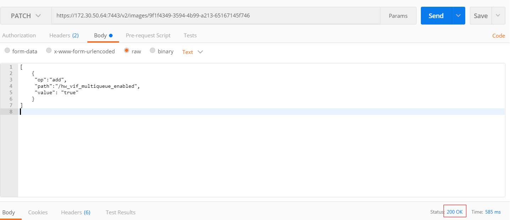

# 开启网卡多队列功能<a name="ZH-CN_TOPIC_0058758453"></a>

## 操作场景<a name="section2585561135"></a>

随着网络IO的带宽不断提升，单核CPU处理网络中断存在瓶颈，不能完全满足网卡的需求，通过开启网卡多队列功能，您可以将弹性云服务器中的网卡中断分散给不同的CPU处理，以满足网卡的需求，从而提升网络PPS和带宽性能。

假设以下场景所述的弹性云服务器满足规格和虚拟化类型要求：

-   使用[网卡多队列支持列表](#section892862210138)中的公共镜像创建的弹性云服务器，默认已开启网卡多队列，无需执行本节操作。
-   对于私有镜像场景，如果您的外部镜像文件的操作系统在[网卡多队列支持列表](#section892862210138)范围内，需要按照如下流程开启网卡多队列：
    1.  [将外部镜像文件导入镜像服务控制台](#section1659682611504)。
    2.  [为私有镜像添加网卡多队列标签](#section1949113217282)。
    3.  [使用私有镜像创建弹性云服务器](#section1841681225617)。
    4.  [执行网卡多队列的配置脚本](#section10278152164110)。


> **说明：** 
>云服务器开启网卡多队列功能后，如果后续有新增或删除网卡，切换VPC等操作，需要重新对云服务器设置网卡多队列，详细操作请参考[执行网卡多队列的配置脚本](#section10278152164110)。

## 网卡多队列支持列表<a name="section892862210138"></a>

网卡多队列的支持情况和实例规格、虚拟化类型、镜像的操作系统有关，只有同时满足这些要求，弹性云服务器才能开启网卡多队列功能。

-   支持网卡多队列的实例规格请参见“[规格清单](https://support.huaweicloud.com/productdesc-ecs/zh-cn_topic_0159822360.html)”。

    > **说明：** 
    >网卡多队列数为大于1的值，表示支持网卡多队列。

-   虚拟化类型必须为KVM。
-   [表2](#table732581623820)所列的Linux公共镜像，支持网卡多队列。

    > **说明：** 
    >-   Windows操作系统弹性云服务器的驱动pvdriver有一套动态调整网卡队列数的策略，会根据vCPU数计算队列数并进行动态调整，因此无需对windows网卡多队列队列数进行设置。
    >-   Windows 2008公共镜像已下线，可通过私有镜像支持。
    >-   Linux操作系统弹性云服务器建议将操作系统内核版本升级至2.6.35及以上，否则不支持网卡多队列。
    >    建议您使用命令**uname -r**查询内核版本，如果低于2.6.35请联系技术支持升级内核。


**表 1**  Windows弹性云服务器网卡多队列支持列表

<a name="table2407167318"></a>
<table><thead align="left"><tr id="row1408567315"><th class="cellrowborder" valign="top" width="58.830000000000005%" id="mcps1.2.4.1.1"><p id="p13408136143117"><a name="p13408136143117"></a><a name="p13408136143117"></a>镜像</p>
</th>
<th class="cellrowborder" valign="top" width="18.11%" id="mcps1.2.4.1.2"><p id="p174081463316"><a name="p174081463316"></a><a name="p174081463316"></a>是否支持多队列</p>
</th>
<th class="cellrowborder" valign="top" width="23.06%" id="mcps1.2.4.1.3"><p id="p114081664315"><a name="p114081664315"></a><a name="p114081664315"></a>是否默认开启多队列</p>
</th>
</tr>
</thead>
<tbody><tr id="row44089620316"><td class="cellrowborder" valign="top" width="58.830000000000005%" headers="mcps1.2.4.1.1 "><p id="p71561418113712"><a name="p71561418113712"></a><a name="p71561418113712"></a>Windows Server 2008 R2 Standard/Enterprise/DataCenter 64bit</p>
</td>
<td class="cellrowborder" valign="top" width="18.11%" headers="mcps1.2.4.1.2 "><p id="p104081617315"><a name="p104081617315"></a><a name="p104081617315"></a>是</p>
</td>
<td class="cellrowborder" valign="top" width="23.06%" headers="mcps1.2.4.1.3 "><p id="p14082619319"><a name="p14082619319"></a><a name="p14082619319"></a>是</p>
</td>
</tr>
<tr id="row13776249193114"><td class="cellrowborder" valign="top" width="58.830000000000005%" headers="mcps1.2.4.1.1 "><p id="p187761649123117"><a name="p187761649123117"></a><a name="p187761649123117"></a>Windows Server 2008 Enterprise SP2 64bit</p>
</td>
<td class="cellrowborder" valign="top" width="18.11%" headers="mcps1.2.4.1.2 "><p id="p102096361370"><a name="p102096361370"></a><a name="p102096361370"></a>是</p>
</td>
<td class="cellrowborder" valign="top" width="23.06%" headers="mcps1.2.4.1.3 "><p id="p11209203620375"><a name="p11209203620375"></a><a name="p11209203620375"></a>是</p>
</td>
</tr>
<tr id="row194081068313"><td class="cellrowborder" valign="top" width="58.830000000000005%" headers="mcps1.2.4.1.1 "><p id="p8156718153716"><a name="p8156718153716"></a><a name="p8156718153716"></a>Windows Server 2008 Web R2 64 bit</p>
</td>
<td class="cellrowborder" valign="top" width="18.11%" headers="mcps1.2.4.1.2 "><p id="p240876133118"><a name="p240876133118"></a><a name="p240876133118"></a>是</p>
</td>
<td class="cellrowborder" valign="top" width="23.06%" headers="mcps1.2.4.1.3 "><p id="p9408569318"><a name="p9408569318"></a><a name="p9408569318"></a>是</p>
</td>
</tr>
<tr id="row4303152519324"><td class="cellrowborder" valign="top" width="58.830000000000005%" headers="mcps1.2.4.1.1 "><p id="p15303425183217"><a name="p15303425183217"></a><a name="p15303425183217"></a>Windows Server 2008 R2 Enterprise 64bit_WithGPUdriver</p>
</td>
<td class="cellrowborder" valign="top" width="18.11%" headers="mcps1.2.4.1.2 "><p id="p11775133619375"><a name="p11775133619375"></a><a name="p11775133619375"></a>是</p>
</td>
<td class="cellrowborder" valign="top" width="23.06%" headers="mcps1.2.4.1.3 "><p id="p19775103612375"><a name="p19775103612375"></a><a name="p19775103612375"></a>是</p>
</td>
</tr>
<tr id="row57294783317"><td class="cellrowborder" valign="top" width="58.830000000000005%" headers="mcps1.2.4.1.1 "><p id="p772997173315"><a name="p772997173315"></a><a name="p772997173315"></a>Windows Server 2012 R2 Standard 64bit_WithGPUdriver</p>
</td>
<td class="cellrowborder" valign="top" width="18.11%" headers="mcps1.2.4.1.2 "><p id="p3338133743718"><a name="p3338133743718"></a><a name="p3338133743718"></a>是</p>
</td>
<td class="cellrowborder" valign="top" width="23.06%" headers="mcps1.2.4.1.3 "><p id="p133873718379"><a name="p133873718379"></a><a name="p133873718379"></a>是</p>
</td>
</tr>
<tr id="row1040811615314"><td class="cellrowborder" valign="top" width="58.830000000000005%" headers="mcps1.2.4.1.1 "><p id="p1315661819375"><a name="p1315661819375"></a><a name="p1315661819375"></a>Windows Server 2012 R2 Standard/DataCenter 64 bit</p>
</td>
<td class="cellrowborder" valign="top" width="18.11%" headers="mcps1.2.4.1.2 "><p id="p84085613112"><a name="p84085613112"></a><a name="p84085613112"></a>是</p>
</td>
<td class="cellrowborder" valign="top" width="23.06%" headers="mcps1.2.4.1.3 "><p id="p34083617319"><a name="p34083617319"></a><a name="p34083617319"></a>是</p>
</td>
</tr>
<tr id="row740816133111"><td class="cellrowborder" valign="top" width="58.830000000000005%" headers="mcps1.2.4.1.1 "><p id="p91565181373"><a name="p91565181373"></a><a name="p91565181373"></a>Windows Server 2016 Standard/DataCenter 64 bit</p>
</td>
<td class="cellrowborder" valign="top" width="18.11%" headers="mcps1.2.4.1.2 "><p id="p144084683113"><a name="p144084683113"></a><a name="p144084683113"></a>是</p>
</td>
<td class="cellrowborder" valign="top" width="23.06%" headers="mcps1.2.4.1.3 "><p id="p94081267313"><a name="p94081267313"></a><a name="p94081267313"></a>是</p>
</td>
</tr>
<tr id="row6985143163719"><td class="cellrowborder" valign="top" width="58.830000000000005%" headers="mcps1.2.4.1.1 "><p id="p1315641853718"><a name="p1315641853718"></a><a name="p1315641853718"></a>Windows Server 2019 DataCenter 64 bit</p>
</td>
<td class="cellrowborder" valign="top" width="18.11%" headers="mcps1.2.4.1.2 "><p id="p195833228371"><a name="p195833228371"></a><a name="p195833228371"></a>是</p>
</td>
<td class="cellrowborder" valign="top" width="23.06%" headers="mcps1.2.4.1.3 "><p id="p11583132210373"><a name="p11583132210373"></a><a name="p11583132210373"></a>是</p>
</td>
</tr>
</tbody>
</table>

**表 2**  Linux弹性云服务器网卡多队列支持列表

<a name="table732581623820"></a>
<table><thead align="left"><tr id="row63275359382"><th class="cellrowborder" valign="top" width="62.36000000000001%" id="mcps1.2.4.1.1"><p id="p9131937123817"><a name="p9131937123817"></a><a name="p9131937123817"></a>镜像</p>
</th>
<th class="cellrowborder" valign="top" width="14.580000000000002%" id="mcps1.2.4.1.2"><p id="p71343783812"><a name="p71343783812"></a><a name="p71343783812"></a>是否支持多队列</p>
</th>
<th class="cellrowborder" valign="top" width="23.06%" id="mcps1.2.4.1.3"><p id="p41393712383"><a name="p41393712383"></a><a name="p41393712383"></a>是否默认开启多队列</p>
</th>
</tr>
</thead>
<tbody><tr id="row193267169388"><td class="cellrowborder" valign="top" width="62.36000000000001%" headers="mcps1.2.4.1.1 "><p id="p932601653813"><a name="p932601653813"></a><a name="p932601653813"></a>Ubuntu 14.04/16.04/18.04/20.04 server 64bit</p>
</td>
<td class="cellrowborder" valign="top" width="14.580000000000002%" headers="mcps1.2.4.1.2 "><p id="p232671618383"><a name="p232671618383"></a><a name="p232671618383"></a>是</p>
</td>
<td class="cellrowborder" valign="top" width="23.06%" headers="mcps1.2.4.1.3 "><p id="p1832681633810"><a name="p1832681633810"></a><a name="p1832681633810"></a>是</p>
</td>
</tr>
<tr id="row132612165385"><td class="cellrowborder" valign="top" width="62.36000000000001%" headers="mcps1.2.4.1.1 "><p id="p532621643810"><a name="p532621643810"></a><a name="p532621643810"></a>OpenSUSE 42.2/15.* 64bit</p>
</td>
<td class="cellrowborder" valign="top" width="14.580000000000002%" headers="mcps1.2.4.1.2 "><p id="p932641603817"><a name="p932641603817"></a><a name="p932641603817"></a>是</p>
</td>
<td class="cellrowborder" valign="top" width="23.06%" headers="mcps1.2.4.1.3 "><p id="p143261016143820"><a name="p143261016143820"></a><a name="p143261016143820"></a>是</p>
</td>
</tr>
<tr id="row532612163386"><td class="cellrowborder" valign="top" width="62.36000000000001%" headers="mcps1.2.4.1.1 "><p id="p732691619388"><a name="p732691619388"></a><a name="p732691619388"></a>SUSE Enterprise 12 SP1/SP2 64bit</p>
</td>
<td class="cellrowborder" valign="top" width="14.580000000000002%" headers="mcps1.2.4.1.2 "><p id="p73261816183811"><a name="p73261816183811"></a><a name="p73261816183811"></a>是</p>
</td>
<td class="cellrowborder" valign="top" width="23.06%" headers="mcps1.2.4.1.3 "><p id="p18326141693815"><a name="p18326141693815"></a><a name="p18326141693815"></a>是</p>
</td>
</tr>
<tr id="row732671614387"><td class="cellrowborder" valign="top" width="62.36000000000001%" headers="mcps1.2.4.1.1 "><p id="p17326181610387"><a name="p17326181610387"></a><a name="p17326181610387"></a>CentOS 6.8/6.9/7.*/8.* 64bit</p>
</td>
<td class="cellrowborder" valign="top" width="14.580000000000002%" headers="mcps1.2.4.1.2 "><p id="p12326121614389"><a name="p12326121614389"></a><a name="p12326121614389"></a>是</p>
</td>
<td class="cellrowborder" valign="top" width="23.06%" headers="mcps1.2.4.1.3 "><p id="p9326111623820"><a name="p9326111623820"></a><a name="p9326111623820"></a>是</p>
</td>
</tr>
<tr id="row8326101613819"><td class="cellrowborder" valign="top" width="62.36000000000001%" headers="mcps1.2.4.1.1 "><p id="p9327191614383"><a name="p9327191614383"></a><a name="p9327191614383"></a>Debian 8.0.0/8.8.0/8.9.0/9.0.0/10.0.0/10.2.0 64bit</p>
</td>
<td class="cellrowborder" valign="top" width="14.580000000000002%" headers="mcps1.2.4.1.2 "><p id="p1332781683812"><a name="p1332781683812"></a><a name="p1332781683812"></a>是</p>
</td>
<td class="cellrowborder" valign="top" width="23.06%" headers="mcps1.2.4.1.3 "><p id="p13327181683816"><a name="p13327181683816"></a><a name="p13327181683816"></a>是</p>
</td>
</tr>
<tr id="row832781617388"><td class="cellrowborder" valign="top" width="62.36000000000001%" headers="mcps1.2.4.1.1 "><p id="p332717164383"><a name="p332717164383"></a><a name="p332717164383"></a>Fedora 24/25/30 64bit</p>
</td>
<td class="cellrowborder" valign="top" width="14.580000000000002%" headers="mcps1.2.4.1.2 "><p id="p153271616183819"><a name="p153271616183819"></a><a name="p153271616183819"></a>是</p>
</td>
<td class="cellrowborder" valign="top" width="23.06%" headers="mcps1.2.4.1.3 "><p id="p132718165389"><a name="p132718165389"></a><a name="p132718165389"></a>是</p>
</td>
</tr>
<tr id="row2327171612388"><td class="cellrowborder" valign="top" width="62.36000000000001%" headers="mcps1.2.4.1.1 "><p id="p8327191612381"><a name="p8327191612381"></a><a name="p8327191612381"></a>EulerOS 2.2/2.3/2.5 64bit</p>
</td>
<td class="cellrowborder" valign="top" width="14.580000000000002%" headers="mcps1.2.4.1.2 "><p id="p332715165381"><a name="p332715165381"></a><a name="p332715165381"></a>是</p>
</td>
<td class="cellrowborder" valign="top" width="23.06%" headers="mcps1.2.4.1.3 "><p id="p2327121653815"><a name="p2327121653815"></a><a name="p2327121653815"></a>是</p>
</td>
</tr>
</tbody>
</table>

## 将外部镜像文件导入镜像服务控制台<a name="section1659682611504"></a>

将外部镜像文件导入镜像服务控制台，详细操作请参见《镜像服务用户指南》中“注册镜像”章节。导入完成后，在镜像详情页查看“网卡多队列”参数取值。

-   如果为“支持”，执行[使用私有镜像创建弹性云服务器](#section1841681225617)。
-   如果为“不支持”，执行[为镜像添加网卡多队列标签](#section1949113217282)。

## 为镜像添加网卡多队列标签<a name="section1949113217282"></a>

Windows操作系统暂未商用支持网卡多队列，如果对Windows操作系统镜像添加网卡多队列标签，开启网卡多队列功能，可能会引起操作系统启动速度变慢等问题。

用户可以选择以下任一种方式设置镜像的网卡多队列属性。

**方式1**：

1.  登录管理控制台。
2.  单击“”，选择“计算 \> 镜像服务”。
3.  单击“私有镜像”页签，在对应镜像所在行的“操作”列下，单击“修改”。
4.  设置镜像的网卡多队列属性。

**方式2**：

1.  登录管理控制台。
2.  单击“”，选择“计算 \> 镜像服务”。
3.  单击“私有镜像”页签，在镜像列表中，单击镜像名称，进入镜像详情页面。
4.  单击右上角的“修改”，在弹出的“修改镜像”对话框中，设置镜像的网卡多队列属性。

**方法3：**通过API为镜像添加网卡多队列标签hw\_vif\_multiqueue\_enabled

1.  <a name="zh-cn_topic_0085214115_li13762086162643"></a>获取Token的方法请参考“[认证鉴权](https://support.huaweicloud.com/api-ims/ims_03_0303.html)”。
2.  “更新镜像信息”的API使用方法请参考“[更新镜像信息（OpenStack原生）](https://support.huaweicloud.com/api-ims/ims_03_0704.html)”。
3.  在请求消息头中增加“X-Auth-Token”。

    “X-Auth-Token”的取值为步骤[1](#zh-cn_topic_0085214115_li13762086162643)中获取的Token。

4.  在请求消息头中增加“Content-Type”。

    “Content-Type”取值为application/openstack-images-v2.1-json-patch

    请求的URI格式为：

    PATCH /v2/images/\{image\_id\}

    请求的body体如下所示。

    ```
    [       
             { 
              "op":"add",
              "path":"/hw_vif_multiqueue_enabled", 
              "value": "true" 
             } 
     ]
    ```

    支持网卡多队列修改样例如[图1](#zh-cn_topic_0085214115_fig3215821216479)所示。

    **图 1**  支持网卡多队列修改样例<a name="zh-cn_topic_0085214115_fig3215821216479"></a>  
    


## 使用私有镜像创建弹性云服务器<a name="section1841681225617"></a>

使用注册好的私有镜像创建弹性云服务器。在配置参数时，需要注意以下两点：

-   区域：必须选择私有镜像所在的区域。
-   镜像：选择“私有镜像”，并在下拉列表中选择需要的镜像。

## 执行网卡多队列的配置脚本<a name="section10278152164110"></a>

Windows操作系统使用的半虚拟化驱动pvdriver有一套动态调整网卡队列数的策略，会根据vCPU数计算队列数并进行动态调整，因此无需对windows网卡多队列队列数进行设置。

Linux操作系统提供了自动开启网卡多队列功能的配置脚本，配置成功后，弹性云服务器支持网卡多队列功能。

1.  登录弹性云服务器，查看网卡支持和已开启的队列数。

    **ethtool -l **_网卡_

    示例：

    ```
    [root@localhost ~]# ethtool -l eth0   #查询网卡eth0的队列数
    Channel parameters for eth0:
    Pre-set maximums:
    RX:               0
    TX:               0
    Other:            0
    Combined:         4   #表示此网卡最多支持设置4个队列
    Current hardware settings:
    RX:               0
    TX:               0
    Other:            0
    Combined:         1   #表示当前已开启的是1个队列
    ```

    如果返回信息中，两个“Combined”字段取值相同，则表示网卡已开启多队列，无需执行以下操作。

2.  执行以下命令，下载配置脚本“multi-queue-hw”。

    **wget  _下载地址URL_**

    下载地址：[https://ecs-instance-driver.obs.cn-north-1.myhuaweicloud.com/multi-queue-hw](https://ecs-instance-driver.obs.cn-north-1.myhuaweicloud.com/multi-queue-hw)

3.  执行以下命令，添加执行权限。

    **chmod +x multi-queue-hw**

4.  执行以下命令，将脚本“multi-queue-hw”放到目录/etc/init.d下。

    **mv multi-queue-hw /etc/init.d**

5.  执行以下命令，运行脚本“multi-queue-hw”。

    **/etc/init.d/multi-queue-hw start**

    运行脚本后，立即生效。但关机后，网卡多队列功能将自动失效。

6.  为了使网卡多队列功能开机自动生效，各个OS需要增加开机启动配置：
    -   CentOS/Redhat/Fedora/EulerOS/Suse/OpenSuse使用如下命令，增加开机启动项，使网卡多队列配置开机：

        **chkconfig multi-queue-hw on**

    -   Ubuntu使用如下命令，增加开机启动项：

        **update-rc.d multi-queue-hw defaults 90 10**

    -   Debian使用如下命令，增加开机启动项：

        **systemctl enable multi-queue-hw**


## 查看网卡队列数<a name="section123351241111718"></a>

开启网卡多队列功能

1.  登录弹性云服务器。
2.  执行以下命令，查看网卡支持和已开启的队列数。

    **ethtool -l** **_网卡_**


示例：

```
[root@localhost ~]# ethtool -l eth0  #查询网卡eth0的队列数
Channel parameters for eth0:
Pre-set maximums:
RX:               0
TX:               0
Other:                  0
Combined: 4  #表示此网卡最多支持设置开启4个队列
Current hardware settings:
RX:               0
TX:               0
Other:                  0
Combined: 4 #表示当前开启的是4个队列
```

